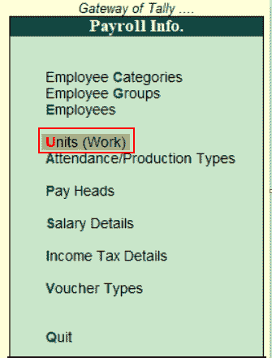
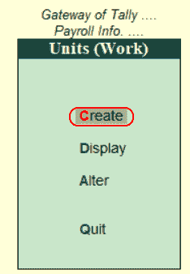
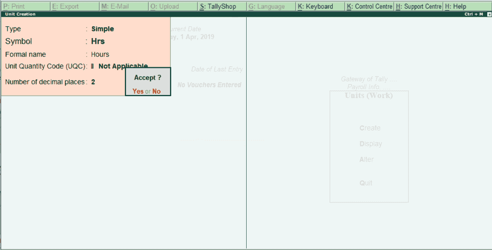

# 在 Tally 中创建简单的薪资单位

> 原文：<https://www.javatpoint.com/create-simple-payroll-units-in-tally>

*   简单工资单位
*   复合薪资单位

工资单可以基于复合工资单单位和简单工资单进行计算。

## 在 Tally 中创建简单的工资单位

简单工资单位是指单个或单个单位，如小时、天、周、箱、号等。使用以下步骤在 Tally 中创建一个简单的薪资单位。

**第一步:**点击**大师**下的**薪资信息**选项。

**第 2 步:**点击薪资信息功能下的单位选项。

**步骤 3:** 点击“单位(工时)”下的“创建”选项，在 Tally ERP 9 中创建新的简单薪资单位。

**第 4 步:**在下一屏幕单位创建中输入以下详细信息。

**类型:**选择薪资单位类型为简单。

**符号:**指定单位的符号。

**正式名称:**指定薪资单位的名称。

**小数位数名称:**指定小数位数为 2。

输入薪资单位的所有必需详细信息后，按回车键并单击是，将数据保存在 Tally ERP 9 中。

* * *