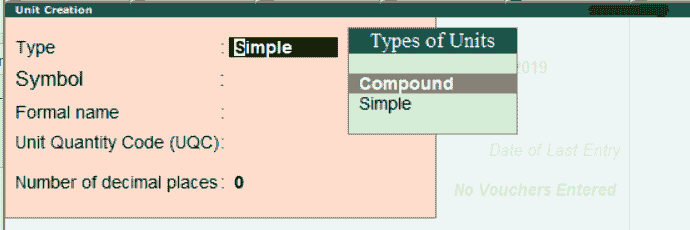
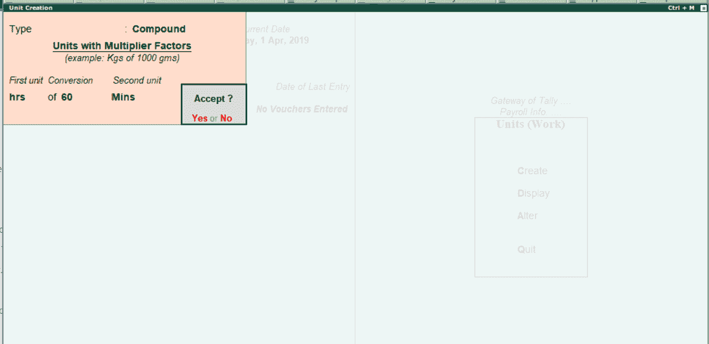

# 在Tally中创建简单的薪资单位

> 原文：<https://www.javatpoint.com/create-compound-payroll-units-in-tally>

在Tally中，复合薪资单位是指两个简单薪资单位的组合。

例如，60 分钟的小时数、30 天的月数等。

**步骤 1:** 使用以下路径在 Tally 中创建简单的薪资单位。

**Tally网关→薪资信息→单位→创建**

**第二步:**在“主”选项下，点击“薪资信息”选项。

**第 3 步:**点击薪资信息功能下的单位选项。

**第 4 步:**点击单位(工时)下的创建选项，在Tally中创建新的复合薪资单位。

**第五步:**在下一屏**单位创建**输入以下详细信息。

**示例:** 60 分钟= 1 小时，即

*   **类型:**选择薪资单位类型为“**复合**，按回车键继续。

*   第一单位:从**第一单位**选项下的薪资单位列表中选择单位。
*   将**换算系数**更新为 60。
*   将列表中的**第二个单位**修改为分钟。

输入复合工资单的所有必需详细信息后，按回车键并单击是，将数据保存在Tally ERP 9 中。

* * *