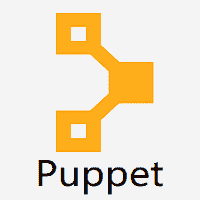

# Puppet教程

> 原文：<https://www.javatpoint.com/puppet>

Puppet 是一个开源的 DevOps 系统管理工具。它用于集中和自动化配置管理过程。这个工具是使用 Ruby DSL(特定领域语言)开发的。Puppet 工具部署、配置和管理服务器。

本教程将有助于理解为什么 Puppet 如此受欢迎，以及与其他配置管理工具相比，它的独特之处。本教程中的所有示例都经过了测试。通过更改当前定义的名称和变量，该代码可以用于任何Puppet配置。

## 什么是Puppet？

*   Puppet 是一个 **DevOps 配置管理工具**。这是由 Puppet Labs 开发的，可用于开源和企业版本。它用于集中和自动化配置管理过程。
*   该工具是使用 Ruby DSL(特定于领域的语言)开发的，它允许您以代码格式更改完整的基础架构，并且可以轻松管理和配置。
*   Puppet 工具部署、配置和管理服务器。这尤其用于混合基础架构交付和管理的自动化。
*   在自动化的帮助下，Puppet 使系统管理员能够更轻松、更快速地进行操作。
*   Puppet 还可以用作部署工具，因为它可以在系统上自动部署软件。Puppet 将基础设施实现为代码，这意味着您可以测试环境以进行准确的部署。
*   uppet 支持微软 Windows、Debian/Ubuntu、Red Hat/CentOS/Fedora、MacOS X 等多种平台。
*   Puppet 使用客户机-服务器模式，在这种模式下，任何集群中的一个系统都作为服务器工作，称为 puppet master，而其他系统作为客户机工作在称为 slave 的节点上。

## Puppet的特点

以下是Puppet的特点:

**平台支撑**

Puppet 兼容所有支持 Ruby 的平台，如微软 Windows、Linux、MacOS X 等。

**可扩展**

Puppet是 2005 年开发的；因此，许多不同的组织，包括中型和大型组织，都部署了 Puppet，因此它的可扩展性非常大。

**文件**

Puppet 提供了大量开发良好的 wiki 页面和详细的文档。

**幂等性**

与其他配置管理工具不同，在 Puppet 中，我们可以在同一台机器上多次安全地运行同一组配置。这意味着，在任何机器上部署配置后，Puppet会在特定的时间间隔内不断验证这些配置。

**开源**

puppet 是一个开源工具，由于这个特性，很容易扩展它来构建定制的库和模块。

**报告合规性**

puppet 的企业版支持图形报告，在这种帮助下，您可以简单地可视化基础架构、进行通信并快速响应修改。它为您提供了对变更影响的实时可见性，这使您可以看到基础架构上发生了什么。

**性价比高**

当您有许多系统并且想要进行一些小的代码更改时，Puppet 有助于减少工作量和成本。

**更快**

Puppet 允许 DevOps 专业人员和系统管理员更快、更有效地工作。

**快速成长**

如今，许多公司都采用Puppet来管理他们的基础设施，如谷歌、红帽、美国电话电报公司、Spotify、AON、美国空军等。

## 先决条件

在继续学习本教程之前，您应该对系统管理、网络协议通信和基础设施有一个基本的了解。为了自动化基础设施配置，我们应该对 Ruby 脚本和我们想要使用 Puppet 的系统有一个基本的了解。

## 观众

本教程是为那些想学习Puppet基础知识的人创建的。本教程将提供足够的理解，以降低管理基础架构的复杂性。

完成本教程后，您将对 Puppet 和工作流程有一个基本的了解。本教程还将让您很好地了解预配置基础架构中 Puppet 的配置，以及如何将其用于自动化。

## 问题

我们向您保证，在学习我们的Puppet教程时，您不会发现任何困难。但是如果本教程有任何错误，请将问题或错误张贴在联系表中，以便我们改进。

* * *