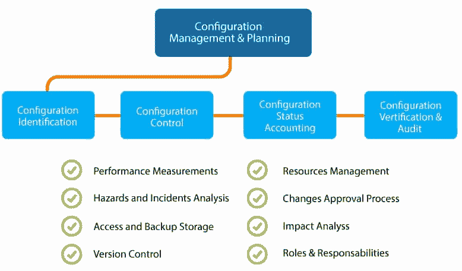

# 结构管理

> 原文：<https://www.javatpoint.com/puppet-configuration-management>

系统管理员定期执行重复性任务，如服务器安装、服务器配置等。通过编写一些脚本，他们可以自动化这个功能，但是当您在大型基础设施上操作时，这是一项非常困难的工作。

为了解决这个困难，配置管理进入了市场。配置管理是将软件和计算机系统(如网络、服务器、存储)保持在已配置、所需和一致状态的过程。

通过配置管理，我们可以访问系统位置的准确历史记录，用于项目管理和审计目的。

借助配置管理，我们可以消除以下挑战:

*   找出当需求改变时要修改的组件。
*   由于上一次实现中的需求变化，需要重新实现。
*   如果任何组件被新的但有缺陷的版本替换，那么它需要恢复到以前的版本。
*   需要更换错误的组件，因为管理员无法确定应该更换哪个组件。

## 配置管理流程

一个**配置项(CI)** 是一个基础设施元素或任何服务组件或任何需要管理的组件，以确保服务的成功交付。配置项目，如单个文档、模型计划等。

配置管理有不同的相互依赖的过程或活动。这些活动如下:

*   配置标识
*   变更管理
*   配置状态会计
*   配置审计

让我们详细看看这些活动:

### 配置标识

*   它用唯一的标识符标记 h/w 和 s/w 配置项目。
*   它标识定义配置项的文档。
*   它用于将相关配置项分组到基线中。
*   它用于标记对配置项和基线的修订。

### 变更管理

它处理个人或组织层面的变化。

### 配置状态会计

用于报告硬件、软件、固件等配置项的详细信息。以及设计和开发过程中与基线的所有偏差。

### 配置审计

配置审核有助于识别系统的当前状态。这是一个审查产品及其预期行为的过程，因为它应该按照对客户的承诺来行事。任何质量审核和测试的结果信息都与配置状态会计信息一起使用，这样做是为了确保所有承诺的功能都已交付。

## 配置管理工具

市场上有很多配置管理工具。一些流行的配置管理工具包括:

*   安塞波
*   木偶
*   厨师
*   微软系统中心配置管理器
*   hashicorp 土地改革公司
*   CFEngine
*   aws opsworks
*   盐堆

* * *