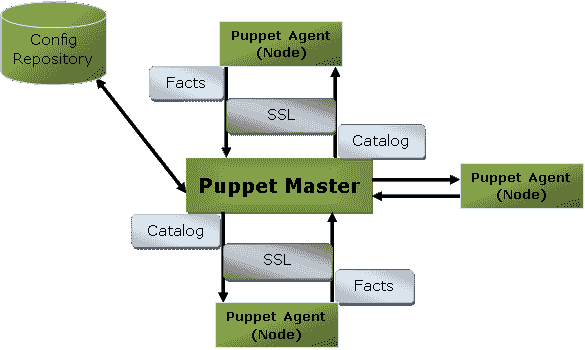
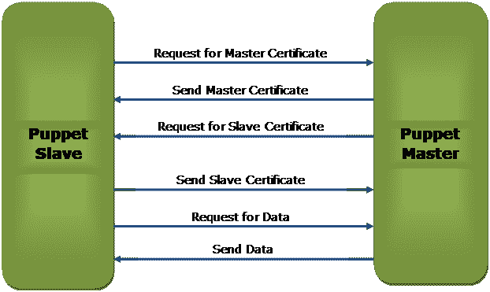

# Puppet建筑

> 原文：<https://www.javatpoint.com/puppet-architecture>

Puppet 采用主从或客户端-服务器架构。Puppet 客户端和服务器通过 SSL 互连，这是一个安全的套接字层。这是一个模型驱动的系统。

这里，客户端被称为Puppet代理/从/节点，服务器被称为Puppet主机。

让我们看看Puppet架构的组件:

### Puppet大师

Puppet大师以Puppet代码的形式处理所有与配置相关的过程。这是一个基于 Linux 的系统，其中安装了 puppet master 软件。Puppet师肯定在 Linux。它使用Puppet代理将配置应用于节点。

这是检查和标记 SSL 证书的地方。

### Puppet奴隶还是代理人

Puppet代理是真正的工作系统，由客户使用。它安装在客户端机器上，由Puppet主人维护和管理。他们内部有一个Puppet代理服务。

代理机器可以在任何操作系统上配置，如视窗、Linux、Solaris 或苹果操作系统。

### 配置存储库

配置存储库是存储所有与服务器和节点相关的配置的存储区域，我们可以根据需要提取这些配置。

### 事实

事实是键值数据对。它包含关于节点或主机的信息。它代表一个Puppet客户端状态，如操作系统、网络接口、IP 地址、正常运行时间以及客户端机器是否是虚拟的。

这些事实用于确定任何代理的当前状态。任何目标机器上的更改都基于事实。Puppet的事实是预先定义和定制的。

### 目录

用 Puppet 编写的整个配置和清单文件被更改为编译格式。这种编译后的格式称为目录，然后我们可以将该目录应用于目标机器。

上图执行以下功能:

*   首先，代理节点向主节点或服务器发送事实并请求目录。
*   主节点或服务器在主节点访问的一些信息的帮助下编译并返回节点的目录。
*   然后，代理通过检查目录中提到的每个资源，将目录应用于节点。如果它识别出没有处于所需状态的资源，则进行必要的调整来修复它们。或者，它确定在无操作模式下，需要进行调整来协调目录。
*   最后，代理向主服务器发回一份报告。

## Puppet主从通信

Puppet主从通过 SSL(安全套接字层)通过安全加密通道进行通信。让我们看下面的图表，了解主设备和从设备之间通过该通道的通信:

上图描述了以下内容:

*   Puppet奴隶申请Puppet主人证书。
*   Puppet主机向Puppet从机发送主证书以响应客户端请求。
*   Puppet主人向Puppet奴隶请求奴隶证书。
*   Puppet从机将请求的从机证书发送给Puppet主机。
*   Puppet从机向Puppet主机发送数据请求。
*   最后，主机根据请求将数据发送给Puppet从机。

* * *