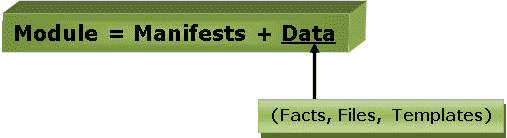

# 木偶组件

> 原文：<https://www.javatpoint.com/puppet-components>

以下是 Puppet 的关键组件:

*   显示
*   组件
*   资源
*   因素
*   集体
*   目录
*   班级
*   节点

让我们详细了解这些组件:

### 显示

傀儡主人包含傀儡奴隶的配置细节，这些都是用傀儡的母语写的。

清单只不过是为傀儡从机指定配置细节的文件。清单文件的扩展名为。pp，意思是傀儡政策。这些文件由描述从机配置的傀儡脚本组成。

### 组件

傀儡模块是一组清单和数据。这里的数据是文件、事实或模板。该模块遵循特定的目录结构。这些模块允许傀儡程序分成多个清单。模块只是独立的数据或代码包。

让我们通过下面的图片来理解该模块:

### 资源

资源是系统配置建模的基本单元。这些是在后端运行的预定义函数，用于在 puppet 中执行必要的操作。

每个傀儡资源都定义了系统的某些元素，比如某个特定的服务或包。

### 因素

该因子收集关于傀儡奴隶的事实或重要信息。事实是键值数据对。它包含关于节点或主机的信息。它代表一个傀儡客户端状态，如操作系统、网络接口、IP 地址、正常运行时间以及客户端机器是否是虚拟的。

这些事实用于确定任何代理的当前状态。任何目标机器上的更改都基于事实。木偶的事实是预先定义和定制的。

### 集体

M-collective 是一个支持在多个从机上并行执行多个作业的框架。该框架执行多种功能，例如:

*   这是用来和一群群傀儡奴隶互动的；它们可以是小组或非常大的部署。
*   要传输需求，请使用广播模型。所有从机同时接收所有请求，请求附有过滤器，只有匹配过滤器的从机才能处理请求。
*   这用于借助简单的命令行工具调用远程从机。
*   这用于编写关于您的基础架构的自定义报告。

### 目录

用 Puppet 编写的整个配置和清单文件被更改为编译格式。这种编译后的格式称为目录，然后我们可以将该目录应用于目标机器。

目录中描述了从属资源的所有必需状态。

### 班级

像其他编程语言一样，puppet 也支持一个类来以更好的方式组织代码。Puppet 类是组合成单个单元的各种资源的集合。

### 节点

节点是安装傀儡从机的位置，用于管理所有客户端和服务器。

* * *