# Puppet 装置

> 原文：<https://www.javatpoint.com/puppet-installation>

在安装 Puppet 之前，让我们看看一些先决条件:

### 先决条件

这里，我们将使用两台安装了 Ubuntu 操作系统的虚拟机，它们的静态 IP 地址和主机名配置正确。

*   一台虚拟机用于配置了静态 IP 地址的 Puppet 主机。
*   一台虚拟机用于配置了静态 IP 地址的 Puppet 客户端。

这里，我的虚拟机配置为:

**Puppet 师:**

主机名:puppetServer

IP 地址:192.168.56.101

**Puppet 特工:**

主机名:puppetClient

IP 地址:192.168.56.103

我们可以通过 ifconfig 命令看到为虚拟机配置的 IP:

```

$ ifconfig -a

```

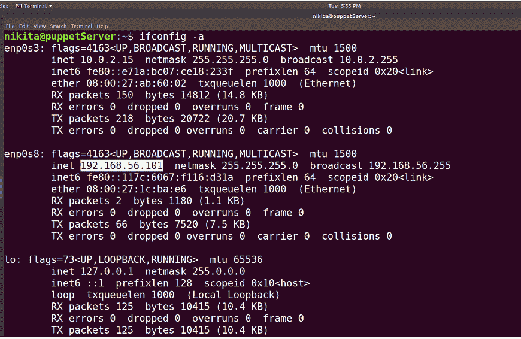
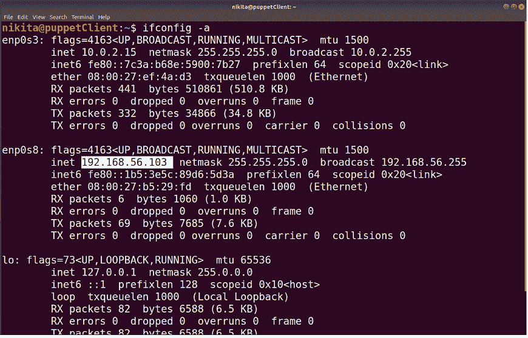

### 删除防火墙规则

首先，从两个虚拟机(即 Puppet 主机和 Puppet 代理)中删除防火墙规则。大多数 Linux 发行版中可用的默认防火墙是 iptables。在两台虚拟机上运行以下命令:

```

$ sudo iptabels -F
$ sudo /sbin/iptables-save

```

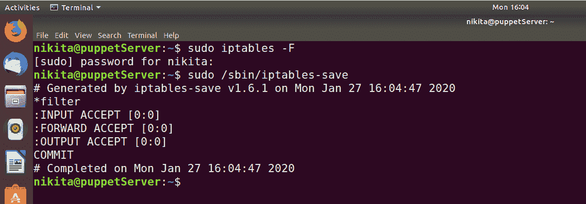
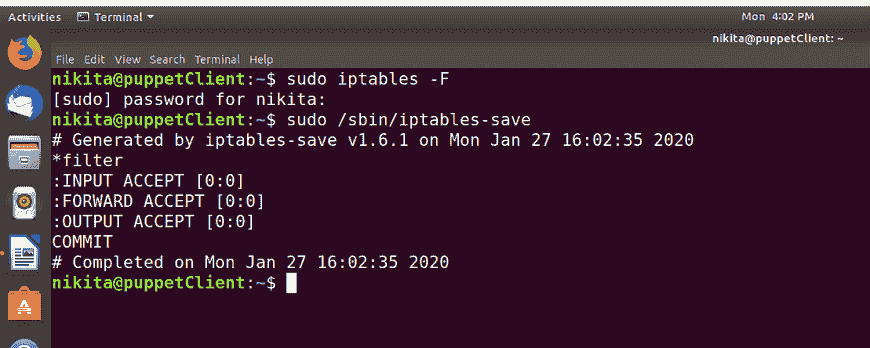

### 编辑主机

*   现在，我们需要在主节点和代理节点上配置/etc/hosts 和 etc/hostname 文件，以便它们能够相互通信。

```

$ sudo vim /etc/hostname

```


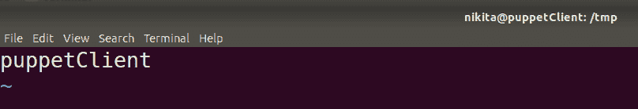

*   在 puppet 服务器和 Puppet 客户机上编辑/etc/hosts 文件。你可以使用任何编辑器。

```

$ sudo vim /etc/hosts

```

在 PuppetServer 上，键入系统的 IP 地址和主机名。

即

```

192.168.56.101  puppetServer

```

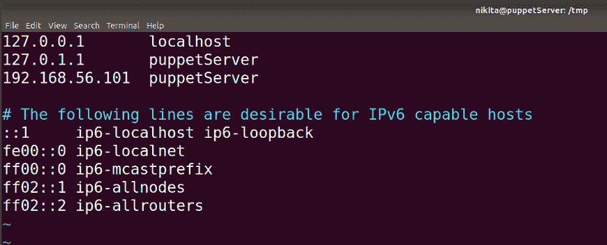

在 Puppet 客户端计算机上，键入 Puppet 代理的 IP 地址和主机名。我们还需要指定你的 Puppet 主人的 IP 地址和给它的主机名。

即

```

192.168.56.103  puppetClient
192.168.56.101  puppetServer

```

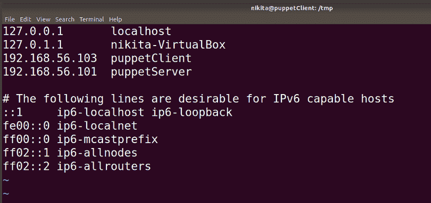

### 添加存储库

*   因为 Puppet 不在标准的 Ubuntu 发行版存储库中，所以我们需要添加一个由 Puppet Labs 提供的定制存储库。

在 Puppet 主机和 Puppet 代理计算机上运行以下命令。

```

$ wget http://apt.puppetlabs.com/puppetlabs-release-trusty.deb

```

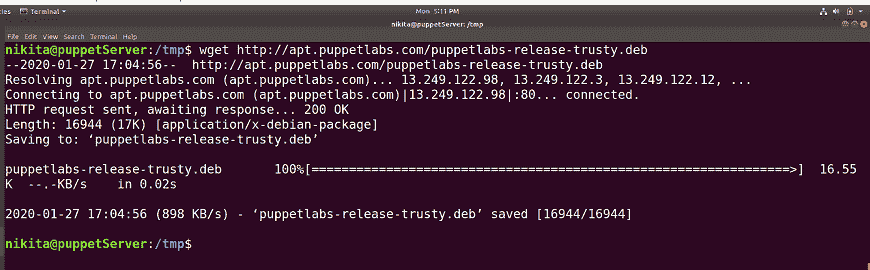
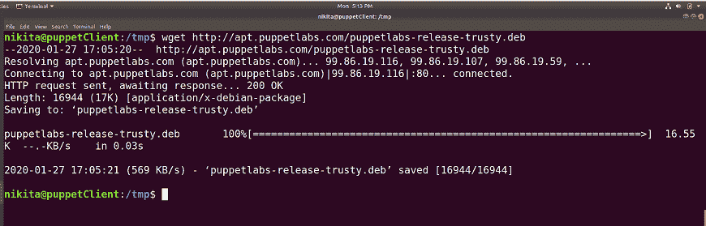

```

$ sudo dpkg -i puppetlabs-release-trusty.deb

```

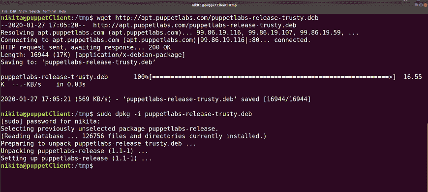
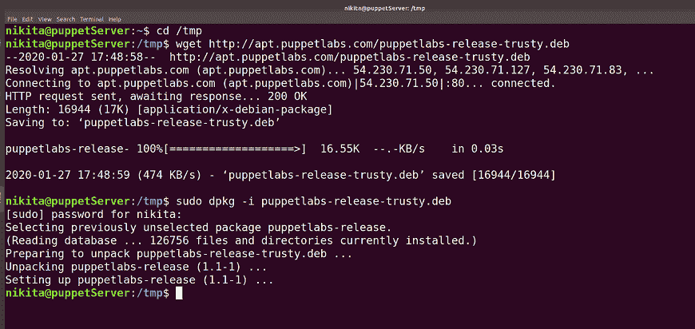

### 更新包

在以下命令的帮助下，用最新的包和存储库更新您的 Puppet 主代理和 Puppet 代理:

```

$ sudo apt-get update

```

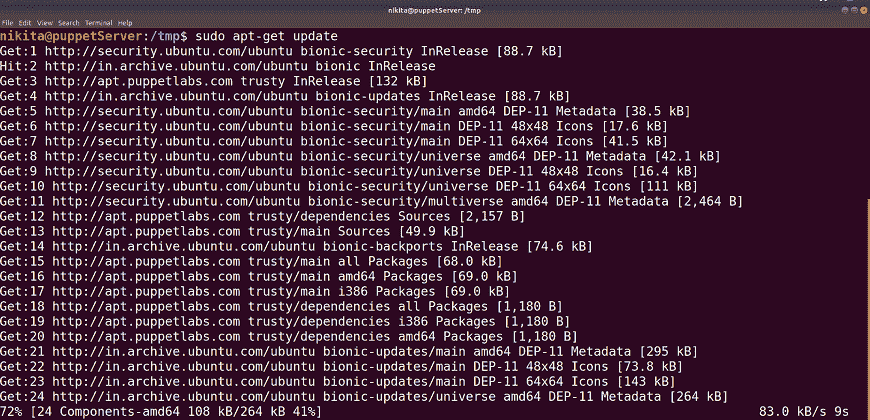
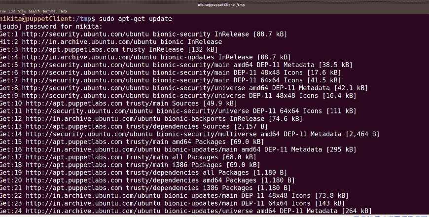

### 在 Puppet 师上启动 NTP

充当 Puppet 主机的 Puppet 服务器应该有准确的系统时间。您可能应该使用 NTP 服务来设置准确的系统时间。在您的 puppetServer 中使用以下命令来启用 NTP 服务器:

```

$ apt-get -y install ntp
$ service ntp restart

```

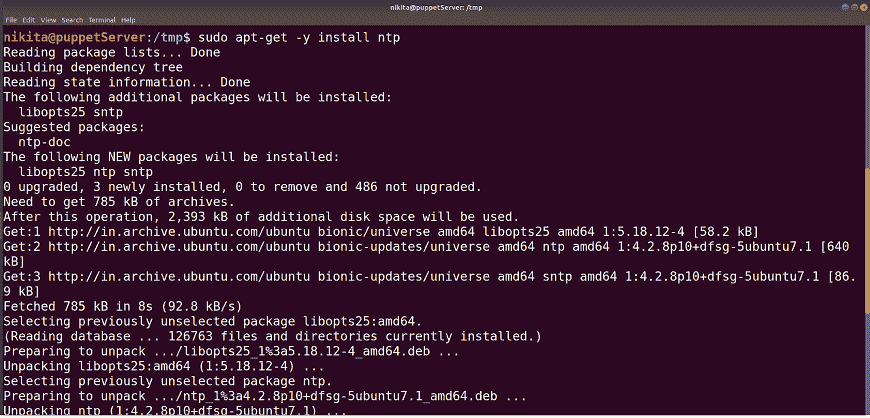

您可以通过以下命令检查状态:

```

$ service ntp status

```

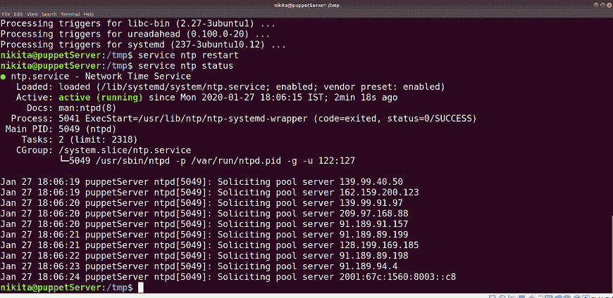

### Puppet 大师装置

*   现在，我们将安装 Puppet 包，它将获取所有必要的先决条件和要求。

要安装 Puppet 主机，请在您的 Puppet 服务器中运行以下命令:

```

$ sudo apt-get install puppetmaster

```

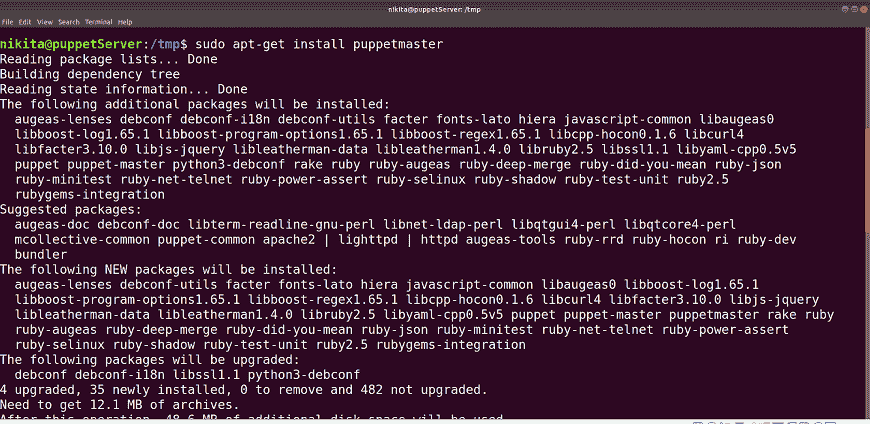
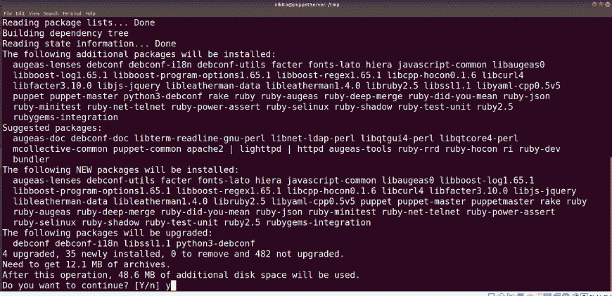

*   输出显示了 Puppet 主机及其运行服务的成功安装。要验证 Puppet 版本，请使用以下命令:

```

$ puppet -V

```

或者

```

$ puppet --version

```

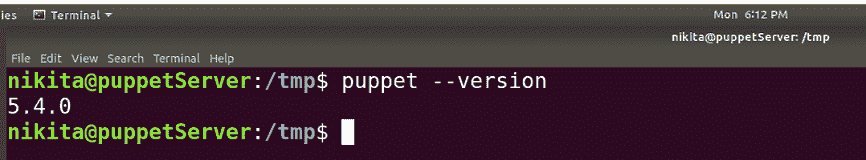

*   使用以下命令安装 Puppet 公用程序:

```

$ sudo apt-get install puppet-common

```

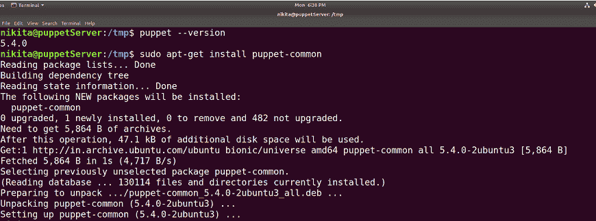

*   现在我们必须锁定 Puppet 版本的升级，因为这将妨碍升级 Puppet 时的配置。它不会在执行系统更新时更改 Puppet。我们可以通过创建一个具有如下配置的新文件来进行这些设置:

```

$ sudo vim /etc/apt/preferences.d/00-puppet.pref

```

在文件中添加以下配置:

```

# /etc/apt/preferences.d/00-puppet.pref
Package: puppet puppet-common puppetmaster-passenger
Pin: version 5.4*
Pin-Priority: 501

```

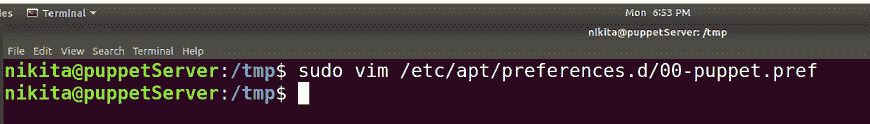
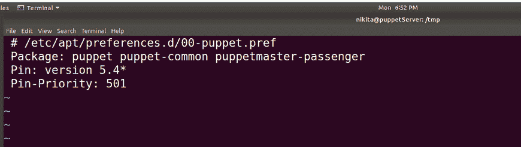

现在它不会在运行设备更新时更新 Puppet。因此，让我们在以下步骤中继续安装 Puppet 客户端。

*   现在，我们将更改 Puppet 配置文件。在编辑器中打开 puppet server 的 puppet.conf 文件，并配置其参数，如下所示。

```

$ sudo vim /etc/puppet/puppet.conf

```

在[主]和[主]下添加新行并保存:

```

[main]
ssldir = /var/lib/puppet/ssl
logdir = /var/log/puppet
rundir = /var/run/puppet

[master] 
certname = puppetServer

```

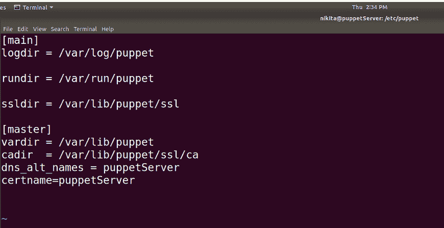

将所需的更改添加到配置文件后，重新启动 puppet master 服务。

```

$ service puppetmaster stop
$ service puppetmaster start

```

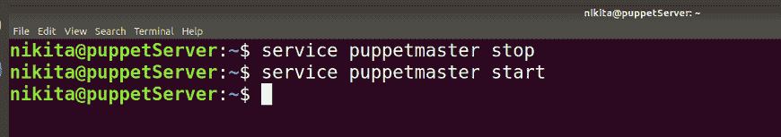

### Puppet 客户端安装

*   因为，我们已经安装了它的所有基本需求，现在只需运行一个命令，在 puppetClient Ubuntu 机器上安装 puppet 代理，该代理将与 Puppet master 即 puppetServer Ubuntu 机器交互。

```

 $ sudo apt-get install puppet

```

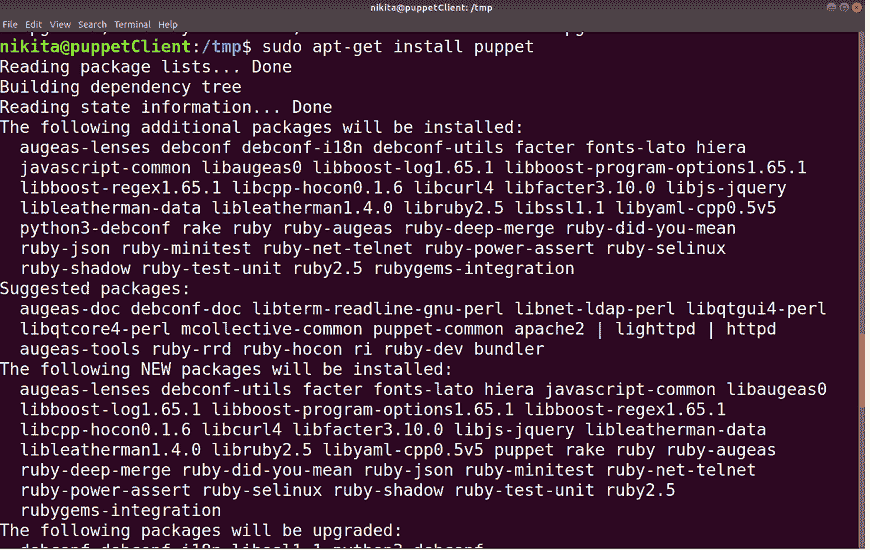

*   要检查 puppet 安装版本，请使用以下命令:

```

$ puppet -V

```

或者

```

$ puppet --version

```

*   现在，按照我们对 Puppet 主服务器所做的相同步骤进行操作。我们必须锁定 Puppet 的版本，这样它就不会在操作系统更新过程中引起任何问题。

创建新文件:

```

$ sudo vim /etc/apt/preferences.d/00-puppet.pref

```


并在文件中添加以下配置:

```

# /etc/apt/preferences.d/00-puppet.pref
Package: puppet puppet-common puppetmaster-passenger
Pin: version 5.4*
Pin-Priority: 501

```

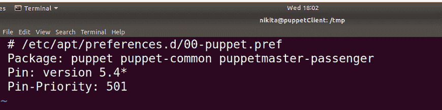

现在它不会在运行设备更新时更新 Puppet。因此，让我们在以下步骤中继续配置 Puppet 客户端。

*   现在，我们将更改 Puppet 配置文件。在编辑器中打开 puppet 客户端的 puppet.conf 文件，并配置其参数，如下所示。

```

$ sudo vim /etc/puppet/puppet.conf

```

注释掉[主]配置，在[主]和[代理]下添加新行并保存:

```

[main]
ssldir = /var/lib/puppet/ssl
vardir = /var/lib/puppet
logdir = /var/log/puppet
rundir = /var/run/puppet

[agent] 
server=puppetServer

```

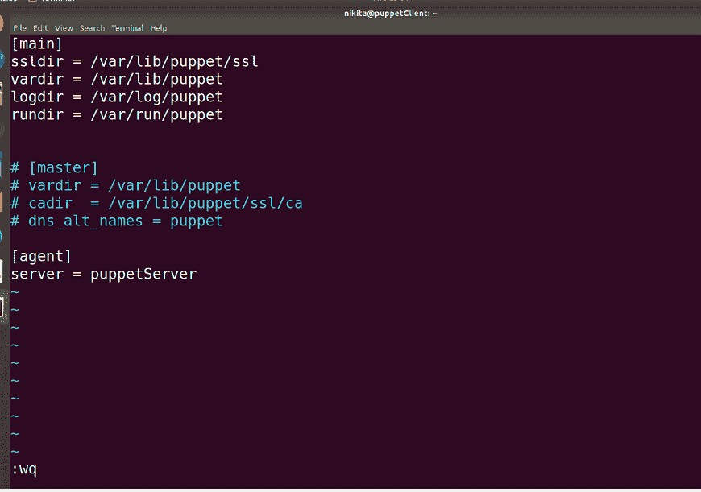

*   启动 Puppet 代理服务。

```

$ service puppet start

```

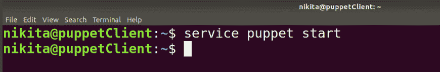

### 建立安全连接

Puppet 代理请求 Puppet 主人的证书，用于 Puppet 主人和 Puppet 代理的交流。因为在 puppet 客户端成功初始化后，它将检查 Puppet 主服务器，并在接受来自主 Puppet 服务器的任何管理指令之前发送证书请求。

一旦 Puppet 主人发送其证书，Puppet 代理生成其自己的证书。然后它请求 Puppet 主人签署这个证书。在主人签署此证书后，Puppet 主人和 Puppet 代理之间形成了安全链接。

*   要在 puppet master 中生成 CA 证书，请转到根用户，并在您的 puppetServer 虚拟机中运行以下命令:

```

$ sudo -i

```

上述命令将允许用户切换到根用户。

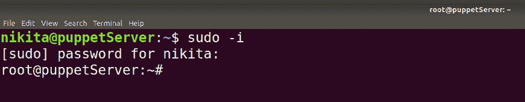

现在，在 PuppetServer 上执行以下命令:

```

# puppet master --no-daemonize --verbose

```

上面的命令将创建一个证书颁发机构证书和一个 Puppet 主证书，其中包括适当的域名。

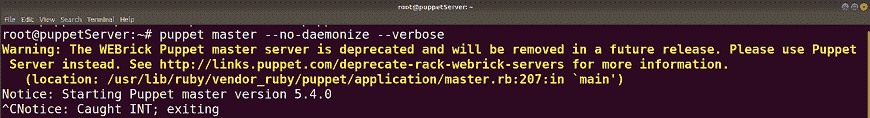

我们可以忽略这个警告信息。一旦您收到“注意:启动 Puppet 大师 5.4.0 版本”消息，请按 ctrl+c，因为我们现在无法启动 Puppet 大师。

*   现在，启动并启用 Puppet 主人服务。

```

# puppet resource service puppetmaster ensure=running

```

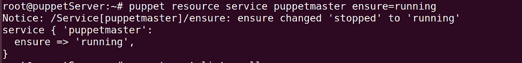

```

# puppet resource service puppetmaster enable=true

```

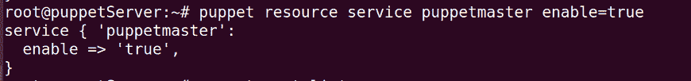

*   现在，将证书签名请求从 Puppet 代理发送给 Puppet 主人。

```

# $ puppet -t

```

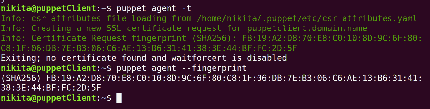

*   在 puppetServer 中，我们需要签署 puppet 代理请求的证书。要获取证书列表，请在 puppetServer 计算机上运行以下命令:

```

# puppet cert list

```

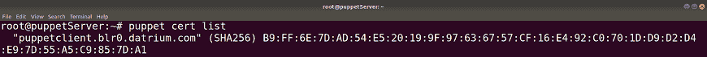

这里，“puppetclient.blr0.datrium.com”是自动为 puppetclient 机器生成的 DNS 名称。

要签署 Puppet 代理请求的证书，请执行以下命令:

```

# puppet cert sign puppetclient.blr0.datrium.com

```

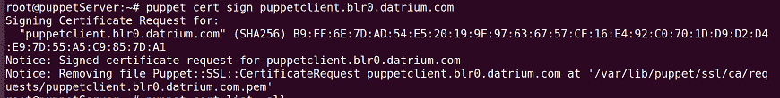

*   签署请求的证书后，启动 Puppet 代理。要启动和启用 Puppet 代理，请运行以下命令:

```

# puppet resource service puppet ensure=running
# puppet resource service puppet enable=true

```

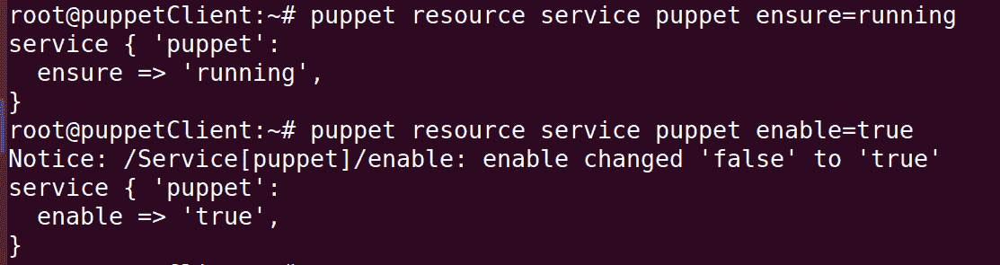

*   通过在 puppet 客户端机器上运行以下命令，我们还可以在客户端 Puppet 机器上看到证书的指纹:

```

$ puppet agent --fingerprint

```

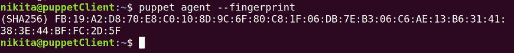

现在，Puppet 主人和 Puppet 特工之间有了安全的联系。

因此，我们已经成功地安装和配置了一个 puppet master，并为具有全功能 Puppet 实例的 Puppet 代理设置了它的基本配置。

* * *