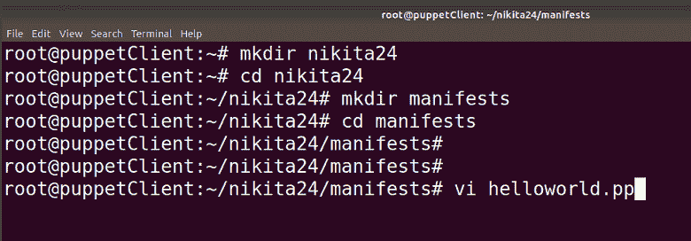
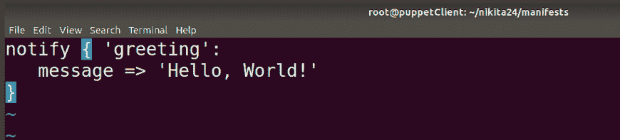
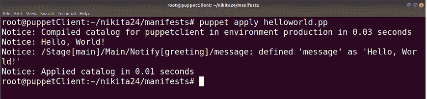

# Puppet清单

> 原文：<https://www.javatpoint.com/puppet-manifest>

在 puppet 中，所有的程序都是用 Ruby 编程语言编写的，并添加了。pp 被称为清单。的完整形式。pp 是Puppet计划。

清单文件是Puppet程序。这用于管理目标主机系统。所有的Puppet程序都遵循Puppet编码风格。

我们可以在任何清单中使用一组不同种类的资源，这些资源按定义和类分组。

Puppet清单也支持条件语句。默认清单文件位于/etc/puppet/manifest/site . PP 位置。

## 清单组件

Puppet清单包含以下组件:

*   **文件:**文件是可以直接部署在你的Puppet客户端上的纯文本文件。如 yum.conf、httpd.con 等。
*   **资源:**资源是我们需要评估或改变的要素。资源可以是包、文件等。
*   **模板:**这是用来在节点上创建配置文件的，我们以后可以重用。
*   **节点:**这里定义了与客户端相关的所有信息和定义的代码块。
*   **类:**类用于对不同类型的资源进行分组。

## 写作清单

### 使用变量

Puppet 提供了许多内置变量，我们可以在清单中使用。我们也可以创建自己的变量，在Puppet清单中定义。 [Puppet](https://www.javatpoint.com/puppet) 提供不同类型的变量。一些常用的变量是字符串或字符串数组。

让我们看一个字符串变量的例子:

```

$package = "vim"  

package {  $package: 
   ensure => "installed" 
}

```

### 使用循环

循环用于多次运行同一组代码，直到定义的条件变为真。为了执行循环，我们可以使用数组。让我们看一个例子:

```

$packages = ['vim', 'git', 'curl']  

package { $packages: 
   ensure => "installed" 
}

```

### 使用条件句

Puppet 允许我们使用不同类型的条件语句。比如 if-else 语句、case 语句等。让我们看一个例子:

```

if $Color != 'White' { 
   warning('This color is not good for wall') 
} else { 
   notify { 'This color is best for wall': }
}

```

## 例子

### 编写清单

众所周知，我们可以创造我们的资源。让我们从像 notify resources 这样的公共资源开始。

```

notify { 'greeting':
  message => 'Hello, world!'
}

```

在上面的代码中，**通知**是资源，消息是属性。**消息**具有用逗号与其值分开的属性，这是在 [Ruby](https://www.javatpoint.com/ruby-tutorial) 、 [PHP](https://www.javatpoint.com/php-tutorial) 、 [Perl](https://www.javatpoint.com/perl-tutorial) 和其他脚本语言中识别键值对的一种非常通用的方式。

创建一个清单，并在该清单中编写上述脚本。首先，您必须切换到根用户。

```

nikita@puppetClient:~$ sudo su
root@puppetClient:~# vi helloworld.pp

```




在这里，我们可以看到清单是用。pp 扩展。我们可以使用任何编辑器来创建或修改清单使用任何文本编辑器。

### 应用清单

Puppet的主要品质是测试代码的简单性。在这种情况下，为了处理Puppet清单，不需要配置复杂的测试环境。

要应用清单，puppet 使用 apply 命令，该命令告诉 puppet 应用单个 puppet 清单:

```

# puppet apply helloworld.pp
Notice: Compiled catalog for puppetclient in environment production in 0.03 seconds
Notice: Hello, World!
Notice: /Stage[main]/Main/Notify[greeting]/message:
  defined 'message' as 'Hello, World!'
Notice: Applied catalog run in 0.01 seconds

```



在这里，你可以看到，Puppet已经成功地应用了清单。这个过程由许多步骤完成:

*   从清单编译或构建Puppet目录。
*   员工的依赖关系和排序信息决定评估顺序。
*   评估所需资源，以决定是否应实施更改。
*   创建、更新或删除资源-通知中将生成一条消息。
*   给出关于目录应用程序的详细输出。

* * *