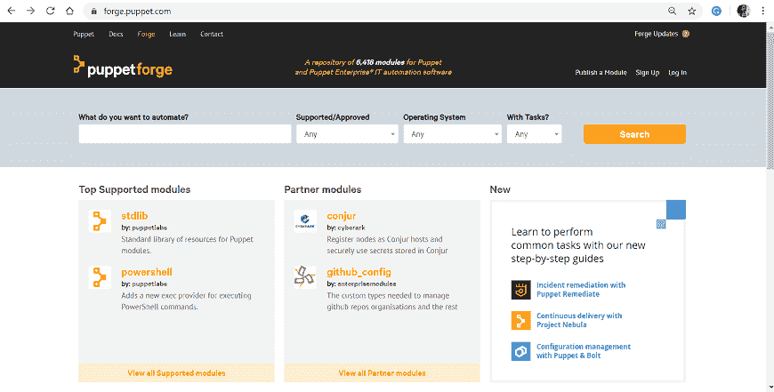
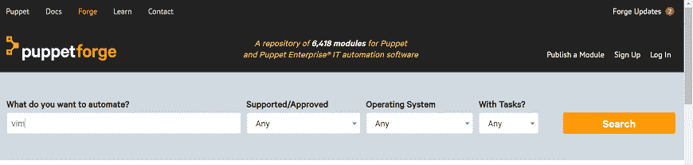
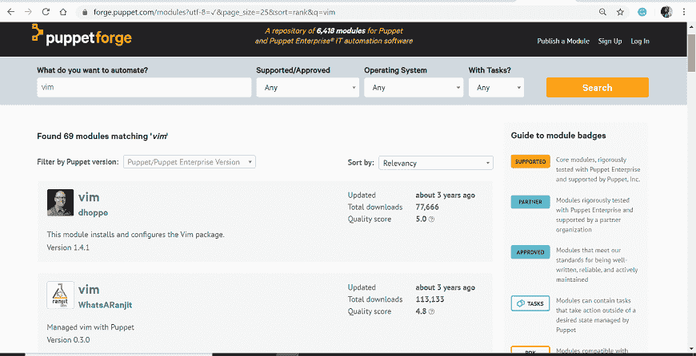
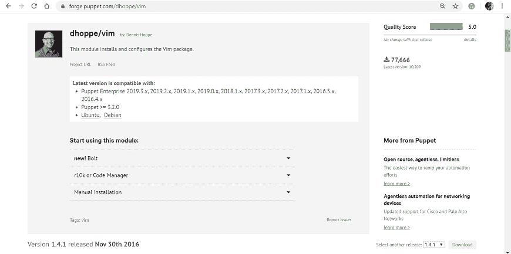
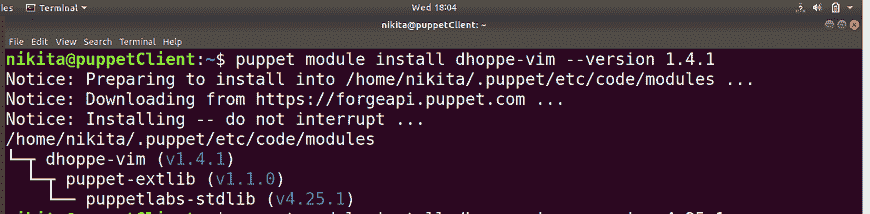

# 木偶模块

> 原文：<https://www.javatpoint.com/puppet-modules>

Puppet Module 是文件、类、模板和资源的集合。每个模块处理基础设施中的特定任务，例如安装和配置一个软件。

由于模块允许您将代码划分为多个清单，这对于组织您的傀儡代码非常有帮助。模块是[傀儡](https://www.javatpoint.com/puppet)中可重用、可共享的单元。

模块必须安装在傀儡模块路径中。modulepath 是/etc/puppet/modules 目录。

## 模块配置

我们在任何 Puppet 模块中都有两个分区，这允许我们定义代码的结构并控制面额。

*   模块搜索路径在 puppetmasterd 或 masterd 中配置，并使用冒号分隔的目录列表。其他部分使用 modulepath 参数进行配置。
    即:

```

[puppetmasterd] 
... 
modulepath = /var/lib/puppet/modules:/data/puppet/modules

```

*   第二个分区是 fileserver.conf 中文件服务器模块的访问控制设置。我们不需要为那个模块指定路径，如果您指定了路径，它会给出警告。

## 模块来源

Puppet 允许在不同的位置存储模块。我们可以将模块存储在机器的不同文件系统中。只有一个条件，即模块的所有路径必须在名为 modulepath 的配置变量中定义。 **modulepath** 是一个路径变量，puppet 在其中搜索所有模块目录，并在引导时加载所有模块目录。

默认路径是:

```

/etc/puppet/modules:/usr/share/puppet:/var/lib/modules

```

## 模块内部组织

在 Puppet 中创建新模块时，它使用相同的结构，并添加以特定目录结构组织的分布式文件、清单、模板和插件，如下面的代码所示。

```

MODULE_PATH/ 
   downcased_module_name/ 
      files/ 
      manifests/ 
         init.pp 
      lib/ 
         puppet/ 
            parser/ 
               functions 
            provider/ 
            type/ 
         facter/ 
      templates/ 
      README

```

创建模块后，它会在清单目录中的特定位置添加 init.pp 清单文件。init.pp 是一个默认文件，它首先在任何模块中运行，并包含与该模块相关的所有类的列表。

### 例子

让我们看一个创建 autofs 模块的例子，该模块安装一个固定的 auto.homes 映射，并从模板生成 auto.master:

```

class autofs { 
   package { autofs: ensure => latest } 
   service { autofs: ensure => running } 

   file { "/etc/auto.homes": 
      source => "puppet://$servername/modules/autofs/auto.homes" 
   } 
   file { "/etc/auto.master": 
      content => template("autofs/auto.master.erb") 
   } 
}

```

文件系统将包含以下文件:

```

MODULE_PATH/ 
autofs/ 
manifests/ 
init.pp 
files/ 
auto.homes 
templates/ 
auto.master.erb

```

## 木偶模块的安装

开源傀儡有许多预先存在的模块。这些模块由傀儡社区编写和开发。任何人都可以更新预先存在的模块。这些是内置的公共模块，任何人都可以下载、安装和使用。[傀儡锻造](https://forge.puppet.com/)中有超过 6000 个预先存在的模块。

让我们看看下载和安装这些预先存在的傀儡模块的步骤。

在这里，我们将从木偶铁匠铺下载 vim 模块。Vim 在 [Linux 操作系统](https://www.javatpoint.com/linux-tutorial)中的免费开源文本编辑器包中提供。

**第一步:** [点击这里](https://forge.puppet.com/)打开傀儡锻造官方页面。

当您单击该链接时，它将显示以下页面:



**第二步:**在搜索栏中，输入想要下载的模块名称。在这里，我们将下载 vim 模块:



**第三步:**点击搜索按钮，会显示多个结果。选择合适的。要决定您的选择，您可以单击单个模块查看完整的详细信息。在我们的例子中，我们将使用 dhoppe vim。



**第四步:**要下载模块，点击页面右侧的下载按钮，我们会得到 tarball 格式的模块。



**步骤 5:** 下载完成后，执行以下命令从 tarball 安装模块:

```

puppet module install /path/dhoppe-vim-1.4.1.tar.gz

```

在上面的命令中，“路径”是保存 tarball 的目录的路径。

我们也可以在线安装木偶模块。

要从 puppet 模块工具下载并安装模块，请执行以下命令:

```

 puppet module install dhoppe-vim --version 1.4.1 

```



* * *