# Puppet事实&事实

> 原文：<https://www.javatpoint.com/puppet-facter-and-facts>

在 Puppet 中，我们可以在 facter 的帮助下将几个值作为环境变量。Facter 是一个Puppet工具，用于保持环境级别的可变。它完全像是 [Bash](https://www.javatpoint.com/bash) 或者 [Linux](https://www.javatpoint.com/linux-tutorial) 的环境变量。有时，存储在事实和机器环境变量中的信息可能会重叠。

[Puppet](https://www.javatpoint.com/puppet)的键值对称为事实。每个资源都有自己的事实，我们可以在 Puppet 中构建自定义事实。

## 因子(factor)

该命令列出了所有不同的环境变量及其相关值。

```

$ facter

```

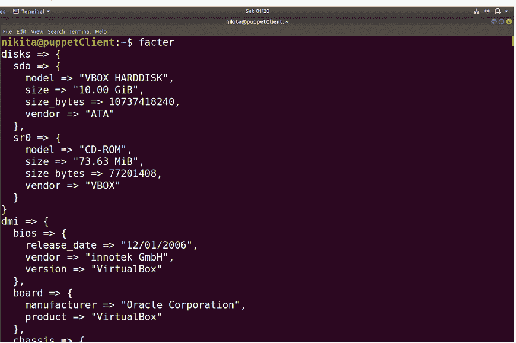

如果您只想查看一个变量，请使用以下命令:

```

$ facter {variable name}

```

### 示例:

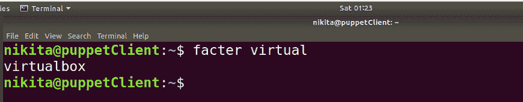

puppet 中 facter 和 facts 的主要特点是它们在整个 puppet 代码中都可以作为“全局变量”使用，这意味着我们可以根据需要在代码的任何部分使用它。

在Puppet中，可以使用三种类型的事实:

*   核心事实
*   自定义事实
*   外部事实

## 核心事实

在顶层，核心事实被描述，并且在代码中的任何点对每个人都可用。一些基本的核心事实如下:

| 核心事实 |
| 现代事实 | 遗留事实 |
| 云 | 遗产 |
| 磁盘 | bios _ 版本 |
| 工厂版本 | 领域 |
| 身份 | 完全合格域名 |
| 炮控设备 | 主机名 |
| 记忆 | 编号 |
| 骨 | ip 地址 |
| 小路 | 接口 |
| 红宝石 | mac 地址 |
| 虚拟的 | 网络掩码 |
| 建立关系网 | system32 |
| 划分 | 内存大小 |
| 处理器 | 无记忆 |
| 内核版本 | 全局唯一识别 |

要查看事实和值的完整列表，请使用以下命令:

```

$ run puppet facts

```

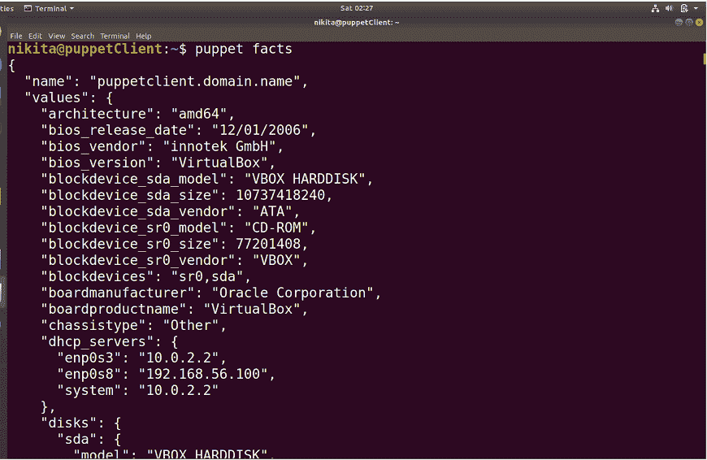
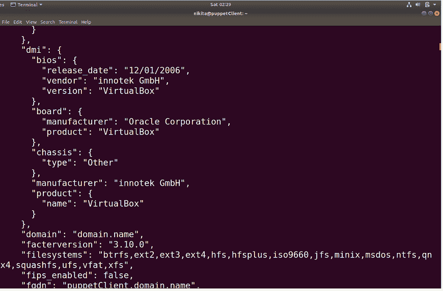

## 自定义事实

我们还可以通过以下方式向节点添加自定义事实:

*   **使用“导出 FACTER”...语法"**

```

$ export FACTER_{fact's name} syntax

```

**示例:**

```

$ export FACTER_tallest_mountain="Everest" 
$ facter tallest_mountain Everest

```


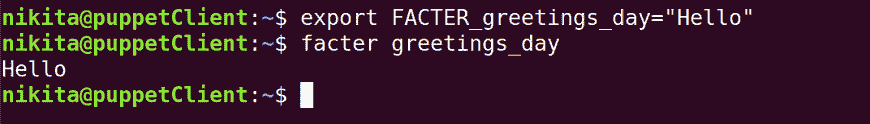

*   **使用$LOAD_PATH 设置**

在 [Ruby](https://www.javatpoint.com/ruby-tutorial) 中，$LOAD_PATH 类似于 Bash $PATH 变量，但不是环境变量；相反，它是一个预定义的变量。

在$LOAD_PATH 中，“$”变量是一个用于搜索和加载值的数组。

```

$ ruby -e 'puts $LOAD_PATH'
/usr/share/rubygems-integration/all/gems/did_you_mean-1.2.0/lib
/usr/local/lib/site_ruby/2.5.0
/usr/local/lib/x86_64-linux-gnu/site_ruby
/usr/local/lib/site_ruby
/usr/lib/ruby/vendor_ruby/2.5.0
/usr/lib/x86_64-linux-gnu/ruby/vendor_ruby/2.5.0
/usr/lib/ruby/vendor_ruby
/usr/lib/ruby/2.5.0
/usr/lib/x86_64-linux-gnu/ruby/2.5.0

```


现在，创建一个目录 facter，添加一个. pp 文件并将内容附加到其中:

```

[nikita@puppetClient ~]$ cd /usr/lib/ruby/site_ruby/ 
[nikita@puppetClient site_ruby]$ mkdir facter 
[nikita@puppetClient site_ruby]$ cd facter/ 
[nikita@puppetClient facter]$ ls 
[nikita@puppetClient facter]$ touch newadded_facts.rb

```

将以下内容添加到 custom_facts.rb 文件中:

```

[nikita@puppetClient facter]$ cat newadded_facts.rb 
Facter.add('tallest_mountain') do 
   setcode "echo Everest" 
end

```

Facter 扫描$LOAD_PATH 中列出的整个文件夹，并搜索名为 facter 的目录。一旦它得到那个特定的目录，它会把它们放在目录结构的任何地方。如果找到了这个文件夹，它会在 facter 目录中搜索任何 Ruby 文件，并将所有指定的事实加载到内存中。

### factory lib

FACTERLIB 类似于$LOAD_PATH。两者只有一个区别，即 FACTERLIB 是操作系统级环境参数，$LOAD_PATH 是 Ruby 特殊变量。

默认情况下，可能不会配置环境变量。让我们检查一下:

```

$ env | grep "FACTERLIB"

```

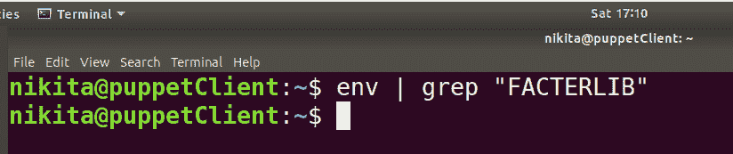

要测试 FACTERLIB，请执行以下步骤:

创建一个名为 test_facts 的目录。

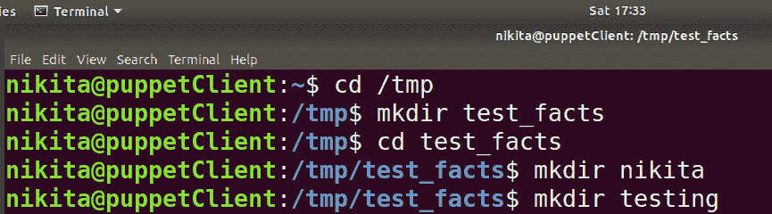
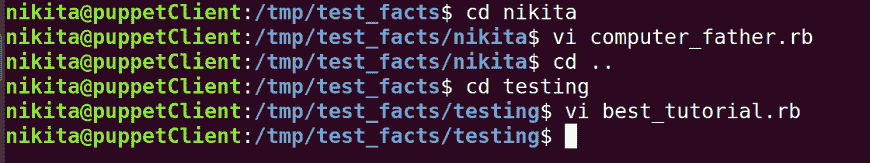

要查看目录结构，请执行以下命令:

```

$ tree /tmp/test_facts/

```

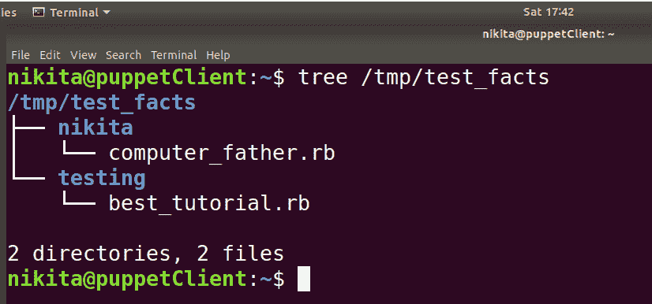

将以下内容复制到。rb 文件:

```

$ vi computer_father.rb
Facter.add('computer_father') do
        setcode "echo 'Charles Babbage'"
end

```

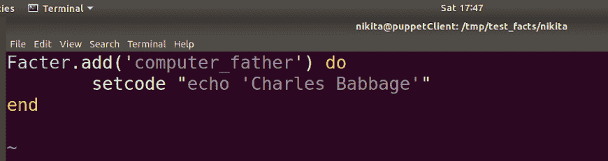

```

$ vi best_tutorial.rb
Facter.add('best_tutorial') do
        setcode "echo 'JavaTpoint'"
end

```

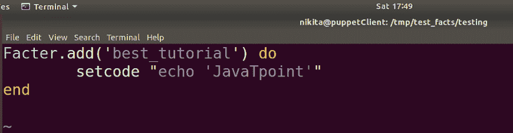

现在，使用导出语句:

```

$ export FACTERLIB="/tmp/test_facts/father:/tmp/test_facts/tutorial"
$ env | grep "FACTERLIB"
FACTERLIB=/tmp/test_facts/father:/tmp/test_facts/tutorial

```

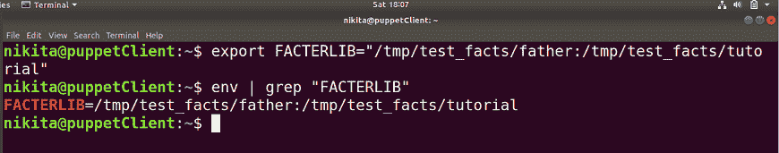

现在，测试一下新的事实:

```

$ facter computer_father
$ facter best_tutorial

```

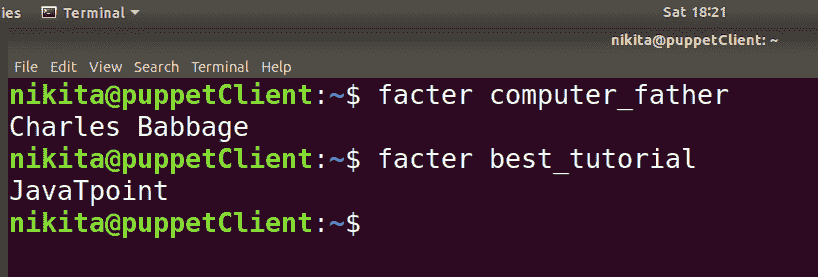

## 外部事实

如果您想应用在资源调配阶段创建的一些新事实，那么您可以使用外部事实。外部事实是在虚拟机(VM)配置时向其应用元数据的最佳方式。比如 OpenStack、vSphere、 [AWS](https://www.javatpoint.com/aws-tutorial) 等。

Puppet 可以使用所有元数据及其生成的信息来决定哪些项目应该包含在将要应用的目录中。

* * *