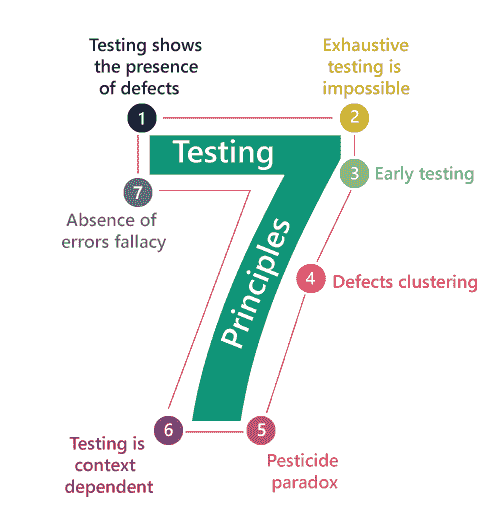

# 软件测试原则

> 原文：<https://www.javatpoint.com/software-testing-principles>

软件测试是实现软件或应用以识别缺陷或错误的过程。为了测试一个应用或软件，我们需要遵循一些原则来使我们的产品没有缺陷，这也有助于测试工程师用他们的努力和时间来测试软件。在这一节中，我们将学习软件测试的七个基本原则。

让我们逐一看看七种不同的测试原则:

*   测试显示存在缺陷
*   详尽的测试是不可能的
*   早期测试
*   缺陷聚类
*   农药悖论
*   测试依赖于上下文
*   无错误谬误

### 测试显示存在缺陷

测试工程师将测试应用，以确保应用没有错误或缺陷。在进行测试时，我们只能识别应用或软件是否有任何错误。进行测试的主要目的是借助各种方法和测试技术来识别未知 bug 的数量，因为整个测试应该可以追溯到客户的需求，这意味着找到任何可能导致产品无法满足客户需求的缺陷。

通过对任何应用进行测试，我们可以减少错误的数量，这并不意味着应用没有缺陷，因为有时软件在对其执行多种类型的测试时似乎没有错误。但是在生产服务器中部署时，如果最终用户遇到测试过程中没有发现的 bug。

### 详尽的测试是不可能的

有时，在整个实际测试过程中，用输入数据的有效和无效组合来测试所有模块及其特性似乎非常困难。

因此，不要进行详尽的测试，因为它需要无限的决心和大部分艰苦的工作是不成功的。因此，我们可以根据模块的重要性完成这种类型的变更，因为产品时间表不允许我们执行这种类型的测试场景。

### 早期测试

在这里，早期测试意味着所有的测试活动都应该在软件开发生命周期的**需求分析阶段**的早期阶段开始，以识别缺陷，因为如果我们在早期阶段发现 bug，它将在初始阶段本身得到修复，与测试过程的未来阶段识别的 bug 相比，这可能会花费我们很少的成本。

为了执行测试，我们将需要需求规范文档；因此，如果需求定义不正确，那么它可以直接被修复，而不是在另一个阶段修复它们，这可能是开发阶段。

### 缺陷聚类

缺陷聚类定义了在整个测试过程中，我们可以检测与少量模块相关的缺陷数量。我们有各种各样的原因，比如模块可能很复杂；编码部分可能很复杂，等等。

这些类型的软件或应用将遵循**帕累托原则**，该原则规定我们可以识别大约。80%的并发症出现在 20%的模块中。借助于此，我们可以找到不确定的模块，但是如果相同的测试定期执行，那么这种方法有其困难，因此相同的测试将不能识别新的缺陷。

### 农药悖论

这个原则定义了，如果我们在特定的时间内一次又一次地执行同一套测试用例，那么这类测试将无法发现软件或应用中的新缺陷。为了克服这些农药悖论，经常审查所有的测试案例是非常重要的。而且新的和不同的测试对于应用或软件的多个部分的实现是必要的，这有助于我们发现更多的 bug。

### 测试依赖于上下文

测试是一个依赖于上下文的原则，说明我们有多个领域，如电子商务网站、商业网站等都可以在市场上获得。有一个明确的方法来测试商业网站以及电子商务网站，因为每个应用都有自己的需求、特性和功能。为了检查这种类型的应用，我们将借助各种测试、不同的技术、方法和多种方法。因此，测试取决于应用的上下文。

### 无错误谬误

一旦应用被完全测试，并且在发布前没有发现任何错误，那么我们可以说应用 99%没有错误。但是，当应用在不正确的需求之外被测试，识别出缺陷，并在给定的时间内修复它们时，这是有可能的，因为测试是在错误的规范上进行的，这不适用于客户的需求。没有错误谬误意味着，如果应用不切实际，不能满足客户的要求和需求，那么识别和修复错误将毫无帮助。

* * *