# 软件测试的类型

> 原文：<https://www.javatpoint.com/types-of-software-testing>

在本节中，我们将了解各种类型的软件测试，它们可以在软件开发生命周期中使用。

正如我们所知，**软件测试**是一个根据客户的先决条件分析应用程序功能的过程。

如果我们想确保我们的软件没有错误或稳定，我们必须执行各种类型的软件测试，因为测试是使我们的应用程序没有错误的唯一方法。

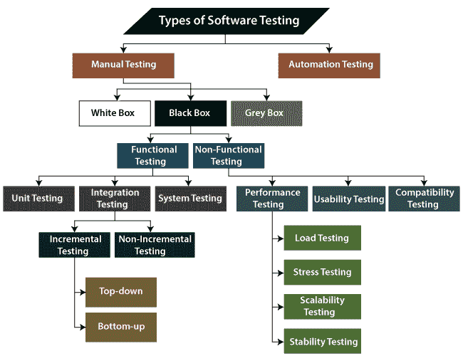

## 不同类型的软件测试

软件测试的分类是不同测试活动的一部分，例如**测试策略、测试可交付成果、定义的测试目标等**。而软件测试就是执行软件来发现缺陷。

测试类型的目的是确认**自动测试**(被测应用)。

要开始测试，我们应该有一个**要求，应用就绪，必要的资源可用**。为了保持责任感，我们应该给不同的测试工程师分配一个相应的模块。

软件测试主要分为两部分，具体如下:

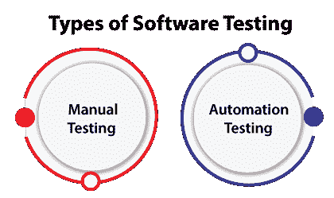

*   **手动测试**
*   **自动化测试**

## 什么是手动测试？

在不使用任何自动化工具的情况下，根据客户的需求测试任何软件或应用程序，称为**手动测试**。

换句话说，可以说是一个**验证和确认**的程序。手动测试用于验证与需求规格相矛盾的应用程序或软件的行为。

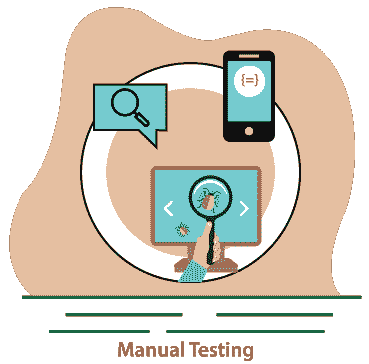

我们不需要任何测试工具的精确知识来执行手动测试用例。我们可以轻松地准备测试文档，同时对任何应用程序执行手动测试。

要获得关于手动测试的详细信息，请点击以下链接:https://www.javatpoint.com/manual-testing.

## 人工测试的分类

在软件测试中，手动测试可以进一步分为**三种不同类型的测试**，具体如下:

*   **白盒测试**
*   **黑盒测试**
*   **灰盒测试**

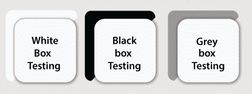

为了更好地理解，让我们一个接一个地看看它们:

### 白盒测试

在白盒测试中，开发人员将检查每一行代码，然后将其交给测试团队或相关的测试工程师。

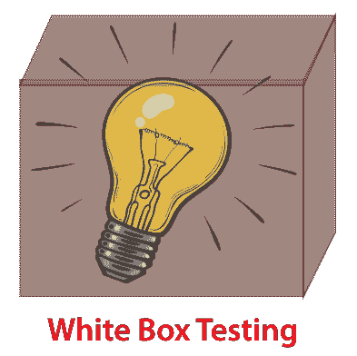

随后，在整个测试过程中，代码对于开发人员来说是显而易见的；这就是为什么这个过程被称为 **WBT(白盒测试)**。

换句话说，我们可以说**开发人员**将对特定的软件执行完整的白盒测试，并将特定的应用程序发送给测试团队。

实现白盒测试的目的是强调软件上的输入和输出流，并增强应用程序的安全性。

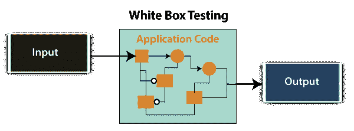

白盒测试又称**开盒测试、玻璃盒测试、结构测试、清盒测试、透明盒测试**。

要深入了解白盒测试，请参考以下链接:[https://www.javatpoint.com/white-box-testing](https://www.javatpoint.com/white-box-testing)。

### 黑箱测试

另一种手动测试是**黑盒测试**。在这个测试中，测试工程师将根据需求分析软件，识别缺陷或 bug，并将其发送回开发团队。

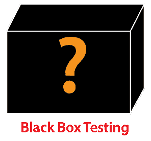

然后，开发人员将修复这些缺陷，进行一轮白盒测试，并将其发送给测试团队。

在这里，修复 bug 意味着缺陷得到解决，并且特定的特性正在按照给定的要求工作。

实现黑盒测试的主要目标是指定业务需求或客户需求。

换句话说，我们可以说黑盒测试是根据客户需求检查应用程序功能的过程。源代码在此测试中不可见；这就是为什么它被称为**黑盒测试**。

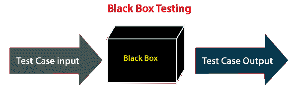

有关黑盒测试的更多信息，请参考以下链接:[https://www.javatpoint.com/black-box-testing](https://www.javatpoint.com/black-box-testing)。

### **黑盒测试类型**

黑盒测试进一步分为两部分，如下所述:

*   **功能测试**
*   **非功能测试**

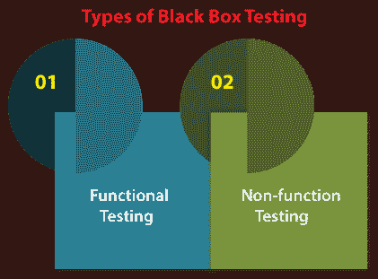

### 功能测试

测试工程师将对照要求规范系统地检查所有部件，这就是所谓的**功能测试**。功能测试也称为**组件测试**。

在功能测试中，通过给出值、定义输出以及用期望值验证实际输出来测试所有组件。

功能测试是黑盒测试的一部分，因为它强调的是应用需求而不是实际代码。测试工程师必须只测试程序而不是系统。

要获得功能测试的详细信息，请参考以下链接:[https://www.javatpoint.com/functional-testing](https://www.javatpoint.com/functional-testing)。

### 功能测试的类型

就像另一种类型的测试被分成几个部分一样，功能测试也被分成各种类别。

不同类型的功能测试包含以下内容:

*   **单元测试**
*   **集成测试**
*   **系统测试**

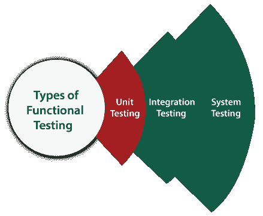

现在，让我们逐一了解它们:

### 1.单元测试

为了测试任何软件，单元测试是功能测试的第一级。在这种情况下，测试工程师将独立测试一个应用程序的模块或者测试所有的模块功能称为**单元测试**。

执行单元测试的主要目的是确认单元组件的性能。这里，单元被定义为软件或应用程序的单一可测试功能。并且它在指定的应用程序开发阶段得到验证。

点击以下链接获取单元测试的完整信息:[https://www.javatpoint.com/unit-testing](https://www.javatpoint.com/unit-testing)。

### 2.集成测试

一旦我们成功地实现了单元测试，我们将进行[集成测试](https://www.javatpoint.com/integration-testing)。它是功能测试的第二个层次，我们在这里测试依赖模块之间的数据流或者两个特性之间的接口叫做**集成测试**。

执行集成测试的目的是测试每个模块之间语句的准确性。

### 集成测试的类型

集成测试还进一步分为以下几个部分:

*   **增量测试**
*   **非增量测试**

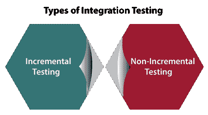

### 增量集成测试

每当模块之间有明确的关系时，我们就进行增量集成测试。假设我们取两个模块，分析它们之间的数据流，看它们是否正常工作。

如果这些模块工作正常，那么我们可以再添加一个模块并再次测试。我们可以继续同样的过程来获得更好的结果。

换句话说，我们可以说，对模块进行增量相加并测试模块之间的数据流称为**增量集成测试**。

**增量集成测试类型**

增量集成测试可以进一步分为两部分，如下所示:

1.  **自上而下的增量集成测试**
2.  **自下而上的增量集成测试**

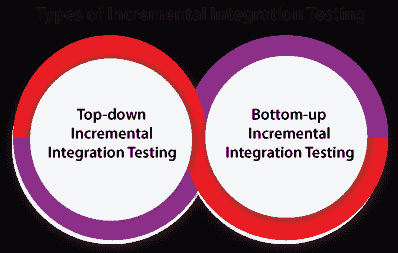

让我们来看看这些类型的集成测试的简要介绍:

**1。自上而下的增量集成测试**

在这种方法中，我们将逐步或递增地添加模块，并测试它们之间的数据流。我们必须确保我们正在添加的模块是早期模块的**子模块。**

**2。自下而上的增量集成测试**

在自底向上的方法中，我们将递增地添加模块，并检查模块之间的数据流。此外，确保我们添加的模块是早期模块的**父模块。**

### 非增量集成测试/大爆炸方法

每当数据流复杂并且很难对父代和子代进行分类时，我们都会选择非增量集成方法。非增量法也被称为**大爆炸法**。

要获得关于集成测试及其类型的完整信息，请参考以下链接:[https://www.javatpoint.com/integration-testing](https://www.javatpoint.com/integration-testing)。

### 3.系统试验

每当我们完成单元和集成测试时，我们就可以继续进行系统测试。

在系统测试中，测试环境与生产环境是并行的。也称为**端到端**测试。

在这种类型的测试中，我们将经历软件的每个属性，并测试最终特性是否按照业务需求工作。并将软件产品作为一个完整的系统进行分析。

点击以下链接获取系统测试的完整信息:[https://www.javatpoint.com/system-testing](https://www.javatpoint.com/system-testing)。

## 非功能测试

黑盒测试的下一部分是**非功能测试**。它提供了软件产品性能和使用技术的详细信息。

非功能性测试将帮助我们将软件的生产风险和相关成本降至最低。

非功能测试是**性能、负载、压力、可用性和兼容性测试**的组合。

有关非功能测试的更多信息，请参考以下链接:[https://www.javatpoint.com/non-functional-testing](https://www.javatpoint.com/non-functional-testing)。

### 非功能测试的类型

非功能测试分为测试的不同部分，我们将进一步讨论:

*   **性能测试**
*   **可用性测试**
*   **兼容性测试**

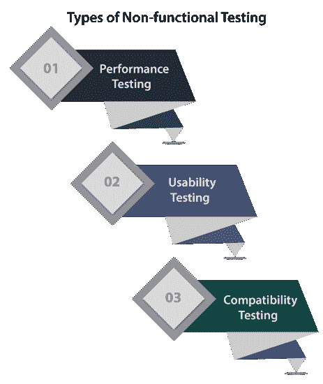

### 1.性能试验

在性能测试中，测试工程师将通过施加一些负载来测试应用程序的工作情况。

在这种类型的非功能测试中，测试工程师将只关注几个方面，例如软件或应用程序的**响应时间、负载、可扩展性和稳定性**。

**性能测试分类**

性能测试包括以下各种类型的测试:

*   **负载测试**
*   **压力测试**
*   **可扩展性测试**
*   **稳定性测试**

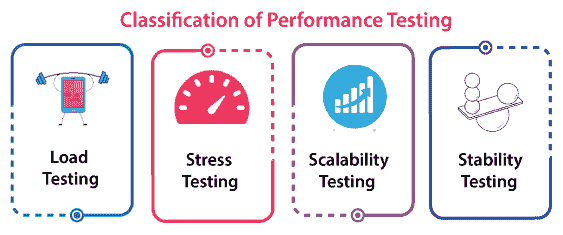

*   **负载测试**

在执行性能测试时，我们将对特定的应用程序施加一些负载来检查应用程序的性能，称为**负载测试**。这里，负载可以小于或等于期望的负载。

它将帮助我们检测软件的最高操作量和瓶颈。

要获得与负载测试相关的完整信息，请参考以下链接:

[https://www.javatpoint.com/load-testing](https://www.javatpoint.com/load-testing)。

*   **压力测试**

它用于分析软件超出常见功能限制的用户友好性和健壮性。

压力测试主要用于关键软件，但也可以用于所有类型的软件应用程序。

压力测试深度知识参考以下链接:[https://www.javatpoint.com/stress-testing](https://www.javatpoint.com/stress-testing)。

*   **可扩展性测试**

分析来看，应用程序通过增强或降低负载(尤其是平衡负载)来提高性能的过程称为**可伸缩性测试**。

在可伸缩性测试中，我们还可以检查**系统、进程或数据库的能力**以满足向上的需求。在此基础上，高效地设计并实现了**测试用例**。

单击以下链接获取与可伸缩性测试相关的详细信息:

[https://www.javatpoint.com/scalability-testing](https://www.javatpoint.com/scalability-testing)。

*   **稳定性测试**

稳定性测试是一个过程，在这个过程中，我们通过在精确的时间内施加负载来评估应用程序的性能。

它主要检查应用程序的恒定性问题和开发产品的效率。在这种类型的测试中，即使在压力很大的情况下，我们也能迅速发现系统的缺陷。

要获得稳定性测试的详细信息，请参考以下链接:

[https://www.javatpoint.com/stability-testing](https://www.javatpoint.com/stability-testing)。

### 2.可用性测试

另一种类型的**非功能测试**是**可用性测试**。在可用性测试中，我们将分析应用程序的用户友好性，并检测软件最终用户界面中的错误。

这里，术语**用户友好性**定义了应用程序的以下方面:

*   该应用程序应该易于理解，这意味着所有功能必须对最终用户可见。
*   应用程序的外观和感觉应该是好的，这意味着应用程序应该是令人愉快的外观，并给最终用户使用它的感觉。

有关可用性测试的更多信息，我们可以参考以下链接:

[https://www.javatpoint.com/usability-testing](https://www.javatpoint.com/usability-testing)。

### 3.兼容性测试

在兼容性测试中，我们将检查应用程序在特定硬件和软件环境中的功能。一旦应用程序功能稳定，我们就进行**兼容性测试**。

这里，**软件**表示我们可以在不同的操作系统和其他浏览器上测试应用，**硬件**表示我们可以在不同的大小上测试应用。

要全面了解兼容性测试，请参考以下链接:

[https://www.javatpoint.com/compatibility-testing](https://www.javatpoint.com/compatibility-testing)。

## 灰盒测试

**手动测试**的另一部分是**灰盒测试**。是黑盒和白盒测试的**合作。**

因为，灰盒测试包括对设计测试用例的内部编码的访问。灰盒测试由懂得编码和测试的人来执行。

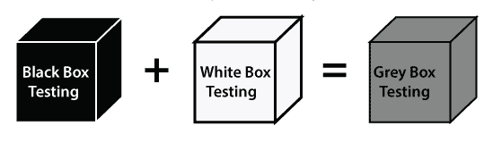

换句话说，我们可以说如果一个单人团队同时做了**白盒测试和黑盒测试**，就认为是**灰盒测试**。

要获得有关灰盒测试的详细信息，我们可以参考以下链接:

[https://www.javatpoint.com/grey-box-testing](https://www.javatpoint.com/grey-box-testing)。

## 自动化测试

软件测试最重要的部分是自动化测试。它使用特定的工具来自动化手动设计测试用例，而没有任何人为干扰。

自动化测试是提高软件测试的效率、生产率和覆盖率的最佳方式。

它用于重新运行测试场景，这些场景是手动、快速和重复执行的。

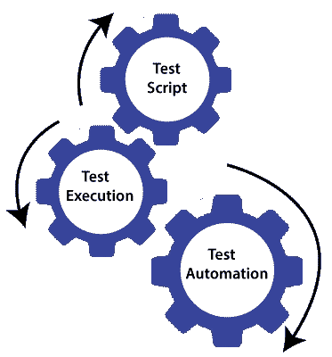

换句话说，我们可以说，每当我们使用一些工具测试一个应用程序时，我们称之为**自动化测试**。

当应用程序或软件出现不同版本或几个回归周期时，我们将进行自动化测试。如果不理解编程语言，我们就无法编写测试脚本或执行自动化测试。

有关自动化测试的更多信息，我们可以参考以下链接:

[https://www.javatpoint.com/automation-testing](https://www.javatpoint.com/automation-testing)。

## 一些其他类型的软件测试

在软件测试中，我们还有一些其他类型的测试，它们不是上面讨论的任何测试的一部分，但是在测试任何软件或应用程序时，这些测试是必需的。

*   **烟雾测试**
*   **健全性测试**
*   **回归测试**
*   **用户验收测试**
*   **探索性测试**
*   **特殊测试**
*   **安全测试**
*   **全球化测试**

让我们逐一了解这些类型的测试:

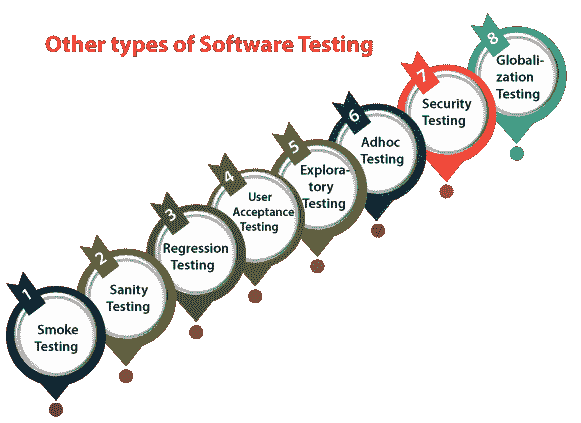

在**冒烟测试**中，我们将先测试一个应用程序的基本和关键特性，然后再进行一轮深入和严格的测试。

**或**之前检查所有可能的正负值被称为**烟雾测试**。分析应用程序核心和主要功能的工作流是执行烟雾测试的主要目标。

有关烟雾测试的更多信息，请参考以下链接:

[https://www.javatpoint.com/smoke-testing](https://www.javatpoint.com/smoke-testing)。

### 健全性测试

它用于确保所有的错误都已被修复，并且不会因为这些更改而产生新的问题。健全性测试是没有脚本的，这意味着我们不能记录它。它检查新添加的特性和组件的正确性。

要获得关于健全性测试的详细信息，我们可以参考以下链接:

[https://www.javatpoint.com/sanity-testing](https://www.javatpoint.com/sanity-testing)。

### 回归测试

回归测试是最常用的软件测试类型。这里，术语**回归**意味着我们必须重新测试未受影响的应用程序的那些部分。

回归测试是最适合自动化工具的测试。根据项目类型和资源可及性，回归测试可以类似于**重新测试**。

每当开发人员修复了一个 bug，然后测试应用程序的其他特性，这些特性可能会因为修复 bug 而被模拟，这就是所谓的**回归测试**。

换句话说，我们可以说，每当某个项目有新版本时，我们就可以执行回归测试，并且由于一个新特性可能会影响到早期版本中的旧特性。

要获得与回归测试相关的全面知识，请参考以下链接:

[https://www.javatpoint.com/regression-testing](https://www.javatpoint.com/regression-testing)。

### 用户接受度测试

用户验收测试(UAT)由被称为领域专家/客户或客户的独立团队完成。而在接受最终产品之前了解应用就称为**用户验收测试**。

在用户接受度测试中，我们分析了业务场景，以及称为 **UAT 环境**的独特环境中的实时场景。在此测试中，我们将在 UAI 之前测试应用程序，以获得客户批准。

有关用户验收测试的更多信息，请单击下面的链接:

[https://www.javatpoint.com/acceptance-testing](https://www.javatpoint.com/acceptance-testing)。

### 探索性测试

每当需求缺失时，就需要早期迭代，当我们有一个关键的应用程序时，测试团队已经有了经验丰富的测试人员。新的测试工程师加入了团队，然后我们进行**探索性测试**。

为了执行探索性测试，我们将首先以所有可能的方式检查应用程序，制作测试文档，了解应用程序的流程，然后测试应用程序。

单击以下链接获取探索性测试的完整信息:

[https://www.javatpoint.com/exploratory-testing](https://www.javatpoint.com/exploratory-testing)。

### 专项测试

一旦构建在检查的序列中，就随机测试应用程序被称为**即席测试**。

也叫**猴子测试和大猩猩测试**。在即席测试中，我们将检查与客户要求相矛盾的应用程序；这就是为什么它也被称为**阴性检测**。

当最终用户不经意地使用应用程序时，他/她可能会发现一个错误。尽管如此，专业的测试工程师会彻底地使用软件，所以他/她可能无法识别类似的检测。

请参考以下内容以获取关于 Adhoc 测试的详细信息:

[https://www.javatpoint.com/adhoc-testing](https://www.javatpoint.com/adhoc-testing)。

**安全测试**

它是软件测试的重要部分，用于确定软件应用程序中的弱点、风险或威胁。

安全测试的执行将帮助我们避免外来者的恶意攻击，并确保我们的软件应用程序的安全。

换句话说，我们可以说，安全测试主要是用来定义数据将是安全的，并忍受软件的工作过程。

有关安全测试的完整信息，请参考以下链接:[https://www.javatpoint.com/security-testing](https://www.javatpoint.com/security-testing)。

### 全球化测试

另一种类型的软件测试是**全球化测试。**全球化测试用于检查开发的软件是否有多种语言。在这里，**全球化**一词意味着为各种语言开发应用程序或软件。

全球化测试用于确保应用程序支持多种语言和多种功能。

在目前的场景中，我们可以看到几项技术的增强，因为应用程序准备在全球范围内使用。

请参考以下链接获取与全球化测试相关的完整信息:

[https://www.javatpoint.com/globalization-testing](https://www.javatpoint.com/globalization-testing)。

## 结论

在教程中，我们讨论了各种类型的软件测试。但是仍然有 100 多个测试类别的列表。然而，每一种测试并不用于所有类型的项目。

我们已经讨论了最常用的软件测试类型，如**黑盒测试、白盒测试、功能测试、非功能测试、回归测试、即席测试等**。

此外，在不同的组织中使用了不同的分类或流程，但总体概念在所有地方都是相似的。

当项目、需求和范围发生变化时，这些测试类型、过程和执行方法会不断变化。

* * *