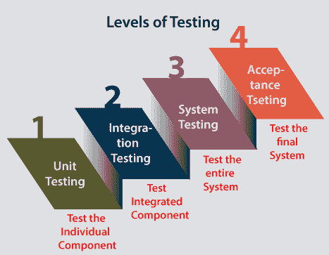

# 测试级别

> 原文：<https://www.javatpoint.com/levels-of-testing>

在本节中，我们将了解软件测试的各个**级别**。

正如我们在软件测试教程的前面部分中了解到的，测试任何应用或软件，测试工程师需要遵循多种测试技术。

为了检测错误，我们将实施软件测试；因此，所有的错误都可以被消除，以找到质量更好的产品。

## 软件测试有哪些级别？

测试级别是寻找缺失区域并避免开发生命周期阶段之间的重叠和重复的过程。我们已经看到了[软件开发生命周期](https://www.javatpoint.com/software-development-life-cycle)的**需求收集、设计、编码测试、部署和维护**等各个阶段。

为了测试任何应用，我们需要经历 SDLC 的所有上述阶段。像 SDLC 一样，我们有多个级别的测试，这有助于我们保持软件的质量。

### 不同级别的测试

软件测试的级别涉及不同的方法，这些方法可以在我们执行软件测试时使用。

在[软件测试](https://www.javatpoint.com/software-testing-tutorial)中，我们有四个不同级别的测试，如下所述:

1.  **单元测试**
2.  **集成测试**
3.  **系统测试**
4.  **验收测试**

正如我们在上面的图片中看到的，所有这些测试级别都有一个特定的目标，这个目标规定了软件开发生命周期的价值。

为了让我们更好地理解，让我们一个接一个地看看它们:

### 级别 1:单元测试

**单元测试**是软件测试的第一级，用于测试软件模块是否满足给定的需求。

第一级测试包括**分析软件应用的每个单元或单个组件**。

单元测试也是 [**功能测试**](https://www.javatpoint.com/functional-testing) 的第一关。执行单元测试的主要目的是验证单元组件的性能。

单元组件是应用的单个功能或规则，或者我们可以说它是软件中最小的可测试部分。执行单元测试的原因是为了测试不可访问代码的正确性。

单元测试将帮助测试工程师和开发人员理解代码的基础，使他们能够快速地改变导致缺陷的代码。开发人员实现该单元。

有关单元测试的更多信息，请参考以下链接:

[https://www.javatpoint.com/unit-testing](https://www.javatpoint.com/unit-testing)。

### 级别 2:集成测试

软件测试的第二个层次是**集成测试。**集成测试流程在**单元测试**之后。

主要用于测试从一个模块或组件到其他模块的**数据流。**

在集成测试中，**测试工程师**测试一组中软件的单元或独立组件或模块。

执行集成测试的主要目的是识别集成组件或单元之间交互的缺陷。

当每个组件或模块单独工作时，我们需要检查依赖模块之间的数据流，这个过程被称为**集成测试**。

我们只在每个应用模块的功能测试成功完成时才进行集成测试。

简单来说，我们可以说**集成测试**旨在评估所有模块之间通信的准确性。

有关集成测试的更多信息，请参考以下链接:

[https://www.javatpoint.com/integration-testing](https://www.javatpoint.com/integration-testing)。

### 第三级:系统测试

软件测试的第三个层次是**系统测试**，用于测试软件的功能性和非功能性需求。

测试环境与生产环境并行的是**端到端测试**。在第三级软件测试中，**我们将测试整个系统的应用。**

以用户身份检查应用或软件的端到端流程称为**系统测试**。

在系统测试中，我们将检查应用的所有必要模块，测试最终特性或最终业务是否正常工作，并将产品作为一个完整的系统进行测试。

简而言之，我们可以说系统测试是一系列不同类型的测试，以实现和检查集成软件计算机系统的整个工作是否符合要求。

有关系统测试的更多信息，请参考以下链接:

[https://www.javatpoint.com/system-testing](https://www.javatpoint.com/system-testing)。

### 第 4 级:验收测试

软件测试的最后一级**和第四级**是**验收测试**，用于评估一个规范或需求是否按照其交付得到满足。

软件通过了三个测试级别(**单元测试、集成测试、系统测试**)。当最终用户在实际场景中使用系统时，仍然可以发现一些小错误。

简单来说，我们可以说验收测试是对之前做的所有测试过程的**挤压。**

验收测试也称为**用户验收测试(UAT)** ，由客户在接受最终产品之前完成。

通常，领域专家(客户)会根据他们的满意度进行 UAT 测试，并根据给定的业务场景和实时场景检查应用是否正常工作。

有关系统测试的更多信息，请参考以下链接:

[https://www.javatpoint.com/acceptance-testing](https://www.javatpoint.com/acceptance-testing)。

### 结论

在本教程中，我们已经学习了所有级别的测试。我们可以得出结论，测试是根据它们在**软件开发生命周期**中的添加位置进行分组的。

软件测试的一个层次是测试软件或系统的每个单元或组件的过程。

实施**级测试**的主要原因是为了使**软件测试**过程高效且易于在特定级别找到所有可能的测试用例。

为了检查软件测试的行为或性能，我们有不同的测试级别。开发上述软件测试级别是为了识别缺失区域和理解开发生命周期条件。

所有这些 SDLC 模型的阶段(**需求收集、分析、设计、编码或执行、测试、部署和维护**)都经历软件测试级别的过程。

* * *