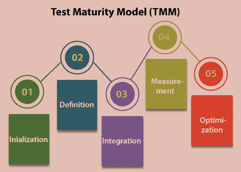
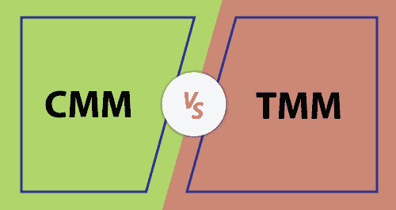

# 测试成熟度模型

> 原文：<https://www.javatpoint.com/test-maturity-model>

在本节中，我们将探讨和讨论与**测试成熟度模型**相关的以下主题，并且我们还将分析 TMM 在应用于软件测试过程时的重要性。

*   **什么是测试成熟度模型？**
*   **测试成熟度模型的五个层次**
*   **TMM 和 CMM 的区别**
*   **测试成熟度模型的好处**

在深入上述所有主题之前，首先，我们将了解**测试成熟度模型。**

## 什么是测试成熟度模型？

当软件被测试时，有许多技术被遵循来实现最大的质量和最小化缺陷或错误。

**测试成熟度模型**就是这样一个模型，它有一套结构化的层次，并且基于**能力成熟度模型(CMM)。**

伊利诺伊理工学院最初开发了**测试成熟度模型**，但现在由 **TMMI 基金会管理。**

我们使用测试成熟度模型来开发策略和参考框架，以增加测试过程。

目前，TMM 被**测试成熟度模型集成(TMMI)** 所取代，这是一个五级模型，提供了一个框架来衡量测试过程的成熟度。

我们需要非常高效地执行[软件开发生命周期](https://www.javatpoint.com/software-development-life-cycle)的测试阶段，因为它对于成功完成任何项目都起着重要作用。

**测试成熟度模型或 TMMi** 就是这样一个过程，它使得软件测试生命周期更加资源丰富。这是一个这样的模型，它有一个详细的测试过程改进模型。

测试成熟度模型的主要目的是找到成熟度并提供目标来增强[软件测试](https://www.javatpoint.com/software-testing-tutorial)过程，以便完成开发。它可以作为独立的模型使用，也可以与任何过程改进模型一起完成。

## 为什么我们需要 TMMi？

**测试成熟度模型集成/TMMi** 正在逐步进入许多信息技术组织，以更新和简化他们的测试过程。

**但问题来了，我们为什么需要 TMMi 模型？**

以下是一些重要的观点，这些观点有助于我们理解对 TMMi 的需求。

*   **测试成熟度模型集成(TMMi)** 有助于测试过程的评估和增强。
*   该模型的实现提高了测试过程、软件质量和测试工程的效率。
*   一些软件过程开发，如**坐标测量机/CMMI** 对测试提供了有限的考虑。因此，我们需要一个类似 TMMI 的过程，它主要是为了测试。
*   然而，为扩大测试过程做出了许多努力；尽管如此，对于软件工程来说，从现实中识别出零缺陷。所以，TMMi 是实现零缺陷的进一步尝试。
*   它是一个测试过程改进模型，可以与其他过程开发模型集成，并作为一个独立的模型使用。

## 测试成熟度模型的级别

测试成熟度模型包含**五个不同的级别**，这将帮助组织确定其成熟度。为了实现更高层次的测试成熟度，这五个层次将引导我们确定下一步的开发步骤:

让我们逐一详细了解一下 TMM 的五个层次:

1.  **初始化**
2.  **定义**
3.  **整合**
4.  **测量与管理**
5.  **优化**

### 级别 1:初始化

*   **初始化**是测试成熟度模型的第一级。TMM 的第一级没有定义的测试过程。
*   初始化级别背后的目的是确保软件能够成功执行并且没有障碍。
*   在这个级别上，将对软件进行探索性或临时性测试，并且在交付产品之前没有质量检查。

### 第 2 级:定义

*   测试成熟度模型的第二个层次是**定义，它是关于定义需求的。**
*   我们可以创建测试策略、测试计划和测试用例，以便根据客户给定的需求构建软件，
*   定义级别的关键目的是确保软件产品按照要求实现，开发测试、调试目标和策略，并始终如一地遵循。

### 第 3 级:集成

*   测试成熟度模型的第三个层次是
*   在测试成熟度模型中执行这个级别的主要目的是确保测试与软件生命周期相集成，并成为其中的一部分。
*   **比如**我们知道 V 模型有**开发和测试**两个阶段，也就是说测试是在开发过程完成之后。
*   整个测试目标基于风险管理，因为测试是独立实施的。

### 第 4 级:测量和管理

*   测试成熟度模型的第四个层次是**度量**和**管理**，其中测试成为软件生命周期中所有活动的一部分。
*   在这里，我们将管理和测量需求。
*   执行这个级别进入**测试成熟度模型**的主要目的是确保建立一个测试度量程序。
*   确定这一级别的质量度量，包括软件的评审、需求收集和设计。

## 第 5 级:优化

*   测试成熟度等级的最后一级和第五级是**优化**。
*   这个级别的本质目的是优化测试过程本身。
*   简而言之，我们可以说测试过程得到了验证，并采取了措施来增强进一步的过程。
*   在这种情况下，质量控制和错误抑制在软件生命周期中执行。
*   在优化级别，我们主要关注缺陷预防，而不是缺陷检测，在不同工具的帮助下，我们可以执行这个测试。

看完测试成熟度模型的所有**五个层次，可以说每个层次都有其作用和责任。所有层次的目标都是建立一个明确的结构。**

**测试成熟度模型**的主要概念取自能力成熟度模型。

本质上，它是用于软件开发的结构化工具，也是支持不同业务流程的模型。在**测试成熟度模型中，**术语**成熟度**是通过优化过程的程度来衡量的。

## 坐标测量机和三坐标测量机的区别

**坐标测量机和 TMM** 模型之间的一些显著差异如下表所示:

| 没有。 | 通信（communication 的简写） | TMM |
| 1. | **能力成熟度模型**或 CMM 用于考虑组织软件过程的成熟度。 | 测试**成熟度模型**或 TMM 指定测试，与检查软件测试模型的质量有关。 |
| 2. | 它极大地控制了软件开发过程。 | 它与 CMMi 一起用作相应的框架。 |
| 3. | CMMi 主要关注软件开发实践。 | TMMi 框架的全部重点是应用于软件测试的过程，以提高测试过程的质量和效率。 |

## 测试成熟度模型的优势

让我们看看在组织中使用测试成熟度模型的一些显著优势:

**缺陷预防**

*   从上面的解释中我们知道，通过使测试过程成为**软件开发生命周期**所有阶段的一部分，TMM 强调的是缺陷预防而不是 bug 检测。
*   它还确保最大的缺陷被识别，并且大部分最终产品是无缺陷的。

**有组织**

*   正如我们已经讨论了 TMM 的五个级别，我们可以得出结论，每个级别都被很好地定义，并且有特定的目的要实现，这使得测试成熟度模型成为一个组织良好的模型，具有坚实的目标。

**明确要求**

*   当软件、设计、测试计划和测试用例的需求被审查时，测试就与需求相矛盾了。或者如果主要测试目标更精确，那么我们就可以实现更精确的测试。

**质量保证**

*   如果我们将测试与软件生命周期的所有阶段相结合，我们就可以实现更高质量的产品。
*   对测试过程的分析会提高结果，从而保证产品的质量。

## 概观

与**CMM(兼容性成熟度模型)相比，TMM(测试成熟度模型)**同样是一个新的话题，但是两个模型的主要目的是相同的。

如果我们想展示一组结构化的级别如何通过增强组织的流程和性能来获得高质量的预期输出。

对于任何组织来说，当项目交付后发现缺陷时，软件维护都是一个昂贵且耗时的过程。

因此，虽然识别缺陷很重要，但是软件在整个开发阶段犯一些小错误也是必要的。像 **TMM** 这样的标准测试过程可以帮助我们实现这一点。

从上面的讨论中我们了解到，**测试成熟度模型**是专门为**解决测试而设计的。**并帮助组织提高测试练习的成熟度。

为了确保信息技术组织中测试过程的增强，开发了 TMMi 模型。并且根据业务，这些模型可以被推广和应用以获得更好的结果。

之所以引入它，是因为之前的模型没有关注测试过程。

尽管如此，TMMi 模型的开发是为了专注于规划和开发，CMMi 模型过程指导它。

* * *