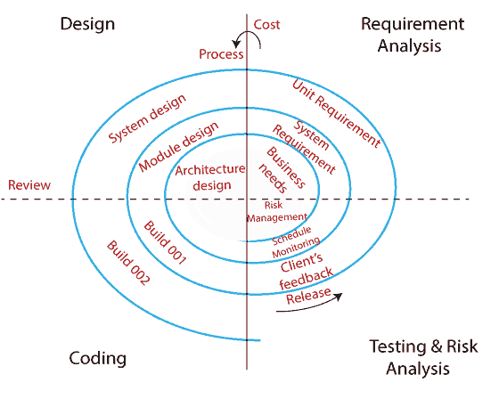
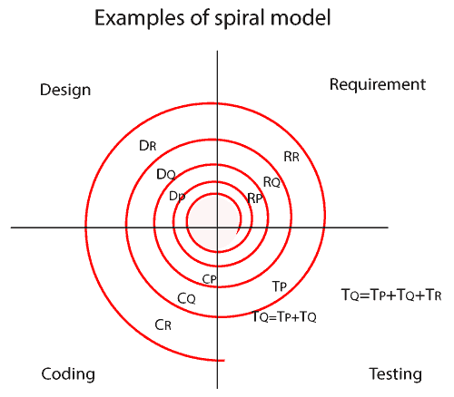
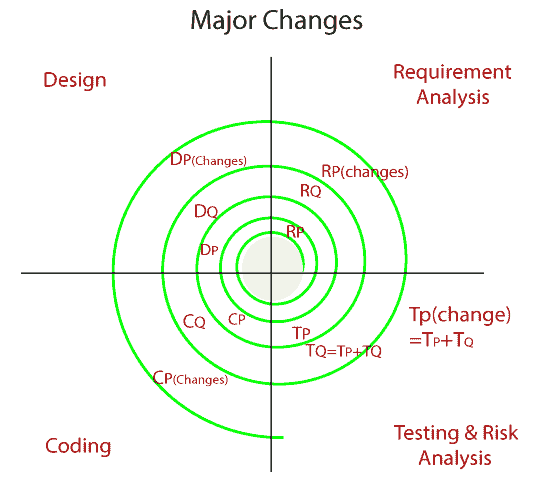
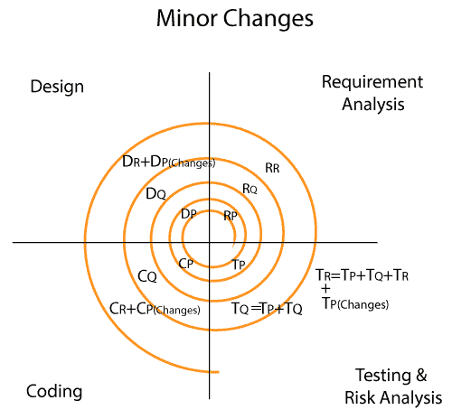

# 螺旋模型

> 原文：<https://www.javatpoint.com/spiral-model>

我们在瀑布模型中面临的最大问题是需要很长时间来完成产品，并且软件变得过时。为了解决这个问题，我们有一种新的方法，这就是螺旋模型。螺旋模型也被称为循环模型。

在这个模型中，我们一个模块一个模块地创建应用，并交给客户，以便他们可以在很早的阶段就开始使用应用。并且我们只在模块相互依赖时才准备这个模型。在这个模型中，我们分阶段开发应用，因为有时客户端会在过程之间给出需求。

螺旋模型的不同阶段如下:

*   **需求分析**
*   **设计**
*   **编码**
*   **测试和风险分析**

### 需求分析

螺旋模型流程从收集业务需求开始。在这方面，下面的螺旋将包括系统需求、单元需求和子系统需求的文档。在这个阶段，我们可以很容易地理解系统需求，因为业务分析师和客户有持续的沟通。而一旦周期完成，应用就会部署到市场上。

### 设计

设计螺旋模型的第二阶段，在这里我们将规划逻辑设计、架构设计、流程图、决策树等等。

### 编码

在设计阶段的编译之后，我们将进入下一步，也就是编码阶段。在这种情况下，我们将根据客户的要求开发产品，并获得客户的反馈。这个阶段指的是每个周期中真实应用的构建。

这些螺旋具有非常清晰的需求，应用的设计细节被称为具有版本号的构建。之后，这些构建被传递给客户端以获得响应。

### 测试和风险分析

一旦开发成功完成，我们将在第一个周期结束时测试构建，并从管理风险、检测和观察技术可行性等不同方面分析软件的风险。之后，客户将测试应用并给出反馈。

## 螺旋模型示例

让我们看一个更好理解螺旋模型的例子:

在螺旋模型中，软件在小模块中开发。假设我们有一个应用，这个应用是在不同模型的帮助下创建的

**上图中，**

**RP:** 模块 P 的需求分析，与 RQ、RR 类似。

**DP:** 模块 P 的设计，与 DQ、DR 类似

**CP:** 模块 P 的编码，类似的还有 CQ，CR。

**TP:** 模块 P 的测试，类似的还有 TQ、TR。

*   在 P 模块中，我们先得到需求，然后才设计模块。而模块 A 的编码部分是在测试 bug 的时候完成的。
*   下一个模块是 Q，它是在构建模块 P 时创建的。我们遵循与模块 P 中相同的过程，但是当我们开始测试模块 Q 时，我们检查以下条件，例如:
    *   测试 Q 模块
    *   模块 Q 与模块 P 的测试集成
    *   测试模块 P
*   在创建模块 P、Q 之后，我们将继续到模块 R，然后我们将遵循与模块 P 和 Q 相同的过程，然后测试以下条件:
    *   首先，将模块检查为 R、Q 和 P
    *   然后，按照以下顺序检查模块的集成度:
        R → Q，R 和 P → P 和 Q

#### 注意:
一旦多个模块的循环继续，只有在模块 P 已经正确构建并且与模块 r 相似之后，才能构建模块 Q。

螺旋模型最适合的例子是 **MS-Excel** ，因为 MS-Excel 工作表有几个单元格，它们是 Excel 工作表的组成部分。由于我们必须先创建单元格(模块 P)，然后我们可以对单元格进行操作，比如将单元格分成两半(模块 Q)，将单元格合并成两个，然后我们可以在 excel 工作表中绘制图表(模块 R)。

在螺旋模型中，我们可以执行两种类型的更改，如下所示:

*   重大变化
*   微小的变化

### 重大变化

当客户要求对特定模块的需求进行重大更改时，我们只更改该模块，并对集成和单元进行测试。为此，我们总是喜欢一个新的周期，因为它可能会影响现有的模块。主要变化可能是软件的功能。

### 微小的变化

每当客户端请求特定应用中的微小更改时，软件团队就会进行较小的更改，而新模块必须在单个周期内同时开发。我们从不进行任何新的循环或迭代，因为微小的变化不会影响现有的功能，而且还需要额外的资源和时间。微小的变化可能是用户界面(前端变化)。

## 螺旋模型的优缺点

| 优势 | 不足之处 |
| 螺旋模型允许灵活的变化。 | 它不适合小而低风险的产品，因为对于较小的项目来说，它可能成本很高。 |
| 开发可以分成更小的部分。 | 这是一个传统的模型，因此开发人员也只做测试工作。 |
| 客户也可以在早期使用该应用。 | 没有评审过程的要求，螺旋模型中也不允许并行交付。 |
| 开发人员和测试工程师更加清晰 | 在螺旋模型中，管理有点困难；这就是为什么这是一个复杂的过程。 |
| 它将提供原型的广泛使用。 | 中间阶段的最大数量需要不必要的文书工作。 |

* * *