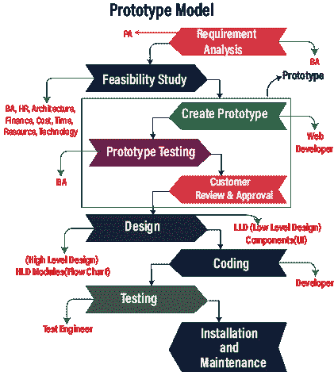

# 原型模型

> 原文：<https://www.javatpoint.com/prototype-model>

以前的模型(瀑布模型和螺旋模型)最大的缺点是，在应用开发之后会有很多客户拒绝，并且在项目之间没有客户的参与。

因此，他们开始了新的方法，被称为**原型模型**。在这方面，我们将从客户那里收集需求，并准备一个**原型(样品)**，并让客户审查和批准。只有当他们满意时，我们才会开始着手原始项目，这样就不会有任何客户拒绝。

原型只是所需软件产品的样本或模型。如果所有提到的模块都存在，那么只有开发人员和测试人员将执行原型测试。

## 当我们使用原型模型时

一般来说，我们选择这种模式是因为以下原因:

*   每当客户刚接触软件行业或不知道如何向公司提出要求时。
*   当开发人员对这个领域还不熟悉的时候。

#### 注意:
测试和原型测试的区别在于——在测试中，我们将处理功能，这给出了一些输入和输出。
而在原型测试中，我们将只测试外观和感觉，这意味着 UI 和前端。

## 原型模型过程

原型模型有不同的阶段，如下所示:

*   **需求分析**
*   **可行性研究**
*   **创建原型**
*   **原型测试**
*   **客户审批**
*   **设计**
*   **编码**
*   **测试**
*   **安装和维护**

### 需求分析

这个模型从收集客户的需求开始。项目的这些要求应该是详细的。这些详细信息由业务分析师和产品分析师接收。其中**业务分析师**分配给**服务型软件公司，**和**产品分析师**分配给**产品型软件公司**。

### 可行性研究

在下一阶段， **BA、HR、Architecture 和 Finance** 团队负责人将坐在一起，讨论产品的成本、需要哪些资源、使用哪些技术开发产品以及完成产品和交付需要多少时间。

### 创建原型

完成可行性研究后，我们将进入下一阶段，在此阶段，我们将基于从客户端收集的数据创建原型(示例或虚拟)，web 开发人员将设计原型。

这里，我们有以下类型的原型:

*   **静态原型**
*   **动态原型**

**静态原型**

在静态原型中，我们将需求的整个原型保存在一个 word 文档中，其中包含了所有的指导原则、屏幕截图，以及如何构建软件、完成的产品将会是什么样子以及它将如何工作等等的描述。

**动态原型**

动态原型和浏览器是并行的，但是这里我们不能提供任何细节，只有功能在那里，不需要输入数据。它就像一个由 html 组成的虚拟页面，有标签和链接到各种页面，以表达产品的特性。

### 实船实验

一旦我们构建了原型，BA 将测试原型并执行一轮原型测试。

#### 注意:
原型测试是测试，这里我们只测试观感，也就是说 UI 和前端。

### 客户审查和批准

原型测试完成后，将交给客户进行审查和批准。如果客户对给定的样品不满意，我们将根据客户的指导方针和反馈更改原型。这一过程将持续到客户认可并对原型满意为止。这有点耗时，因为我们必须在原型中一次又一次地执行更改。

### 设计

获得批准的原型后，我们将开始最终产品的高层次和低层次设计，并考虑客户在最终原型时给出的所有建议。

### 编码

一旦设计阶段成功完成，我们就进入编码阶段，相关的开发人员根据他们的编程知识开始开发产品。

### 测试

开发阶段编译完成后，交给测试工程师。测试工程师测试应用的功能以及所有的输入和输出。

### 安装和维护

一旦我们的最终产品根据最终原型进行开发和测试，它将被部署到生产中。并且产品将经历一次又一次的维护，以减少任何中断，这有助于避免重大故障。

**注:**

*   从**需求收集**到**客户评审**开始，因为是扩展的需求收集阶段，所以文档格式转换为原型格式，实际设计从设计阶段开始。
*   以前，原型开发是由开发人员完成的。尽管如此，现在它是由内容开发人员或网页设计师完成的，他们在一些工具的帮助下开发产品的原型。
*   在这种情况下，客户在开始阶段就有机会要求修改需求，因为在原型中而不是在实际应用中修改需求是很容易的。因此，成本会降低，预期会得到满足。

## 原型模型的优缺点

原型模型有以下优点和缺点:

| 优势 | 不足之处 |
| 我们可以很容易地发现缺失的功能。 | 这是一个耗时的过程，因为如果客户改变了原型。
而且还会浪费我们的时间，在假人(原型)中一次又一次的更换，会耽误真实项目的工作。 |
| 在这种情况下，开发团队和客户对产品的需求和结果有清晰的沟通。 | 没有需求评审，但是原型评审在那里。 |
| 在这一点上，顾客满意是存在的。 | 没有平行的交付物，这意味着两个团队不能一起工作。 |
| 我们可以在设计阶段和类似的应用中重用原型。 | 有时，部分应用可能会导致软件无法像整个系统设计的那样使用。 |
| 与其他模型相比，这种模型的客户拒绝更少。 | 问题分析不充分或不全面。 |
| 问题可以在早期发现。 | 如果客户对最终产品或原始原型不满意，我们也可能会失去他们的关注。 |

* * *