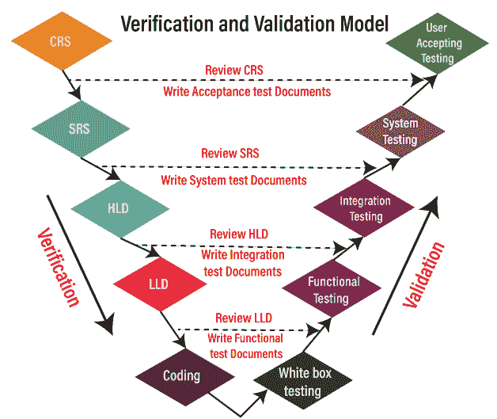

# 虚拟模型/虚拟和虚拟模型/验证和确认模型

> 原文：<https://www.javatpoint.com/v-model>

这个模型的出现是为了克服瀑布模型的缺点。在这个模型中，测试从需求阶段本身开始。

在这个模型中，首先，所有的活动都沿着**向下的方向**进行，在某个时间点，它开始沿着**向上的方向**移动，以将测试文档重新用于测试过程，并形成一个 **V** 形状。因此被称为 **V 型**。

## 当我们选择这种模式时

我们选择 V 型和 V 型的原因如下:

*   对于大而复杂的应用，这里，大意味着 n 个模块和复杂指定了模块之间的许多依赖关系。
*   它也用于长期项目。

在进一步研究这个模型之前，首先，我们将了解需求:

### 要求

这是从客户那里收集的文件；这里，我们有两种不同类型的需求文档，如下所示:

*   **CRS/BRS**
*   **SRS/FS**

### CRS/BRS

CRS 或 BRS 代表**客户需求规范或业务需求规范**。对于 CRS，细节将由 BA(业务分析师)用简单的业务(英语)语言编写，开发人员和测试工程师无法理解。

**让我们看一个 Gmail 应用的客户需求规格示例:**

| 1. | 客户安全进入 |
| 2. | 可选创建邮件 |
| 3. | 能够看到邮件 |
| 4. | 不想要的内容删除 |
|  | - |
|  | - |
| 15. | 成功关闭应用。 |

### SRS/FS

代表**软件需求规范**或**功能规范**；在这种情况下，所有的细节都被转换成细节文档，开发者和测试工程师都可以理解。

**让我们看看 Gmail 应用软件需求规格的一个示例:**

| 1. | **登录**(模块) |
| One point one | 用户名→文本框(功能说明) |
| 1.1.1 | 用户名→仅接受 5 个字母 |
| One point two | 密码→文本框 |
| 1.2.1 | 密码→仅接受 8 个字符，其中一个应为大写，一个为特殊字符(@、$、%、&) |
| One point three | 确定→按钮 |
| 1.3.1 | 确定→启用 |
| 2. | 化合物 |
| Two point one | to→文字方块 |
|  | - |
|  | - |
| 3. | **收件箱** |
| Three point one | - |
|  | - |
| 4. | **注销** |

### 功能需求的特征

*   需求应该是 **In-Details** ，这意味着它有关于**模块、组件和功能规范**的所有细节，并且在**适当流程**中，这意味着它应该在**顺序**中。
*   要求应该用大家都容易理解的简单语言来写。
*   要求应该是可测量的或可计数的。

## 五模型和五模型过程

整个 V 模型分两个阶段执行，完整的**评审流程**在**验证阶段**完成，整个**测试流程**在**验证阶段**完成；这就是为什么它也被称为**验证和确认**模型的原因。

验证和确认过程包括不同的阶段:

**第一阶段**

它将从业务分析师从客户那里收集 CRS(客户需求规格)文档开始，测试工程师将检查以下场景:

*   **根据以下内容查看 CRS**
    *   不正确的要求
    *   缺少需求
    *   需求中的冲突
*   **编写验收测试文件**

#### 注意:在所有阶段，测试文档包括测试计划和测试用例。

一旦测试工程师团队审查了 CRS 并发现了任何错误或缺陷，他们将把它发送给开发团队来修复这些错误。修复错误后，开发团队更新 CRS 并同时开发 SRS 文档。

**第二阶段**

在完成 CRS 之后，SRS 被发送到测试团队进行评审过程，开发人员开始为应用创建 HLD(高级设计)。测试团队将在以下场景中测试 SRS:

*   **对照 CRS 检查 SRS**
    *   每个客户关系管理系统都被转移到员工代表系统
    *   CRS 没有正确转换为 SRS
*   **编写系统测试文档**

一旦测试团队审查了 SRS 的每个细节，并且 CRS 已经正确地转换为 SRS，我们将进入下一阶段。

**第三阶段**

完成 HLD 后，开发人员开始为应用创建 LLD(低级设计)，同时，测试人员将在 HLD 上检查以下测试:

*   **审核 HLD**
*   **编写集成测试文档**

**第 4 阶段**

一旦测试团队完成了对 HLD 的审查，开发人员就编写代码并开发应用，测试团队将执行以下任务:

*   **查看 LLD**
*   **编写功能测试文档**

**第五阶段**

编码部分完成后，开发人员会进行一轮单元测试，也叫白盒测试，检查每一行代码，确保代码正确。

执行单元测试后，应用被发送到测试团队，在那里他们执行多个测试，如**功能测试、集成测试、系统测试和验收测试。**

一旦测试部分完成，应用将最终交付给客户。

**注:**
**如何处理 V 和 V 中的需求变化？**
当需求发生变化时，同样的程序继续，文件将被更新。

## V 型和 V 型的优缺点

让我们看看 V 和 V 模式的利弊:

| 优势 | 不足之处 |
| 在这种情况下，审查存在于每个阶段，这就是为什么我们可能在应用中得到较少数量的 bug。 | 这是一个有点昂贵的过程，因为初始投资很高，因为从开始阶段就需要测试团队。 |
| V 模型提供了并行交付，这意味着两个团队可以像这里一样一起工作；开发和测试团队正在并行工作。 | 这是一个耗时的过程，因为如果需求发生变化，我们需要更改每个文本文档。 |
| 这种模式有助于交付稳健或稳定的产品。 | 在这种情况下，由于测试用例和所有其他文档，我们需要做更多的文档工作。 |
| 在这个模型中，测试工程师对产品有更多的了解，因为测试涉及到产品开发的每个阶段。 | V 模型不适合面向对象的项目。 |
| 文本文档可以重复使用。 | 一旦应用处于测试阶段，我们就不能返回并替换功能。 |

* * *