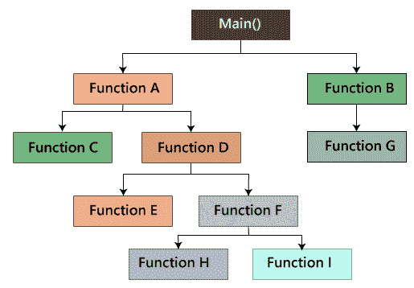
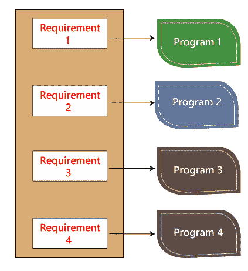
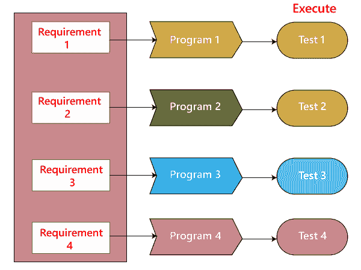
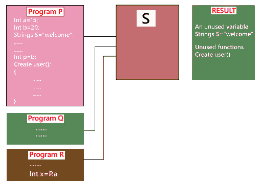
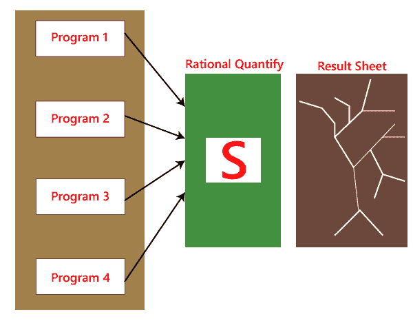
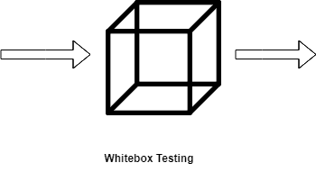

# 白盒测试

> 原文：<https://www.javatpoint.com/white-box-testing>

软件测试的盒子测试方法包括黑盒测试和白盒测试。我们这里讨论的白盒测试也称玻璃盒是**测试、结构测试、清盒测试、开盒测试和透明盒测试**。它测试软件的内部编码和基础设施，重点是对照预期和期望的输出检查预定义的输入。它基于应用的内部工作，围绕内部结构测试展开。在这种类型的测试中，设计测试用例需要编程技能。白盒测试的主要目标是关注通过软件的输入和输出流，并加强软件的安全性。

使用“白盒”一词是因为系统的内部视角。透明框或白色框或透明框的名称表示透过软件外壳看到其内部工作的能力。

开发人员做白盒测试。在这种情况下，开发人员将测试程序的每一行代码。开发人员执行白盒测试，然后将应用或软件发送给测试团队，在那里他们将执行[黑盒测试](https://www.javatpoint.com/black-box-testing)，并验证应用和需求，识别错误并将其发送给开发人员。

开发人员修复 bug，并进行一轮白盒测试，然后将其发送给测试团队。在这里，修复 bug 意味着 bug 被删除，并且特定的特性在应用上运行良好。

在此，测试工程师将不包括修复缺陷，原因如下:

*   修复该错误可能会中断其他功能。因此，测试工程师应该总是发现错误，开发人员应该仍然在修复错误。
*   如果测试工程师花费大部分时间修复缺陷，那么他们可能无法找到应用中的其他 bug。

白盒测试包含以下各种测试:

*   路径测试
*   循环测试
*   条件测试
*   基于记忆视角的测试
*   测试程序的性能

### 路径测试

在路径测试中，我们将编写流程图并测试所有独立的路径。这里写流程图意味着流程图代表了程序的流程，也显示了每个程序是如何相互添加的，如下图所示:



测试所有独立的路径意味着假设从 main()到 function G 的路径，首先设置参数并测试程序在该特定路径中是否正确，然后以同样的方式测试所有其他路径并修复错误。

### 循环测试

在循环测试中，我们将测试 while、for 和 do-while 等循环。并且还检查结束条件是否正常工作以及条件的大小是否足够。

**例如**:我们有一个程序，开发者给出了大约 5 万个循环。

```

{
while(50,000)
……
……
}

```

我们无法针对所有 50，000 个循环周期手动测试该程序。所以我们写了一个小程序，对所有 50，000 个周期都有帮助，正如我们在下面的程序中看到的，测试 P 是用与源代码程序相似的语言编写的，这就是所谓的单元测试。而且是只由开发者写的。

```

Test P
{
……
…… }

```

正如我们在下图中看到的，我们有各种各样的要求，比如 1、2、3、4。然后，开发人员为并行条件编写程序，如程序 1、2、3、4。这里应用包含 100 行代码。



开发人员将进行白盒测试，他们将逐行测试所有五个程序的代码，以发现错误。如果他们在任何程序中发现任何错误，他们将会改正。他们必须再次测试系统，然后这个过程包含大量的时间和精力，并减缓产品发布时间。

现在，假设我们有另一种情况，客户端想要修改需求，那么开发人员将进行所需的更改，并再次测试所有四个程序，这需要花费大量的时间和精力。

**这些问题可以通过以下方式解决:**

在本文中，我们将为一个类似的程序编写测试，其中开发人员用相关语言编写这些测试代码作为源代码。然后他们执行这些测试代码，这也被称为**单元测试程序**。这些测试程序链接到主程序并作为程序实现。



因此，如果代码中有任何修改或 bug 的要求，那么开发人员会在主程序和测试程序中进行调整，然后执行测试程序。

### 条件测试

在此，我们将测试**真**和**假**值的所有逻辑条件；也就是说，我们将验证 **if** 和 **else** 条件。

**例如:**

```

if(condition) - true
{
…..
……
……
}
else - false
{
…..
……
……
}

```

上面的程序对这两个条件都适用，这意味着如果条件是准确的，那么 else 应该是假的，反之亦然。

### 基于内存(大小)角度的测试

代码的大小正在增加，原因如下:

*   **代码的复用不在**:我们举一个例子，我们有四个相同应用的程序，程序的前十行是相似的。我们可以把这十行写成一个离散函数，上面四个程序也应该可以访问。此外，如果有任何错误，我们可以修改函数中的代码行，而不是整个代码。
*   **开发人员使用可能被修改的逻辑**。如果一个程序员编写代码，并且文件大小高达 250kb，那么另一个程序员可以使用不同的逻辑编写类似的代码，并且文件大小高达 100kb。
*   **开发人员声明了太多的函数和变量**，可能永远不会在代码的任何部分使用。因此，程序的大小会增加。

**例如**，

```

Int a=15;
Int b=20;
String S= "Welcome";
….
…..
…..
….
…..
Int p=b;
Create user()
{
……
……
….. 200's line of code
} 

```

在上面的代码中，我们可以看到**整数 a** 在程序中的任何地方都没有被调用过，函数**创建用户**在代码中的任何地方都没有被调用过。因此，它导致我们消耗内存。

由于代码庞大，我们无法通过验证代码来手动记住这种类型的错误。因此，我们有一个内置的工具，它帮助我们测试不必要的变量和函数。并且，这里我们有一个工具叫做 **Rational purify** 。



假设我们有三个程序，如程序 P、Q 和 R，它向 S 提供输入，S 进入程序，验证未使用的变量，然后给出结果。之后，开发人员将点击几个结果，并调用或删除不必要的函数和变量。

该工具仅用于 [C 编程语言](https://www.javatpoint.com/c-programming-language-tutorial)和 [C++编程语言](https://www.javatpoint.com/cpp-tutorial)；对于另一种语言，我们在市场上有其他相关工具。

*   开发人员不使用可用的内置功能；相反，他们使用自己的逻辑来编写完整的特性。因此，这导致我们浪费时间，也推迟了产品发布。

### 测试程序的性能(速度、响应时间)

由于以下原因，应用可能会变慢:

*   当使用逻辑时。
*   对于有条件的情况，我们将适当使用**或** & **和**。
*   开关盒，也就是说我们不能用**嵌套 if** ，而要用开关盒。



正如我们所知，开发人员正在执行白盒测试，他们理解代码运行缓慢，或者程序的性能也变得故意。开发人员不能手动检查程序并验证哪一行代码减慢了程序的速度。

为了在这种情况下恢复，我们有一个名为**理性量化**的工具，它可以自动解决这类问题。一旦整个代码准备好了，rational quantify 工具将遍历代码并执行它。我们可以在结果表上看到粗细线条的结果。

这里，粗线指定哪一段代码耗时。当我们双击粗线时，工具会自动将我们带到那一行或那一段代码，它也以不同的颜色显示。我们可以一次又一次地修改代码并使用这个工具。当线条的顺序都很细的时候，我们知道节目的呈现已经增强了。开发人员将自动执行白盒测试，因为它节省时间，而不是手动执行。

白盒测试的测试用例来源于软件开发生命周期的设计阶段。数据流测试、控制流测试、路径测试、分支测试、语句和决策覆盖所有这些技术都被白盒测试用作创建无错误软件的指南。



白盒测试遵循一些工作步骤，使测试易于管理，并易于理解下一个任务要做什么。执行白盒测试有一些基本步骤。

## 白盒测试的一般步骤

*   设计所有的测试场景、测试用例，并根据高优先级的数字进行优先排序。
*   这一步包括在运行时研究代码，以检查资源利用率、代码的未访问区域、各种方法和操作所花费的时间等等。
*   在这个步骤中，对内部子程序进行测试。内部子例程，如非公共方法、接口，能够适当或不适当地处理所有类型的数据。
*   这一步的重点是测试控制语句，如循环和条件语句，以检查不同数据输入的效率和准确性。
*   在最后一步中，白盒测试包括安全测试，通过查看代码如何处理安全性来检查所有可能的安全漏洞。

## 白盒测试的原因

*   它识别内部安全漏洞。
*   检查代码内部的输入方式。
*   检查条件循环的功能。
*   在单个级别测试函数、对象和语句。

## 白盒测试的优势

*   白盒测试优化了代码，因此可以识别隐藏的错误。
*   白盒测试的测试用例可以很容易地自动化。
*   这种测试比其他测试方法更彻底，因为它覆盖了所有的代码路径。
*   即使没有 GUI，也可以在 SDLC 阶段启动。

## 白盒测试的缺点

*   当涉及到大规模编程应用时，白盒测试太耗时了。
*   白盒测试非常昂贵和复杂。
*   它会导致生产错误，因为开发人员没有详细说明。
*   白盒测试需要对编程语言和实现有详细了解和理解的专业程序员。

## 白盒测试中使用的技术

| [数据流测试](data-flow-testing-in-white-box-testing) | 数据流测试是一组测试策略，它检查程序的控制流，以便根据事件的顺序探索变量的顺序。 |
| [控制流测试](control-flow-testing-in-white-box-testing) | 控制流测试通过控制结构确定程序的语句或指令的执行顺序。程序的控制结构用于开发程序的测试用例。在这种技术中，测试人员选择大型程序的特定部分来设置测试路径。由程序的控制图表示的测试用例。 |
| [分支测试](branch-coverage-testing-in-white-box-testing) | 分支覆盖技术用于覆盖控制流图的所有分支。它至少覆盖一次决策点每个条件的所有可能结果(真和假)。 |
| [报表测试](statement-coverage-testing-in-white-box-testing) | 语句覆盖技术被用来设计白盒测试用例。这种技术包括至少执行一次源代码的所有语句。它用于计算源代码中执行的语句总数，而不是源代码中存在的语句总数。 |
| [决策测试](decision-coverage-testing-in-white-box-testing) | 这种技术报告布尔表达式的真假结果。每当像 do while 语句、if 语句和 case 语句(控制流语句)这样的语句有两个或多个结果的可能性时，它被认为是决策点，因为有两个结果，要么是真，要么是假。 |

## 白盒测试和黑盒测试的区别

以下是白盒测试和黑盒测试之间的显著区别:

| 白盒测试 | 黑盒测试 |
| 开发人员可以执行白盒测试。 | 测试工程师执行黑盒测试。 |
| 要表演 WBT，我们应该了解编程语言。 | 表演 BBT，不需要了解编程语言。 |
| 在本文中，我们将研究源代码并测试代码的逻辑。 | 在本文中，我们将基于需求规范来验证应用的功能。 |
| 在这方面，开发人员应该了解代码的内部设计。 | 在这种情况下，不需要了解代码的内部设计。 |

* * *