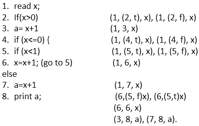
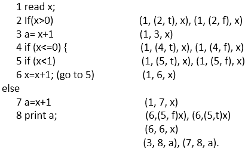
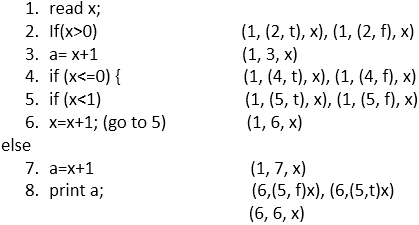

# 数据流测试

> 原文：<https://www.javatpoint.com/data-flow-testing-in-white-box-testing>

数据流测试用于分析程序中的数据流。它是收集变量如何在程序中流动的信息的过程。它试图获得过程中每个特定点的特定信息。

数据流测试是一组测试策略，用于检查程序的控制流，以便根据事件的顺序探索变量的顺序。它主要集中在给变量赋值的点和使用这些值的点上，通过集中在这两点上，可以测试数据流。

数据流测试使用控制流图来检测可能中断数据流的不合逻辑的东西。由于以下原因，在值和变量关联时会检测到数据流中的异常:

*   如果变量在没有初始化的情况下使用。
*   如果初始化的变量至少没有使用一次。

**我们用一个例子来理解一下:**



在这段代码中，我们总共有 8 条语句，我们将选择一条覆盖所有 8 条语句的路径。从代码中可以明显看出，我们不能在一个路径中覆盖所有语句，因为如果语句 2 为真，那么语句 4、5、6、7 不被覆盖，如果语句 4 为真，那么语句 2 和 3 不被覆盖。

因此，我们采用两条路径来涵盖所有陈述。

```
1\. x= 1
Path - 1, 2, 3, 8

```

**输出= 2**

当我们将 x 的值设置为 1 时，它首先在步骤 1 读取并分配 x 的值(我们在路径中取 1)，然后在语句 2 (x>0(我们在路径中取 2))上出现，这是真的，它出现在语句 3 (a= x+1(我们在路径中取 3))上，最后它出现在语句 8 上打印 x 的值(输出是 2)。

对于第二条路径，我们取 x 的值为 1

```
2\. Set x= -1
Path = 1, 2, 4, 5, 6, 5, 6, 5, 7, 8

```

**输出= 2**

当我们将 x 的值设置为。1 然后首先，它在步骤 1 读取并分配 x 的值(我们在路径中取 1)，然后在步骤 2，这是假的，因为 x 不大于 0 (x>0，它们的 x=-1)。由于条件为假，它不会出现在语句 3 上，直接跳到语句 4 上(我们在路径中取了 4)，如果 4 为真(x<=0，并且它们的 x 小于 0)，那么出现在语句 5 上(x<1(我们在路径中取了 5))，这也是真的，所以它会出现在语句 6 上(x=x+1(我们在路径中取了 6))，这里 x 增加 1。

所以，

```
x=-1+1 
x=0 

```

有 x 的值变成 0。现在转到语句 5(x<1(我们在路径中取了 5))，值为 0，0 小于 1，所以这是真的。来吧语句 6 (x=x+1(我们在路径中取 6))

```
x=x+1 
x= 0+1 
x=1 

```

在那里，x 变成了 1，并再次转到语句 5 (x<1(我们在路径中取了 5))，现在 1 不小于 1，因此，条件为假，它将转到 else 部分，表示语句 7 (a=x+1，其中 x 的值为 1)，并将该值赋给 a (a=2)。最后，它出现在语句 8 上并打印值(输出为 2)。

为代码建立关联:

### 联合

在联想中，我们列出了所有的定义及其用途。

(1，(2，f)，x)，(1，(2，t)，x)，(1，3，x)，(1，(4，t)，x)，(1，(4，f)，x)，(1，(5，t)，x)，(1，(5，f)，x)，(1，6，x)，(1，7，x)，(6，(5，f)x)，(6，(5，t)x)，(6，6，x)，(3，8，a)，(7，8，a)。

## 数据流测试中如何进行关联<link>



*   **(1，(2，t)，x)，(1，(2，f)，x)-** 此关联与陈述 1(读作 x；)和语句 2 (If(x > 0))，其中 x 在第 1 行定义，在第 2 行使用，所以，x 是变量。
    陈述 2 是合乎逻辑的，它可以是真的也可以是假的，这就是为什么关联是以两种方式定义的；一个是(1，(2，t)，x)为真，另一个是(1，(2，f)，x)为假。
*   **(1，3，x)-** 此关联与语句 1(读作 x；)和语句 3 (a= x+1)，其中 x 在语句 1 中定义，并在语句 3 中使用。这是一种计算用途。
*   **(1，(4，t)，x)，(1，(4，f)，x)-** 此关联与陈述 1(读作 x；)和语句 4 (If(x < =0))，其中 x 在第 1 行定义，在第 4 行使用，因此 x 是变量。语句 4 是符合逻辑的，它可以是真的也可以是假的，这就是为什么关联是以两种方式定义的，一种是(1，(4，t)，x)表示真，另一种是(1，(4，f)，x)表示假。
*   **(1，(5，t)，x)，(1，(5，f)，x)-** 此关联与陈述 1(读作 x；)和语句 5 (if (x < 1))，其中 x 在第 1 行定义，在第 5 行使用，所以 x 是变量。
    陈述 5 是合乎逻辑的，它可以是真的也可以是假的，这就是为什么关联是以两种方式定义的；一个是(1，(5，t)，x)为真，另一个是(1，(5，f)，x)为假。
*   **(1，6，x)-** 此关联与语句 1(读作 x；)和语句 6 (x=x+1)。x 在语句 1 中定义，在语句 6 中使用。这是一种计算用途。
*   **(1，7，x)-** 这种关联由语句 1(读作 x)和语句 7 (a=x+1)构成。x 在语句 1 中定义，当语句 5 为假时，在语句 7 中使用。这是一种计算用途。
*   **(6，(5，f) x)，(6，(5，t) x)-** 这种关联是用语句 6(x = x+1；)和语句 5 if (x < 1)，因为 x 在语句 6 中定义并在语句 5 中使用。陈述 5 是符合逻辑的，它可以是真的也可以是假的，这就是为什么关联是以两种方式定义的，一种是(6，(5，f) x)表示真，另一种是(6，(5，t) x)表示假。这是一个预测的用途。
*   **(6，6，x)-** 这个关联是用语句 6 进行的，语句 6 使用变量 x 的值，然后定义 x 的新值。
    x=x+1
    x= (-1+1)
    语句 6 使用变量 x 的值，也就是说？1，然后定义 x 的新值[x= (-1+1) = 0]即 0。
*   **(3，8，a)-** 此关联由语句 3(a= x+1)和语句 8 构成，其中变量 a 在语句 3 中定义，并在语句 8 中使用。
*   **(7，8，a)-** 这种关联由语句 7(a=x+1)和语句 8 构成，其中变量 a 在语句 7 中定义，并在语句 8 中使用。

### 定义，c-use，p-use，c-use 一些 p-use 覆盖，p-use 一些 c-use 覆盖在数据流测试中<link>

下一个任务是将定义中的所有关联分组，c-use，p-use，c-use 一些 p-use 覆盖，p-use 一些 c-use 覆盖类别。

**见下图代码:**



所以，这些都是包含定义、谓词使用、计算使用的关联

(1，(2，f)，x)，(1，(2，t)，x)，(1，3，x)，(1，(4，t)，x)，(1，(4，f)，x)，(1，(5，t)，x)，(1，(5，f)，x)，(1，6，x)，(1，7，x)，(6，(5，f)x)，(6，(5，t)x)，(6，6，x)，(3，8，a)，(7，8，a)，(3，8，a)，(7，a)

### 定义

变量的定义是当值绑定到变量时，变量的出现。在上面的代码中，值在第一条语句中被绑定，然后开始流动。

*   如果(x>0)是其中 x 的值与之绑定的语句 2。
    陈述 2 的联想是(1，(2，f)，x)，(1，(2，t)
*   a= x+1 是以 x 值为界的语句 3
    语句 3 的关联是(1，3，x)

**所有定义覆盖范围**

(1，(2，f)，x)，(6，(5，f) x)，(3，8，a)，(7，8，a)。

### 谓词用法

如果使用变量值来决定执行路径，则认为是谓词使用(p-use)。在控制流语句中有两种

语句 4 if (x<=0)是谓词，因为它可以被断言为真或假。如果为真，则 if (x<1)，6x = x+1；否则将执行执行路径，否则将执行路径。

### 计算用途

如果变量值用于计算输出值或定义另一个变量。

**报表 3** a= x+1 (1，3，x)
**报表 7** a=x+1 (1，7，x)
**报表 8** 打印一张(3，8，a)、(7，8，a)。

这些是**计算使用**，因为 x 的值用于计算，a 的值用于输出。

**所有 c 用途保险**

(1，3，x)，(1，6，x)，(1，7，x)，(6，6，x)，(6，7，x)，(3，8，a)，(7，8，a)。

**所有 c-使用一些 p-使用覆盖**

(1，3，x)，(1，6，x)，(1，7，x)，(6，6，x)，(6，7，x)，(3，8，a)，(7，8，a)。

**所有 p-使用一些 c-使用覆盖**

(1，(2，f)，x)，(1，(2，t)，x)，(1，(4，t)，x)，(1，(4，f)，x)，(1，(5，t)，x)，(1，(5，f)，x)，(6，(5，f)，x)，(6，(5，f)，x)，(6，(5，t)，x)，(3，8，a)，(7，8，a)。

收集完这些组后，(通过检查每个点变量是否至少被使用过一次)测试人员可以看到所有的语句和变量都被使用了。没有被使用但存在于代码中的语句和变量被从代码中删除。

* * *