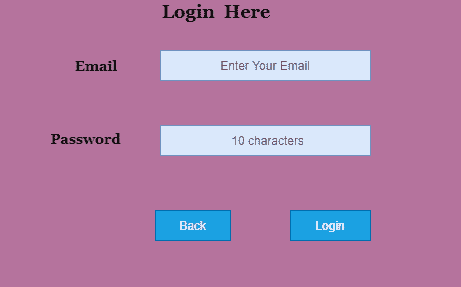

# 状态转换技术

> 原文：<https://www.javatpoint.com/state-transition-technique-in-black-box-testing>

状态转移的一般含义是，同一情况的不同形式，而根据含义，状态转移的方法也是如此。当给同一个函数不同的输入值时，它用于捕获软件应用程序的行为。

我们都使用自动取款机，当我们从里面取款时，它最后会显示账户的详细信息。现在我们再次做另一笔交易，然后它再次显示账户明细，但是第二笔交易后显示的明细与第一笔交易不同，但是这两笔明细都是使用 ATM 的相同功能显示的。所以这里使用了相同的函数，但是每次输出不同，这被称为状态转换。在测试软件应用程序的情况下，该方法在输入不同的输入时测试功能是否遵循状态转换规范。

这适用于提供特定次数的访问应用程序尝试的应用程序类型，例如在指定次数的不正确尝试后被锁定的应用程序的登录功能。让我们详细看看，在我们使用电子邮件和密码的登录功能中，它给出了访问应用程序的特定尝试次数，在超过最大尝试次数后，它会被锁定并显示一条错误消息。

**让我们在图中看到:**

有一个应用程序的登录功能，最多提供三次尝试，超过三次后，它将被导向一个错误页面。

**状态转换表**

| 状态 | 注册 | 确认 | 重新传入 |
| S1 | 第一次尝试 | 病人 | S2 |
| S2 | 第二次尝试 | 病人 | S3 |
| S3 | 第三次尝试 | 病人 | 表面抗原-5 |
| 第四心音 | 主页 |  |  |
| 表面抗原-5 | 错误页面 |  |  |

在上面的状态转换表中，我们看到状态 S1 表示首次登录尝试。当第一次尝试无效时，用户将被引导至第二次尝试(S2 州)。如果第二次尝试也无效，则用户将被引导至第三次尝试(S3 州)。现在，如果第三次也是最后一次尝试无效，那么用户将被引导到错误页面(状态 S5)。

但是如果第三次尝试是有效的，那么它将被导向主页(S4 州)。

**看看第三次尝试是否有效的状态转移表:**

| 状态 | 注册 | 确认 | 重新传入 |
| S1 | 第一次尝试 | 病人 | S2 |
| S2 | 第二次尝试 | 病人 | S3 |
| S3 | 第三次尝试 | 有效的 | 第四心音 |
| 第四心音 | 主页 |  |  |
| 表面抗原-5 | 错误页面 |  |  |

通过使用上面的状态转换表，我们可以执行任何软件应用程序的测试。我们可以通过确定期望的输出来制作一个状态转换表，然后运行软件系统来检查它是否给出期望的输出。

* * *