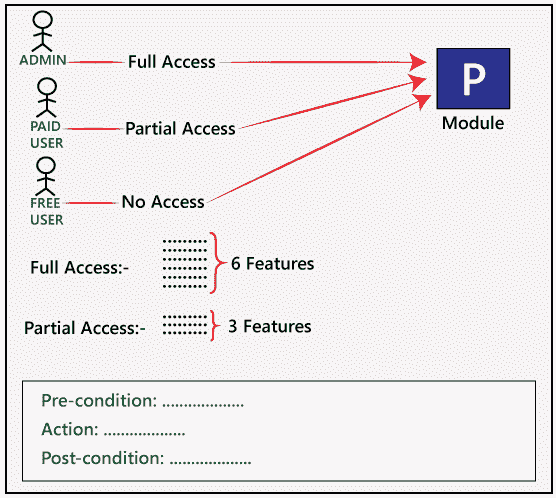
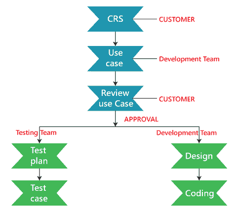

# 用例技术

> 原文：<https://www.javatpoint.com/use-case-technique-in-black-box-testing>

用例是黑盒测试的功能测试，用于根据系统的使用情况从系统的开始到结束识别测试用例。通过使用这种技术，测试团队创建了一个测试场景，可以基于每个功能从头到尾的功能来运行整个软件。

它是业务需求的图形演示，描述了最终用户将如何与软件或应用程序合作。用例为我们提供了最终用户如何使用应用程序的所有可能的技术，如下图所示，即**用例**的样子:

在上图中，我们可以看到一个用例的示例，其中我们有一个与客户需求规范(CRS)相关的需求。

对于软件的**模块 P** ，我们有六个不同的特性。

在这里，**管理员**可以访问所有的**六大功能**，**付费用户**可以访问**三大功能**，而对于**免费用户**，则无法访问任何功能**。**

 **与**管理员**一样，不同的条件如下:

**前置条件** →必须生成管理员

**操作** →以付费用户身份登录

**后置条件** →必须存在 3 个特征

对于**自由用户**，不同的情况如下:

**前置条件** →必须生成自由用户

**动作** →以自由用户身份登录

**后置条件** →无特征

## 谁编写用例？

客户端为应用提供客户需求规范，然后开发团队根据 CRS 编写**用例**，用例发送给客户审核。

如果客户批准了，那么批准的**用例**被发送到开发团队进行进一步的设计和编码过程，并且这些批准的用例也被发送到测试团队，因此他们可以开始编写测试计划，并且稍后开始为软件的不同特性编写测试用例。

在下面的场景中，有一个测试人员代表用户逐个使用系统的功能。在这个场景中，有一个参与者代表用户使用软件系统的功能。

这描述了软件应用程序的逐步功能，可以用一个例子来理解，假设有一个在线货币转账的软件应用程序。转账的各个步骤如下:

*   用户确实登录以验证实际用户。
*   系统用数据库检查身份和密码，以确保它是否是有效用户。
*   如果验证成功，服务器将用户连接到帐户页面，否则返回登录页面。
*   在账户页面，有几个选项，因为考官正在检查资金转账选项；用户进入货币转账选项。
*   成功完成这一步后，用户输入他想转账的账号。用户还需要输入其他详细信息，如银行名称、金额、IFSC 代码、家庭分行等。

在最后一步中，如果有包括验证自动柜员机卡号和个人识别码的安全功能，则输入自动柜员机卡号、个人识别码和其他所需的详细信息。

如果系统成功地完成了所有的步骤，那么就不需要为这个功能设计测试用例。通过描述使用步骤，很容易为软件系统设计测试用例。

## 用例和原型的区别

| 用例 | 原型 |
| 在用例的帮助下，我们知道了产品应该如何工作。它是软件及其多种功能以及它们应该如何工作的图形表示。 | 在本文中，我们不会看到最终用户如何与应用程序交互，因为它只是应用程序的一个虚拟(软件的特定映像)。 |

## 开发人员如何开发用例

开发人员使用标准符号来编写一个用例，这样每个人都很容易理解。他们将使用**UML** (UML)来创建用例。

有各种工具可以帮助编写用例，比如 **Rational Rose。**这个工具有一个预定义的 UML 符号，我们需要拖放它们来编写一个用例，开发人员也可以使用这些符号来开发用例。

## 用例技术的优势

用例技术给了我们一些帮助我们创建应用程序的特性。

以下是我们在开发产品时使用用例技术的好处:

*   用例用于获取系统的功能需求。
*   这些是步骤的分类，描述了用户及其操作之间的联系。
*   它从最基本的角度出发，首先创建系统，并主要用于用户。
*   它用于确定完整的分析，这有助于我们实现复杂化，然后它集中在一个详细的特征一次。

* * ***