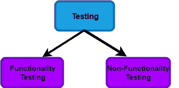
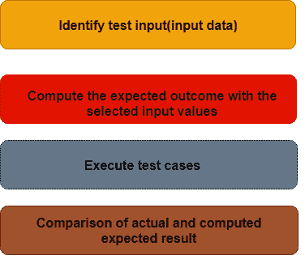
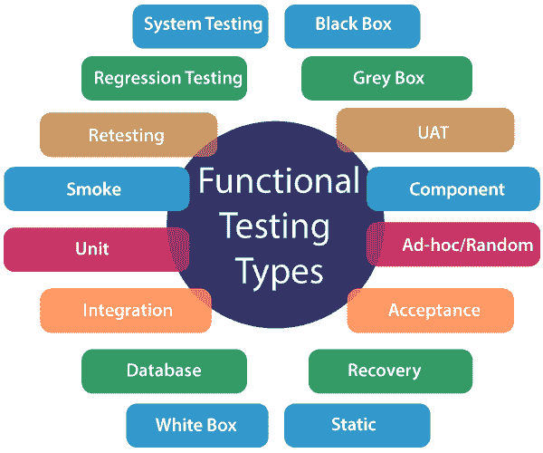

# 功能测试

> 原文：<https://www.javatpoint.com/functional-testing>

在进行功能测试之前，我们应该了解测试，什么是测试？

## 什么是测试？

简单来说，测试就是将实际结果与预期结果进行比较。测试是为了确定所有的功能是否都如预期的那样工作。

## 什么是软件测试？

软件测试是一种检查实际结果是否与预期结果相匹配并确保软件没有任何缺陷或 bug 的技术。

软件测试确保应用没有任何缺陷或者需求与实际需求不符。无论是手工测试还是自动化测试都可以进行软件测试。

软件测试也定义为被测应用的验证。

有两种类型的测试:

## 功能测试:

它是一种软件测试，用于验证软件应用的功能，功能是否按照需求规范工作。在功能测试中，通过给出值、确定输出以及用期望值验证实际输出来测试每个功能。功能测试以黑盒测试的形式执行，黑盒测试的目的是确认应用或系统的功能表现符合我们的预期。这样做是为了验证应用的功能。

功能测试也称为黑盒测试，因为它关注的是应用规范，而不是实际代码。测试人员必须只测试程序，而不是系统。

### 功能测试的目标

功能测试的目的是检查主要的输入功能，必要的可用功能，屏幕图形用户界面的流程。功能测试显示错误消息，以便用户可以轻松地在整个应用中导航。

### 功能测试的流程是什么？

测试人员在功能测试中遵循以下步骤:

*   测试人员在软件应用中验证需求规格。
*   分析之后，需求规格测试人员会制定一个计划。
*   在计划测试之后，测试人员将设计测试用例。
*   在设计测试之后，用例测试人员将制作一份可追溯矩阵的文档。
*   测试人员将执行测试用例设计。
*   分析覆盖范围，检查应用覆盖的测试区域。
*   缺陷管理应该管理缺陷解决。

### 功能测试要测试什么？解释

功能测试的主要目标是检查软件系统的功能。它集中于:

*   **基本可用性:**功能测试涉及系统的可用性测试。它检查用户是否可以毫无困难地自由浏览屏幕。
*   **可达性:**功能测试测试功能的可达性。
*   **主线功能:**重点测试主要功能。
*   **错误情况:**功能测试用于检查错误情况。它检查是否显示错误信息。

### 解释执行功能测试的完整过程。

执行功能测试有以下步骤:

*   需要了解软件需求。
*   身份测试输入数据
*   用选定的输入值计算预期结果。
*   执行测试用例
*   实际结果和计算结果之间的比较

### 解释功能测试的类型。

功能测试的主要目标是测试组件的功能。

功能测试分为多个部分。

以下是功能测试的类型。

**单元测试:单元测试**是一种软件测试，测试软件的单个单元或组件。单元测试，检查应用的不同部分，由单元测试也做功能测试，因为单元测试确保每个模块都正常工作。

开发人员进行单元测试。单元测试在应用的开发阶段完成。

**烟雾测试:通过烟雾测试进行功能测试**。烟雾测试仅包括系统的基本(特征)功能。烟雾测试被称为“ ***建造验证测试*** ”烟雾测试旨在确保最重要的功能发挥作用。

例如，冒烟测试验证应用是否成功启动，并将检查图形用户界面是否响应。

**健全性测试:健全性测试**涉及整个高层业务场景是否正常工作。进行健全性测试是为了检查已修复的功能/错误。理智测试比烟雾测试进步不大。

例如，登录工作正常；所有按钮工作正常；点击按钮后，页面导航完成与否。

**回归测试:**这种类型的测试集中于确保代码更改不会对系统的现有功能产生副作用。回归测试指定当修复错误后系统中出现错误时，回归测试集中于所有部分是否工作。回归测试的重点是对系统有没有影响。

**集成测试:集成测试**将单个单元组合在一起，作为一个组进行测试。该测试的目的是揭示集成单元之间交互的故障。

Developers and testers perform integration testing.

**白盒测试:白盒测试**被称为 Clear Box 测试、基于代码的测试、结构测试、广泛测试，以及玻璃盒测试、透明盒测试。这是一种软件测试方法，其中测试者知道内部结构/设计/实现。

白盒测试需要分析组件或系统的内部结构。

**黑盒测试:**又称行为测试。在这个测试中，测试人员不知道内部结构/设计/实现。这种类型的测试是功能测试。为什么我们把这种类型的测试叫做黑盒测试，在这种测试中测试者，看不到内部代码。

例如，不了解网站内部结构的测试人员通过使用提供输入的网络浏览器测试网页，并根据预期结果验证输出。

**用户验收测试:**是客户根据需求对系统进行认证的一种测试。测试的最后阶段是将软件发布到市场或生产环境之前的用户验收测试。UAT 是一种暗箱测试，两个或更多的最终用户将参与其中。

**重新测试:重新测试**是一种测试类型，用于检查在最终执行中不成功的测试用例在缺陷修复后是否成功通过。通常，测试人员在测试产品或其组件时发现错误时，会将其分配给测试人员。这个 bug 分配给了一个开发人员，他修复了它。修复后，将错误分配给测试人员进行验证。这种测试被称为重新测试。

**数据库测试:**数据库测试是一种检查模式、表、触发器等的测试类型。正在测试的数据库的。数据库测试可能涉及创建复杂的查询来对数据库进行负载/压力测试并检查其响应性。它检查数据的完整性和一致性。

例如:让我们考虑一个用户进行交易的银行应用。现在从以下数据库测试来看，事情很重要。它们是:

*   应用将事务信息存储在应用数据库中，并向用户正确显示它们。
*   在此过程中没有信息丢失
*   应用不保留部分执行或中止的操作信息。
*   用户信息不允许个人通过

**临时测试:**临时测试是一种非正式的测试类型，其目的是破坏系统。这种类型的软件测试是计划外的活动。它不遵循任何测试设计来创建测试用例。临时测试是在应用的任何部分随机进行的；它不支持任何结构化的测试方式。

**恢复测试:恢复测试**用于定义应用从崩溃、硬件故障和其他问题中恢复的程度。恢复测试的目的是验证系统从测试故障点恢复的能力。

**静态测试:静态测试**是一种软件测试技术，通过它我们可以在不实际执行的情况下检查软件中的缺陷。静态测试是为了避免开发早期阶段的错误，因为在早期阶段更容易发现故障。静态测试用于检测动态测试中可能找不到的错误。

### 为什么我们使用静态测试？

**静态测试**有助于早期发现错误。借助静态测试，这将减少开发时间。它降低了测试成本和时间。静态测试也用于开发生产力。

**组件测试:组件测试**也是软件测试的一种，对每个组件单独进行测试，不与其他部分集成。组件测试也是一种黑盒测试。组件测试也称为单元测试、程序测试或模块测试。

**灰盒测试:灰盒测试**定义为白盒和黑盒测试的结合。灰盒测试是一种在系统内部功能信息有限的情况下进行的测试技术。

### 有哪些功能测试工具？

除了手动测试之外，功能测试还可以通过各种方式来执行。这些工具简化了测试过程，有助于获得准确有用的结果。

它是在开发过程之前决定和指定的重要和最高优先级的技术之一。

用于功能测试的工具有:

| 工具 | 特征/特性 |
| 副王谢 | 

*   It is an open source automatic testing tool, which is released under the open source license of Apache License, and is used for testing web applications.
*   Sahi is written in Java and JavaScript, which is considered as the basis of most testing technologies.
*   Run as a proxy server; It is browser-independent.

 |
| 调试工具 | 

*   It is an open source functional testing tool for web application testing.
*   The design is simple and feasible.
*   Support multiple environments, that is, the target environment can be set under any circumstances.

 |
| 沃特沃特 Walter | 

*   Watir, the abbreviation of web application testing in ruby, is an open source tool to realize the automation of web browser. /li >
*   It uses ruby scripting language, which is simple and easy to use. /li >
*   Watir supports multiple browsers of various platforms.

 |
| Selenium | 

*   Open source tools for functional testing of web applications and desktop applications.

 |
|  | 

*   It automatically runs browsers and web applications for testing.
*   It provides the flexibility to customize automated test cases.
*   The advantages of writing test scripts according to requirements by using network drivers are provided.

 |
| 管道 WebTest | 

*   An open source tool to perform web application function test.
*   Platform independence
*   Easy and fast
*   Extend easily to meet growth and incoming demand.

 |
| 黄瓜 | 

*   Cucumber is an open source testing tool written in Ruby language. This tool is most suitable for test-driven development. It is used to test many other languages, such as java, c# and python. Cucumber test uses some programming.

 |

### 功能测试的优势是什么？

功能测试的优点是:

*   它生产出无缺陷的产品。
*   它确保客户满意。
*   它确保满足所有要求。
*   它确保应用/软件/产品的所有功能正常工作。
*   它确保软件/产品按预期工作。
*   它确保了安全性和安全性。
*   它提高了产品的质量。

例子:这里，我们举一个银行软件的例子。在银行中，当钱从银行 A 转移到银行 B。而银行 B 没有收到正确的金额，则收取费用，或者钱没有转换成正确的货币，或者转移不正确，或者银行 A 没有收到银行 B 关于付款已经收到的声明通知。这些问题至关重要，可以通过适当的功能测试来避免。

### 功能测试的缺点是什么？

功能测试的缺点是:

*   功能测试可能会遗漏系统中的一个关键的逻辑错误。
*   这种测试并不能保证软件上线。
*   在功能测试中，进行冗余测试的可能性很高。

## 包裹

在这里，我们可以很容易地得出结论，要建立一个顶级软件产品的强大基础，功能测试是必不可少的。它作为结构的基础，是每个测试程序的关键部分。

* * *