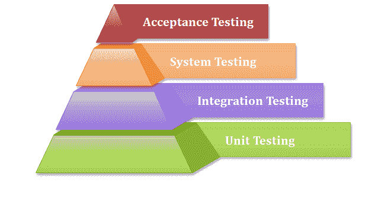
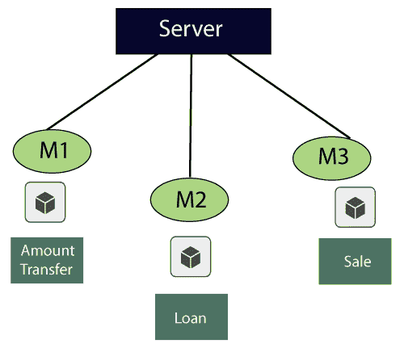
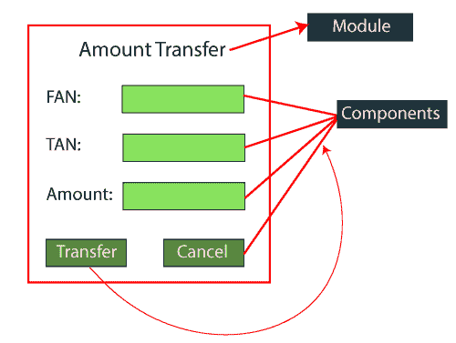

# 单元测试

> 原文：<https://www.javatpoint.com/unit-testing>

单元测试包括软件应用的每个单元或单个组件的测试。这是功能测试的第一级。单元测试的目的是验证单元组件的性能。

一个单元是软件系统的单一可测试部分，在应用软件的开发阶段进行测试。

单元测试的目的是测试隔离代码的正确性。单元组件是应用的单个功能或代码。白盒测试方法用于单元测试，通常由开发人员完成。

每当应用准备就绪并交给测试工程师时，他/她将开始独立或逐个检查应用的模块或模块的每个组件，这一过程称为**单元测试**或**组件测试**。

## 为什么是单元测试？

在测试层次结构中，单元测试是集成之前完成的第一级测试，也是测试的其他剩余级别。它在测试过程中使用模块，减少了等待单元测试的依赖性。框架、存根、驱动程序和模拟对象被用来帮助单元测试。

一般来说，**软件经历了四个级别的测试:单元测试、集成测试、系统测试和验收测试，但是有时由于时间消耗，软件测试人员只进行最少的单元测试，但是在集成测试、系统测试和验收测试期间，甚至在软件应用完成后进行的 Beta 测试期间，跳过单元测试可能会导致更高的缺陷。**

 ****一些关键原因如下:**

*   单元测试帮助测试人员和开发人员理解代码的基础，这使得他们能够快速地改变导致缺陷的代码。
*   单元测试有助于文档。
*   单元测试在开发阶段很早就修复了缺陷，这就是为什么在即将到来的测试阶段可能会出现少量的缺陷。
*   它通过迁移代码和测试用例来帮助代码重用。

## 单元测试示例

让我们看一个示例来更好地理解单元测试的概念:

对于**金额转账，**要求如下:

| 1. | 金额转账 |
| One point one | 自账号(FAN)→文本框 |
| 1.1.1 | 风扇→仅接受 4 位数字 |
| One point two | 至账号(电话号码)→文本框 |
| 1.2.1 | TAN→仅接受 4 位数 |
| One point three | 金额→文本框 |
| 1.3.1 | 金额→接受最大 4 位数 |
| One point four | 传输→按钮 |
| 1.4.1 | 传输→启用 |
| One point five | 取消→按钮 |
| 1.5.1 | 取消→启用 |

以下是客户提供的应用访问详细信息

*   URL→登录页
*   用户名/密码/确定→主页
*   要到达金额转账模块，请遵循以下步骤

**贷款→销售→金额转账**

在执行单元测试时，我们应该遵循一些规则，如下所示:

*   要开始单元测试，至少我们应该有一个模块。
*   测试正值
*   测试负值
*   没有过度测试
*   不需要假设

当我们感觉到**最大测试覆盖率**达到时，我们将停止测试。

现在，我们将开始在不同的组件上执行单元测试，例如

*   **从账号(FAN)**
*   **至账号(TAN)**
*   **金额**
*   **转移**
*   **取消**

**风扇部件**

| 价值观念 | 描述 |
| One thousand two hundred and thirty-four | 接受 |
| Four thousand three hundred and eleven | 错误消息→账户有效或无效 |
| 空白的 | 错误消息→输入一些值 |
| 5 位/ 3 位 | 错误消息→仅接受 4 位数字 |
| 含字母和数字的 | 错误消息→仅接受数字 |
| 冻结账号 | 出错信息 |
| 复制并粘贴该值 | 错误消息→键入值 |
| 和范和谭一样 | 出错信息 |

**为 TAN 成分**

*   提供值，就像我们在**从账号** (FAN)组件中所做的那样

**对于金额组成部分**

*   提供值，就像我们在 FAN 和 TAN 组件中所做的那样。

**用于传送组件**

*   输入有效的风扇值
*   输入有效的 TAN 值
*   输入正确的金额值
*   点击转账按钮→金额转账成功(确认信息)

**取消组件**

*   输入 FAN、TAN 和金额的值。
*   点击取消按钮→所有数据应被清除。

## 单元测试工具

我们在市场上有各种类型的单元测试工具，如下所示:

*   NUnit
*   单元测试
*   菲普奈
*   Parasoft Jtest
*   女子名

有关单元测试工具的更多信息，请参考以下链接:

[https://www.javatpoint.com/unit-testing-tools](https://www.javatpoint.com/unit-testing-tools)

## 单元测试技术:

单元测试使用所有白盒测试技术，因为它使用软件应用的代码:

*   数据流测试
*   控制流测试
*   分支覆盖测试
*   语句覆盖测试
*   决策覆盖测试

## 如何通过单元测试获得最佳结果？

通过遵循下面列出的步骤，单元测试可以在不混淆和增加复杂性的情况下给出最佳结果:

*   测试用例必须是独立的，因为如果需求有任何变化或增强，测试用例将不会受到影响。
*   单元测试用例的命名约定必须清晰一致。
*   在单元测试期间，在进入软件开发生命周期的下一阶段之前，必须修复识别出的错误。
*   一次只能测试一个代码。
*   随着代码的编写采用测试用例，如果不这样做，执行路径的数量将会增加。
*   如果任何模块的代码有变化，请确保该模块的相应单元测试可用或不可用。

## 单元测试的优缺点

单元测试的利弊如下:

### 优势

*   单元测试使用模块方法，因为任何部分都可以在不等待另一部分测试完成的情况下进行测试。
*   开发团队专注于单元所提供的功能，以及功能应该如何在单元测试服中出现，以理解单元 API。
*   单元测试允许开发人员在几天后重构代码，并确保模块仍然工作，没有任何缺陷。

### 不足之处

*   当它在代码单元上工作时，它不能识别集成或大范围的错误。
*   在单元测试中，不可能评估所有的执行路径，所以单元测试不能捕捉程序中的每一个错误。
*   它最适合与其他测试活动结合使用。

* * ***