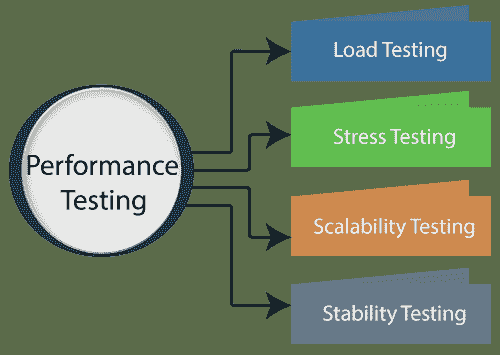
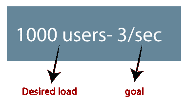
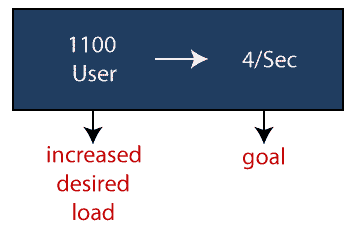
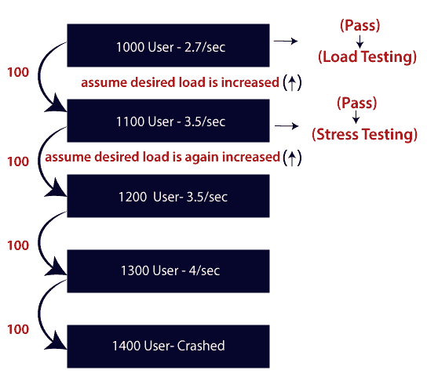
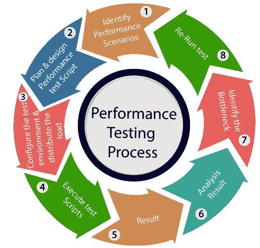

# 性能试验

> 原文：<https://www.javatpoint.com/performance-testing>

在本节中，我们将了解性能测试、我们为什么需要它、性能测试的类型以及性能测试过程。

以下是我们将在本节中了解的主题:

## 什么是性能测试？

这是非功能测试中最重要的部分。

> *通过施加一些负载来检查应用的行为被称为性能测试。*

一般来说，这个测试定义了服务器响应用户请求的速度。

在对应用进行性能测试时，我们将关注各种因素，如应用的**响应时间、负载和稳定性**。

**响应时间:**响应时间是服务器响应客户端请求所花费的时间。

**Load:** 这里的 Load 是指当 **N 号**的用户同时使用该应用或者一次向服务器发送请求时。

**稳定性:**对于稳定性因素，我们可以说，当 N-数量的用户在特定时间内同时使用应用时。

## 当我们使用性能测试时。

一旦软件稳定并转移到生产中，我们将进行性能测试，它可能会被多个用户并发访问，由于这个原因，可能会出现一些性能问题。为了避免这些性能问题，测试人员执行一轮性能测试。

因为它是非功能测试，这并不意味着我们总是使用性能测试，我们只在应用功能稳定时进行性能测试。

#### 注意:性能测试不能手动完成，因为其昂贵和准确的结果无法保持。

## 性能测试的类型

以下是性能测试的类型:

*   **负载测试**
*   **压力测试**
*   **可扩展性测试**
*   **稳定性测试**

让我们逐一讨论，让您全面了解**负载、压力、可扩展性、**和**稳定性**性能测试。

### 负载测试

负载测试用于通过施加小于或等于所需负载的负载来检查应用的性能，称为负载测试。

**例如:**下图中， **1000 用户**是客户给出的**期望负载**，而**3/秒**是我们在进行负载测试时想要达到的**目标**。

### 压力测试

压力测试是测试，它通过施加大于期望负载的负载来检查应用的行为。

**举个例子:**如果我们拿上面的例子，把想要的负载增加 1000 到 1100 个用户，目标是 4/秒。在这种情况下执行压力测试时，它会通过，因为负载比实际所需负载大(100 倍以上)。

### 可扩展性测试

通过增加或减少特定规模(用户数量)的负载来检查应用的性能被称为**可伸缩性测试**。向上可伸缩性和向下可伸缩性测试称为可伸缩性测试。

可伸缩性测试分为以下两部分:

*   **向上扩展性测试**
*   **向下可扩展性测试**

**向上扩展性测试**

它正在测试我们**在特定范围内增加用户数量**，直到我们到达崩溃点。我们将使用向上可伸缩性测试来找到应用的最大容量。

**向下可扩展性测试**

当负载测试没有通过时，使用向下可伸缩性测试，然后开始**减少特定间隔**的用户数量，直到达到目标。这样就很容易识别瓶颈(bug)。

### 稳定性试验

通过在特定持续时间内施加负载来检查应用的性能被称为**稳定性测试**。

## 性能测试示例

让我们举一个例子，我们将**测试一个应用的行为，其中期望的负载要么小于 1000，要么等于 1000 个用户**。

在下图中，我们可以看到 **100 up** 用户不断增加查看**最大负载**，也叫**向上扩展性测试**。

*   **场景 1:** 当我们有 1000 个用户作为期望负载，2.7/秒是目标时间时，这些场景将在执行负载测试时通过，因为在负载测试中，我们将集中在用户数量上，根据要求它等于 1000 个用户。
*   **场景 2:** 在下一个场景中，我们将增加 100 个用户的期望负载，目标时间将上升到 3.5 \秒。如果我们执行压力测试，这个场景将通过，因为在这里，实际负载大于(1100)期望负载(1000)。
*   **场景 3:** 在这种情况下，如果我们将期望负载增加三倍为
    **1200→3.5 \秒:**【它不小于或等于期望负载，这就是为什么它会**失效**
    **1300→4 \秒:**【它不小于或等于期望负载。即**故障**
    **1400→死机**

#### 注 1:体积和浸泡测试是一种测试，但不是性能测试。

**容积测试**

容量测试是测试，它通过在数据方面插入大量负载来帮助我们检查应用的行为，这就是所谓的容量测试，在这里，我们将关注数据速率的数量，而不是用户的数量。

#### 注 2:
容量为容量，负载为数量，即负载测试指用户数，容量测试指数据量。

**浸泡测试**

在这种类型的测试中，我们将检查环境中应用的行为，这种行为在很长一段时间内都是不被支持的，这就是所谓的浸泡测试。

一般来说，浸泡测试是一种否定类型的测试，因为我们已经知道服务器或环境不支持。

## 性能测试过程

性能测试不能手动完成，因为:

*   我们需要大量的资源，这成为了一种成本更高的方法。
*   当我们手动跟踪响应时间时，准确性无法保持。

性能测试过程将在以下步骤中完成:

*   确定性能场景
*   计划和设计性能测试脚本
*   配置测试环境并分配负载
*   执行测试脚本
*   结果
*   分析结果
*   识别瓶颈
*   重新运行测试

如果我们执行性能测试流程的**正向流程**，它可以遵循以下流程:

### 确定性能场景

首先，我们将根据以下因素确定性能方案:

**最常用的场景:**是指我们可以根据场景找到性能场景，像 **Gmail 应用中常用的场景；**我们将执行**登录、收件箱、发送邮件、撰写邮件和注销**。

**最关键的场景:**关键场景是指在 Gmail 应用**中经常使用且对业务很重要的登录、撰写、收件箱和注销**。

**庞大的数据事务:**如果我们拥有庞大的数据意味着同时使用应用的用户数量为 n。

一旦我们确定了性能场景，我们将进入下一步。

### 计划和设计性能测试脚本

在这一步中，我们将在测试工程师机器中安装工具并访问测试服务器，然后我们根据测试场景编写一些脚本并运行该工具。

一旦我们写完剧本，我们将进入下一步。

### 配置测试环境并分配负载

写完测试脚本后，我们会在执行前安排好测试环境。此外，根据“使用模式”管理工具、其他资源和分配负载，或者提及持续时间和稳定性。

### 执行测试脚本

一旦我们完成了负载分配，我们将执行、验证和监控测试脚本。

### 结果

执行测试脚本后，我们将得到测试结果。并检查在给定的响应时间内结果是否满足目标，响应时间可以是最大值、平均值和最小值。

如果响应不符合要求的时间响应，那么我们将进入**负流程**，执行以下步骤:

### 分析结果

首先，我们将分析测试结果是否符合响应时间。

### 识别瓶颈

之后，我们将确定**瓶颈(bug 或性能问题**)。而瓶颈可能会因为这些方面而出现，如代码方面的**问题、硬件问题(硬盘、内存处理器)、网络问题、**和软件问题(操作系统)。找到瓶颈后，我们将执行**调整(修复或调整)**来解决这个瓶颈。

### 重新运行测试

一旦我们解决了瓶颈，就重新运行测试脚本，并检查结果是否符合要求的目标。

## 问题出现在性能测试中

在对应用执行性能测试时，可能会出现一些问题，这些问题也被称为**性能问题**。

性能问题如下:

*   **响应时间问题**
*   **可扩展性问题**
*   **瓶颈**
*   **速度问题**

### 响应时间问题

响应时间意味着服务器对客户端请求的响应速度。如果用户的请求没有在给定的响应时间内完成，用户可能会对特定的软件或应用失去兴趣。这就是为什么应用或软件应该有一个完美的响应时间来快速响应用户的请求。

### 可扩展性问题

当应用不能同时接受 n 个用户和预期的用户请求时，就会出现可伸缩性问题。这就是为什么我们将进行**向上可伸缩性测试**(检查应用的最大容量)和**向下可伸缩性测试**(当预期时间与实际时间不匹配时)。

### 瓶颈

瓶颈是 bug 的非正式名称，当应用受到单个组件的限制并对系统性能造成不良影响时，就会出现瓶颈。

造成瓶颈的主要原因是**软件问题(与操作系统相关的问题)、硬件问题(与硬盘、内存和处理器相关的问题)、**和**编码问题、**等。

以下是最常见的性能瓶颈:

*   内存利用率
*   磁盘使用情况
*   中央处理器利用率
*   操作系统限制
*   网络利用率

### 速度问题

当我们对应用执行性能测试时，应用的速度应该更快，以获得用户的兴趣和关注，因为如果应用的速度较慢，可能会失去用户对应用的兴趣。

## 性能测试工具

我们在市场上有各种类型的性能测试工具，其中一些是商业工具和开源工具。

**商用工具:LoadRunner【HP】、WebLOAD、NeoLoad**

**开源工具:JMeter**

### 工具

它是性能测试最强大的工具之一，用于支持广泛协议、多种技术和应用环境的性能测试。

它可以快速识别性能问题的最常见原因。并且还能准确预测应用的可扩展性和容量。

### 测试工具

Apache JMeter 软件是一个开源工具，它完全是一个 Java 应用，旨在加载功能测试行为并测量性能。

一般来说，它是为测试网络应用而设计的，但现在也扩展到了其他测试功能。

Apache JMeter 用于测试静态和动态资源以及动态 web 应用的性能。
可用于再现服务器、网络或对象、服务器组上的重负载，以测试其强度或分析不同负载类型下的整体性能。

### web load(web load)

WebLOAD 测试工具，用于测试 web 应用的负载测试、性能测试和压力测试。

WebLOAD 工具将性能、可伸缩性和完整性结合为一个单一的过程，用于验证 web 和移动应用。

### NeoLoad

纽泰公司开发了一种叫做 NeoLoad 的测试工具。NeoLoad 用于测试性能测试场景。借助 NeoLoad，我们可以找到网页和手机应用开发过程中的瓶颈区域。

与传统工具相比，NeoLoad 测试工具速度更快。

除此之外，其他一些工具还有**电负载、web 压力工具、LoadUI Pro、StresStimulus、LoadView、LoadNinja 和帮助测试软件或应用性能的 RedLine13、**。

* * *