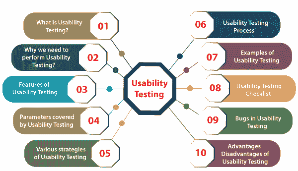
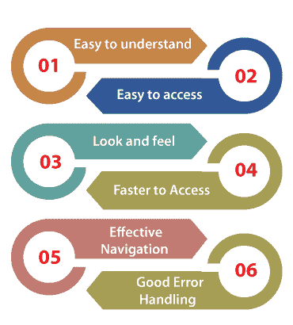
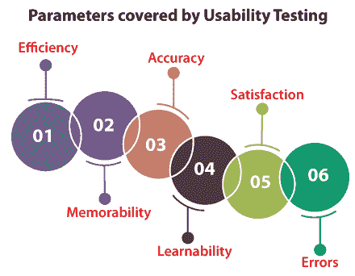
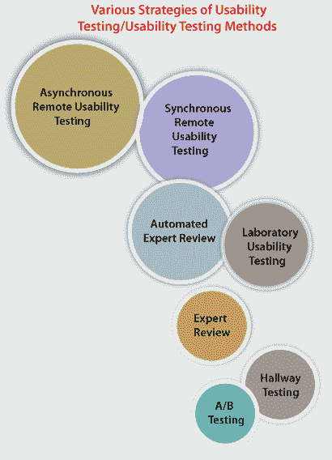
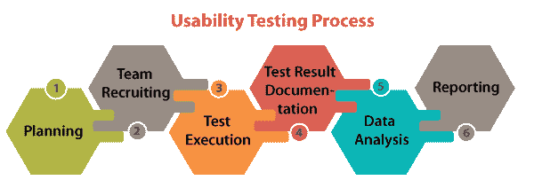

# 可用性测试

> 原文：<https://www.javatpoint.com/usability-testing>

如今，我们在应用商店中有 n 个可用的应用，以帮助人们工作。

在那里，他们可以给出否定的回答或差的评级，这导致特定的产品在被有限数量的最终用户下载或安装之前就达到了他们的目的。

简而言之，我们可以说一次糟糕的评论会损害所有的资源技能、长时间的计划、开发产品的热情等等。

这就是为什么可用性测试会解决这些类型的问题，因为可用性测试具有活跃的意义，并且由测试工程师在整个软件测试生命周期中执行。

为了帮助我们理解它在 STLC 中的重要性，在这一节中，我们将讨论所有关于可用性测试的内容，其中包括下列基本主题:

*   **什么是可用性测试？**
*   **为什么我们需要进行可用性测试？**
*   **可用性测试的特点**
*   **可用性测试涵盖的参数**
*   **可用性测试的各种策略**
*   **可用性测试流程**
*   **可用性测试示例**
*   **可用性测试清单**
*   **可用性测试中的错误**
*   **可用性测试的优势**
*   **可用性测试的缺点**

## 什么是可用性测试？

可用性测试是**软件测试** 技术的重要[类型，属于](https://www.javatpoint.com/types-of-software-testing) [**非功能测试**](https://www.javatpoint.com/non-functional-testing) 的范畴。

它主要用于以用户为中心的交互设计，以检查软件产品的可用性或易用性。可用性测试的实现需要对应用的理解，因为它是广泛的测试。

一般来说，可用性测试是从最终用户的角度来验证系统是否有效工作。

> 检查应用的用户友好性、效率和准确性被称为可用性测试。

执行可用性测试的主要目的是检查应用对于最终用户来说是否易于使用，同时支持客户指定的功能和业务需求。

当我们使用可用性测试时，它确保开发的软件是直接的，同时使用系统不会面临任何问题，并使最终用户的生活更容易。

换句话说，我们可以说可用性测试是识别软件产品最终用户沟通缺陷的独特测试技术之一。这就是为什么它也被称为**用户体验(UX)测试**。

它帮助我们修复特定网站或应用中的几个可用性问题，甚至确保其卓越性和功能性。

可用性测试的执行证明了产品的所有必要特性，从测试浏览网站的费力程度，到验证其流程和内容，以便提出最佳用户体验。

通常，可用性测试是由现实生活中的用户执行的，而不是由开发团队执行的，因为我们已经意识到开发团队是创建产品的人。因此，他们无法识别与用户体验相关的更小的缺陷或 bug。

#### 注意:它可以在[软件开发生命周期(SDLC)](https://www.javatpoint.com/software-development-life-cycle) 的设计阶段实现，以帮助我们更清楚地了解用户的需求。

在**可用性测试**中，**用户友好性**可以借助以下特征来描述:

*   **通俗易懂**
*   **易于访问**
*   **观感**
*   **更快地访问**
*   **有效导航**
*   **良好的错误处理**

让我们一个接一个地看，以便更好地理解:

**通俗易懂**

*   软件或应用的所有特性必须对最终用户可见。

**易于访问**

*   一个用户友好的应用应该每个人都可以访问。

**易于访问**

*   应用的外观和感觉应该是优秀的和有吸引力的，以引起用户的兴趣。
*   软件的图形用户界面应该是好的，因为如果图形用户界面不好，用户在使用应用或软件时可能会失去兴趣。
*   产品质量达到了客户给出的标准。

**更快地访问**

*   软件在访问时应该更快，这意味着应用的响应时间更快。
*   如果响应时间很慢，可能会发生用户被激怒的情况。我们必须确保我们的应用将在 3 到 6 秒的响应时间内加载。

**有效导航**

*   有效的导航是软件最重要的方面。有效导航的以下几个方面:
*   良好的内部链接
*   信息页眉和页脚
*   良好的搜索功能

**良好的错误处理**

*   在编码级别处理错误可以确保软件或应用没有错误并且健壮。

*   通过显示正确的错误消息，将有助于增强用户体验和应用的可用性。

## 为什么我们需要执行可用性测试？

我们需要可用性测试，因为可用性测试是为了构建一个具有良好用户体验的系统。可用性不仅用于[软件开发](https://www.javatpoint.com/software-development-life-cycle)或网站开发，也用于产品设计。

客户必须对具有以下参数的应用感到满意。

*   应用的流程应该是良好的
*   导航步骤应该清晰
*   内容应该简单
*   布局应该清晰
*   响应时间

我们还可以测试可用性测试中的不同特性，如下所示:

*   使用该应用有多容易
*   学习应用有多容易

## 可用性测试的特点

可用性测试的实现帮助我们增加特定应用和软件的最终用户体验。在可用性测试的帮助下，软件开发团队可以快速检测系统中的几个可用性错误，并快速修复它们。

可用性测试的其他一些重要特性如下:

*   它是**软件测试**中**黑盒测试**技术下的**非功能测试**技术的基本类型。
*   可用性测试在整个**系统**和**验收测试**级别进行。
*   一般来说，可用性测试是在软件开发生命周期 (SDLC)的早期实施的。
*   可用性测试的执行为最终用户的前景提供了更多的可见性。
*   可用性测试确保软件产品满足其计划的目的。
*   它还帮助我们发现指定软件产品中的许多可用性错误。
*   可用性测试主要测试最终产品的用户友好性、有用性、可追溯性、可用性和合意性。
*   它提供了真实用户如何使用软件/应用的直接输入。
*   可用性测试包括在测量的环境下系统地执行产品的可用性。

## 可用性测试涵盖的参数

为了测试软件的**质量、可用性、用户友好性** ss 等重要因素，可用性测试起着重要的作用。它还帮助我们支持组织向其目标受众提供更广泛的服务。

然而，可用性测试对这些方面的影响是不够的，还涵盖了以下各种约束或参数，帮助我们提高软件的生产力。

1.  **效率**
2.  **可记忆性**
3.  **精度**
4.  **可学性**
5.  **满意度**
6.  **错误**

为了增强我们对可用性测试的了解，让我们将它们分开来看:

### 1.效率

可用性测试的执行所覆盖的第一个约束是**效率。**这里，效率参数解释了作为专家的最终用户，他/她可以用最少的时间来执行他/她的基本任务，或者我们可以说，未开发的任务。

### 2.值得记忆

可用性测试实现的第二个限制是**可记忆性。**应用的可记忆性可以是有益的，也可以是无益的。但是，问题来了，我们如何决定一个应用的可记忆性是好是坏？

以下几点将给出上述问题的完美答案:

*   当我们有一段时间没有请求应用并返回应用或试图在没有任何帮助的情况下完成简单的任务时，我们可以说应用的**可记忆性是有益的。**
*   或者，如果我们在一段时间后没有任何帮助就不能执行一个简单的任务，我们可以说应用的**可记忆性没有好处。**

### 3.准确

进行可用性测试的下一个参数是**准确度**。可用性测试确保产品中不存在不合适/不相关的数据或信息。此外，能够发现特定产品中的断裂链接，帮助我们开发最终产品的准确性。

### 4.可学性

可用性测试包含的另一个限制是**可学习性。**在这个约束条件下，最终用户花费最少的时间来学习基本任务。

### 5.满意

可用性测试的执行确保了**客户的满意度**，因为我们知道满意的客户可以轻松或自由地使用应用。

### 6.错误

可用性测试涵盖的最后一个也是最重要的参数是**错误检测**。在这一点上，我们试图帮助最终用户修复他们之前犯下的错误，并重新完成他们的任务。

## 可用性测试的各种策略/可用性测试方法

像其他类型的软件测试包含几种方法一样，可用性测试也涉及各种策略或方法。一些最常用的可用性测试方法如下:

*   **空调测试**
*   **走廊测试**
*   **实验室可用性测试**
*   **专家评审**
*   **自动专家评审**
*   **同步远程可用性测试**
*   **异步远程可用性测试**

让我们逐一总结，以便更好地理解:

### 1.空调测试

第一种可用性测试方法是 **A/B 测试，****包括创建一个类似的产品形象，但没有原始产品的重要方面，这可能会直接影响用户性能。**

 **对比分析理解了 A/B 测试，我们可以通过一些其他的元素，比如**的颜色，文本，或者界面的差异**。

### 2.走廊测试

可用性测试的下一个方法是**走廊测试**。与其他可用性测试方法相比，这是最成功和最节省成本的方法之一。

在走廊测试中，一些随机的人测试应用，而不是熟练的专业人员，他们没有任何早期的产品知识。因此，如果这些随机人员中的任何一个更有效地测试应用，我们将获得更精确的结果和可靠的响应，以便进一步增强。

走廊测试背后的主要目的是为 bug 找到最关键的环境，因为这些 bug 会使简单的特性变得无效和无精打采。

### 3.实验室可用性测试

可用性测试的第三个策略是**实验室可用性测试。**实验室可用性测试是在观众在场的情况下进行的。通常，它是由团队在单独的实验室中实施的。

在这种方法中，查看者关心的是定期检查测试工程师的表现，并将测试结果报告给相关团队。

### 4.专家评论

可用性测试的另一种通用方法是**专家评审**。专家评审方法包括在执行可用性测试的特定领域具有深入知识或经验的专业团队的好处。

可用性测试是一致的，因为当产品具有关键特性时，专业人员的知识是值得花费的。在发布产品之前，组织需要了解用户的反应。

要求特定领域的专家测试产品，给出响应，然后提交结果。为了提交结果，专家审评也可以远程进行。

与其他类型的可用性测试相比，可用性测试的专家评审实施得很快，花费的时间也更少，因为专业人员可以很容易地发现产品中的漏洞和缺陷。

这使得特定的过程成本很高，因为公司需要任命一名技术人员。所以，有时候客户会避开这个选项。

### 5.自动专家评审

**可用性测试**的下一个基本方法是**自动专家评审**。顾名思义，自动化的**专家评审**是通过编写自动化脚本来执行的。

为了执行这种可用性测试方法，一个组织需要指定一个非常了解编写自动化脚本和开发自动化框架的资源。

自动化测试工程师编写测试脚本，当脚本被触发时，我们可以轻松地实现测试用例。测试实施后，记录并提交结果。

自动化专家评审是可用性测试的成功类型之一，因为它减少了人工参与、自动化脚本，并且减少了遗漏任何问题的机会。

简单地说，我们可以指定它只是对所有可用性约束的基于程序的审查。然而，这种方法的问题是当由人执行时缺乏深刻的审查，这使得它成为一种较慢的测试方法。

这是一种主要使用的可用性测试方法，因为与**专家评审**相比，它没有那么昂贵。

### 6.远程可用性测试

可用性测试的下一个方法是**远程可用性测试**。顾名思义，远程可用性测试是由位于远程位置的人进行的，这意味着那些位于不同州或有时位于其他一些国家的人可以实现他们的测试目标。

远程可用性测试是远程执行的，如果发现任何问题，也能够报告。在这种方法中，响应可以由随机的人记录和提交，而不是由熟练的人提交。

有时，远程测试使用视频会议来实现。与其他类型的可用性测试方法相比，这种方法成本更低。

远程可用性测试可以分为以下两个部分，如下所述:

*   **同步远程可用性测试**
*   **异步远程可用性测试**

**同步远程可用性测试**

远程可用性测试第一部分**同步远程可用性测试**。在全面研究了远程执行可用性测试的相关问题后，提出了同步远程可用性测试方法。

我们可以使用 W **ebEx** 工具进行远程网页共享的视频会议。然而，它需要真实存在的有效性来使这个集体测试过程成功。

**异步远程可用性测试**

远程可用性测试方法的第二种方法是**异步远程可用性测试。**

异步远程可用性测试方法帮助我们轻松地将用户响应分为各种人口统计和性能类型。

这是最常用的方法，它使用用户日志、用户界面响应和用户环境本身的测试。

在大多数情况下，可用性测试解决了许多与性能测试过程的输出密切相关的错误。

## 可用性测试过程

可用性测试过程分为几个重要的步骤。这个过程将帮助我们为测试执行过程中发现的所有问题提供和创建不同的结果。

实时地，可用性测试从用户的角度测试应用的行为，尽管这是一个耗时的过程，为测试人员提供了实际测试中最精确的结果。

这让我们对产品中的错误/缺陷有了一个概念，并在将其安装到服务器上之前帮助我们清楚地了解。

可用性测试过程遵循一套精确的步骤，以帮助团队从最终用户那里获得详细和有用的响应。

因此，可用性测试的过程分为以下步骤完成，如下图所示:

### 第一步:计划

可用性测试的第一步是**规划**，团队制定测试计划，生成一些文档样本，帮助测试团队完成可用性测试任务。这是可用性测试过程中最重要和最关键的阶段之一。

可用性测试的目标由计划步骤控制。在这里，我们的目标不是让志愿者坐在我们的应用前记录他们的活动，而是我们需要修复系统的关键特性和元素。

我们需要将任务交给熟悉这些关键特性的测试工程师。可用性测试方法、可用性测试工程师的数量和人口统计数据、测试报告格式在整个规划阶段也是固定的。

### 第二步:团队招募

一旦规划阶段完成，我们将进入可用性测试的下一步，即**团队招募。**

顾名思义，在这里，我们将根据产品的预算和密度雇佣或招聘最终用户代表和参与者或测试工程师。

这些代表或测试工程师准备参加测试会议，验证产品的正确性和可用性。

首先，这些测试工程师的选择是基于测试的必要性以及测试计划中提到的人数。

一旦聘用了测试工程师，团队就被指定承担特定的职责和工作。

### 步骤 3:测试执行

规划和团队招募步骤成功完成后。我们将进行下一步，即**测试执行**。

在测试执行步骤中，测试工程师执行可用性测试并实现他们被分配的职责。在这种情况下，用户需要测试产品以发现不规则性(如果有的话)，并正确记录它们。

### 步骤 4:测试结果文档

**测试结果文档**步骤包括基于**测试执行**步骤的结果，然后进行进一步分析。

### 第五步:数据分析

一旦测试结果文档完成，我们将进入可用性测试流程的下一步，即**数据分析**。

响应或反馈是从数据分析阶段的可用性测试评估中获得的。结果被分类，模式被确认。

在这一步中，来自可用性测试的数据被全面评估，以获得表达含义，并帮助我们提供可操作的建议来提高我们产品的整体可用性。

### 步骤 6:报告

成功完成以上所有步骤后，我们将最终到达可用性测试流程的最后一步，命名为**报告**。

在这种情况下，我们可以向开发团队、设计师和特定项目的另一个参与者报告并分享结果和建议的修改，以及所有相关文档、音频、数据库、屏幕记录等。

## 可用性测试的例子

让我们看一些例子，在那里我们理解可用性测试的使用。

### 例 1

假设我们有两个应用，即 **P 和 Q** ，它们不同但执行相同的工作，我们将看到哪一个是用户友好的。

下面是一些重要的参数或约束，我们在测试时会考虑这些参数，并且大多数参数是不可测量的。

*   **看&感觉**
*   **导航要简单**
*   **速度**
*   **兼容性**
*   **帮助**
*   **组件位置**
*   **功能**

在本例中，我们在 **4 小时**中学习了**应用 P** ，但是为了理解**应用 q**，我们花费了 6 个小时

让我们看看其他不同的情况，以更清楚地了解上面的例子:

*   由于我们在 4 小时内理解了**应用 P** ，如果我们将其与**应用 q**进行比较，它将变得用户友好
*   假设**观感**不适合**应用 P** 。在这样的场景下，我们在 4 小时内理解**应用 P**；我们不能说应用 P 是用户友好的。
*   因此，在我们说软件的用户友好性之前，我们研究各种参数。

#### 注:什么是观感？

在可用性测试中，术语 ***观感*** 是最常用的术语。【T4 感觉】外观用于描述应用应该是令人愉悦的外观。

假设我们在**的红色背景**中有**蓝色文字**；事实上，我们不想使用它，也不想让最终用户感觉使用它。

### 例 2

我们正在使用一个**银行应用**，在这里我们为经理生成应用。

#### 注意:在这里，经理是最终用户。

现在，如果最终用户(经理)在测试工程师面前开始使用应用

假设两个测试工程师坐在最终用户的后面，当他/她使用应用时，他/她作为一个开发人员拿着缺陷报告来检查最终用户是否以正确的方式使用应用。

最终用户(经理)将逐步检查应用，因为他/她知道测试工程师正在监视他/她。

#### 注意:一般来说，专业的测试工程师不会执行可用性测试，因为他们确切地知道特定特性在哪里会失败，以及它是如何工作的。
因此，测试工程师对应用变得友好。
所以只有最终用户应该做可用性测试，以获得更好的结果。

有时测试工程师不得不进行可用性测试，原因如下:

*   没有钱花在可用性测试上。
*   不想外包给另一家公司。

### 例 3

在这个例子中，公司的主管去收集软件(假设是一个游戏软件)，并将其分发给不同的最终用户，如员工、朋友等。

现在，这些最终用户将使用特定的游戏软件，并将他们的反馈提供给总监。

该主管查看他们的反馈，查看主要反馈，然后整合所有反馈并制作一份报告。

如果报告了所有最终用户的某个特定功能，则应考虑该功能，或者如果只有一个或两个最终用户报告了该功能，则该功能变得次要。

一旦完成了主要和次要缺陷的合并，它们将根据主管的要求进行修复。

如果它是一个主要的错误，那么它将首先修复，或者如果它是次要的，那么它可能会被延迟或在下一个版本中修复。

#### 注意:不能将所有应用交给最终用户，因为这取决于应用或软件需求。

## 可用性测试清单

可用性测试清单包含所有与可用性测试相关的文档。我们不在可用性测试中编写测试用例，因为我们使用标准的可用性测试清单，我们只是测试应用的外观和感觉。

 **#### 注意:在创建可用性清单时，我们应该开发一个标准的清单，可以对所有页面执行。还有一种情况是，客户为应用提供清单。

为了使可用性测试更加成功，我们将准备标准的检查表，这意味着“*有哪些检查点”。或者，如果我们不做一个清单，我们可能会错过应用中的一些功能。*

 **   **创建清单**
*   **审核清单**
*   **执行清单/批准清单**
*   **导出检查表报告(执行报告)**

让我们看看**一个例子**，我们正在为一个应用创建一个清单:

如果我们拿一个**电子商务应用**准备清单，如下图:

*   所有的图像都应该有 alt 标签(工具提示)。
*   登录功能应该有忘记密码链接。
*   所有的页面都应该有一个应用主页的链接。
*   应该可以访问所有组件。

像这样，我们可以根据产品或应用驱动尽可能多的清单。

## 可用性测试中的缺陷

可用性测试中一个常见的错误是在设计过程中组织研究太晚。如果我们等到我们的产品发布，我们将没有时间或金钱来解决任何问题。我们浪费了大量精力，以错误的方式创造我们的产品。

此外，我们可能会在测试任何软件或应用时遇到更多的错误。这些 bug 可能是**路径漏洞**和**潜在 bug**。

**路径漏洞和潜在 bug**:路径漏洞和潜在 bug 是开发者和测试工程师在进行可用性测试时可以看到的。

## 可用性测试的优势

使用可用性测试的一些显著好处如下所述:

*   可用性测试的执行帮助我们验证软件的可用性。
*   它提高了用户对软件产品的满意度，也确保了交付高质量的产品。
*   可用性测试的实施将提高软件产品的充分性和一致性。
*   在可用性测试的帮助下，我们可以在交付最终产品之前发现可用性问题。
*   最终用户总是渴望使用应用。
*   可用性测试的执行帮助我们识别软件中可能的错误和缺陷。
*   它帮助我们使软件更加高效和适用。
*   可用性测试的使用将帮助我们接收相关和精确的用户响应。
*   它提高了软件产品的充分性和一致性。

## 可用性测试的缺点

实现可用性测试的一些最常见的缺点如下所述:

*   我们知道，预算是执行任何软件测试时最关键的因素。在这里，可用性测试成本也起着至关重要的作用。建立可用性测试实验室需要很多资源，有时雇佣或招聘可用性测试工程师可能成本很高。
*   正如我们从上面对可用性测试的讨论中了解到的，它是由最终用户实现的，有时识别可以作为测试工程师工作的志愿者有点困难。
*   首先，可用性测试不能 100%代表实际情况。

## 结论

在看到所有至关重要的**可用性测试主题**后，我们可以得出结论，这是一个广泛的测试过程，需要对这个领域有更高水平的理解以及创造性的思维。

实施可用性测试对于世界各地的组织来说是必要的，因为这是最有效的软件测试方法之一，有助于测试工程师和开发人员保持软件的可用性、正确性、一致性、性能和其他基本特征。

因此，如果可用性测试在软件开发的初始阶段进行，我们可以保证应用的易用性，并交付满足用户期望的重要产品。

* * ******