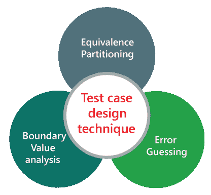

# 猜错技术

> 原文：<https://www.javatpoint.com/error-guessing-technique-in-black-box-testing>

每个测试工程师在编写测试用例时需要遵循的测试用例设计技术或方法或途径，以实现最大的测试覆盖率。如果我们遵循测试用例设计技术，那么它将变得面向过程而不是面向个人。

测试用例设计技术确保测试目的需要所有可能的正负值。在软件测试中，我们有三种不同的测试用例设计技术，如下所示:

*   猜错
*   等价划分
*   边界值分析[BVA]

在本节中，我们将了解第一个测试用例设计技术，即**错误猜测技术**。

错误猜测是一种没有特定方法来识别错误的技术。它基于测试分析师的经验，测试人员利用经验来猜测软件中有问题的地方。这是一种黑盒测试技术，它没有任何定义的结构来发现错误。

在这种方法中，每个测试工程师将基于他们对需求的理解或假设来导出值或输入，我们不遵循任何类型的规则来执行错误猜测技术。

猜错技术的完成依赖于测试人员的能力和产品知识，因为一个好的测试工程师知道错误最有可能在哪里，这有助于节省大量时间。

## 猜错技术是如何实现的？

这种技术的实现依赖于测试人员或分析师的经验，他们以前有类似应用的经验。它只需要经验丰富的测试人员和快速的错误猜测技术。这种技术用于发现可能不容易被正式黑盒测试技术捕获的错误，这就是原因，它是在所有正式技术之后完成的。

错误猜测技术的范围完全取决于测试人员和之前测试中的经验类型，因为它不遵循任何方法和指导方针。测试用例由分析师准备来识别条件。通过识别最有可能出错的区域来准备条件，然后为它们设计测试用例。

该技术的主要目的是通过执行以下任务来识别任何测试级别的常见错误:

*   在文本字段中输入空格。
*   空指针异常。
*   输入无效参数。
*   除以零。
*   使用上传文件的最大限制。
*   不输入值检查按钮。

*测试用例的增量取决于测试人员的能力和经验。*

## 猜测错误的目的

错误猜测技术的主要目的是处理所有可能的错误，这些错误不能被识别为非正式测试。

*   错误猜测技术的主要目的是处理非正式测试中无法识别的所有可能的错误。
*   它必须包含所有的测试用例集，而不跳过任何有问题的区域，也不涉及冗余的测试用例。
*   这种技术完成了在正式测试中未完成的特性。

依靠测试人员的直觉和经验，所有的缺陷都无法纠正。考官在运用自己的经验时，可以利用一些因素-

*   测试者的直觉
*   历史学习
*   检查清单
*   软件的风险报告
*   应用程序界面
*   一般测试规则
*   以前的测试结果
*   过去发生的缺陷
*   用于测试的各种数据
*   自动测试知识

## 猜错法示例

### 示例 1

应用程序的一个功能需要一个必须为 10 个字符的手机号码。现在，以下是可用于猜测移动号码字段错误的技术:

*   如果输入的字符不是数字，结果会是什么？
*   如果输入的字符少于 10 位，结果会怎样？
*   如果移动字段留空，结果会是什么？

在实现了这些技术之后，如果输出与预期结果相似，那么这个函数就被认为是没有 bug 的，但是如果输出与预期结果不相似，那么它就被发送给开发团队来修复缺陷。

然而，错误猜测是所有测试技术中的关键技术，因为它依赖于测试人员的经验，但是它不能保证最高质量的基准。它不提供软件的完全覆盖。如果与其他测试技术相结合，这种技术可以产生更好的结果。

### 示例 2

假设我们有一个银行账户，我们必须在那里存一些钱，但是这个金额将在**的特定范围内被接受，即 5000-7000** 。因此，在这里，我们将提供不同输入的值，直到它覆盖基于错误猜测技术的最大测试覆盖率，并查看它是否被接受或给出错误消息:

| 价值 | 描述 |
| Six thousand | 接受 |
| Five thousand five hundred and fifty-five | 接受 |
| Four thousand | 出错信息 |
| Eight thousand | 出错信息 |
| 空白的 | 出错信息 |
| 100$ | 出错信息 |
| - | - |
| - | - |
| 最大测试覆盖率 |  |

**注:**

**条件:如果金额> 5000，金额< 7000 金额**

如果我们输入 5000 →错误信息(根据条件不接受)

7000→错误消息(根据情况不接受)

## 猜错技术的优缺点

### 优势

猜错技术的好处如下:

*   这是发现软件中具有挑战性的部分的好方法。
*   当我们将这种技术与其他形式测试技术结合使用时，这是有益的。
*   它用于增强正式的测试设计技术。
*   借助这种技术，我们可以披露那些可能在大量测试中发现的缺陷；因此，测试工程师可以节省大量的时间和精力。

### 不足之处

以下是错误猜测技术的缺点:

*   猜错技术是以人为本，而不是以过程为本，因为它取决于人的思维。
*   如果我们使用这种技术，我们可能无法达到最小的测试覆盖率。
*   借助于此，我们可能无法覆盖所有的输入或边界值。
*   因此，我们不能保证产品质量。
*   猜错技术可以由有产品知识的人来做；对产品不熟悉的人是做不到的。

* * *