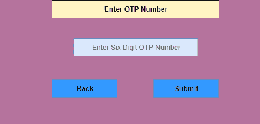
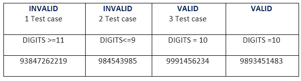
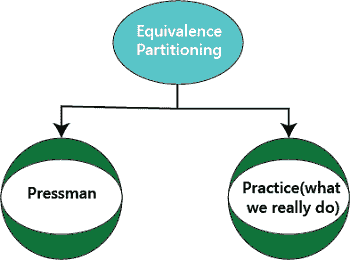
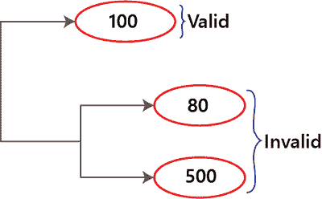
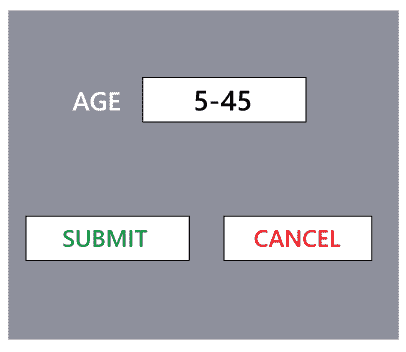
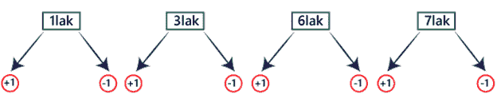
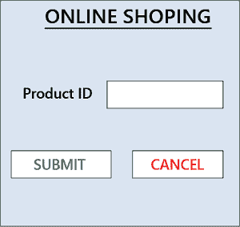
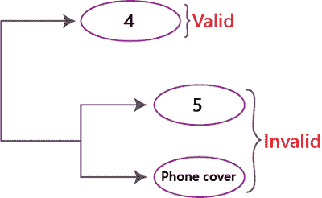
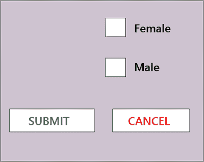
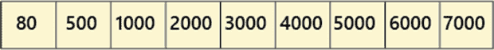

# 等价划分技术

> 原文：<https://www.javatpoint.com/equivalence-partitioning-technique-in-black-box-testing>

等价分区是一种软件测试技术，其中输入数据被划分为有效和无效值的分区，所有分区必须表现出相同的行为。如果一个分区的条件为真，那么另一个相等分区的条件也必须为真，如果一个分区的条件为假，那么另一个相等分区的条件也必须为假。等价划分的原则是，测试用例应该被设计成至少覆盖每个分区一次。每个相等分区的每个值必须表现出与其他值相同的行为。

等价分区源自软件的需求和规范。这种方法的优点是，由于从无限到有限的测试用例数量较少，有助于减少测试时间。它适用于测试过程的所有级别。

### 等价划分技术的例子

假设软件应用的某个功能接受特定数量的数字，不大于也不小于该特定数量。例如，仅包含六位数字、少于或多于六位数字的 OTP 号码将不被接受，并且应用将把用户重定向到错误页面。

```

1\. OTP Number = 6 digits

```




让我们再看一个例子。

软件应用的一个功能接受一个 10 位数的手机号码。

```

2\. Mobile number = 10 digits 

```




在这两个例子中，我们可以看到有一个由两个同样有效和无效的分区组成的分区，在应用有效值(例如第一个例子中的 6 位数的动态口令和第二个例子中的 10 位数的移动号码)时，两个有效分区的行为相同，即重定向到下一页。

另外两个分区包含无效值，例如第一个示例中的 5 或小于 5 和 7 或大于 7 位数，第二个示例中的 9 或小于 9 和 11 或大于 11 位数，在应用这些无效值时，两个无效分区的行为相同，即重定向到错误页面。

我们可以在示例中看到，每个示例只有三个测试用例，这也是等价划分的原则，即该方法旨在减少测试用例的数量。

## 我们如何执行等价划分

我们可以通过以下两种方式执行等价划分:



让我们看看 pressman 和一般实践方法将如何在不同条件下使用:

### 情况

如果要求是**一个数值范围**，那么推导出**一个有效**和**两个无效**输入的测试用例。

这里，**值的范围**意味着，每当我们想要识别范围值时，我们就进行等价划分，以实现最小的测试覆盖率。之后，我们进行错误猜测，以获得最大的测试覆盖率。

**据记者报道:**

例如，“测试量”字段接受一个范围(100-400)的值:



**根据通用实践方法:**

每当需求为范围+标准时，将范围划分为内部，并检查所有这些值。

**例如:**

在下图中，pressman 技术足以测试一个有效和两个无效的年龄文本字段。但是，如果我们有十年及以上保险的条件，并且在年龄文本字段中有多个不同年龄组的保单，那么我们需要使用实践方法。



### 情况

如果要求是**一组值**，那么推导出**一个有效**和**两个无效**输入的测试用例。

在这里，**组值**意味着每当我们必须测试一组值时，我们会选择**一个正的**和**两个负的**输入，然后进行错误猜测，我们还需要验证所有的组值是否符合要求。

**例 1**

**基于印刷人方法**

如果转账金额为(100000-700000)

那么对于，10 亿→接受

**根据通用实践方法**

给 10 亿-70 亿的范围+百分比

**喜欢:** 1lak - 3lak →5.60%

3lak - 6lak →3.66%

6 lak-7 lak→自由



如果我们有贷款之类的东西，我们应该采用一般的实践方法，把这些东西分成区间，以达到最小的测试覆盖率。

**例 2**

如果我们在做网购，手机产品，和不一样的**产品 ID** - **1，4，7，9**



这里， **1 →手机套 4 →耳机 7 →充电器 9 →护屏**

而如果我们给的产品 id 为 **4** ，则被接受，是一个有效值，如果我们给的产品 id 为 **5，电话套**，则不按要求被接受，这是两个无效值。



### 条件 3

如果需求 id **为布尔型(真/假)**，则推导出真/假值的测试用例。

单选按钮复选框的布尔值可以为真，也可以为假。

**例如**



| 序列号 | 描述 | 投入 | 预期的 | 注意 |
| one | 选择有效 | 钠 | 真实的 | - |
| Two | 选择无效 | 钠 | 错误的 | 值可以根据需要进行更改。 |
| three | 不要选择 | 钠 | 不要选择任何内容，将显示错误信息 | 我们不能问下一个问题 |
| four | 两者都选 | 钠 | 我们可以选择任何单选按钮 | 一次只能选择一个单选按钮。 |

**注:**

在**练习**方法中，我们将遵循以下流程:

这里，我们通过导出以下输入值来测试应用:



让我们看一个节目，以便更好地理解。

```

If( amount < 500 or > 7000)
{
Error Message
}
if( amount is between 500 & 3000)
{
deduct 2%
}
if (amount > 3000)
{ 
deduct 3%
}

```

当使用 pressman 技术时，前两个条件被测试，但是如果我们使用练习方法，所有三个条件都被覆盖。

我们不需要对所有应用都使用实践方法。有时我们也会使用 pressman 方法。

但是，如果应用有很高的精度，那么我们就采用实践方法。

如果要使用练习法，应该遵循以下几个方面:

*   它应该是特定于产品的
*   它应该是针对具体情况的
*   除法的数量取决于精度(2%和 3 %的扣除)

## 等价划分技术的优缺点

以下是等价划分技术的优缺点:

| 优势 | 不足之处 |
| 它是面向过程的 | 所有必要的输入可能不包括。 |
| 我们可以实现最小的测试覆盖率 | 这种技术不考虑边值分析的条件。 |
| 它有助于减少一般的测试执行时间，也减少了测试数据集。 | 测试工程师可能认为所有数据集的输出都是正确的，这导致了测试过程中的问题。 |

* * *