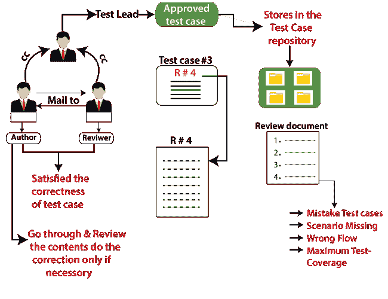
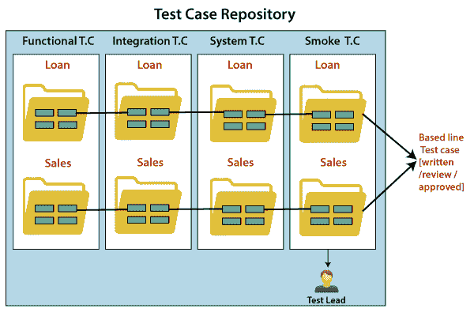
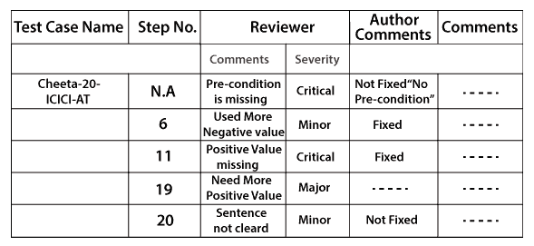
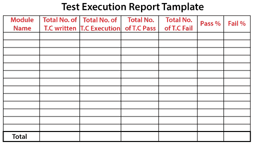
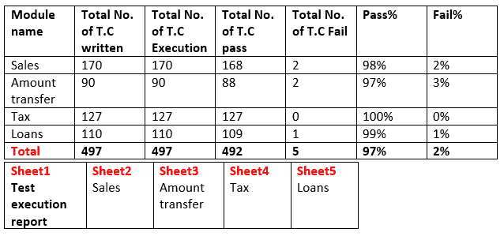
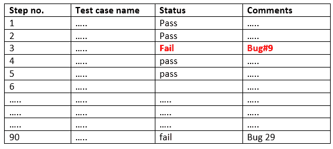

# 测试用例审查过程

> 原文：<https://www.javatpoint.com/test-case-review-process>

当测试工程师编写测试用例时，他/她可能会跳过一些场景，输入和编写错误的导航步骤，这可能会影响整个测试执行过程。

为了避免这种情况，我们将在开始测试执行之前进行一轮**审核和批准流程**。

如果不走评审流程，我们**漏掉了一些场景，准确性就不在了，测试工程师也不会认真。**

只有在完成编写测试用例之后，所有的用例才需要被发送到评审过程。所以，对方不会被打扰。

一旦作者完成了测试用例的编写，它需要被发送给另一个被称为**评审者**的测试工程师进行评审。

评审人员打开具有相应要求的[测试用例](https://www.javatpoint.com/test-case)，检查测试用例的**正确性、适当的流程和最大测试覆盖率**。

在这个评审过程中，如果评审人员发现任何错误，他/她会将其写在一个单独的文档中，该文档被称为**评审文档**，并将其发送回作者。

作者浏览了所有的评论，如果有必要的话，开始做修改，然后再次发送回去进行评论。

这一修正过程将持续到两位作者和审稿人都满意为止。

一旦审核成功，审核者将其发送回**测试主管**进行最终审批流程。

在这个审批过程中，**团队领导**始终保持在循环中，这样作者和审稿人在工作中才会认真。

当测试用例被编写、审查和批准时，它将被存储在一个集中的位置，称为**测试用例库**。

#### 注意:

**测试用例库**

*   测试用例存储库是一个集中的位置，所有的基线测试用例(编写的、评审的和批准的)都存储在这里。
*   当客户给出需求时，开发人员开始开发模块，测试工程师将根据需求编写测试用例。
*   测试用例存储库用于存储批准的测试用例。
*   任何测试工程师想要测试应用，那么他/她只需要从测试用例库中访问测试用例。
*   如果我们不需要任何测试用例，我们可以从测试用例库中删除它们。
*   对于每个版本，我们维护一个不同的测试用例库。
*   一旦测试用例被基线化或者存储在测试用例库中，没有测试负责人的许可，它们就不能被编辑或者改变。
*   如果发生任何影响软件的崩溃，测试团队总是有测试用例库的完整备份。

### 审查过程

评审时，评审人员在[测试用例](https://www.javatpoint.com/test-case)中检查以下方面:

**模板**

审查人员检查模板是否符合产品要求。

**表头**

在标题中，我们检查以下方面:

*   是否捕获了所有属性。
*   所有属性是否相关。
*   所有属性都已填充或未填充。

**车身**

在测试用例的主体中，我们将检查以下方面:

*   应该准备好测试用例，以便执行过程花费最少的时间。
*   是否涵盖了所有可能的场景。
*   寻找包括最大测试覆盖率在内的流程
*   测试用例设计技术是否被应用。
*   测试用例应该简单易懂
*   是否写了正确的导航。

一旦测试用例被评审，评审意见将被发送到测试用例评审模板。

审阅者将使用上述模板并发送评论。如果作者修复了测试用例，他/她会将其报告为已修复。

## 文本执行报告

它是最终文件，由测试负责人在整个测试过程完成时准备。

测试执行报告定义了应用的稳定性，并包含了诸如编写、执行、通过、失败的案例数量及其百分比等信息。

测试执行报告是一个最终的总结报告，应用的质量是基于该报告定义的，它也有助于决定应用是否可以移交给客户。

每个模块都有各自模块的独立电子表格。

让我们看一个测试执行报告的例子，其中我们有不同的模块，如**销售、金额转账、税务、贷款**。

测试负责人制作了这份报告，测试工程师发送他/她已经测试并执行的各个特性。

测试负责人将此报告发送给以下人员:

*   **开发团队**
*   **管理**
*   **测试经理**
*   **客户**

开发团队需要失败测试用例的列表。

正如我们在下表中看到的，我们有一个测试用例名称、相关状态和注释的列表。

下表显示了传输测试用例数据的数量。

**金额转账**

* * *