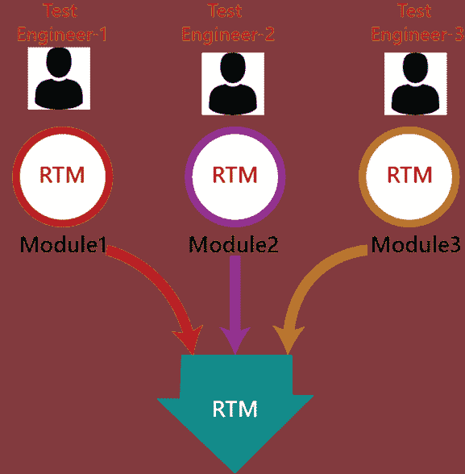
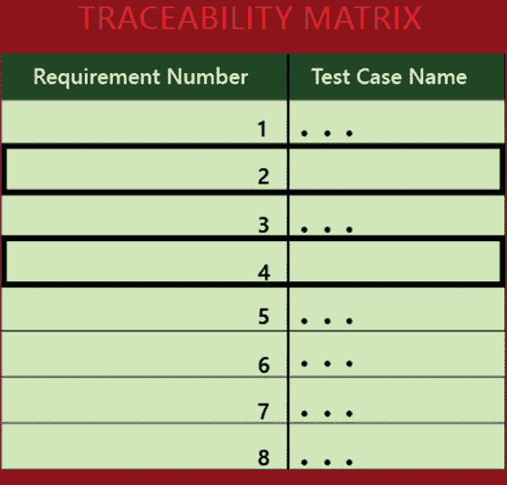
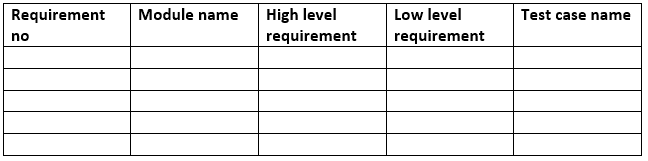
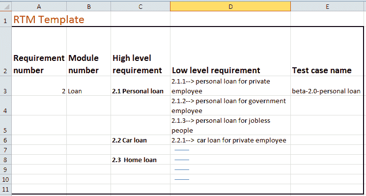
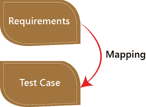
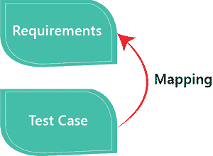

# 溯源矩阵

> 原文：<https://www.javatpoint.com/traceability-matrix>

可追溯性矩阵是一个表格类型的文档，用于软件应用程序的开发，以跟踪需求。它可以用于向前(从需求到设计或编码)和向后(从编码到需求)跟踪。也称为**需求追溯矩阵(RTM)或交叉引用矩阵(CRM)。**

它是在测试执行过程之前准备的，以确保每个需求都以测试用例的形式被覆盖，这样我们就不会错过任何测试。在 RTM 文档中，我们映射了所有的需求和相应的测试用例，以确保我们已经为每个条件编写了所有的测试用例。

**测试工程师**将为各自分配的模块准备 RTM，然后发送给测试负责人。测试负责人将去仓库检查测试用例是否在那里，最后测试负责人整合并准备一个必要的 RTM 文档。

该文档旨在确保每个需求都有一个测试用例，并且测试用例是基于客户给出的业务需求编写的。如果缺少任何需求，它将在测试用例的帮助下执行，这意味着测试用例不是为特定的需求编写的，并且特定的需求没有被测试，因为它可能有一些 bug。编写可追溯性是为了确保覆盖整个需求。

我们可以在下图中观察到，没有提到需求编号 2 和 4 的测试用例名称，这就是我们突出显示它们的原因，这样我们就可以很容易地理解我们必须为它们编写测试用例。

一般来说，这就像一个工作表文档，它包含一个表，但是也有许多用户定义的可追溯性矩阵模板。可追溯性矩阵中的每个需求都与其各自的测试用例相关联，这样测试就可以根据特定的需求按顺序进行。

**注:**

我们在批准后和执行前进行实时测试，这样我们就不会错过任何需求的测试用例。

我们在写测试的时候不写 RTM，因为它可能是不完整的，写完测试用例之后，我们不去这里，因为测试用例可能会被拒绝。

RTM 文档确保每个需求中至少有一个测试用例，然而它并没有谈到为特定需求编写的所有可能的测试用例。

## RTM 模板

下面是需求可追溯矩阵的样本模板:

### RTM 模板示例

让我们来看一个 RTM 模板的例子，以便更好地理解:

## 追溯矩阵的目标

*   它有助于跟踪在软件开发生命周期的不同阶段开发的文档。
*   它确保软件完全满足客户的要求。
*   它有助于发现任何错误的根本原因。

## 溯源测试矩阵的类型

可追溯性矩阵可分为以下三种不同类型:

*   向前追溯
*   向后或反向追溯
*   双向追溯

### 向前追溯

前向可追溯性测试矩阵用于确保每个业务的需求或要求在应用程序中得到正确执行，并经过严格测试。这样做的主要目的是验证产品开发是否朝着正确的方向发展。在这种情况下，需求被映射到测试用例的前向。

### 向后或反向追溯

反向或向后追溯用于检查我们没有通过增强设计元素、代码、测试业务需求中没有提到的其他东西来增加产品的空间。这样做的主要目的是使现有的项目保持在正确的方向上。在这种情况下，需求被映射到测试用例的后向。

### 双向追溯

它是向前和向后追溯矩阵的组合，用于确保所有的业务需求都在测试用例中执行。它还评估由于应用程序中的错误而发生的需求修改。

## RTM 的优势

以下是需求可追溯性矩阵的好处:

*   在 RTM 文档的帮助下，我们可以根据需求显示完整的测试执行和 bug 状态。
*   它用于显示文档中缺失的需求或冲突。
*   在这种情况下，我们可以确保完整的测试覆盖，这意味着所有的模块都经过测试。
*   它还将考虑测试团队在返工或重新考虑测试用例方面所做的努力。

* * *