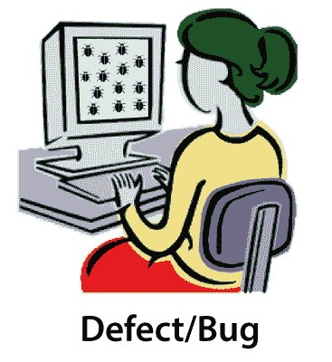
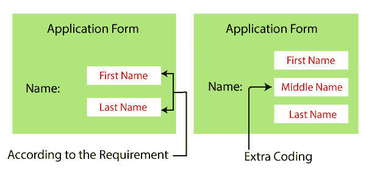

# 软件测试中的错误

> 原文：<https://www.javatpoint.com/bug-in-software-testing>

在本章中，我们将学习软件测试中的缺陷/bug 及其发生的原因、缺陷的基本术语以及 bug 跟踪工具。

## 软件测试中的 bug 是什么？

Bug 是缺陷的非正式名称，这意味着软件或应用没有按照要求工作。

在[软件测试](https://www.javatpoint.com/software-testing-tutorial)中，软件错误也可能是问题、错误、故障或失败。当开发人员在开发产品时犯了任何错误时，就会出现这个 bug。

在测试应用或执行测试用例时，测试工程师可能无法按照要求得到预期的结果。而且这个 bug 在不同的公司有不同的名字，比如错误、问题、问题、过失、错误等等。

## 缺陷的基本术语

让我们看看缺陷的不同术语:

*   **缺陷**
*   **Bug**
*   **错误**
*   **发行**
*   **失误**
*   **故障率**

| 条款 | 描述 | 由...抚养 |
| **缺陷** | 当应用不按要求运行时。 | 测试工程师 |
| **Bug** | 缺陷的非正式名称 | 测试工程师 |
| **错误** | 代码中的问题会导致错误。 | 开发人员，自动化测试工程师 |
| **发行** | 当应用不满足业务需求时。 | 顾客 |
| **错误** | 文件中的问题被称为错误。 | - |
| **故障** | 许多缺陷导致软件的失败。 | - |

## 为什么会出现缺陷/bug？

在软件测试中，错误可能由于以下原因而发生:

*   错误编码
*   缺少编码
*   额外编码

### 错误编码

错误的编码意味着不正确的实现。

**例如:**假设我们在 Gmail 应用中点击**“收件箱”**链接，它导航到**“草稿”**页面，这是因为开发人员做了错误的编码，这就是为什么它是一个 bug。

### 缺少编码

这里，缺少编码意味着开发人员可能没有只为该特定特性开发代码。

**例如:**如果我们拿上面的例子打开收件箱链接，我们看到它不仅仅在那里，这意味着该功能不仅仅是开发出来的。

### 额外编码

在这里，额外的编码意味着开发人员开发额外的特性，而这些特性并不是根据客户的需求而需要的。

**例如:**

假设我们有一个申请表，其中**姓名字段**、**名字**和**姓氏**文本框需要根据客户的要求进行开发。

但是，开发人员也开发了**“中间名”**文本框，根据客户的要求，这是不需要的，如下图所示:

如果我们开发一个需求中不需要的额外特性，就会导致不必要的额外工作。另外，增加额外的功能也会影响其他元素。

## 错误跟踪工具

我们在软件测试中有各种类型的 bug 跟踪工具，可以帮助我们跟踪与软件或应用相关的 bug。

一些最常用的错误跟踪工具如下:

*   支尔格
*   **巴格齐拉**
*   排雷
*   **螳螂**
*   **积压**

### JIRA

JIRA 是最重要的 bug 跟踪工具之一。JIRA 是一个开源工具，用于[手动测试](https://www.javatpoint.com/manual-testing)中的 bug 跟踪、项目管理和问题跟踪。

JIRA 包括不同的功能，如报告、记录和工作流程。在 JIRA，我们可以跟踪与软件相关的、由测试工程师生成的各种 bug 和问题。

要获得有关 JIRA 工具的完整详细信息，请参考以下链接:

[https://www . javatppoint . com/jira 教程](https://www.javatpoint.com/jira-tutorial)

### 布 JIRA

Bugzilla 是另一个重要的 bug 跟踪工具，它被许多组织广泛用于跟踪 bug。

[Bugzilla](https://www.javatpoint.com/bugzilla) 是一个开源工具，用来帮助客户，以及客户端维护 bug 的轨迹。

它还被用作测试管理工具，因为在这种情况下，我们可以轻松地链接其他测试用例管理工具，如资产管理、质量中心等。

Bugzilla 支持各种操作系统，如 Windows、Linux 和 Mac。

Bugzilla 有一些功能可以帮助我们轻松报告错误:

*   bug 可以以多种格式列出
*   由用户偏好控制的电子邮件通知。
*   高级搜索功能
*   出色的安全性
*   时间跟踪

### 雷米恩

这是一个开源工具，用于跟踪问题和基于网络的项目管理工具。Redmine 工具是用 **Ruby** 编程语言编写的，也兼容 MySQL、微软 SQL、SQLite 等多个数据库。

使用 Redmine 工具时，用户还可以管理各种项目和相关的子项目。

Redmine 工具的一些常见特征如下:

*   灵活的基于角色的访问控制
*   时间跟踪功能
*   灵活的问题跟踪系统
*   订阅源和电子邮件通知
*   支持多种语言(阿尔巴尼亚语、阿拉伯语、荷兰语、英语、丹麦语等)

### 曼蒂斯特

尾数代表**螳螂虫子追踪器**。这是一个基于网络的 bug 跟踪系统，也是一个开源工具。

尾数用于跟踪软件缺陷。它是用 [PHP](https://www.javatpoint.com/php-tutorial) 编程语言执行的。

尾数的一些常见特征如下:

*   全文搜索
*   对问题变更的审计跟踪
*   版本控制系统集成
*   文本字段和注释的修订控制
*   通知
*   外挂程式
*   问题之间关系的图示

### 积压

积压被广泛用于管理信息技术项目和跟踪错误。它主要是为开发团队构建的，用于报告 bug 以及问题、评论的完整细节。状态的更新和改变。它是一个项目管理软件。

积压工具的特性如下:

*   甘特图和燃尽图
*   它支持 Git 和 SVN 存储库
*   IP 访问控制
*   支持原生 iOS 和安卓应用

* * *