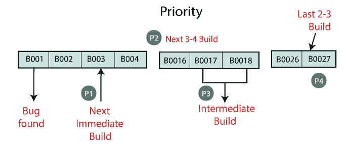
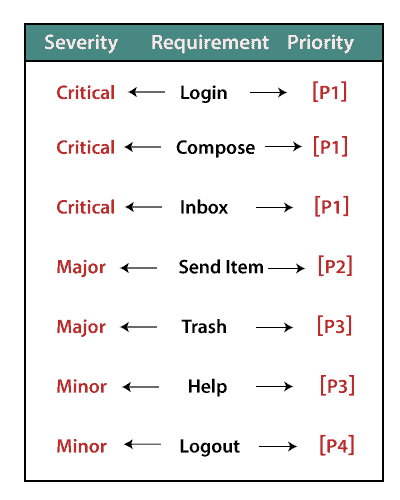

# 测试的严重性和优先级

> 原文：<https://www.javatpoint.com/severity-and-priority-in-testing>

在本节中，我们将了解软件测试中错误的严重性和优先级

## 严重

bug 对应用的影响被称为严重性。
它可以是一个**拦截器，对 bug 来说可以是关键的、主要的和次要的**。

**拦截器:**如果一个 bug 的严重程度是一个拦截器，这意味着我们不能进入下一个模块，并且不必要的测试工程师坐在理想的位置。

**拦截器** bug 有两种类型，分别如下:

**一个主要特征不起作用:**登录 HDFC，金额转账不起作用

**主要流程不工作:**登录注册本身在 HDFC 应用中不工作。

**Critical:** 如果是 Critical，说明主要功能不工作，测试工程师无法继续测试。

**专业:**如果是专业，表示配套的组件和模块工作不正常，但测试工程师可以继续测试。

**次要:**如果一个 bug 的严重性是重大的，这意味着所有的 U.I 问题都没有正常工作，但是测试可以不间断地进行。

## 优先

优先级对于修复 bug、先修复哪个 bug 或者多长时间修复一次 bug 都很重要。

可以是**急、高、中、低**。

**高:**对客户应用有重大影响，必须先修复。

**中:**在这种情况下，问题应该在开发中的当前版本发布之前解决。

**Low:** 有时间的话流量应该是固定的，但是可以推迟到下一次发布。

#### 注意:测试工程师决定严重性和优先级，开发人员也可以用适当的理由和对错误报告的评论来改变严重性。
开发人员不能更改优先级，因为如果开发人员更改了优先级，他/她可能会先修复容易的 bug。

## 严重性和优先级示例

**例 1**

假设我们必须根据客户端的要求发送优先级，这意味着需要先修复哪个 bug。

*   当 bug 刚刚被发现时，它将在下一个立即构建中被修复，并赋予优先级为 P1 或紧急。
*   如果 bug 的优先级是 P2 或更高，它将在接下来的 3-4 个版本中被修复。
*   当 bug 的优先级是 P3/中等时，它将在应用的中间版本中被修复。
*   最后，如果优先级为 P4/低，它将在软件的最后 2-3 个版本中固定，如下图所示:

**例 2**

如果我们以登录模块为例，那么严重性和优先级可能取决于应用，如下图所示:

* * *