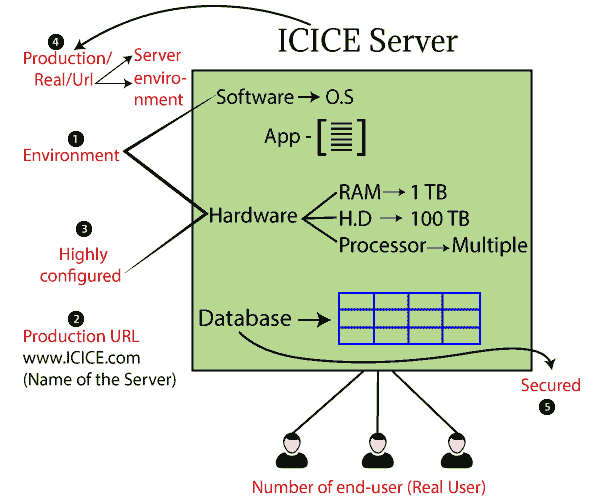
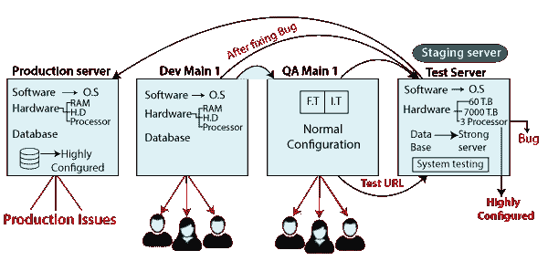
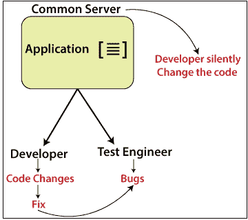
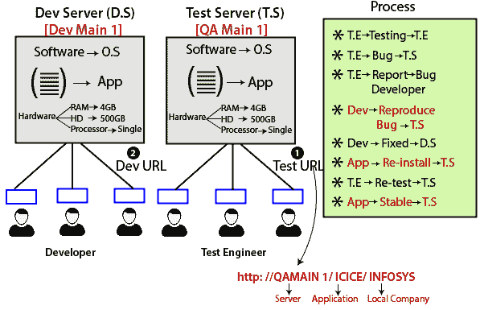
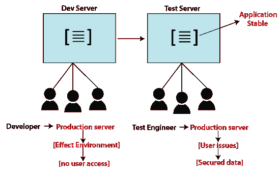

# 测试环境是什么？

> 原文：<https://www.javatpoint.com/test-environment>

测试环境是硬件和软件的集合，帮助我们执行测试用例。

一旦我们从客户那里得到需求，开发人员就开始开发代码。

当编码阶段完成时，应用应该安装在测试服务器中。该应用可以在 URL 的帮助下访问，URL 可以是这样的:

**HTTP://计算机名称/项目/公司名称**

假设我们有 ICICE 服务器，它已经配置了软件、硬件、数据库和应用。

*   测试环境有软件配置(操作系统)、硬件配置(内存、硬盘和处理器)和测试控制台，帮助我们执行测试用例。
*   环境设置是测试过程的一个重要部分，因为如果设置不正确，测试团队就无法启动测试过程，应用可能会崩溃。
*   而生产 [URL](https://www.javatpoint.com/url-full-form) 可以是**服务器**的名称，比如[ICICE.com](http://www.ICICE.com)和**环境**。
*   数据库是安全的；这就是为什么我们可以使用它来创建、修改和删除数据。
*   该服务器可由 n 个最终用户(真实用户)使用。

## 软件服务器

这里，我们有四种类型的服务器，如下所示:

*   **生产服务器**
*   **开发服务器**
*   **QA 主服务器**
*   **中转服务器**

### 生产服务器

该服务器由软件、硬件和应用开发环境组成，被称为**生产服务器**。它是用户访问任何网络应用或网站的核心服务器。

生产服务器配置类似于临时服务器，在转储到生产服务器之前，应该在临时服务器上调试和测试应用。

**生产服务器的特性**

*   最终用户或真实用户使用此服务器。
*   生产服务器具有安全性，因为它包含真实的用户数据。
*   高度配置的系统，因为它由 n 个用户使用。
*   生产网址访问生产服务器。
*   一旦应用被开发/测试/稳定，它就被部署到生产环境中。

### 开发服务器

通常，开发人员访问它是为了编写新的代码行以及修复错误。开发服务器提供了一个运行时环境，程序在其中开发和调试。

### 质量保证主服务器

测试工程师访问它来进行所有类型的测试，并由开发人员获取来重现错误。在这个服务器中，我们将执行单元和集成测试。

### 测试(暂存)服务器

我们使用另一台服务器来检查服务器的兼容性，因为生产服务器的配置很高，所以我们需要一台类似的服务器来执行系统测试。

检查应用兼容性[bug](https://www.javatpoint.com/bug-in-software-testing)被称为暂存服务器。

该服务器帮助我们在将应用部署到生产服务器之前识别软件性能、行为、错误和其他问题。

## 测试环境的过程

*   一旦客户给出需求，开发人员完成编码，我们就在测试服务器上开始第一轮测试，如**功能/单元、集成**测试，并具有正常的配置。
*   这里所有的服务器软件应该是一样的，但是硬件和数据库类似于**生产服务器**和**中转服务器**。
*   对于[系统测试](https://www.javatpoint.com/system-testing)，我们需要一个高度配置的服务器，类似于生产服务器(类似于软硬件和数据库)，称为**中转服务器。**
*   在中转服务器中，我们使用**测试网址**并执行**系统测试**。
*   如果我们发现任何 bug，我们会交给开发人员，他们会修复 bug，并直接存储在**分期测试服务器**中。

*   在一家公司中，我们将只使用两种环境，如下所示:
    *   开发者环境
    *   测试环境
*   在测试过程中，为了节省时间，我们将把数据库从 **QA Main 1** 移到**登台服务器**，而不是使用已经存在的 dev 数据库创建一个新的数据库。
*   然后将应用从测试服务器(暂存服务器)移动到生产服务器。

#### 注意:
生产问题:这些问题可能会在最终用户使用应用的生产现场实时发生。

### 为什么测试环境类似于生产服务器？

因为，如果我们将应用从低配置转移到生产环境，用户可能会发现一些问题。为了避免这种情况，我们在一个类似于生产环境的环境中进行了一轮端到端(系统)测试。

以下方面说明了为什么我们需要类似于生产服务器的测试环境:

**软件应该和生产**差不多

*   数据库服务器应该是相似的
*   操作系统应该是相似的
*   网络服务器应该是相似的
*   应用服务器应该是相似的

**硬件要和生产**差不多

*   硬件配置应该类似于生产服务器

**例如:**如果生产服务器是 ICICE，那么测试服务器也应该是 ICICE 服务器。

*   配置和硬件必须相似，但容量不同，即中央处理器的数量。

**数据应与生产**相似

*   我们应该创建一个数据，类似于生产。
*   在实时环境中，我们可以在数据库中输入 n 个条目，但是在测试时，我们不能手动输入 n 个条目。因此，我们编写了一个测试脚本，它可以生成数千个条目，用于测试。

**注:**

*   **我们能为开发和测试团队开发一个通用的服务器吗？**
    没有，因为没有连续的任务，如果我们有公共服务器，开发人员会默默的修改代码。
    
*   **开发人员何时重现 bug，在哪个服务器，测试服务器还是开发服务器？**
    *   在发现 bug 的地方，只能在那里复制(测试服务器，发现 bug)。
    *   如果我们在开发人员服务器上这样做，有可能其他一些开发人员可以更改代码，所以好的方法是只在测试服务器上重现 bug。
    *   应用总是从测试服务器移动到生产服务器，因为开发人员可以随时更改代码。
    *   但是，在测试服务器中，人们不能访问代码，因为我们总是将应用从测试服务器转移到生产服务器。
*   **该网址是否只允许访问需要测试的应用？**
    *   当客户需要更改或给出应用的新要求时，它会将其提供给特定的公司。
    *   获得需求后，开发团队创建一个单独的服务器，并使用开发人员 URL 来运行应用。
    *   一旦应用准备好，它将移交给测试工程师，测试工程师将使用测试网址测试应用，该网址只能在特定的公司使用。
*   **当我们使用一个网址时，我们只能从服务器或应用的前端访问应用。**
    
    *   客户想要一个应用，然后他/她去软件公司并给出需求；公司为开发人员提供了在开发服务器中开发代码的要求。
    *   完成代码后，应用被安装在测试服务器中，这样测试工程师将测试应用，直到应用稳定，然后它将被部署到生产服务器中。
*   **能不能把需求改成两台服务器？**
    *   当应用在生产服务器中时，测试工程师和开发人员不能改变任何事情，因为他们可能已经改变了开发服务器和测试服务器上的需求。
        

* * *