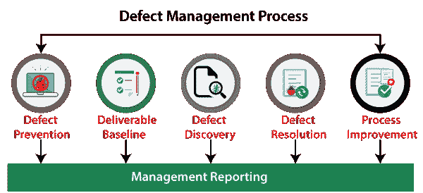
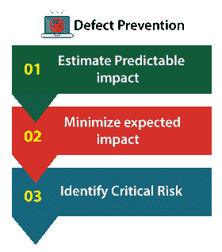
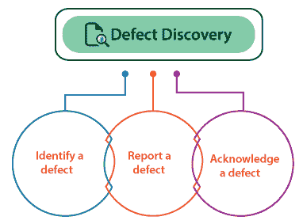
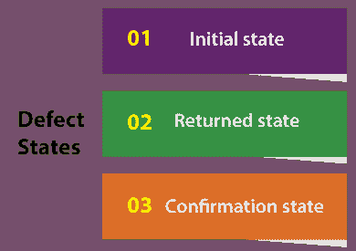

# 缺陷管理过程

> 原文：<https://www.javatpoint.com/defect-management-process>

在本节中，我们将了解**缺陷管理流程的工作。**

另外，参见软件测试中的缺陷**、缺陷管理过程的目标**、**缺陷管理过程、缺陷管理过程的优缺点。**

但是，首先我们要了解缺陷管理的过程，了解软件测试中的**缺陷。**

## 软件测试中的缺陷

*   由**程序员**宣布并在代码中的 bug 被称为
***   换句话说，我们可以说当应用没有按照要求工作时，被称为**缺陷**。*   它被指定为从应用或软件的**实际和预期结果**的不规则性。*   **缺陷**是实际结果和预期输出之间的差异。*   **测试工程师**可以识别缺陷，并在**软件开发生命周期**的开发阶段由开发人员修复。*   当测试工程师测试一段代码时，他/她会遇到预期输出与现有输出的差异，这就是所谓的**缺陷**。而缺陷的替代品在软件测试中又被称为**问题、bug 和事件**。**

 **## 什么是缺陷管理过程？

**缺陷管理流程**是软件测试的核心。一旦缺陷被识别，对于任何组织来说最重要的活动就是管理缺陷，不仅对于测试团队，而且对于参与软件开发或项目管理过程的每个人。

众所周知，**缺陷预防**是减少缺陷数量的有效途径。缺陷预防是一个非常有成本效益的过程，用于修复在软件过程的早期阶段发现的缺陷。

**缺陷管理流程**是大多数组织管理**缺陷发现、缺陷消除**，然后是**过程改进**的流程。

顾名思义**，缺陷管理流程(DMP)** 通过纯粹检测和解决或修复故障来管理缺陷。

不可能使一个软件 100%没有错误或缺陷，但是可以通过修复或解决它们来减少一些缺陷。

缺陷管理过程主要集中于停止缺陷，在早期阶段发现缺陷，以及缓和缺陷的影响。

## 缺陷管理过程的目标(DMP)

缺陷管理过程的主要目标如下所述:

*   DMP 的主要目标是在软件开发过程的早期暴露缺陷。
*   缺陷管理过程的执行将帮助我们增强软件的过程和实现。
*   缺陷管理过程减少了缺陷对软件的影响。
*   缺陷管理流程(DMP)帮助我们避免缺陷。
*   缺陷管理过程的主要目标是解决或修复缺陷。

对于不同的组织或项目，缺陷管理过程的关键目标如下:

*   缺陷管理过程允许我们为关于缺陷的状态和进度报告提供输入。
*   找出缺陷发生的主要原因以及如何处理。
*   为与缺陷发布相关的信息提供输入。

## 缺陷管理过程的不同阶段

缺陷管理过程包括以下几个阶段:

1.  **缺陷预防**
2.  **可交付基线**
3.  **缺陷发现**
4.  **缺陷解决**
5.  **工艺改进**
6.  **管理报告**

让我们一个接一个地讨论它们:

### 1.缺陷防止

**缺陷管理流程**的第一阶段是**缺陷预防**。在这个阶段，程序、方法和标准方法的执行降低了缺陷的风险。在初始阶段去除缺陷是减少其影响的最佳方法。

因为在修复或解决缺陷的初始阶段成本较低，而且影响也可以减小。

但是对于未来的阶段，识别故障然后修复它是一个昂贵的过程，并且缺陷的影响也会被放大。

缺陷预防阶段包括以下重要步骤:

*   **估计可预测的影响**
*   **将预期影响降至最低**
*   **识别关键风险**

**步骤 1:估计可预测的影响**

在这一步中，如果遇到了风险，那么我们可以计算每一个关键场合的估计财务影响。

**第二步:最小化预期影响**

当所有关键风险都被发现时，我们可以承担最大的风险，如果遇到这些风险，可能会对系统造成危险，并尝试减少或消除这些风险。

那些无法消除的风险将降低存在的可能性及其财务影响。

**第三步:识别关键风险**

在缺陷预防中，我们可以快速识别系统的关键风险，如果这些风险发生在整个测试过程中或未来阶段，将会产生更大的影响。

### 2.可交付结果基线

缺陷管理过程的第二阶段是**可交付基线。**在这里，交付内容定义了**系统、文档或产品**。

我们可以说**交付品是一个基线**，只要一个交付品达到了它的预定义里程碑。

#### 注意:预定义的里程碑描述了软件应该完成的任务。

在这个阶段，可交付成果被从一个步骤带到另一个步骤；系统现有的缺陷也前进到下一步或一个里程碑。

换句话说，我们可以说，一旦一个可交付成果被基线化，任何额外的变化都被控制。

### 3.缺陷发现

缺陷管理过程的下一阶段是**缺陷发现**。在缺陷管理过程的早期阶段，缺陷发现非常重要。而且以后，它可能会造成更大的伤害。

如果开发人员已经批准或记录该缺陷为有效缺陷，那么只有一个缺陷被认为是*。*

 *正如我们所理解的，从系统中消除每个缺陷并使系统无缺陷实际上是不可能的。但是我们可以在缺陷对项目来说变得昂贵之前及早发现它们。

缺陷发现阶段包括以下阶段:让我们详细了解它们:

*   **识别缺陷**
*   **报告缺陷**
*   **承认缺陷**

**阶段 1:识别缺陷**

在缺陷发现的第一阶段，我们需要在成为关键问题之前发现缺陷。

**阶段 2:报告缺陷**

当测试团队发现一个缺陷时，他们需要将已知的问题分配给开发团队进行进一步的评估和修复。

**阶段 3:确认缺陷**

一旦测试工程师将缺陷移交给指定的开发人员，现在开发团队就有责任承认错误，并在缺陷有效的情况下继续修复。

### 4.缺陷解决方案

一旦**缺陷发现**阶段成功完成，我们进入缺陷管理流程的下一步，**缺陷解决**。

**缺陷解决**是一个逐步修复缺陷的过程，或者我们可以说这个过程有利于指定和跟踪缺陷。

这个过程从将缺陷移交给开发团队开始。开发人员需要继续解决缺陷，并根据**优先级进行修复。**

一旦选择了缺陷，开发人员就向测试经理的测试团队发送一份解决缺陷的报告。

缺陷解决过程还包括向测试工程师发回通知，以确认解决方案得到了验证。

为了完成缺陷解决阶段，我们需要遵循以下步骤。

*   **优先考虑风险**
*   **修复缺陷**
*   **报告决议**

**第一步:优先考虑风险**

在缺陷解决的第一步，开发团队评估缺陷

并安排故障的修复。如果一个缺陷对系统的影响更大，那么开发人员需要优先修复这些缺陷。

**第二步:修复缺陷**

在第二步中，开发人员将按照优先级修复缺陷，这意味着优先级较高的缺陷将首先得到解决。然后开发人员将修复优先级较低的缺陷。

**第三步:上报决议**

在缺陷解决的最后一步，开发人员需要发送修复的缺陷报告。因为开发团队有责任确保测试团队清楚地知道缺陷何时会被修复，以及故障是如何被修复的。

这一步将有利于测试团队理解缺陷的根源。

### 5.过程改进

在上述阶段(缺陷解决)，缺陷已经被安排和修复。

现在，在**过程改进**阶段，我们将研究优先级较低的缺陷，因为这些缺陷也是必不可少的，并且会影响系统。

从过程改进阶段的角度来看，所有公认的缺陷都等同于关键缺陷，需要修复。

参与这个特定阶段的人需要回忆并检查缺陷是从哪里开始的。

在此基础上，我们可以对**验证流程、基线文档、审查流程**进行修改，以便在流程早期发现缺陷，并降低流程成本。

这些微小的缺陷让我们了解如何改进流程，避免任何可能影响系统或产品未来故障的缺陷的存在。

### 6.管理报告

**管理报告**是**缺陷管理流程**的最后阶段。这是缺陷管理过程中一个重要且必不可少的部分。管理报告需要确保生成的报告有目标，并增加缺陷管理过程。

简而言之，我们可以说缺陷信息的评估和报告支持组织和风险管理、过程改进和项目管理。

项目团队收集的关于特定缺陷的信息是管理报告的基础。因此，每个组织都需要考虑在整个缺陷管理过程中收集的信息，以及各个缺陷的分组。

## 缺陷工作流和状态

借助于在**bug/缺陷生命周期**中跟踪缺陷并包含缺陷报告的工具，实现**软件测试**的各种组织。

通常，缺陷的一个所有者在**缺陷生命周期**的每个状态下报告，负责完成将缺陷报告移动到后续状态的任务。

有时，如果我们可能面临以下情况，缺陷报告在缺陷生命周期的最后阶段可能没有所有者:

*   如果缺陷无效，则缺陷报告为**取消**。
*   如果缺陷不能作为项目的一部分得到修复，则缺陷报告被视为**延期**。
*   如果无法再检测到故障，则缺陷报告被视为不可重复**。**
***   如果缺陷已经修复并经过测试，则缺陷报告被视为**关闭**。**

 **### 缺陷状态

如果在整个测试过程中发现了缺陷，测试团队必须在以下三种状态下进行管理:

*   **初始状态**
*   **返回状态**
*   **确认状态**

### 1.初态

*   它是缺陷的第一种状态，也称为开放状态。
*   一个或几个测试工程师负责收集所有需要的数据来修复这种状态下的缺陷。

### 2.返回状态

*   第二种缺陷状态是**返回状态**。在这种情况下，接收测试报告的人拒绝并要求报告创建者提供进一步的信息。
*   在返回状态下，测试工程师可以提供更多信息或接受拒绝报告。
*   如果各种报告被拒绝，测试经理应该注意初始信息收集过程本身的错误。
*   返回的状态也称为**澄清状态或拒绝状态**。

### 3.确认状态

*   缺陷的最后一个状态是**确认状态**，测试工程师执行**确认测试**以确保缺陷已经修复。
*   这是通过重复在测试时发现缺陷的步骤来实现的。
*   如果缺陷得到解决，则报告关闭。
*   如果缺陷没有解决，则该报告被认为是**重新打开**并报告给先前保存缺陷报告的所有者进行修复。
*   确认状态也称为**已验证或已解决状态**。

## 缺陷管理过程的优势

以下是缺陷管理过程最显著的好处:

### 确认解决方案

*   缺陷管理过程也将帮助我们确保被跟踪的缺陷的解决。

### 自动化工具的可访问性

*   缺陷管理过程中最重要的程序之一是**缺陷或缺陷跟踪过程**。
*   对于缺陷跟踪，我们在市场上有各种各样的自动化工具，可以帮助我们在早期跟踪缺陷。
*   如今，各种不同的工具可以用来跟踪不同类型的缺陷。**例如**
    *   **软件工具:**这些类型的工具用于识别或跟踪非技术问题。
    *   **面向用户的工具**:这些类型的工具会帮助我们发现与生产相关的缺陷。

### 提供有价值的指标

*   缺陷管理过程也为我们提供了有价值的缺陷度量和自动化工具。
*   这些有价值的缺陷指标帮助我们进行报告和持续改进。

### 缺陷管理过程的缺点

缺陷管理过程的缺点如下:

*   如果缺陷管理流程执行不当，那么我们可能会失去客户、收入损失和品牌声誉受损。
*   如果缺陷管理过程处理不当，那么在产品价格上涨的过程中，会有巨大的成本放大。
*   如果在早期阶段没有适当地完成缺陷，那么之后，缺陷可能会造成更大的损害，并且修复缺陷的成本也会增加。

## 概观

在本文中，我们已经看到了软件测试中的**缺陷、缺陷管理过程、好处和缺点。**

在**软件测试**中，缺陷管理过程很重要，因为我们知道任何软件编写的代码，缺陷都需要被测试。

缺陷管理的过程包括发现软件中的缺陷并修复它们。完整的缺陷管理流程将帮助我们在早期发现缺陷，并确保交付高质量的产品。

缺陷管理过程的执行确保了在将应用转移到生产环境时，应用中不会再有缺陷。这样做的结果会节省很多钱。

在敏捷方法中，缺陷管理过程特别重要，因为开发冲刺阶段还必须包含测试工程师的参与、参与和行动。

在任何组织中，高级管理层也应该从公司改进的角度理解和支持缺陷管理过程。

* * ******