# 什么是回归测试？

> 原文：<https://www.javatpoint.com/regression-testing>

回归测试是一种黑盒测试技术。它用于验证软件中的代码更改不会影响产品的现有功能。回归测试是确保产品在新功能、 [bug](https://www.javatpoint.com/bug-in-software-testing) 修复或现有功能的任何变化下都能正常工作。

回归测试是[软件测试](https://www.javatpoint.com/software-testing-tutorial)的一种。测试用例被重新执行，以检查应用以前的功能是否正常工作，新的更改没有产生任何错误。

当原始功能发生重大变化时，可以在新的构建上执行回归测试。它确保代码即使在发生变化时也能工作。回归意味着重新测试应用中没有改变的部分。

回归测试也被称为验证方法。测试用例通常是自动化的。[测试用例](https://www.javatpoint.com/test-case)需要多次执行，手动反复运行同一个测试用例，耗时且繁琐。

### 回归测试示例

在这里，我们将通过一个案例来有效地定义回归测试:

考虑产品 Y，其中一个功能是触发确认、接受和发送电子邮件。还需要对其进行测试，以确保代码中的更改不会影响到他们。回归测试不依赖于任何编程语言，如 [Java](https://www.javatpoint.com/java-tutorial) 、 [C++](https://www.javatpoint.com/cpp-tutorial) 、 [C#](https://www.javatpoint.com/c-sharp-tutorial) 等。此方法用于测试产品的修改或任何更新。它确保产品中的任何变化都不会影响产品的现有模块。验证已修复的错误和新添加的功能在软件的先前工作版本中没有造成任何问题。

## 我们什么时候可以执行回归测试？

每当产品代码被修改时，我们都会进行回归测试。

我们可以在以下场景中执行回归测试，这些场景是:

**1。当新功能添加到应用中时。**

**示例:**

一个网站有一个登录功能，允许用户只使用电子邮件登录。现在提供了一个使用脸书登录的新功能。

**2。当有变更要求时。**

**示例:**

记住以前适用的登录页面中删除的密码。

**3。缺陷修复时**

**示例:**

假设登录按钮在登录页面中不起作用，测试人员报告了一个错误，指出登录按钮已损坏。一旦开发人员修复了错误，测试人员就对其进行测试，以确保登录按钮按照预期的结果工作。同时，测试人员测试与登录按钮相关的其他功能。

**4。当出现性能问题时修复**

**示例:**

加载一个主页需要 5 秒钟，将加载时间减少到 2 秒钟。

**5。当环境发生变化时**

**示例:**

当我们将数据库从 MySql 更新为 Oracle 时。

## 如何执行回归测试？

当软件维护包括增强、错误纠正、优化和删除现有特性时，就需要回归测试。这些修改可能会影响系统功能。在这种情况下，回归测试变得很有必要。

可以使用以下技术执行回归测试:

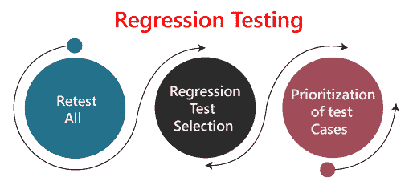

**1。全部重新测试:**

重新测试是进行回归测试的方法之一。在这种方法中，所有的测试用例都应该被重新执行。在这里，我们可以将重新测试定义为当测试失败时，我们确定失败的原因是软件故障。故障被报告，我们可以期待一个新版本的软件，其中的缺陷被修复。在这种情况下，我们需要再次执行测试，以确认故障已经修复。这就是所谓的重新测试。有些人会称之为确认测试。

重新测试非常昂贵，因为它需要大量的时间和资源。

**2。回归测试选择:**

*   在这种技术中，将执行一个选定的测试用例集，而不是整个测试用例集。
*   选定的测试用例适合分为两种情况
    1.  可重用的测试用例。
    2.  过时的测试用例。
*   可重用的测试用例可以在后续的回归周期中使用。
*   过时的测试用例不能在后续的回归周期中使用。

**3。测试用例的优先顺序:**

根据业务影响、关键的和经常使用的功能，确定测试用例的优先级。测试用例的选择将减少回归测试套件。

## 回归测试工具有哪些？

回归测试是质量保证过程的重要部分；在执行回归时，我们可能会面临以下挑战:

*   **耗时**
    回归测试耗费大量时间来完成。回归测试再次涉及现有的测试，所以测试人员不会兴奋地重新运行测试。
*   **复杂**
    当需要更新任何产品时，回归测试也很复杂；测试列表也在增加。
*   **沟通业务规则**
    回归测试确保现有的产品特性仍然处于工作状态。与非技术领导者沟通回归测试可能是一项困难的任务。这位高管希望看到产品向前发展，并在回归测试中投入大量时间，以确保现有功能能够正常工作。
*   **识别影响区域**
*   **测试用例通过发布增加发布**
*   **资源少**
*   **无精度**
*   **重复任务**
*   **单调的工作**

## 回归测试过程

回归测试过程可以在**版本**和**版本**之间执行。

### 跨构建的回归测试

每当 bug 修复后，我们就重新测试 Bug，如果有任何依赖模块，我们就进行回归测试。

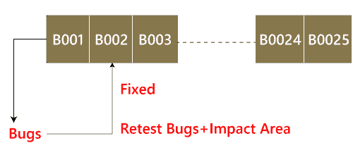

**例如**，如果我们有不同的构建，如**构建 1、构建 2 和构建 3** ，它们有不同的场景，我们如何执行回归测试。

**Build1**

*   首先，客户将提供业务需求。
*   然后开发团队开始开发特性。
*   之后，测试团队将开始编写测试用例；例如，他们为产品的版本#1 编写了 900 个测试用例。
*   然后，他们将开始实现测试用例。
*   一旦产品发布，客户就要进行一轮验收测试。
*   最终，产品被转移到生产服务器。

**Build2**

*   现在，客户要求增加 3-4 个额外(新)功能，并提供新功能的要求。
*   开发团队开始开发新功能。
*   之后，测试团队将开始为新特性编写测试用例，他们将编写大约 150 个新的测试用例。因此，对于这两个版本，编写的测试用例总数都是 1050。
*   现在测试团队开始使用 150 个新的测试用例来测试新的特性。
*   一旦完成，他们将在 900 个测试用例的帮助下开始测试旧特性，以验证添加新特性是否损坏了旧特性。
*   在这里，测试旧特性被称为**回归测试**。
*   一旦所有功能(新的和旧的)都经过测试，产品就被移交给客户，然后客户将进行验收测试。
*   验收测试完成后，产品将被转移到生产服务器。

**Build3**

*   在第二个版本之后，客户希望删除像销售这样的功能之一。
*   然后他/她将删除所有属于销售模块的测试用例(大约 120 个测试用例)。
*   然后，测试另一个特性，以验证在移除销售模块测试用例之后，所有其他特性是否正常工作，并且这个过程是在回归测试下完成的。

**注:**

*   测试稳定的特性，确保它不会因为变化而损坏。这里的变化意味着**的修改、添加、bug 修复或删除**。
*   在不同的构建或版本中重新执行相同的测试用例是为了确保更改(修改、添加、错误修复或删除)不会在稳定的特性中引入错误。

### 整个版本的回归测试

每当同一项目有新版本时，回归测试过程就会开始，因为新特性可能会影响以前版本中的旧元素。

为了理解回归测试过程，我们将遵循以下步骤:

**第一步**

在**版本#1** 中没有回归测试，因为版本#1 中没有发生修改，因为版本本身是新的。

**第二步**

回归测试的概念从**发布#2** 开始，这时客户给出一些**新要求**。

**第三步**

在首先获得新的需求(修改特性)后，他们(开发人员和测试工程师)将在前往**影响分析**之前了解需求。

**第四步**

在了解了新的要求后，我们将进行一轮**影响分析**来规避重大风险，但这里出现了一个问题:谁来做影响分析？

**第五步**

影响分析是由**客户**基于他们的**业务知识**、**开发人员**基于他们的**编码知识**完成的，最重要的是由**测试工程师**完成的，因为他们拥有**产品知识**。

#### 注意:如果一个人做了，他/她可能不会覆盖所有的影响区域，所以我们包括所有的人，以便我们可以覆盖最大的影响区域，并且影响分析应该在发布的早期阶段进行。

**第六步**

一旦完成**影响区域**，那么开发商将准备**影响区域(文件)**，而**客户**也将准备**影响区域文件**，这样我们就可以实现**影响分析**的最大覆盖。

**第七步**

完成影响分析后，开发人员、客户和测试工程师将影响区域文件的**报告#** 发送给**测试负责人**。同时，测试工程师和开发人员正忙于开发新的测试用例。

**第八步**

一旦测试负责人获得了报告#，他/她将**合并**报告并存储在发布#1 的**测试用例需求仓库**中。

#### 注意:测试用例库:在这里，我们将保存所有版本的测试用例。

**第九步**

之后，测试负责人将在 RTM 的帮助下，从**测试用例库中**挑选出必要的**回归测试用例**，这些文件将被放置在**回归测试套件**中。

**注:**

*   测试负责人将把回归测试用例存储在回归测试套件中，以免进一步混淆。
*   **回归测试套件**:这里我们将保存所有影响区域测试文档。
*   **回归测试用例**:这些是旧版本文本文档的测试用例，需要重新执行，如下图所示:

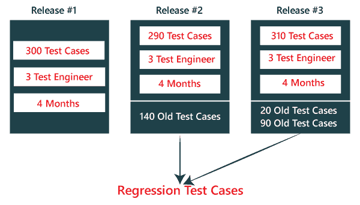

**第 10 步**

之后，当测试工程师完成新测试用例的工作后，测试负责人将**将回归测试用例**分配给测试工程师。

**第 11 步**

当所有回归测试用例和新特性**稳定并通过**后，再用测试用例检查**影响区域，直到旧特性加上新特性都耐用，然后交给客户。**

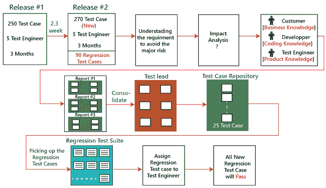

## 回归测试的类型

回归测试的不同类型如下:

*   单元回归测试
*   区域回归测试[RRT]
*   完全或完全回归测试

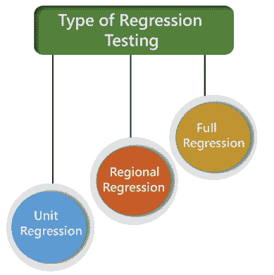

### 单元回归测试

在这种情况下，我们将只测试已更改的单元，而不是影响区域，因为它可能会影响同一模块的组件。

**示例 1**

在下面的应用中，在第一个构建中，开发人员开发了接受 **1-15 个字符**的**搜索**按钮。然后测试工程师借助**测试用例设计技术**测试搜索按钮。

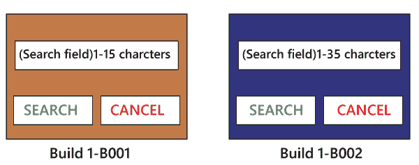

现在，客户端对需求做了一些修改，也要求**搜索按钮**可以接受 **1-35 个字符**。测试工程师将只测试搜索按钮，以验证它需要 1-35 个字符，并且不会检查第一次构建的任何进一步功能。

**示例 2**

这里我们有 **Build B001** ，识别出一个缺陷，将报告交付给开发者。开发人员将修复该错误，并发送在第二个**版本 B002** 中开发的一些新功能。之后，测试工程师只有在缺陷修复后才会进行测试。

*   测试工程师将识别出点击**提交**按钮进入空白页。
*   而它是一个缺陷，被送到开发者那里去修复。
*   当新版本附带错误修复时，测试工程师将只测试提交按钮。
*   在这里，我们不打算检查第一次构建的其他特性，而是继续测试第二次构建中发送的新特性。
*   我们确定修复**提交**按钮不会影响其他功能，所以我们只测试修复的 bug。

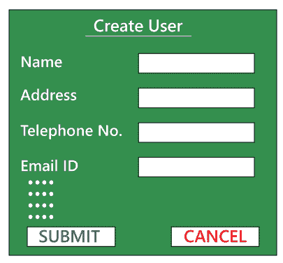

因此，我们可以说，通过测试只有改变的特征被称为**单元回归测试**。

### 区域回归测试[RRT]

在这种情况下，我们要测试的修改连同影响区域或区域，被称为**区域回归测试**。这里，我们测试影响区域，因为如果有可靠的模块，它也会影响其他模块。

**例如:**

在下图中，我们可以看到我们有四个不同的模块，例如**模块 A、模块 B、模块 C 和模块 D** ，它们是由开发人员在第一次构建时为测试提供的。现在，测试工程师将识别**模块 D** 中的错误。bug 报告被发送给开发人员，开发团队修复这些缺陷并发送第二个构建。

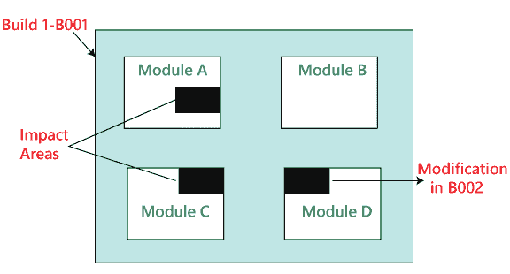

在第二次构建中，修复了之前的缺陷。现在测试工程师了解到模块 D 中的 bug 修复影响了**模块 A 和模块 C** 中的一些特性。因此，测试工程师首先测试已经修复错误的模块 D，然后检查**模块 A 和模块 C** 中的影响区域。因此，该测试被称为**区域回归测试。**

在执行区域回归测试时，我们可能会面临以下问题:

**问题:**

在第一个构建中，客户端发送一些需求修改，并希望在产品中添加新的特性。需求被发送到两个团队，即开发和测试。

获得需求后，开发团队开始进行修改，并根据需求开发新特性。

现在，测试负责人向客户发送邮件，要求他们在完成必要的修改后，所有的影响区域都将受到影响。因此，客户会有一个想法，所有的功能都需要再次测试。他/她还将向开发团队发送一封邮件，以了解应用中的哪些领域将因新功能的更改和添加而受到影响。

同样，客户向测试团队发送一封邮件，要求提供影响范围列表。因此，测试负责人将从客户、开发团队以及测试团队那里收集影响列表。

该**影响列表**被发送给所有查看该列表并检查其特征是否被修改的测试工程师，如果被修改，则他们进行**区域回归测试**。影响区域和修改区域都由各自的工程师进行测试。每个测试工程师只测试他们的特征，这些特征可能由于修改而受到影响。

上述方法的问题在于，测试负责人可能不了解影响区域的全部概念，因为开发团队和客户可能没有那么多时间回复他/她的邮件。

**解决方案**

为了解决上述问题，我们将遵循以下流程:

当一个新的构建带有最新的特性和错误修复时，测试团队将安排会议，他们将在会上讨论他们的特性是否因为上述修改而受到影响。因此，他们将进行一轮**影响分析**，并生成**影响列表**。在这个特定的列表中，测试工程师试图封闭最大可能的影响区域，这也减少了获得缺陷的机会。

当新的构建到来时，测试团队将遵循以下程序:

*   他们将进行冒烟测试来检查应用的基本功能。
*   然后他们将测试新功能。
*   之后，他们将检查更改的功能。
*   一旦他们检查完改变的特性，测试工程师将重新测试这些错误。
*   然后他们将通过执行区域回归测试来检查影响区域。

### 使用单位和区域回归测试的缺点

以下是使用单元和区域回归测试的一些缺点:

*   我们可能会错过一些影响区域。
*   我们可能会识别错误的影响区域。

#### 注意:我们可以说，我们在区域回归测试上所做的主要工作将导致我们得到更多数量的缺陷。但是，如果我们在完全回归测试中表现出同样的奉献精神，我们将会得到更少的缺陷。因此，我们可以在这里确定，测试工作中的增强不会帮助我们获得更多的缺陷。

### 完全回归测试

在产品的第二个和第三个版本中，客户要求增加 3-4 个新功能，并且一些缺陷需要从以前的版本中修复。然后测试团队将进行影响分析，并确定上述修改将引导我们测试整个产品。

因此，我们可以说测试**修改的特征**和**所有剩余的(旧的)特征**被称为**完全回归测试**。

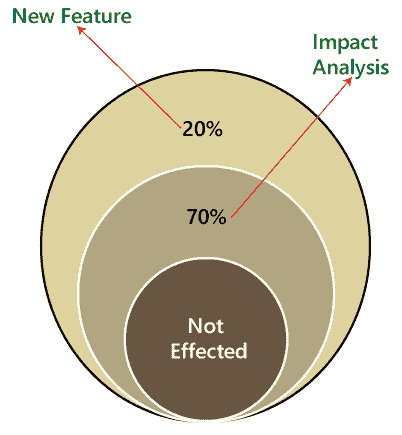

### 当我们执行完全回归测试时？

当我们具备以下条件时，我们将执行首次登记税:

*   当产品的源文件中发生修改时。**例如**，JVM 是 JAVA 应用的根文件，如果 JVM 中将要发生任何变化，那么将测试整个 JAVA 程序。
*   当我们必须进行 n 次改变时。

**注:**

区域回归测试是回归测试的理想方法，但问题是，在执行区域回归测试时，我们可能会错过许多缺陷。

我们将通过以下方法来解决这个问题:

*   当申请测试时，测试工程师将测试前 10-14 个周期，并进行 **RRT** 。
*   然后对于第 15 个周期，我们做 FRT。再次，对于接下来的 10-15 周期，我们进行**区域回归测试**，对于第 31 周期，我们进行**全回归测试**，我们将继续这样。
*   但是对于发布的最后十个周期，我们将只执行**完整的回归测试**。

因此，如果我们遵循上述方法，我们可以得到更多的缺陷。

**反复手工做回归测试的缺点:**

*   生产力会下降。
*   这是一项很难做的工作。
*   测试执行没有一致性。
*   并且测试执行时间也增加了。

因此，我们将通过自动化来解决这些问题；当我们有 n 个回归测试周期时，我们将进行**自动化回归测试过程**。

### 自动化回归测试过程

一般来说，只要有多个发布或多个回归周期，或者有重复的任务，我们就进行自动化。

自动化回归测试过程可以通过以下步骤完成:

**注 1:**

使用一些工具测试应用的过程称为自动化测试。

假设我们举一个**登录模块**的例子，那么我们如何进行回归测试。

在这里，登录可以通过两种方式完成，如下所示:

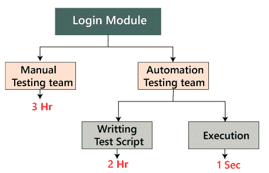

**手动:**在这种情况下，我们将只执行一次和两次回归。

**自动化:**在这种情况下，我们将多次执行自动化，因为我们必须编写测试脚本并执行。

#### 注 2:实时地，如果我们遇到了一些问题，例如:

| 问题 | 处理方式 |
| 新功能 | 人工测试工程师 |
| 回归测试特征 | 自动化测试工程师 |
| 剩余(110 个功能+版本#1) | 人工测试工程师 |

**第一步**

当新版本开始时，我们不追求自动化，因为没有回归测试和回归测试用例的概念，正如我们在上面的过程中理解的那样。

**第二步**

当新版本和增强开始时，我们有两个团队，即手动团队和自动化团队。

**第三步**

人工团队将审核需求，并确定影响区域，并将**需求测试套件**移交给自动化团队。

**第四步**

现在，手动团队开始致力于新特性，自动化团队将开始开发测试脚本，也开始自动化[测试用例](https://www.javatpoint.com/test-case)，这意味着回归测试用例将被转换成测试脚本。

**第五步**

在他们(自动化团队)开始自动化测试用例之前，他们还将分析哪些用例可以自动化，哪些不能。

**第六步**

基于分析，他们将开始自动化，即将每个回归测试用例转换成测试脚本。

**第七步**

在这个过程中，他们会借助**回归案例**，因为他们没有产品知识，也没有**工具**和**应用**。

**第八步**

一旦测试脚本准备好了，他们将开始在新应用上执行这些脚本[旧特性]。因为，测试脚本是在回归特性或旧特性的帮助下编写的。

**第九步**

一旦执行完成，我们会获得不同的状态，如**通过/失败**。

**第 10 步**

如果状态是失败的，这意味着需要手动重新确认，如果 Bug 存在，它将向相关开发人员报告。当开发人员修复该 bug 时，该 Bug 需要由手动测试工程师连同影响区域一起重新测试，并且脚本也需要由自动化测试工程师重新执行。

**第 11 步**

这个过程一直持续到所有新的特征，回归特征将被传递。

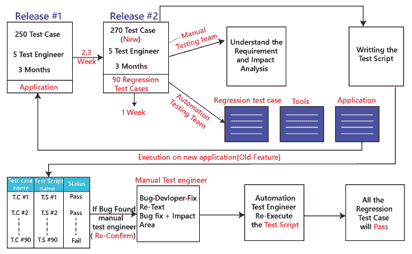

### 通过自动化测试进行回归测试的好处:

*   **精准度**之所以一直存在，是因为任务是由工具来完成的，工具永远不会感到无聊或疲惫。
*   测试脚本可以在多个版本中重复使用。
*   **批量执行**可以使用自动化，即:所有的书面测试脚本可以并行或同时执行。
*   即使回归测试用例的数量随着每个版本的发布而增加，我们也不需要增加自动化资源，因为一些回归用例已经从之前的版本自动化了。
*   这是一个**省时的过程**，因为执行总是比手工的方法快。

## 如何选择回归测试的测试用例？

是行业检查发现的。客户报告的几个缺陷是由于最后一分钟的错误修复。这些产生副作用并因此选择回归测试的测试用例是一门艺术，而不是一项容易的任务。

回归测试可以通过以下方式进行:

*   经常有缺陷的测试用例
*   用户更容易看到的功能。
*   测试用例验证产品的核心特性。
*   所有集成测试用例
*   所有复杂的测试用例
*   边界值测试用例
*   成功测试案例的示例
*   测试用例失败

## 回归测试工具

如果软件经历频繁的变更，回归测试的成本也会增加。在这些情况下，测试用例的手动执行增加了测试执行时间和成本。在这种情况下，自动化测试是最好的选择。自动化的持续时间取决于连续回归周期中保持可重用的测试用例的数量。

**以下是回归测试所使用的基本工具:**

**Selenium**

Selenium 是一种开源工具。该工具用于 web 应用的自动化测试。对于基于浏览器的回归测试，使用了 Selenium。Selenium 用于基于 web 的应用的 UI 级别回归测试。

**拉诺雷克斯工作室**

借助内置的 Selenium WebDriver，对桌面、网络和移动应用进行一次回归测试自动化。Ranorex 工作室包括完整的 IDE 和无代码自动化工具。

**快速测试专业人员(QTP)**

QTP 是一个用于回归和功能测试的自动化测试工具。这是一个数据驱动的，基于关键字的工具。它使用 VBScript 语言进行自动化。如果我们打开 QTP 工具，我们会看到三个按钮，分别是**录制、播放和停止**。这些按钮有助于记录计算机系统上执行的每一次点击和操作。它记录动作并回放。

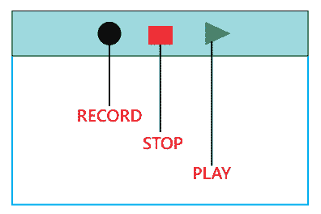

**理性功能测试器(RTF)**

Rational functional tester 是一个 Java 工具，用于自动化软件应用的测试用例。RTF 用于自动化回归测试用例，它还与 rational functional tester 集成。

有关回归和自动化测试工具的更多信息，请参考以下链接:

[https://www.javatpoint.com/automation-testing-tool](https://www.javatpoint.com/automation-testing-tool)

## 什么是回归测试和配置管理？

回归测试中的配置管理在敏捷环境中变得势在必行，在敏捷环境中，代码被不断修改。为了确保有效的回归测试，我们必须遵循以下步骤:

*   在回归测试阶段，代码中不允许有变化。
*   回归测试用例必须不受开发人员变更的影响。
*   用于回归测试的数据库必须是独立的；数据库中不允许更改。

## 重测和回归测试有什么区别？

**重新测试测试**是指再次测试功能或 bug，确保代码修复。如果没有设置，缺陷不需要重新打开。如果修复，缺陷关闭。

重新测试是一种测试类型，它的执行是为了检查在最终执行中不成功的测试用例在缺陷修复后是否成功通过。

**回归测试**是指在软件应用经历代码变更时对其进行测试，以确保新代码没有影响软件的其他部分。

回归测试是一种测试类型，用于检查代码是否没有改变应用的现有功能。

**重测和回归测试的区别如下:**

| 重新测试 | 回归测试 |
| 执行重新测试是为了确保在最终执行中失败的测试用例在缺陷修复后通过。 | 进行回归测试是为了确认代码更改是否没有影响现有的特性。 |
| 重新测试可以修复缺陷。 | 回归测试的目的是确保代码更改不会对现有功能产生不利影响。 |
| 缺陷验证是重新测试的一部分。 | 回归测试不包括缺陷验证 |
| 重新测试的优先级高于回归测试，因此它是在回归测试之前进行的。 | 基于项目类型和资源的可用性，回归测试可以与重新测试并行。 |
| 重新测试是有计划的测试。 | 回归测试是一种通用测试。 |
| 我们不能自动化重新测试的测试用例。 | 我们可以对回归测试进行自动化；手动测试可能既昂贵又耗时。 |
| 重新测试是针对失败的测试用例。 | 回归测试是针对通过的测试用例的。 |
| 重新测试确保原始故障得到纠正。 | 回归测试检查意外的副作用。 |
| 重新测试用相同的数据和相同的环境执行缺陷，用新的构建执行不同的输入。 | 回归测试是指在一个现有的项目中有一个修改或变更成为强制性的。 |
| 重新测试不能在开始测试之前进行。 | 回归测试可以从功能规范、用户指南和手册以及与纠正问题相关的缺陷报告中获得测试用例。 |

## 回归测试的优势是什么？

回归测试的优点是:

*   回归测试提高了产品的质量。
*   它确保任何错误修复或更改都不会影响产品的现有功能。
*   自动化工具可以用于回归测试。
*   它确保修复的问题不会再次发生。

## 回归测试的缺点是什么？

回归测试有几个优点，但也有缺点。

*   回归测试应该针对代码中的微小变化进行，因为即使是代码中的微小变化也会在现有的功能中产生问题。
*   如果在项目中不使用自动化进行测试，一次又一次地执行测试将是耗时且繁琐的任务。

## 结论

回归测试是重要的方面之一，因为它有助于交付高质量的产品，从而节省组织的时间和金钱。通过确保代码中的任何更改都不会影响现有的功能，它有助于提供高质量的产品。

为了自动化回归测试用例，有几个可用的自动化工具。一个工具应该具有更新 ***测试套件*** 的能力，因为回归测试套件需要频繁更新。

* * *