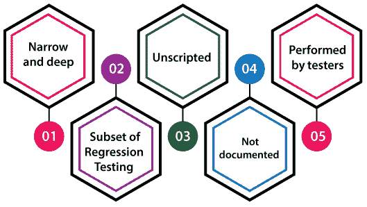
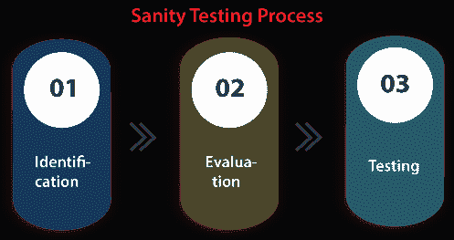

# 健全性测试

> 原文：<https://www.javatpoint.com/sanity-testing>

在这一节中，我们将了解健全性测试的工作原理，它用于检查在构建之后 bug 是否已经被修复。

我们还了解了**的过程，为什么需要进行健全性测试，健全性测试的目的，实时示例，健全性测试的各种属性，优点和缺点。**

## 什么是理智测试？

一般来说，健全性测试是在稳定的构建上执行的，它也被称为[回归测试](https://www.javatpoint.com/regression-testing)的变体。

健全性测试是在我们从开发团队接收到软件构建(带有微小的代码更改)时执行的。这是一个检查点，用于评估构建测试是否可以继续进行。

换句话说，我们可以说，执行健全性测试是为了确保所有的缺陷都得到解决，并且不会因为这些修改而出现额外的问题。

健全性测试还确保代码或函数中的修改不会影响相关的模块。因此，它只能应用于可能受到影响的连接模块。

## 健全性测试的目标

实现健全性测试的关键目标是实现以下方面:

*   执行健全性测试的主要目的是定义计划的特性是否像预期的那样工作不均衡。如果健全性测试失败，构建将被拒绝，从而在更严格的测试中节省成本和时间复杂性。
*   健全性测试的执行确保了新的修改不会改变软件当前的功能。
*   它还验证了新添加的功能和组件的准确性。

## 健全性测试的属性

为了理解**健全性测试技术**的基础，我们必须学习它们的属性和其他几个组成部分。因此，以下是健全性测试的一些重要特性:

*   **窄而深**
*   **回归测试的子集**
*   **无脚本**
*   **未记录**
*   **由测试人员执行**

**窄而深**

在软件测试中，健全性测试是一种**窄而深的**方法，其中有限的组件被深度保护。

**回归测试的子类**

它是**回归测试**的一个细分，主要侧重于应用程序中不太重要的单元。

它用于测试已执行的修改或新功能要求下的应用效率。

**无脚本**

通常，健全性测试是没有脚本的。

**未记录**

通常，健全性测试不能被记录。

**由测试工程师执行**

通常，健全性测试是由测试工程师完成的。

## 健全性测试流程

执行健全性测试的主要目的是检查组件过程中不存在的错误结果或缺陷。此外，确保新添加的功能不会影响当前功能的功能。

因此，我们需要按照以下步骤逐步实现健全性测试过程:

*   **识别**
*   **评估**
*   **测试**

### 第一步:识别

健全性测试过程的第一步是**识别**，在这里我们检测新添加的组件和特性，以及修复错误时代码中出现的修改。

### 第二步:评估

在完成识别步骤后，我们将分析新实现的组件、属性，并根据给定的要求修改它们，以检查它们的预期和适当的工作。

### 第三步:测试

一旦识别和评估步骤处理成功，我们将进入下一步，即**测试**。

在这一步中，我们检查和评估上述分析属性的所有关联参数、组件和要素，并对它们进行修改，以确保它们工作正常。

如果以上所有步骤都运行良好，那么构建可以经受更详细和更耗费精力的测试，并且发布可以通过彻底的测试。

## 谁执行健全性测试？

通常，健全性测试用例由**测试工程师执行。**

## 我们什么时候需要执行健全性测试？

没有这样硬而快速的软件测试规则来执行健全性测试过程。

这是一个测试应用程序的快速过程，因为它不包括任何测试用例的脚本。

健全性测试是一种狭窄的回归测试，强调组件的特定领域。如果我们遇到以下两个条件，我们需要执行一轮健全性测试，这些条件如下:

**案例 1**

只要指定软件的功能有所改进，我们就会进行健全性测试。

**案例 2**

每当 bug 被修复，或者添加了新特性时，我们需要执行健全性测试，以便检查应用程序是否仍然运行良好。

## 健全性测试的例子

为了更好地理解健全性测试，我们将看到下面的例子:

### 例 1

假设我们有一个 e**-商务应用**，它包含几个模块，但是在这里，我们主要集中在几个模块上，比如**登录页面、主页、新用户创建页面、用户档案页面等。**

*   当新用户试图登录应用程序时，他/她无法登录，因为**登录页面**中有一个错误。
*   由于**登录模块**中的**密码字段**接受的字母数字字符少于 4 个，根据规范，密码字段不应接受 7-8 个字符以下。
*   因此，它被认为是 bug，由测试团队向开发团队报告以修复它。
*   一旦开发团队修复了指定的错误并向测试团队报告，测试团队就测试相同的特性，以验证代码中发生的修改是否正常工作。
*   测试团队还验证了特定的修改不会影响其他相关功能。
*   在用户**档案页面**修改**密码**有一个过程。
*   作为健全性测试过程的一部分，我们必须验证**登录页面**和**个人资料页面**，以确认这两个地方的更改都运行良好。

## 健全性测试的优点和缺点

以下是健全性测试的一些重要优点和缺点。

### 健全性测试的优势

执行健全性测试的一些动态好处如下:

健全性测试很容易理解和实现。

*   它帮助我们找到任何部署或编译问题。
*   与其他类型的软件测试相比，它更便宜。
*   它有助于快速找到核心功能中的缺陷。
*   健全性测试没有强制性的文档，这就是为什么它可以在更短的时间内执行。
*   执行健全性测试将帮助我们节省不必要的测试工作和时间，因为它只关注一个或几个功能领域。
*   健全性测试有助于检测丢失的依赖对象。

### 健全性测试的缺点

以下是健全性测试的缺点:

*   对于开发人员来说，如果他们不遵循设计结构级别，理解如何修复在整个健全性测试中确认的缺陷已经成为一个非常复杂的过程。
*   所有的测试用例都没有包含在健全性测试中。
*   它只强调应用程序的声明和功能。
*   我们没有未来的参考，因为健全性测试是没有脚本的。
*   找到任何其他组件成为一个复杂的过程，因为健全性测试只对一些有限的特性执行。

## 概观

在本教程中，我们了解了健全性测试的执行、实时示例、优点和缺点。

当在程序中执行新的功能、修改请求或错误修复时，就实现了健全性测试。

这是一个**窄而深的**测试过程，只对那些修改已经影响的组件进行密集测试。

健全性测试是有益的，因为它提供了各种优势，比如，它提供了软件发布质量的快速评估。

健全性测试允许我们在软件发生微小变化时检查应用程序的小功能。

* * *