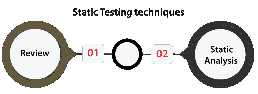
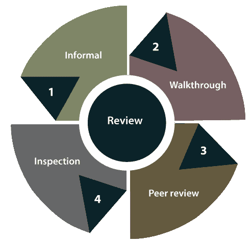
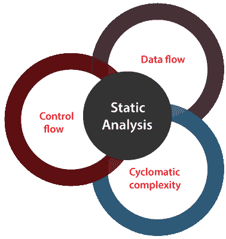

# 静态测试

> 原文：<https://www.javatpoint.com/static-testing>

在本节中，我们将了解**静态测试**，它用于在不执行代码的情况下检查应用程序。我们也了解了**静态测试，为什么使用静态测试，如何执行，静态测试的不同技术，静态测试的优势，以及各种静态测试工具。**

## 静态测试简介

静态测试是一个验证过程，用于在不实现应用程序代码的情况下测试应用程序。而且是一个**性价比很高的流程**。

为了避免错误，我们将在开发的初始阶段执行静态测试，因为它更容易识别错误的来源，并且可以轻松修复。

换句话说，我们可以说**静态测试**可以手动完成，也可以借助工具，通过在开发初期发现错误来提高应用的质量；也就是所谓的**验证过程**。

在执行静态测试时，我们可以执行以下一些重要活动:

*   **业务需求评审**
*   **设计评审**
*   **代码演练**
*   **测试文件审查**

#### 注意:静态测试是在白盒测试阶段执行的，开发人员在将代码交给测试工程师之前会检查每一行代码。

静态测试还有助于我们识别那些[动态测试](https://www.javatpoint.com/static-testing-vs-dynamic-testing)可能找不到的错误。

## 为什么我们需要执行静态测试？

我们可以执行静态测试来实现以下方面:

*   我们可以使用静态测试来提高开发效率。
*   如果我们对一个应用程序执行静态测试，我们可以在早期阶段找到检测并轻松修复它们。
*   静态测试的使用将减少测试成本、开发时间和时间。

## 我们可以在静态测试中测试哪些不同的特性？

我们可以在静态测试中测试各种测试活动，如下所示:

*   BRD[业务需求文档]
*   功能或系统要求
*   单元用例
*   原型
*   原型规范文件
*   测试数据
*   数据库字段字典电子表格
*   文档/培训指南/用户手册
*   测试用例/测试计划策略文档
*   可追溯性矩阵文件
*   性能测试脚本/自动化

## 当我们执行静态测试时？

要执行静态测试，我们需要遵循以下步骤:

**步骤 1:** 为了全面检查应用程序的设计，我们将执行**检查流程**。

**步骤 2:** 之后，我们将对每一个正在审查的文档使用一个检查表，以确保所有审查都被完全覆盖。

我们还可以在执行静态测试时实现几个活动，这些活动将在下表中讨论:

| 活动 | 说明 |
| **架构回顾** | 

*   Architecture review activities include all business-level processes, such as **network diagram, load balance, server location, protocol definition, test equipment, database accessibility, etc.**

 |
| **用例需求验证** | 

*   Used to authenticate all end-user actions and related input and output.
*   If the use cases are more comprehensive and detailed, we can make more accurate and inclusive test cases.

 |
| **功能需求验证** | 

*   Functional verification activities are used to ensure that all necessary elements are correctly identified.
*   It is also responsible for **software, interface list, network requirements, hardware and database functions.**

 |
| **字段字典验证** | 

*   In field dictionary verification, we will test each field specified in the user interface to create field-level verification test cases.
*   We can check the **error message, minimum or maximum length, list value and so on in the field.**

 |
| **原型/屏幕模型验证** | 

*   Prototype verification activities include the verification of requirements and use cases.

 |

## 为什么我们需要静态测试？

当我们在测试应用程序或软件时遇到以下情况时，我们需要静态测试:

*   **动态测试耗时**
*   **早期缺陷/缺陷识别**
*   **动态测试很贵**
*   **软件尺寸增大**

**动态测试耗时**

我们需要静态测试来测试应用程序，因为动态测试是一个耗时的过程，即使动态测试识别了错误并提供了一些关于错误的信息。

**早期缺陷/缺陷识别**

当我们开发软件时，我们不能完全依赖动态测试，因为它会在后期发现应用程序/软件的错误或缺陷，因为修复这些错误需要程序员大量的时间和精力。

**动态测试很贵**

我们需要对软件产品进行静态测试，因为动态测试比静态测试更昂贵。在动态测试中涉及测试用例是昂贵的，因为测试用例是在初始阶段创建的。

我们还需要保留测试用例的实现和验证，这需要测试工程师花费大量时间。

**软件尺寸增大**

每当我们测试软件时，它都会增加软件产品的规模，由于代码覆盖率的降低，我们无法处理这个问题。

这就是为什么我们需要静态测试来在软件开发生命周期的早期摆脱 bug 或缺陷。

## 静态测试的目标

执行静态测试的主要目标如下:

*   静态测试将减少生产中的缺陷。
*   静态测试将在尽可能早的时间识别、预测和修复错误。
*   它用于节省时间和成本。
*   它用于在 SDLC 的早期阶段识别缺陷，我们可以很容易地修复它们。

## 成功静态测试过程的一些有用要点

以下指导方针帮助我们在软件测试中成功地执行静态测试过程。

*   我们可以用例子来训练参与者。
*   如果我们删除测试执行中的主要延迟，测试成本和时间可以减少。
*   我们可以根据项目文化保留正式的流程。
*   我们只能强调重要的事情。
*   正如我们所知，一个软件演练和评审通常会合并到同行评审中；因此，我们可以明确地计划和跟踪评审活动。
*   我们可以解决客户的问题。

## 静态测试技术

静态测试技术为提高软件开发的质量和效率提供了一个很好的途径。静态测试技术可以通过以下两种方式完成:

*   **复习**
*   **静态分析**

### 回顾

在静态测试中，**评审**是一种技术或过程，用于发现应用程序中可能的错误。在评审过程中，我们可以很容易地识别和消除 SRS **【软件需求规范】等各种支持文件中的故障和缺陷。**

换句话说，我们可以说静态测试中的**评审**是所有团队成员了解项目进度的地方。

在静态测试中，**评审**可以分为**四个不同的部分**，如下:

*   **非正式评论**
*   **演练**
*   **技术/同行评审**
*   **检查**

让我们逐一详细了解它们:

*   **非正式评论**
    在**非正式评论**中，文档设计者将内容放在观众面前，每个人给出自己的看法；因此，bug 在早期就被确认了。
*   **演练**
    一般来说，**演练评审**是由技术人员或专家来验证 bug。因此，在开发或测试阶段可能不会有问题。
*   **同行评审**
    在**同行评审**中，我们可以互相检查对方的文档，发现并解决 bug，一般是一个团队完成的。
*   **检验**
    在评审中，**检验**实质上是上级对文件的验证，例如****对 SRS【软件需求规格】文件的验证。****

 **### 静态分析

另一种静态测试技术是**静态分析**，用于包含开发人员建立的代码质量评估。

我们可以使用不同的工具对相同的代码进行分析和评估。

换句话说，我们可以说，开发人员开发的代码是用一些工具来分析结构缺陷的，这可能会导致缺陷。

**静态分析**也会帮助我们识别以下错误:

*   **死码**
*   **未使用的变量**
*   **无尽循环**
*   **语法不正确**
*   **未定义值的变量**

在静态测试中，**静态分析**可以进一步分为**三个部分**，讨论如下:

**数据流**:静态分析时，数据流连接到流处理。

**控制流**:一般来说，控制流是用来指定命令或指令是如何实现的。

**圈复杂度**:是对程序复杂度的度量，大多与程序的控制流图中独立路径的数量挂钩。

## 用于静态测试的工具

在静态测试中，市场上有几种工具，但这里我们讨论的是最常用的工具，如下所示:

*   **校验和**
*   **源表**
*   **烟灰**

### 校验和样式

它是一个开发工具，用于帮助开发人员编写遵循编码标准的 Java 代码。**检查样式工具**自动执行检查 Java 代码的过程。

这是一个高度配置的工具，支持几乎任何编码标准。**谷歌 Java Style，Sun 代码约定**是那些配置文件，是 CheckStyle 支持的。

**检查样式的特征**

以下是 CheckStyle 最常见的功能:

*   它可以检查我们的源代码的各种特征。
*   CheckStyle 代码能够验证代码布局和格式问题。
*   它还可以帮助识别方法设计问题、类设计问题。

### 源仪表

是**[【C】](https://www.javatpoint.com/c-programming-language-tutorial)/[c++](https://www.javatpoint.com/cpp-tutorial)、 [C#](https://www.javatpoint.com/c-sharp-tutorial) 、 [Java](https://www.javatpoint.com/java-tutorial) 、Python** 、 **RPG 项目**等多种编程语言具体静态源代码分析的高级工具。

借助 **SourceMeter 工具的**帮助，我们可以从源代码中轻松识别正在开发的系统的易受攻击点。

所有编程语言都可以访问带有 SourceMeter 部分功能的免费版本。

在 SourceMeter 中，我们可以使用分析的输出，即分析的源代码的质量，以有指导的方式增强和发展短期和长期。

**源表**的特性

SourceMeter 工具最常用的功能如下:

*   它提供最精确的编码错误检测。
*   SourceMeter 工具将提供深度静态代码分析。
*   它在第三方集成的帮助下改进了用户界面。
*   它将提供独立于平台的命令行工具。

### 煤烟

它是一个 **Java 优化框架**，意思是它是一个分析和转换 Java 和 Android 应用的框架，在这里我们可以测试以下几个方面:

*   命名模块和模块化 jar 文件。
*   自动模块，这意味着模块是从模块路径中的 jar 重复创建的。
*   分解模块
*   烟尘解决模块

而一个 Soot 也可以产生各种输出格式的可能转换的代码，比如**安卓字节码、Java 字节码 Jasmin 和 Jimple** 。

## 静态测试的优势

静态测试的优势如下:

*   **改进的产品质量**
    静态测试将提高产品质量，因为它识别软件开发初始阶段的缺陷或 bug。
*   **提高了动态测试的效率**
    使用静态测试会提高动态测试的效率，因为执行静态测试后代码会变得更干净更好。
    如上所述，静态测试需要一些努力和时间来生成和保持高质量的测试用例。
*   **降低了软件开发生命周期成本**
    静态测试降低了软件开发生命周期成本，因为它在软件开发生命周期的早期阶段**发现了缺陷。因此，它需要更少的努力和时间来改变产品和修复它们。**
***   **即时评估&反馈**
    静态测试在开发软件产品的过程中，在每个阶段为我们提供软件的即时评估和反馈。*   **追踪 bug 的准确位置**
    当我们执行静态测试时，与动态测试相比，我们可以很容易地识别 bug 的准确位置。**

 **## 概观

在静态测试部分，我们学习了以下主题:

*   静态测试用于在软件开发周期的早期阶段识别故障。
*   我们知道静态测试不能代替动态测试，因为两种测试都识别不同的错误类型。
*   我们已经理解了静态测试的目的。
*   在静态测试中，评审是测试应用程序的有效方法，因为评审有助于识别错误并识别设计缺陷、缺失的需求和不可维护的代码等。
*   我们已经了解了几种静态测试工具，它们可以帮助我们提高软件产品的测试性能。

* * *****