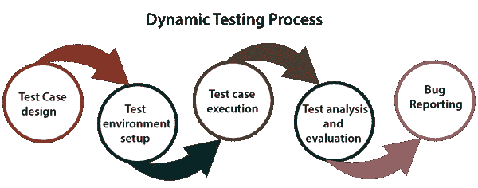
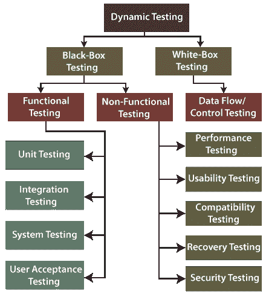

# 动态试验

> 原文：<https://www.javatpoint.com/dynamic-testing>

在本节中，我们将了解**动态测试**，这是在运行时环境中执行代码时完成的。

我们也了解了动态测试，**我们为什么使用它，如何执行它，动态测试的不同技术是什么，动态测试的各种工具**。

## 动态测试简介

动态测试是软件测试中最重要的部分之一，用于分析代码的动态行为。

动态测试是通过给出输入值并通过实现一个可以手动完成或通过自动化过程完成的特定测试用例来验证输出是否是预期的，从而与软件一起工作。

当代码在运行时环境中执行时，可以进行动态测试。这是一个**验证过程**，在此过程中进行功能测试【单元、集成、系统和用户验收测试】和非功能测试【性能、可用性、兼容性、恢复和安全性测试】。

我们知道[静态测试](https://www.javatpoint.com/static-testing)是一个**验证**的过程，而**动态测试**是一个**验证**的过程，它们共同帮助我们交付一个高性价比的高质量软件产品。

## 为什么我们需要执行动态测试？

如果我们考虑动态测试可访问的特性，我们很容易理解如何在 [STLC【软件测试生命周期】](https://www.javatpoint.com/software-testing-life-cycle)期间实现动态测试。

使用动态测试，团队可以验证软件的关键特性，但是其中一些特性可以不做任何评估。它们也会影响软件产品的功能、可靠性和性能。

因此，我们可以执行**动态测试**来完成以下各个方面:

*   我们将执行动态测试，以检查应用或软件在安装应用期间和之后是否工作正常，没有任何错误。
*   我们可以执行动态测试来验证软件的有效行为。
*   如果我们想进行动态测试，软件应该被编译和运行。
*   通常，实现动态测试是为了定义代码的动态行为。
*   在动态测试过程中，团队实现代码以在运行时环境中测试软件应用的性能。
*   它确保软件应用与客户的潜力、需求和最终用户的并发性。
*   测量几个环境压力对软件应用(如**网络、硬件**)的影响是一种可操作的技术

## 动态测试的特点

为了理解**软件测试技术**的基础，我们必须学习它们的属性和其他几个组件。因此，**动态测试**的一些重要特征如下:

*   它贯穿于软件测试的**验证阶段**。
*   动态测试是通过执行程序来完成的。
*   功能测试和非功能测试都包括在动态测试中。
*   在动态测试中，我们可以很容易地识别特定软件的错误。
*   它帮助团队验证软件应用的可靠性。
*   与静态测试不同，团队实现软件代码以在动态测试中获得预期的输出。
*   与其他测试技术相比，动态测试直接在软件应用上执行。
*   动态测试是针对不同测试活动的更正式的测试方法，例如**测试执行、覆盖考虑、报告和测试用例识别。**

## 动态测试过程

通常，当方法和测试实现性能被决定时，动态测试遵循一个设定的过程，并且团队可以移动来执行不同的测试活动。

在这个过程的帮助下，团队可以从方法和策略中发现任何不规则之处，并帮助我们展示所有的测试步骤。

在 **STLC** 中，动态测试的过程涉及不同的功能。动态测试过程中的所有功能都依赖于测试过程中早期任务的结论。

动态测试过程将在以下步骤中完成:

*   **测试用例设计**
*   **测试环境升级**
*   **测试用例执行**
*   **测试分析与评估**
*   **错误报告**

实际的动态测试过程从[软件测试](https://www.javatpoint.com/software-testing-tutorial)生命周期中的测试用例设计开始。现在，我们逐一讨论每个步骤，以获得动态测试过程的完整知识。

**步骤 1:测试用例设计**

在动态测试过程的第一步，团队将设计测试用例。在这里，我们正在创建那些依赖于项目开始前建立的测试需求和范围的测试用例。

在这一步中，我们可以**发起测试条件，获取测试用例，提取覆盖项，**和**识别那些需要测试的特征。**

**步骤 2:环境设置**

在**测试环境阶段**，我们将确保测试环境应该始终与生产环境并行，因为测试是直接在软件产品上实现的。

在这一步中，动态测试过程的主要目标是安装测试环境，这有助于我们在测试机器上取得成功。

**第三步:测试执行**

一旦我们成功安装了测试环境，我们将执行那些在动态测试过程的初级阶段准备的测试用例。

**第四步:分析&评估**

在执行测试用例之后，我们将分析和评估测试的结果。我们将把这些结果与预期结果进行比较。

如果根据执行情况，预期的结果和实际的结果不一样，我们将认为这些测试用例失败，并将 bug 记录在 Bug 存储库中。

**步骤 5:错误报告**

在分析测试案例后，我们将向相关人员报告并记录实际结果和预期结果之间的任何错误或缺陷。相关人员将确保问题得到解决，并交付高质量的产品。

## 动态测试示例

让我们举一个例子来说明动态测试是如何工作的。

所以，为此，我们将了解任何应用的登录模块，如 **www。Twitter.com。**

假设我们想用安全密码创建一个新账户，那么我们需要遵循**密码字段中的一些预定义规则。**

密码应该有 8 个字符长，大写字母和至少一个特殊字符。

如果我们正在测试这个功能，我们将采用所有的输入条件来测试它，然后验证输出。

我们也可以把非工作约束，比如输入一个 **4 个字符的密码**，验证是否有错误发生。

## 动态测试的类型

动态测试分为两种不同的测试方式，分别如下:

*   **白盒测试**
*   **黑盒测试**

这两种测试技术都将帮助我们高效地执行动态测试过程，因为它们在验证软件的性能和质量方面起着重要的作用。

让我们一个接一个地详细了解它们，并查看下图:

### 白盒测试

**白盒**这个词用来描述系统的核心视角。开发人员将执行[白盒测试](https://www.javatpoint.com/white-box-testing)，在那里他们将测试程序的每一行代码。

当开发人员执行白盒测试，然后将软件应用发送给测试团队时，测试团队将执行黑盒测试，验证应用以及需求。白盒测试进一步分为**数据流/控制测试。**

### 数据流测试

**[数据流测试](https://www.javatpoint.com/data-flow-testing-in-white-box-testing)** 用于根据程序中变量的描述和使用的设置来识别程序的测试路径。它与数据流图无关。

### 黑盒测试

**[黑盒测试](https://www.javatpoint.com/black-box-testing)** 是一种测试技术，其中测试工程师选择一个模块并给出一个输入值，以观察其功能并分析该功能是否给出预期的输出。如果函数产生了正确的输出，那么特定的函数将被标记为通过。

为了执行黑盒测试，测试工程师应该有关于软件需求的特定知识，而不是软件的编程知识。

然后，他们可以开发测试用例来检查软件功能的正确性。

黑盒测试进一步分为以下两种类型:

*   **功能测试**
*   **非功能测试**

### 功能测试

[功能测试](https://www.javatpoint.com/functional-testing)是黑盒测试最重要的部分之一。它主要关注应用规范而不是实际代码，测试工程师将测试程序而不是系统。

功能测试用于验证软件应用的功能，功能是否按照需求规格工作。

在功能测试中，每个模块都通过给出值、确定输出以及用期望值验证实际输出来进行测试。

功能测试分为以下四种不同类型的测试:

*   **单元测试**
*   **集成测试**
*   **系统测试**
*   **用户验收测试**

**[单元测试](https://www.javatpoint.com/unit-testing)**

*   单元测试是对软件应用执行任何测试的第一级功能测试。
*   只要应用准备好并交给测试工程师，我们就会执行单元测试。他/她将开始独立或逐一检查模块或应用的每个组件。而这个过程被称为**组件测试**。
*   执行单元测试的主要目的是测试远程代码的正确性，并验证单元组件的性能。

**[集成测试](https://www.javatpoint.com/integration-testing)**

*   当我们在特定软件上成功完成单元测试后，我们将进行集成测试。集成测试将帮助我们组合单个单元并作为一个组进行测试。而且是**功能测试的第二关**。
*   当所有组件或模块独立工作时，我们将检查依赖模块之间的数据流，这被称为集成测试。
*   开发人员和测试工程师执行集成测试。集成的主要目的是识别集成单元之间交互中的故障。

**[系统测试](https://www.javatpoint.com/system-testing)**

*   系统测试用于以用户身份检查应用或软件的端到端流程。
*   系统测试也称为**端到端测试**，因为测试环境类似于生产环境。
*   在功能测试的**第三级(系统测试)**中，我们会遍历一个应用的所有必要模块，检查终端功能或终端业务是否正常工作，并将产品作为一个整体系统进行测试。

**[用户验收测试](https://www.javatpoint.com/acceptance-testing)**

*   执行用户验收测试以根据要求认证系统。客户或委托人在接受最终产品之前会这样做。
*   换句话说，我们可以说 **UAT** 是由客户(领域专家)根据给定的业务场景和实时场景，为他们的满意度和检查应用是否工作而做的。
*   这是功能测试的最后一级，在将软件发布到市场或生产环境之前执行，两个或多个最终用户将参与其中。

### 非功能测试

黑盒测试的另一部分是[非功能测试](https://www.javatpoint.com/non-functional-testing)。它用于测试非功能性约束，如**负载测试、可靠性、性能和软件责任。**

执行非功能测试的主要目的是根据非功能参数测试软件系统的读取速度，因为这些参数在功能测试之前从未测试过。

**非功能测试**在测试软件或应用时，对客户满意度起着至关重要的作用。

它降低了软件的生产风险和相关成本，并提供了产品行为和使用技术的全面知识。

此外，非功能性测试被分成多个部分，可以在测试级别执行。

*   **性能测试**
*   **可用性测试**
*   **兼容性测试**
*   **恢复测试**
*   **安全测试**

让我们逐一详细了解它们:

**[性能测试](https://www.javatpoint.com/performance-testing)**

*   性能测试是最重要的使用类型**非功能**
*   一旦软件稳定并转移到生产中，并且可能被多个用户并发访问，我们将进行**性能测试**。
*   **性能测试**是测试我们通过施加一些负载来检查应用的*行为。*
*   正如我们所知，它是非功能测试，这并不意味着当应用功能稳定时，我们总是使用性能测试；只有这样我们才能进行性能测试。

**[可用性测试](https://www.javatpoint.com/usability-testing)**

*   在可用性测试中，我们将检查软件应用的用户友好性、效率和准确性。
*   如果我们使用可用性测试，它可以确保开发的软件在使用系统时易于测试，而不会面临任何问题，并使最终用户的生活更加轻松。

**[兼容性测试](https://www.javatpoint.com/compatibility-testing)**

*   下一种类型的**非功能测试**是**兼容性测试**，用于检查不同**软件、硬件平台、网络和浏览器上应用的功能。**
*   并非所有应用都进行兼容性测试；我们将只对那些我们无法控制用户使用的平台的应用进行兼容性测试。

**恢复测试**

*   在**恢复测试**中，我们可以验证一个系统从硬件故障和崩溃中恢复得有多好。
*   它再现了受控环境中的故障模式或主要生产故障。
*   执行恢复测试是为了确认系统是容错的，并且可以很好地改善故障。

**[安全检测](https://www.javatpoint.com/security-testing)**

*   安全测试用于发现软件应用中的弱点、风险或威胁，帮助我们阻止来自外部的恶意攻击，并确保我们的软件应用的安全。
*   安全测试的主要目的是识别应用的所有可能的不确定性和漏洞，以便软件不会停止工作。

## 动态测试的优缺点

从检测和评估软件中的几个 bug 和错误到验证软件的性能，动态测试为用户和测试团队提供了很多好处。

但是，我们有动态测试的各种**优势**，也有一些 ***劣势。***

因此，下面我们列出了动态测试的一些优点和缺点:

### 优势

**以下是动态测试的优势:**

*   它验证软件应用的性能。
*   动态测试的使用保证了软件产品的可靠性和恒定性。
*   它可以在工具的帮助下实现自动化，这些工具可以检测测试过程中有问题和复杂的错误，而静态分析无法涵盖这些错误。
*   它帮助测试团队识别运行时环境的薄弱领域。
*   与静态测试相比，使用**动态测试**最重要的好处是可以发现相对较多的 bug。
*   与**静态测试相比，动态测试**在测试的计划层面需要较少的会议次数。
*   它实现软件，端到端，并提供无 Bug 软件。
*   它成为识别任何安全威胁的重要工具。
*   在动态测试中，我们可以检测出有问题的 bug，这些 bug 可能已经逃过了审查过程。
*   它还识别那些静态测试无法发现的错误。
*   动态测试还可以发现安全威胁，从而确保应用更好、更安全。

### 不足之处

**以下是动态测试的缺点:**

*   这是一个耗时的过程，因为它实现了软件应用或代码，需要大量的资源。
*   动态测试过程**有点贵**，因为它增加了软件的预算。
*   动态测试需要更多的人力资源来完成任务，这使得它的实现成本更高。
*   通常，动态测试是在编码阶段完成后执行的，因此，bug 会在生命周期的后期被识别出来。

## 概观

在动态测试部分，我们学习了以下主题:

*   了解了上面的动态测试之后，我们很容易就可以说动态测试在**软件测试生命周期(STLC)中的重要性是巨大的。**
*   动态测试用于执行代码的动态行为。
*   我们已经了解了动态测试的过程和各种类型的动态测试。
*   在动态测试中，我们可以直接实施软件测试来验证**软件的功能性能、行为、可靠性等重要特性。**
*   我们已经了解了**动态测试的优缺点**。

* * *