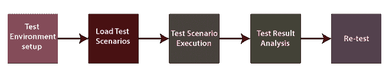
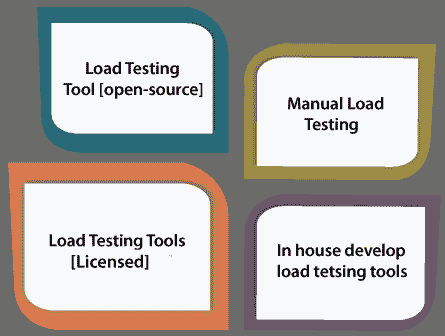

# 负载测试

> 原文：<https://www.javatpoint.com/load-testing>

在本节中，我们将了解**负载测试**，它是**性能测试**的重要部分，用于通过施加一些负载来检查软件的性能。

我们还了解了它的过程，为什么需要进行负载测试，负载测试的目的，例如，负载测试的各种策略，优缺点。

## 负载测试简介

在软件测试中，负载测试是[非功能测试](https://www.javatpoint.com/non-functional-testing)下性能测试不可分割的一部分。

负载测试是通过施加小于或等于所需负载的负载来检查应用性能的测试。

这里的加载是指当 **N 个用户同时使用应用或一次向服务器发送请求时。**

负载测试将有助于检测应用的最大运行容量以及任何**阻塞**或瓶颈。

它控制软件应用在被多个用户同时访问时的表现。

负载测试主要用于测试**客户端/服务器的性能和基于网络的应用。**

换句话说，我们可以说**负载测试**是用来发现用于竞争应用的组织是否有必要，当应用处于其用户负载的最大值时，应用的性能得到保持。

一般来说，负载测试用于表示有多少并发用户处理应用，以及应用在**硬件、网络容量**等方面的规模。

## 负载测试的目的

使用负载测试的主要目的是实现以下方面:

*   负载测试用于执行软件应用的**最大数量**，而没有重要的性能故障。
*   它用于管理应用的可伸缩性，并允许各种用户访问它。
*   它用于标识可以同时访问应用的用户总数。
*   负载测试用于确定最新的基础设施是否可以运行软件应用，并确定应用在极端用户负载下的可持续性。

## 为什么负载测试很重要？

由于以下因素，负载测试至关重要:

*   它保证了系统及其一致性和性能。
*   如果应用中发生任何可能影响应用性能的代码更改，负载测试是必要的。
*   它很重要，因为它再现了真实的用户场景。
*   它有助于发现系统的瓶颈。

## 负载测试规则

在执行负载测试期间，测试工程师应遵循以下规则:

*   一名测试工程师试图逃避在网站上下载图片。
*   一旦应用变得功能稳定，就应该计划负载测试。
*   响应时间的可靠性得出结论，应该记录过去的时间段，并且应该将过去的时间段与几次测试运行进行比较。
*   对于每个场景或脚本，应该决定用户数量。

## 负载测试过程

负载测试过程将在以下步骤中完成:

### 步骤 1:测试环境设置

*   在第一步中，我们将设置测试环境来执行负载测试，以确保测试可以适当地完成。
*   从**网络、硬件、软件规格等方面考虑，测试环境应尽可能设置在生产环境附近。**

### 步骤 2:加载测试场景或指定性能标准

*   在下一步中，我们将定义性能标准，包括响应时间、吞吐量的合理限制和负载测试事务。
*   然后，我们创建负载测试场景，确保成功标准最终确定。
*   在负载测试中，为应用确定事务
    ，并为每个事务设置数据。

#### 注意:测试场景是测试会话期间执行的脚本和虚拟用户的组合。场景可以是两种类型，手动的或面向目标的。

**例如**，在 LoadRunner 测试工具中，场景是在 **LoadRunner 控制器的**帮助下创建的。

### 步骤 3:测试场景的执行

*   一旦我们成功地创建了负载测试场景，我们将执行特定的测试场景。
*   但是在我们执行负载测试场景之前，我们必须设置不同的配置和矩阵来收集信息。
*   服务器上的负载由连续几个虚拟用户匹配，以同时完成任务。
*   我们可以在虚拟用户组或单个虚拟用户中执行整个场景。

### 第四步:测试结果分析

*   在执行负载测试场景之后，我们将分析测试结果。
*   负载测试场景可以借助 **LoadRunner** 在线监视器进行检查，如:
    *   **系统资源**
    *   **运行时事务**
    *   **网络延迟**
    *   **网络资源**

### 第五步:重新测试

*   负载测试过程的最后一步取决于测试结果，因为如果测试失败，我们必须重复执行相同的过程，直到测试结果通过，所有的问题和瓶颈都得到解决。

## 负载测试示例

让我们看看**一些实时的例子**，我们可以看到特定应用的大量失败，因为它们没有执行负载测试:

**示例 1**

电子商务网站充分利用广告活动，但不利用负载测试来保证理想的系统性能，同时获得大量用户。正因为如此，一些非常受欢迎的网站遭遇了严重的失败

**示例 2**

**亚马逊**每分钟损失 66000-66240 美元，因为 2013 年 Amazon.com 服务器被用户 30 分钟的流量严重当机。

在节日优惠期间，一个航空公司网站不能同时处理 10000 多个用户。

**示例 3**

更多的人习惯于在假期或航空公司有报价的日子里预订机票。

正如我们所看到的，更多的人倾向于在促销活动中购买产品，如排灯节、黑色星期五、十亿天大甩卖。

而且如果某个网站或某个应用在这样的事件中崩溃，用户可能会离开网站，转而使用竞争对手的应用，从而导致收入和市场份额的损失。这些情况可能会发生，因为我们不在系统上执行负载测试。

#### 注:根据一项调查，如果一个网站崩溃或运行缓慢，70-75%的用户会离开该网站。如果网站或应用在 3 秒钟内没有加载，40-50%的用户表示他们会在其他地方购买。

## 负载测试和压力测试的区别

下表列出了负载测试和压力测试之间的主要区别:

| 负载测试 | 压力测试 |
| 使用负载测试，测试工程师可以检测瓶颈，并在部署到生产服务器之前告知瓶颈的原因。 | 通过使用压力测试，测试工程师可以在系统故障或崩溃之前，当用户数量突然增加时，检查系统容量。 |

请参考以下链接，了解负载测试和压力测试之间的更多区别:

[https://www.javatpoint.com/load-testing-vs-stress-testing](https://www.javatpoint.com/load-testing-vs-stress-testing)

## 负载测试工具的类型

我们有各种类型的负载测试工具来执行负载测试，如下所示:

### 负载测试工具[开源]

*   为了执行负载测试，我们可以使用开源负载测试工具，因为市场上有各种免费的负载测试工具。
*   如果我们对特定项目的预算有限，我们可以使用开源工具。但不是每次都这样，因为它们可能不如付费负载测试工具先进。
*   JMeter 是最常用的开源负载测试工具。

### 手动负载测试

*   最有效的负载测试方法之一是执行负载测试的手动过程。但是，我们不能依赖它，因为它不能在应用上产生可重复的输出和可评估的压力水平。
*   如果我们手动执行负载测试，它需要大量的劳动力，这与付费工具相比相当昂贵。

### 负载测试工具[企业级]

*   付费负载测试工具用于支持多种协议；因此可以实现**流媒体、ERP/CRM 等多种类型的应用。**
*   **LoadRunner** 是最受欢迎的授权负载测试工具。

### 内部开发的负载测试工具

*   特定组织使用内部开发的负载测试工具方法来构建他们的工具，以对他们的应用执行负载测试，从而理解负载测试的重要性

## 负载测试工具

我们在市场上有各种类型的负载测试工具，其中一些是**商业工具**和开源工具。让我们看看一些最常见的负载测试如下:

*   **加载忍者**
*   **Apache JMeter**
*   新负荷
*   **惠普性能测试仪**
*   **网播**
*   **负载视图**

要获得有关上述负载测试工具的详细信息，请参考以下链接:

[https://www.javatpoint.com/performance-testing-tools](https://www.javatpoint.com/performance-testing-tools)

## 负载测试的优缺点

### 优势

执行负载测试的一些重要**好处**如下:

*   负载测试有助于我们在生产前检测瓶颈和性能相关问题。
*   负载测试增强了系统或软件应用在网络、软件和数据库方面的可扩展性。
*   执行负载测试的主要优势是降低了故障成本，这也有助于我们将系统中断风险降至最低。
*   使用负载测试可以提高客户的满意度。

### 不足之处

以下是负载测试的**缺点**:

*   只有当我们对任何编程语言以及测试工具有足够的了解时，负载测试才能被执行。
*   使用负载测试工具可能是一个昂贵的过程，因为定价取决于支持的虚拟用户数量。

## 概观

在负载测试教程中，我们已经了解了负载测试的以下方面:

*   在执行应用的性能测试时，负载起着至关重要的作用，有助于了解软件或应用的有效性和能力。
*   如果忽略负载测试，可能会造成经济损失。
*   它是作为一种类型的**软件测试**来指定的，该测试控制系统在实际负载条件下的性能。
*   它扩展了可伸缩性、性能问题以及应用在投入生产之前的稳定性。
*   使用各种负载测试工具，我们可以确保交付一个不会崩溃的高质量产品，同时让最大数量的用户同时使用它。

* * *