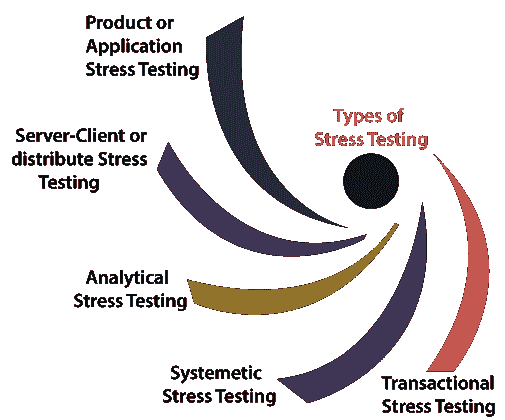
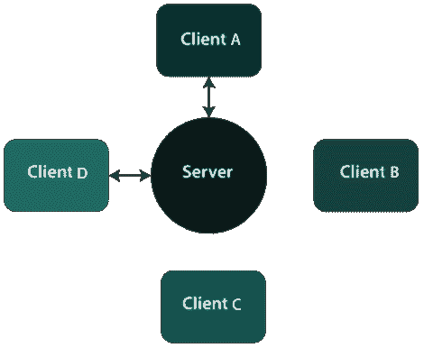
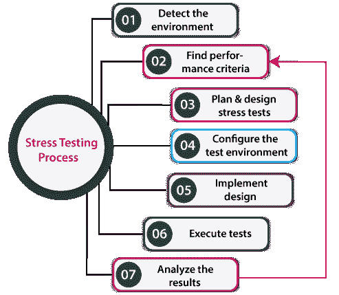

# 压力测试

> 原文：<https://www.javatpoint.com/stress-testing>

在本节中，我们将了解**压力测试**，这是**性能测试**的重要部分，用于通过施加大于所需负载的负载来检查应用的行为。

我们也了解了**的过程，为什么需要进行压力测试，**压力测试的**目标，例子，压力测试的各种特点，优势和劣势。**

## 压力测试简介

在软件测试中，压力测试是非功能测试下性能测试的重要组成部分。

**压力测试**是用于检查软件的可访问性和健壮性是否超出通常的功能限制的测试。它主要考虑关键软件，但也可以用于所有类型的软件应用。

又称 ***耐力测试、疲劳测试*** 或 ***折磨测试*** 。

压力测试包括超出标准操作尺寸的**测试，重复至**断点**，以获得输出。**

它强调了重载下的错误处理和健壮性，而不是常规条件下的正确行为。

换句话说，我们可以说**压力测试**是用来验证恒定性和

系统的可靠性，并确保系统不会在灾难情况下崩溃。

为了分析系统在极端条件下如何工作，我们在正常负载之外进行**应力测试**。

## 压力测试的目的

使用压力测试的主要目的是实现以下方面:

*   执行压力测试的主要目的是**确认软件不会因为缺少计算资源(如磁盘空间、内存和网络请求)而崩溃。**
*   压力测试的实施证明了系统的失败并毫不费力地改进，称为**可恢复性过程。**
*   我们可以使用压力测试来发现硬件问题和数据损坏问题。
*   压力测试将有助于我们识别在持续高峰负载期间可能潜入的安全弱点。
*   它有助于确定软件应用在极端负载下的数据完整性，这意味着数据在故障后应该处于可靠状态。

## 压力测试的特点

以下是压力测试的基本特征:

*   压力测试还可以确保未预料到的故障不会导致安全问题。
*   它用于分析系统在罕见情况下的工作以及系统在故障后的行为。
*   压力测试用于检查系统在崩溃前是否保存了数据。
*   压力测试保证在系统处于压力下时显示适当的错误信息。

## 为什么我们需要进行压力测试？

如果遇到以下情况，我们需要进行压力测试:

每当**电商或网购网站**在节日期间宣布销售时，流量可能会激增。或者当一篇文章在一家顶级报纸上被提及时，它的知识会带来意想不到的流量。

如果我们不能帮助这种突然的交通可能会导致利润和地位的损失。因此，在这种情况下，我们需要执行**压力测试来整合这种不规则的流量峰值**。

以下情况也需要进行压力测试:

*   当系统处于压力下时，它应该显示正确的错误信息。
*   检查系统是否在异常情况下工作。
*   如果系统在风险情况下出现故障，可能会导致巨额利润损失。
*   通过实施压力测试，我们将为极端情况做好准备。

## 压力测试示例

让我们看看一些**实时示例**，在这里我们可以发现压力测试的用法。

### 示例 1:电子商务网站/应用

在整个新产品发布、销售、假日、促销和节日优惠中，电子商务应用往往会在很短的时间内获得许多用户。

### 示例 2:某个重大/病毒事件发生时的新闻网站

重大事件发生时，新闻网站会崩溃或变慢；**比如**迈克尔杰克逊去世的时候，最大数量的新闻网站都慢了下来，或者说有一些还死机了。

为了克服这种情况，我们需要对特定的应用进行压力测试，并做好准备在出现任何崩溃或故障时快速恢复。

### 示例 3:教育委员会的结果网站

在教育委员会的成绩网站上进行压力测试很重要。在一些结果的日子里，许多学生、用户和申请人会登录特定的来检查他们的成绩。

因此，执行压力测试有助于识别应用的故障，并在短期内出现最终负载或结果出来时评估性能和可恢复性。

#### 注意:网站或应用的压力测试对于处理几个访问者或用户的意外增加非常重要。

## 压力测试的类型

压力测试可以分为以下几个部分:

*   **产品或应用压力测试**
*   **服务器-客户端或分布式压力测试**
*   **分析应力测试**
*   **系统压力测试**
*   **交易压力测试**

### 产品或应用压力测试

*   应用或产品压力测试主要集中于确定与网络问题、数据锁定、阻塞和软件产品中的性能瓶颈相关的故障。

### 服务器-客户端或分布式压力测试

*   在这种类型的压力测试中，所有与服务器相关的客户端都要进行测试。
*   分布式压力测试用于在服务器的所有客户端上执行。
*   服务器可以与**客户端 A 和 B** 通信，但是当客户端-服务器系统出现压力时，服务器无法与**客户端 C 和 D** 链接，如下图所示:

### 分析/探索性压力测试

*   分析性或探索性测试用于在不太可能在真实场景中发生的异常约束下执行系统。
*   它主要用于识别罕见情况下的 bug，如**大量用户同时登录或从网站检索数据库时数据库离线。**

让我们看一些使用这种不规则条件的分析应力测试的例子**:**

*   当大量并行用户试图登录应用时。
*   数据库中加入了大量的数据。
*   当网站试图从前端访问它时，链接到网站的数据库就会关闭。

### 系统压力测试

*   它是一种组合测试，用于在运行于类似服务器上的不同系统上执行测试。
*   使用**系统压力测试**，我们可以轻松检测到一个应用的数据阻塞另一个应用的瓶颈。

### 交易压力测试

*   另一种类型的压力测试**是事务性压力测试**，用于在各种应用之间实现一个或多个事务。
*   执行事务性压力测试的主要目的是**提高系统性能。**

## 压力测试流程/如何进行压力测试

压力测试过程将分为以下步骤:

### 步骤 1:检测测试环境

在压力测试的第一步，我们将确定可用于实现压力测试的网络、软件和硬件配置及工具。

### 第二步:找到绩效验收标准

在确定测试环境之后，我们将找到性能验收标准，这有助于我们对用于测试压力下应用性能的指标进行分类。

此外，确定压力测试的成功标准，例如，应用失败时可以承受的最大负载。

### 步骤 3:计划和设计压力测试

在压力测试过程的下一步，我们将计划和设计一个压力测试计划，确定测试场景等。

### 步骤 4:配置测试环境

一旦成功创建了压力测试计划，我们将进入下一步，创建测试环境、工具和资源，以便在特性和组件可供测试时执行每种方法。

### 步骤 5:实现测试设计

在测试环境配置完成后，我们将开发压力测试，使测试设计表现最佳。

### 步骤 6:执行测试

在下一步中，我们将执行特定的测试，观察并确认测试以及测试数据和输出收集。

### 第七步:分析结果

在压力测试过程的最后一步，我们将分析结果，合并和共享各自团队的输出数据。

## 压力测试工具

我们知道**压力测试**是**性能测试**的一部分，用于性能测试的工具可以用于压力测试。因此，我们在市场上有各种类型的**压力测试**工具，其中一些是商业工具和开源工具。下面列出了一些最常见的**应力测试**:

*   **Apache JMeter**
*   新负荷
*   **应力测试仪**
*   **装载机**

要获得有关上述压力测试工具的详细信息，请参考以下链接:

[https://www.javatpoint.com/performance-testing-tools](https://www.javatpoint.com/performance-testing-tools)

## 压力测试的优点和缺点

### 优势

执行压力测试的一些重要**好处**如下:

*   压力测试表明系统在失败后的行为，并确保系统从崩溃中快速恢复。
*   执行压力测试的最重要的优势将使系统以合适的方式在规则和不规则的条件下工作。
*   它决定了软件的可扩展性和增强性能。

### 不足之处

压力测试最常见的一些缺点如下:

*   即使在像 JMeter 这样的开源工具中，也需要一个负载测试环境，它应该尽可能接近生产环境的设置。
*   如果我们正在编写压力测试脚本，这个人应该对特定工具支持的语言有足够的脚本知识。
*   如果我们使用压力测试，它将需要额外的资源，这使得这个测试有点昂贵。
*   如果我们手动执行**压力测试**，就变成了一个繁琐复杂的任务去完成，也可能不会产生预期的结果。

## 概观

在本教程中，我们已经了解到**压力测试**用于评估极端情况下的系统。它可以验证系统恢复到正常状态。

是**非功能测试**的一种，一般在**功能测试后执行。**

**压力测试**完全专注于在极端负载情况下测试系统，以检测其**断点**，并查看系统无响应时是否显示合适的消息。

* * *