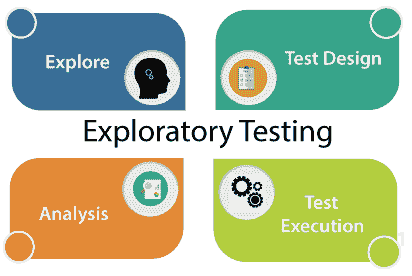
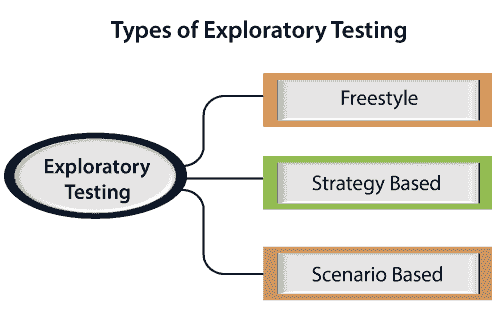

# 探索性测试

> 原文：<https://www.javatpoint.com/exploratory-testing>

在这一节中，我们将学习探索性测试，它的类型，我们使用它的时候，它的优点和缺点。

## 什么是探索性测试？

如果需求不存在，那么我们做一轮探索性测试。

因此，首先，我们将以所有可能的方式探索应用程序，理解应用程序的流程，准备测试文档，然后测试应用程序，这种方法被称为探索性测试。

## 当我们使用探索性测试时

我们将在以下方面使用该测试:

*   当需求缺失时
*   需要早期迭代
*   当我们有一个关键的应用程序时，测试团队有经验丰富的测试人员，新的测试人员进入团队。

**比如**测试任何软件或者应用，首先我们会进行单元、集成、[系统测试](https://www.javatpoint.com/system-testing)。

因此，如果我们想首先理解任何应用程序，我们将执行单元或组件测试，假设应用程序有一个包含许多元素的登录页面，我们将理解每个部分并进行组件测试，但实际上，我们正在进行探索性测试，因为我们正在探索应用程序。

假设我们在应用程序中有许多模块，并且我们正在尝试做一些集成场景。

间接来说，我们只是在执行[集成测试](https://www.javatpoint.com/integration-testing)时进行探索性测试。

而且，即使我们在执行系统测试，我们也在间接执行探索性测试，因为这里我们也在理解和探索应用程序。

## 为什么缺少需求

由于以下原因，该要求缺失:

如果项目很旧，测试工程师不能从一开始就理解每个场景，可能会出现需求缺失的情况。

**例如**在每个公司，我们都没有看到任何快速的过程，这意味着我们不能期望发布在短短一个月内完成，产品应该在非常短的时间内交付。

过去 6 到 12 年间，许多公司仍处于特定产品的开发阶段。

假设一家公司有一个 15 年的项目，他们现在雇佣了一个新的测试工程师。新的测试工程师在从头开始理解每个场景或需求时面临许多困难，因为他/她是应用程序的新手。

在这种情况下，测试工程师会用 15 岁的软件做什么？

所以首先，他/她会接受申请并开始探索申请。一旦测试工程师开始使用应用程序，他/她将了解应用程序是如何工作的。而且，这个过程只不过是探索性的测试。

## 如何执行探索性测试

要执行探索性测试，首先，我们将开始使用应用程序，并从具有良好产品知识的人(如高级测试工程师)和开发人员那里了解应用程序的需求。

然后我们将探索应用程序并编写必要的文档，并将该文档发送给领域专家，他们将浏览该文档。

我们可以根据我们的知识，借助已经在市场上推出的竞争产品来测试应用程序。

## 探索性测试的类型

探索性测试可以分为以下三个部分:

*   **自由泳**
*   **基于策略的**
*   **基于场景的**

### 即兴说唱

在自由式测试中，我们没有遵循任何规则，没有最大覆盖范围，我们将像 Adhoc 测试一样探索应用程序。

如果我们想对软件友好并检查其他测试工程师的工作，我们可以使用自由式探索测试。

### 基于策略

基于策略的探索性测试可以在多种测试技术的帮助下进行，例如基于风险、边界值分析和等价划分。

这是由经验丰富的测试人员完成的，他/她使用应用程序的时间最长，因为他/她非常了解该应用程序。

### 基于场景

基于场景的探索性测试是在端到端、[测试场景](https://www.javatpoint.com/test-scenario)和真实用户场景等多个场景的帮助下进行的。

测试工程师可以在探索应用程序时，利用他们的应用程序知识发现缺陷，并检查多种场景的各种可能性。

## 探索性测试的优缺点

## 优势

以下是探索性测试的一些好处:

*   如果测试工程师使用探索性测试，他/她可能会很早得到一个关键的错误，因为在这个测试中，我们需要更少的准备。
*   在这个测试中，我们还可以发现那些可能在测试用例中遗漏的 bug。
*   这个测试可以用来测试新的特性，然而，对于现有的功能，如果我们有更少的时间来测试应用程序，我们将使用回归测试。
*   对于测试工程师来说，这种测试需要大量的精力来探索应用。

## 不足之处

以下是探索性测试的缺点:

*   **耗时**
    这是一个耗时的过程，因为我们不知道需求，也不知道首先要测试哪个特性，因为我们只是在探索应用。
*   **测试工程师会将该特性误解为 bug。**
    **例如，**假设我们有一个登录页面，要求我们必须提供必要的详细信息，如**用户名、密码、**和**员工 id** ，然后点击**登录**按钮。
    但是在进行试探性测试时，我们只提供了**用户名、密码、**的详细信息，然后点击**登录**按钮，但是我们没有输入员工 id。既然我们没有需求，并且在做探索性测试，这就是为什么我们觉得员工 id 组件是一个 bug，但是它是一个特性。
*   **bug 可能会被误解为功能**
    **例如，**假设我们有一个注册页面，我们必须提供详细信息，如**用户名、密码、手机号码、**和**电子邮件 id** 。
    而且要求说，我们在提供手机号和邮箱 id 的时候，会给注册的邮箱 id 和手机号发同样的代码，验证是否正确。
    但当我们在注册页面进行探索性测试并提供所有详细信息(用户名、密码、手机号和邮箱 id)时，代码只会发送到我们的手机号，而不会发送到邮箱 id。
    之所以会发生，是因为需求缺失，我们会被误解为这个 bug 是一个特性，我们永远不会得出这是一个 bug。

* * *