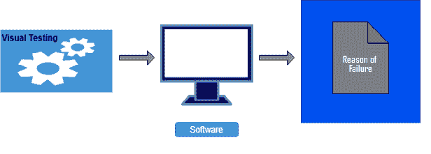
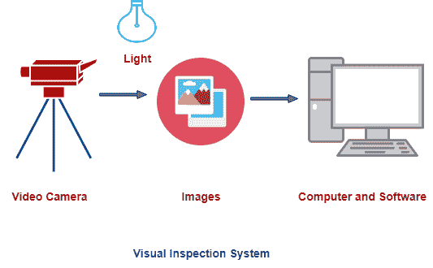

# 视觉测试

> 原文：<https://www.javatpoint.com/visual-testing>

可视化测试用于通过定义数据来检查在软件故障点发生了什么，定义数据的方式是开发人员可以快速识别故障原因，并且信息被清晰地表达出来，以便任何其他开发人员都可以利用这些信息。

视觉测试的目的是展示实际的问题，而不仅仅是描述它，它显著地增加了理解和清晰度，从而可以快速解决问题。

视觉的一般含义是我们所能看到的光学意义。因此，视觉测试需要对整个过程进行视频记录。它以视频格式捕捉系统测试时发生的一切。Tester 在网络摄像头中提供图片，并通过麦克风提供音频评论作为输入值。

## 视觉检测系统

视觉检测系统由高质量的摄像机和软件组成，摄像机用于收集数据，软件和计算机用于分析数据。摄像机用于在测试过程中捕捉物体的图像。这些目标图片通过帧抓取器发送到计算机。

计算机有软件可以分析图片并决定物体是否通过检查。

视频测试系统工作的条件必须得到很好的控制，并且易于保持测试持久性。

视觉测试有很多优点。它极大地提高了沟通的质量，因为测试人员可以通过视觉向开发人员呈现问题，而不是以书面文档的形式描述问题。开发人员拥有测试失败的所有必要证据，所以重点只在于失败的原因和如何修复。

下面给出了一些显著的优点和缺点:

### 视觉测试的优势

*   视觉测试很便宜，因为信息是以视频形式记录的。因此，我们不需要以任何其他形式复制信息。它省钱。
*   可视化测试提供了可移植性。如果软件类型相同，测试人员可以向任何其他测试人员提供视频。因此，在系统故障的情况下，我们不会丢失数据。
*   可视化测试节省了测试的时间，就好像一旦测试过程完成并以可视化的形式保存，那么我们就不需要再次测试软件了。开发人员可以通过观看视频来识别缺陷。
*   视觉测试需要最低数量的特殊技能。
*   视觉测试需要最少的零件准备，因为只需要找到系统故障的原因。

### 视觉测试的缺点:

*   目测只适用于看得见的表面，所以需要安排合适的表面。
*   视觉测试无法发现隐藏的缺陷；它只能检测到较大的缺陷。
*   为了记录清晰可见的视频，必须很好地实施照明。
*   它只遵循规则，不模仿人类的检查。
*   划痕和裂缝会造成误解。
*   视觉测试不提供产品的组件变化，如果软件组件有变化，则不能通过视觉测试进行测试。

### 摘要

当我们用容易检测到的缺陷测试软件并且不允许组件变化时，使用视觉测试。

* * *