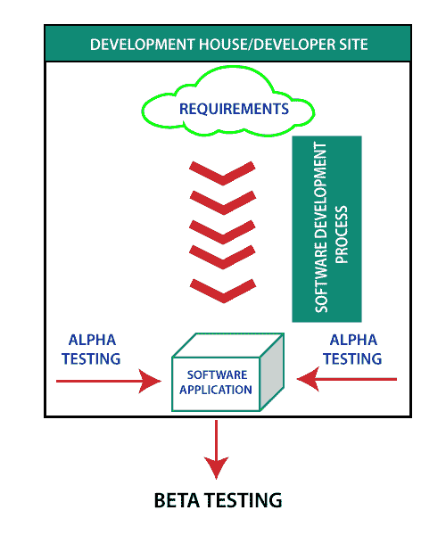
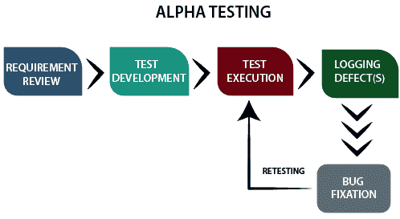
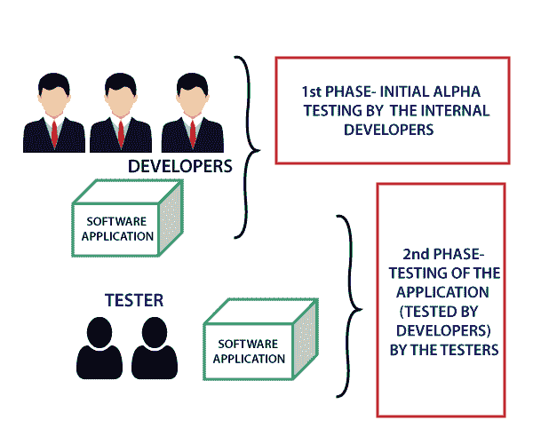
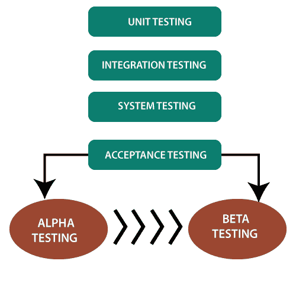

# 阿尔法测试简介

> 原文：<https://www.javatpoint.com/alpha-testing>

Alpha 测试在组织中进行，由开发人员一方的终端用户代表小组进行测试，有时也由独立的测试团队进行测试。

Alpha 测试是在内部站点进行的模拟或真实操作测试。它出现在单元测试、集成测试等之后。所有测试执行后使用的 Alpha 测试。

它可以是白盒测试，也可以是黑盒测试，这取决于需求——特定的实验室环境和该测试所需的实际环境的模拟。

## 阿尔法测试流程是什么？

阿尔法测试遵循以下流程:

1.  **需求评审:**评审规范和功能需求的设计
2.  **测试开发:**测试开发基于需求评审的结果。开发测试用例和测试计划。
3.  **测试用例设计:**执行测试计划和测试用例。
4.  **记录缺陷:**记录应用程序中发现的已识别和已检测的缺陷。
5.  **bug 修复:**当所有 Bug 都被识别并记录下来，那么就需要修复 Bug。
6.  **重测:**当所有问题都解决，固定重测完成。

## 阿尔法测试有哪些阶段？

Alpha 测试确保软件运行完美，不会影响组织的声誉；该公司以 alpha 测试的形式实施最终测试。该测试分为两个阶段。

阿尔法测试有两个阶段。

**第一阶段:**软件工程师的内部开发人员做第一阶段的测试。在这个阶段，测试人员使用硬件调试器或硬件辅助调试器来快速捕获错误。在 alpha 测试期间，测试人员会发现很多 bug、崩溃、缺失的特性和文档。

**第二阶段:**第二阶段涉及质量保证人员通过黑盒和白盒技术进行阿尔法测试。

## 什么时候进行阿尔法测试？

Alpha 测试是用户接受度测试。一旦产品通过测试阶段并准备发布，就执行 Alpha 测试。它是在测试前执行的，测试也是验收测试的一部分，可以定义为现场测试。在测试过程中，我们可以对软件进行修改，以提高其质量和功能。Alpha 测试在开发人员的站点完成，独立开发人员可以在该站点监控和记录用户体验，并进行必要的更改以提高性能。

## 执行阿尔法测试的原因是什么？

阿尔法测试是测试的最后阶段。Alpha 测试是一种重要且流行的测试技术，可以帮助团队交付高质量且有用的软件。该测试在产品发布前进行。Alpha 测试可以定义为确保软件按照需求计划运行的第一轮独立测试。

阿尔法测试的原因是:

*   通过发现和纠正以前测试中没有发现的错误来改进软件产品。
*   Alpha 测试允许团队在真实环境中测试软件。
*   做 alpha 测试的原因之一是为了保证软件产品的成功。
*   Alpha 测试在软件发布到现实世界之前验证软件的质量、功能和有效性。

## 阿尔法测试有什么特点？

*   阿尔法测试是验收测试的一种。
*   阿尔法测试发生在软件产品完成的阶段。
*   阿尔法测试在实验室中进行，我们在实验室中提供特定的受控环境。
*   Alpha 测试是内部测试，由组织内部的开发人员和测试人员执行。
*   公众没有任何参与。
*   Alpha 测试有助于获得用户对软件产品接受度的信心。
*   借助黑盒和白盒技术，我们可以实现阿尔法测试。
*   Alpha 测试确保在将软件发布到市场或客户进行 beta 测试之前，软件的最大可能质量。
*   开发人员在开发人员的现场执行 alpha 测试；它使开发人员能够轻松记录错误，快速解决发现的错误。
*   Alpha 测试是在单元测试、集成测试、系统测试之后但在 beta 测试之前做的。
*   Alpha 测试用于测试软件应用程序、产品和项目。

## 阿尔法测试的优势是什么？

阿尔法测试的优点是:

*   阿尔法测试的好处之一是它减少了项目的交付时间。
*   它提供了完整的测试计划和测试用例。
*   将团队成员释放到另一个项目中。
*   每个反馈都有助于提高软件质量。
*   它可以更好地观察软件的可靠性和可靠性。

## 阿尔法测试的缺点是什么？

阿尔法测试的缺点是:

*   Alpha 测试不涉及软件的深入测试。
*   测试人员测试软件的数据和客户数据之间的差异可能会导致软件功能的差异。
*   实验室环境用于模拟真实环境。但是，实验室仍然不能提供真实环境的所有要求，例如多种条件、因素和环境。

## 总结:

每个软件产品在进入高度竞争的市场之前都需要经历一个重要的方法论。阿尔法测试是重要的测试之一。在将软件发布到市场之前，需要仔细考虑软件的功能，并获得用户对其真实环境接受度的信心。

* * *