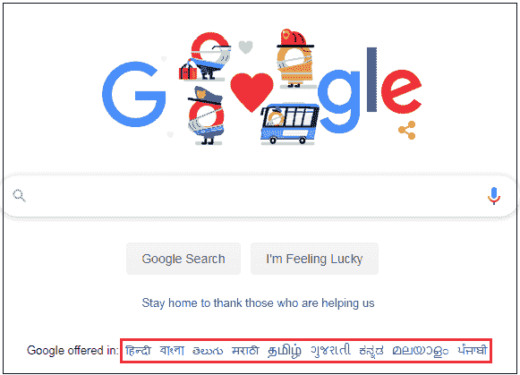
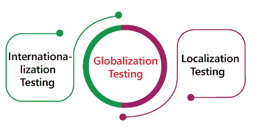
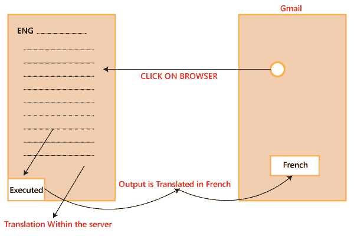
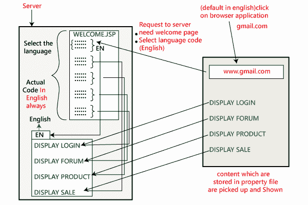
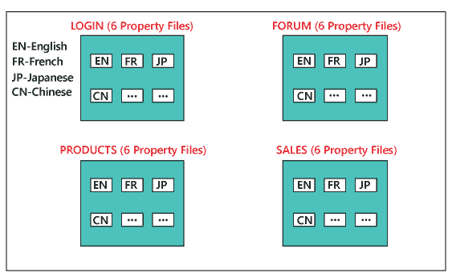
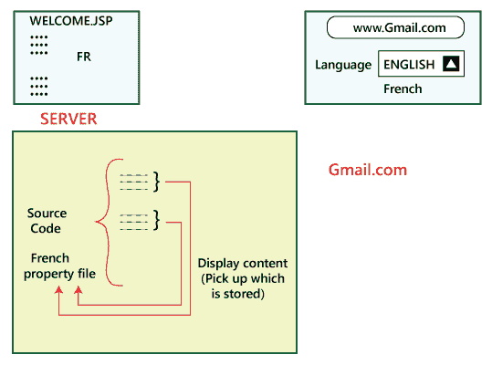
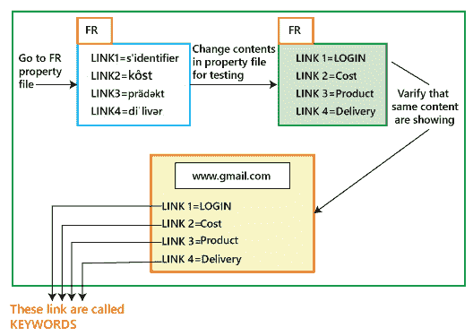
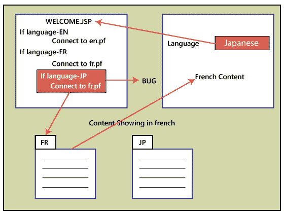

# 全球化测试

> 原文：<https://www.javatpoint.com/globalization-testing>

全球化测试是另一种类型的软件测试，用于测试为多种语言开发的软件，称为**全球化测试，**为各种语言改进应用或软件，称为**全球化**。

该测试确保应用程序将支持多种语言和多种功能，因为在当前的场景中，我们可以看到几种技术的增强，因为应用程序是以全球通用的方式进行规划的。

**比如**，在印度，**Google.com**支持大部分语言，由于是全球化的应用，也可以被各个国家的大量人群检索到。

## 全球化测试的目的

全球化测试的主要目的如下:

*   它用于确保应用程序支持世界各地的所有语言。
*   它用于确定实施的各个阶段。
*   它用于定义软件的用户界面。
*   该测试将集中于应用程序的全球体验。
*   它用于确保代码可以控制所有国际支持，而不会破坏应用程序的功能。

## 为什么我们需要执行全球化测试

我们需要执行全球化测试来满足以下条件:

**理解语言词汇:**应用程序的设计应该能够轻松理解世界各地的多种语言术语。

**例如**

*   在英国→英语
*   在印度→印地语和英语

**邮政编码:**假设我们生活在英国，邮政编码包括字母数字字符，而在印度，邮政编码是 6 位数格式。因此，如果我们选择像印度这样的国家，并输入我们国家的个人识别码，它应该只接受 6 位数的代码。

因此在这种情况下，软件应该接收基于英国邮政编码格式的邮政编码。因此，确保邮政编码功能在每个位置都能正常工作是非常重要的。

**地址和电话号码格式**:应用程序的测试方式应该能够访问多个国家的地址和电话号码格式。

**例如**

*   英国→+44
*   印度→91

## 全球化测试的类型

全球化测试分为两个不同的部分，如下所示:

## 国际化测试

国际化测试是开发和规划软件或应用程序(产品)或文件内容的过程，它允许我们为任何给定的语言、文化和地区本地化我们的应用程序，而不要求对源代码进行任何更改。这个测试也被称为 I **18N 测试，**这里的 **18** 是 **I** 国际化 **n** 字中 **I** 和 **N** 之间的数字。

主要目标是执行国际化测试，该测试集中于多个测试，如功能测试、集成测试、可用性测试、用户界面测试、兼容性测试、安装测试和验证测试。

在这个测试中，应用程序代码独立于语言，并且是在设计级别完成的。

### 我们为什么要进行国际化测试

我们将执行 I18N 测试，以检查以下情况:

*   用于验证正确的内容是否在正确的位置。
*   检查对产品质量的负面影响。
*   用于验证内容是否使用正确的语言。

## 国际化测试示例

让我们看一个例子来理解国际化测试。

假设我们想让我们的软件使用法语，那么我们必须点击浏览器。浏览器会把我们带到服务器，在那里代码是英文的，从那里执行，输出被翻译成法语，并以法语显示。

现在问题来了，我们如何翻译成另一种语言？

我们能在翻译的帮助下做到吗？不。使用翻译有一些缺点。

如果我们在翻译人员的帮助下将代码从英语翻译成任何其他语言，我们将面临以下后果:

*   我们不会唤起这种感觉，这就是为什么译者的使用会失败。
*   意义会改变。

让我们看看英语国际化测试是如何工作的:

我们将用英语编写一个通用代码，对于所有其他语言，我们有多个属性文件。假设我们有 6 种不同的语言，为此，我们有 6 个不同的属性文件。让我们看看这将如何执行:

首先，点击浏览器，它会根据以下指导方针将请求带到服务器，因为我们需要一个欢迎页面并启动语言代码 EN。那么实现该语言的代码具有英语的属性文件。现在我们选择英文属性文件并连接到特定的链接。

**例如**，如果下一阶段的编码是针对登录模块的，那么它与 Link1 相关，然后收集存储在那里的数据，并用英语进行演示。同样的过程将持续到其他环节，如论坛、销售和产品。不同的语言也将遵循同样的过程。

但是这里要考虑的是，**这些属性文件**是谁写的？

首先，开发人员用英语编写属性文件。然后，有经验的人获取数据，手动编写属性文件，并将其返回给开发人员。

之后，开发人员将这个特定的属性放在服务器中，如下图所示:

现在让我们理解**我们将如何翻译成法语**，我们也测试一下。

我们将遵循与上面相同的过程:

*   首先，我们点击浏览器，选择语言法语后再进一步点击。
*   我们点击后，它会引导我们进入带有选定语言代码 FR 的欢迎页面。
*   因此，它将转到 FR 属性文件并显示数据(法语)，该数据基于它连接的链接存储在文件中。**例如**链接 1 登录显示登录模块的数据。同样，对于其他模块，如论坛、销售和产品。

好像现在，我们已经把英语转换成了法语。那么**我们如何验证它是法语还是其他语言呢？**

移动到法国属性文件，并更改该特定文件中的内容，如下图所示:

一旦我们在属性文件中完成了修改，我们再次选择法语，并查看我们在内容中所做的更改是否显示相同。

如果显示相同，那么测试工程师可以进行测试，我们必须在属性文件中进行修改，而不是在实际代码中。或者如果它没有显示相同的内容，那么我们会发现只需要在代码中修复的缺陷。

在进行 I18N 测试时，我们可能会发现以下缺陷:

*   如果我们选择英语→用英语显示
    如果我们选择法语→用法语显示
    如果我们选择日语→用法语显示

**注:**

现在，我们会明白如果**我们选择日语，它会用法语显示内容吗？**

如果开发人员将代码复制粘贴，忘记修改具体的属性文件，如 **jp.pf** 等日语，就会出现上述情况；他们继续使用 **Fr.pf** 文件；这就是为什么内容仍然以法语呈现。

*   缺陷可能在**对齐、**中，因此我们将验证各种语言的对齐规范是否得到适当遵循，如左对齐或右对齐。
*   我们可以检查相反方向的语言，这意味着我们可以如何分解单词。有两种类型的语言，如**双向和单向**，其中**双向语言**可以从右向左开始**，而**单向语言**可以从左向右开始**。因此，我们必须检查文本是否按照所选语言正确显示。****

 ****## 本地化测试(L10N 测试)

本地化测试只不过是格式测试，我们根据国家、地区等来测试格式规范。又称 **L10N** 测试，这里 **10** 是**L**ocalization**N**字中 **L** 和 **N** 之间的数字。

本地化的主要目标是为目标市场提供产品的外观和感觉，无论其文化、位置和语言如何。本地化产品不需要这种测试。

让我们了解我们在本地化测试中执行的各种格式测试:

#### 日期格式测试

该软件的设计应该能够根据国家格式跟踪日期。

**例如**

*   在美国，日期格式→毫米-日-YY
*   在印度，日期格式→日-月-年

#### 货币格式测试

在这种情况下，我们不担心格式的功能，例如$被转换为 Rs。或者没有。这里我们只测试$应该在第一个还是最后一个。

**例如**，200 美元，250 美元，500 卢比(标准应符合国家标准)

#### Pin 码格式测试

在这种情况下，我们有带有字符的 pin 码的国家，如 PQ230。检查 Pin 码格式是 L10N 测试，检查 PQ 是否翻译成法语是 I18N 测试。

L10N 测试包含日期格式、货币格式和个人识别码格式。

#### 图像格式测试

在这种情况下，我们只能更改图像的名称，因为图像无法更改。因此，我们必须根据国家有多个图像。

## 全球化测试的优势

全球化测试的好处如下:

*   该测试将向多个地点提供软件应用程序或其他内容的免费版本。
*   这种测试确保了应用程序可以在各种语言中使用，而不需要重写整个软件代码。
*   它将提高产品的代码设计和质量。
*   它将增强全球的客户基础。
*   该测试将帮助我们降低本地化测试的成本和时间。
*   这个测试将为我们提供更多的可伸缩性和灵活性。

## 全球化测试的缺点

全球化测试的缺点如下:

*   测试工程师可能会面临时间表的挑战。
*   我们需要领域专家来执行全球化测试，
*   我们需要雇用一名当地翻译，这使得这一程序更加昂贵。

* * *****