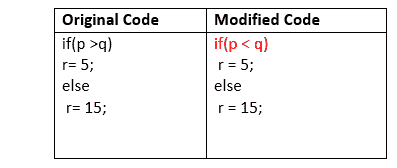
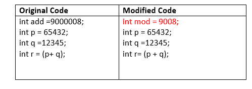
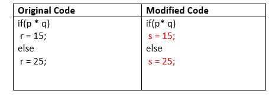
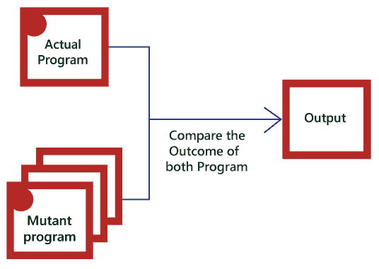

# 突变测试

> 原文：<https://www.javatpoint.com/mutation-testing>

## 什么是突变检测？

变异测试是软件测试中的一种白盒方法，在这种方法中，我们有目的地将错误插入到程序(被测试)中，以验证现有的测试用例是否能够检测到错误。在这个测试中，程序的突变体是通过对原始程序进行一些修改而产生的。

突变测试的主要目标是检查每个突变是否创建了一个输出，这意味着它不同于原始程序的输出。我们将对变种人程序进行细微的修改，因为如果我们大规模改变它，将会影响整个计划。

当我们检测到错误的数量时，这意味着要么程序是正确的，要么测试用例在识别错误方面效率低下。

突变测试的目的是评估应该能够使突变代码失败的案例的质量，因此这种方法也被称为基于故障的测试，因为它用于在程序中产生错误，这就是为什么我们可以说执行突变测试是为了检查测试案例的效率。

## 什么是突变？

变异是程序中的一个小修改；这些微小的修改是针对编码过程中发生的典型低级错误而设计的。

通常，我们以匹配数据的规则的形式来考虑变异操作符，并且还生成一些有效的环境来产生突变体。

## 突变检测的类型

突变检测可以分为三个部分，如下所示:

*   决策突变
*   价值突变
*   语句突变

让我们逐一了解它们:

### 决策突变

在这种类型的突变测试中，我们将检查设计错误。在这里，我们将对算术和逻辑运算符进行修改，以检测程序中的错误。

比如我们对算术运算符进行以下更改:

*   加号(+)→减号(-)
*   星号(*)→双星号(**)
*   加号(+)→增量运算符(i++)

比如我们在逻辑运算符中做以下改变

*   兑换 P **>** → P **<** ，或 P **> =**

现在，让我们看一个例子来更好地理解:

### 价值突变

在这种情况下，这些值将被修改以识别程序中的错误，通常，我们将更改以下内容:

*   小值à高值
*   较高值à小值。

**例如:**

### 语句突变

语句突变意味着我们可以通过删除或替换行来修改语句，如下例所示:

在上面的例子中，我们用 s=15 代替了 r=15，用 s=25 代替了 r=25。

## 如何进行突变测试

要执行突变测试，我们将遵循以下流程:

*   在这方面，首先，我们将通过产生各种版本将错误添加到程序的源代码中，这些版本是已知的突变体。这里每个变异体都有一个错误，这导致变异体种类不成功，也验证了测试用例的效率。
*   之后，我们会借助突变程序中的测试用例，实际应用会发现代码中的错误。
*   一旦我们识别出错误，我们将匹配实际代码和突变代码的输出。
*   在比较实际程序和变异程序的输出之后，如果结果不匹配，那么变异程序由测试用例执行。因此，测试用例必须足以识别实际程序和突变程序之间的修改。
*   如果实际程序和突变程序产生了准确的结果，那么突变程序就被保存了。这些案例是更活跃的测试案例，因为它帮助我们执行所有的变种人。

## 变异测试的优缺点

### 优势

突变测试的好处如下:

*   对于应用程序员来说，这是一种正确的错误检测方法
*   变异测试是实现源程序广泛覆盖的一个很好的方法。
*   变异测试帮助我们为客户提供最可靠的结构。
*   这种技术可以识别程序中的所有错误，也有助于我们发现代码中的疑点。

### 不足之处

突变体测试的缺点如下:

*   这个测试有点费时，而且成本更高，因为我们有很多需要创建的突变程序。
*   突变测试不适合黑盒测试，因为它包含了对源代码的修改。
*   与实际程序相比，每一个变异都有相同数量的测试用例。因此，大量的突变程序可能需要在真正的测试套件之外进行测试。
*   因为这是一个繁琐的过程，所以我们可以说这个测试需要自动化工具来测试应用。

* * *