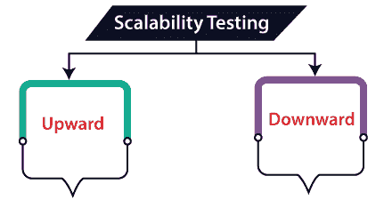
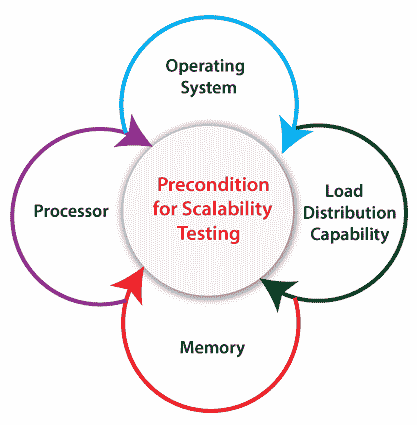
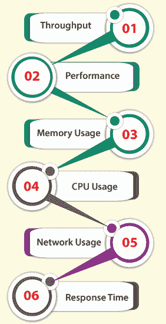
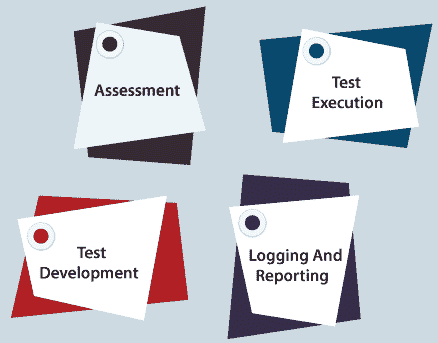

# 可扩展性测试

> 原文：<https://www.javatpoint.com/scalability-testing>

在本节中，我们将了解**可伸缩性测试**，它通过增加或减少特定规模(如用户数量)的负载来检查应用的性能。

并且我们也了解了**它的需求，可伸缩性测试的目的，可伸缩性测试的类型，可伸缩性测试的前提条件，可伸缩性测试的各种特性，如何执行，优缺点**。

## 可伸缩性测试介绍

另一种类型的[性能测试](https://www.javatpoint.com/performance-testing)是**可伸缩性测试**，属于[软件测试](https://www.javatpoint.com/software-testing-tutorial)的[非功能测试](https://www.javatpoint.com/non-functional-testing)。

它用于通过增加或减少特定规模的负载来检查应用的性能，称为**可伸缩性测试**。它在**硬件、软件或数据库级别**执行。

它被指定为**网络、系统、应用、产品或进程**的容量，以便在对系统的大小或体积进行修改以满足日益增长的需求时正确运行。

在这个测试中， [**测试用例**](https://www.javatpoint.com/test-case) 是以组织良好的方式设计和实现的。它还分析了**系统、流程或数据库的能力**以满足向上的需求。

**例如**，一个**网页**的可扩展性测试取决于用户数量、CPU 使用率、网络使用率。相比之下，**网络服务器的可伸缩性测试取决于处理的请求数量**。

## 可伸缩性测试的目标

以下是可伸缩性测试的关键目的:

*   执行可伸缩性测试的主要目标是控制应用如何平衡不断增加的工作负载，以及软件产品或系统在什么时候停止扩展，并确定其背后的原因。
*   需要可伸缩性测试来表示软件产品的用户限制。
*   找出客户端降级、负载下的最终用户参与和服务器端稳定性。
*   可伸缩性测试的使用将确保软件能够随着工作负载和数据流量的增加而扩展。

## 为什么我们需要执行可伸缩性测试？

可伸缩性测试的执行是必需的，因为它确保软件或应用的平稳运行，同时毫无问题地完成最终用户的需求。

如果我们遇到以下问题，就需要进行可伸缩性测试:

*   以防软件中的任何修改导致我们失败？
*   增强后，软件在满足用户需求和期望方面工作正常且高效。
*   软件是否能按照扩展需求生产和改进？

## 可扩展性测试的类型

可伸缩性测试分为两部分，如下所示:

*   **向上扩展性测试**
*   **向下可扩展性测试**

### 向上可扩展性测试

向上可伸缩性测试用于在特定规模上扩展用户数量，直到我们到达崩溃点。主要用于**识别一个应用的最大容量**。

### 向下可扩展性测试

另一种可伸缩性测试是**向下可伸缩性测试**。当负载测试没有通过时，我们将使用向下可伸缩性测试，然后开始**在特定的时间间隔**减少用户数量，直到达到目标。

因此，我们可以通过执行向下的可伸缩性测试来快速识别瓶颈(bug)。

## 可伸缩性测试的前提

对于可伸缩性测试，**测试策略**可以根据被测应用的类型进行更改。

**例如，**如果数据库与应用相关，那么测试约束将是数据库和用户数量。我们有一些可用于可伸缩性测试的默认先决条件，如下所示:

*   **操作系统**

如果我们想要执行可伸缩性测试，我们需要验证负载生成管理器和负载测试大师准备了什么操作系统。

*   **负荷分配能力**

它用于分析负载测试工具是否允许从几个设备创建负载并从一个关键点进行测量。

*   **记忆**

在执行可伸缩性测试之前，我们必须分析有多少内存足够虚拟用户和负载测试主机使用。

*   **处理器**

在执行可伸缩性测试之前，我们需要分析负载测试主机和虚拟用户需要什么类型的 CPU。

## 可伸缩性测试的特点

下面列出了可伸缩性测试的一些重要组件；让我们一个一个来看:

*   **吞吐量**
*   **多用户性能测量**
*   **内存使用**
*   CPU 使用量
*   **网络使用**
*   **响应时间**

### 生产能力

*   吞吐量特性用于指定应用在给定时间内完成的工作量。
*   吞吐量可能会因应用而异。
*   **例如，**在数据库应用中，它在一个时间单位内管理的几个命令中持续。相比之下，在 web 应用中，单位时间内处理的用户请求数量是一致的。

### 表演

*   可伸缩性测试的下一个特性是**性能**，用于检查用户在系统的**网络服务器**和**休眠下的重复集合负载和请求。**
*   换句话说，我们可以说应用的性能取决于它的类型，因为它是为几个用户连续测试的，可以在没有故障或备份的情况下支持。

### 内存使用

*   在可伸缩性测试中，**内存使用**是**资源使用**之一，用于维持应用执行任务所消耗的内存。
*   通常，内存使用是根据**单位字节**计算的。

### CPU 使用情况

*   另一个正在进行可扩展性测试的**资源利用率**是 **CPU 使用率**，用于计算执行应用代码命令时的 CPU 利用率。
*   通常情况下，中央处理器的使用是按照**单位兆赫**计算的。

### 网络使用

*   它用于承载被测应用消耗的带宽。
*   网络使用率是根据每秒接收的**帧、每秒接收的字节、每秒接收和发送的段等**来计算的。

### 响应时间

*   它是应用响应和用户请求之间的时间。
*   换句话说，我们可以说响应时间检查系统或应用对用户或其他应用请求的响应速度。
*   它可以根据应用上不同的用户负载来增加或减少时间。
*   通常，应用的响应时间会随着用户负载的增加而缩短。

## 如何执行可伸缩性测试

要执行可伸缩性测试，我们需要遵循以下步骤:

### 第一步:评估

在可伸缩性测试的第一步，我们将评估现有的和可预测的未来软件可能增加的潜力。他们还检查可伸缩性测试的标准，并决定执行测试所需的软件工具。

### 步骤 2:测试执行

在评估之后，我们将准备测试计划、测试场景和测试用例，它们涵盖并分析软件为每个增量开发所做的工作。

#### 注意:在开发可伸缩性测试时，建议增强后续阶段的负载，以便从基础级别测试系统到高级阶段。

此外，对于每个不同的增强负载，测试环境要求是持久的和固定的。

### 步骤 3:测试开发

之后，我们将设置测试环境，配置实现可伸缩性测试所需的硬件，生成、验证可视化脚本和负载测试场景。

然后，以有组织的方式执行这些测试用例并分析结果。

### 步骤 4:记录和报告

一旦测试开发已经完成，我们将分析记录的结果并构建必要的报告。

## 可伸缩性测试的优缺点

以下是可伸缩性测试的优点和缺点。

### 可伸缩性测试的好处

可伸缩性测试的优势如下:

*   它有助于操作工具的使用跟踪。
*   使用可伸缩性测试最重要的优势是我们可以从**网络使用情况、响应时间、网络使用情况、CPU 使用情况**等方面找出下面测试的 web 应用限制。
*   如果我们执行可伸缩性测试，我们可以控制特定负载下的最终用户体验。因此，可以更早地采取有用的步骤来解决问题，并使应用更容易访问。
*   及早发现问题既省时又省钱。
*   它增强了软件产品对未来开发困难的把握。
*   如果我们在测试阶段确定特定应用中多个性能问题的原因，可伸缩性测试将帮助我们节省大量的金钱和时间。
*   通常包括一套软硬件设置不同的负载测试，保持**测试环境**不变。

### 可伸缩性测试的缺点

以下是可伸缩性测试的缺点:

*   在可伸缩性测试期间，可能会遗漏功能故障。
*   有时，测试环境并不总是精确地类似于生产环境。
*   有时候，测试工作得很好，但是在测试阶段失败了，因为测试脚本和测试场景不正确，这浪费了大量时间来做无意义的修改。
*   如果我们使用可伸缩性测试的高级工具和性能测试的专属测试团队，这将导致项目预算超支。
*   要执行可伸缩性测试，需要高水平的测试知识和技能。

## 概观

在本教程中，我们了解到可伸缩性测试是**非功能测试**的一部分，当系统的大小或体积被修改以满足日益增长的需求时，该测试测试系统的能力、网络或进程。

对于**可伸缩性测试**，测试策略对于被测试的应用类型是不同的。它用于评估应用以停止扩展并确定其背后的原因。

它作为一个可操作的工具来支持软件应用，以满足用户日益增长的需求。

* * *