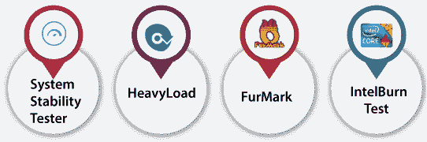

# 稳定性试验

> 原文：<https://www.javatpoint.com/stability-testing>

在本节中，我们将了解**稳定性测试**，这是**性能测试**的重要组成部分。

我们还了解了**的需求，稳定性测试的目的，为什么需要进行稳定性测试，例如，优势和劣势**。

## 稳定性测试介绍

**稳定性测试**是一个[软件测试](https://www.javatpoint.com/software-testing-tutorial)程序，我们通过在一段特定的时间内施加负载来分析应用的性能。

对于稳定性因素，我们可以说当 N 个用户在特定时间同时使用应用时。

它属于作为[性能测试](https://www.javatpoint.com/performance-testing)的一部分而指导的[非功能测试](https://www.javatpoint.com/non-functional-testing)。

稳定性测试将提供应用在大负载下的软件可靠性、错误处理、健壮性和可扩展性方面的先进内容，而不是在通常情况下分析系统行为。

通常，它评估应用的稳定性问题和开发产品的生产率。执行稳定性测试的主要目的是最大限度地强调软件组件。

## 为什么我们需要执行稳定性测试？

我们需要执行稳定性测试，以实现以下方面:

*   当系统被推到严格的环境中时，它帮助我们检测错误，并修复那些可以增加软件稳定性或应用的错误或缺陷。
*   如果我们执行稳定性测试，软件的寿命会延长。
*   如果我们无休止地进行稳定性测试，我们可以确定产品的稳定性。
*   如果我们提前准备好系统，我们可以承受任何压力/

## 稳定性测试的目的

稳定性测试的重要目标如下:

*   稳定性测试的主要目标是分析软件应用在任何时间点是否因正常使用而失败，方法是使用它的全部范围。
*   它帮助我们发现系统的健壮性，并确保系统能够处理庞大的程序。
*   稳定性测试将允许我们识别应用的稳定性，这也增强了开发人员的信心。
*   如果我们执行稳定性测试，我们可以在紧张的情况下快速识别系统中的错误。
*   稳定性测试的执行将提高产品的完整评估和效率。
*   它帮助我们分析数据库连接并测试应用的响应时间。

## 如何做稳定性测试？

1.  在软件测试中，稳定性测试可以手动执行，也可以借助一些自动化工具来执行。
2.  执行稳定性测试的主要原因是为应用创建稳定性。至少可以分析三个批次来评估软件产品的强度。
3.  它帮助我们定义测试的范围并识别业务问题，以验证系统性能并根据用户加载数据。
4.  数据的任何修改都会影响整个应用，在分析负载之后，如果我们发现任何问题，就可以重新测试它。
5.  稳定性测试的第一步是回归测试或冒烟测试。一旦通过，我们就可以进行功能或非功能测试。
6.  在**功能测试**中，可以完成所有不同功能的性能，而**非功能**测试将包含性能相关问题。
7.  它管理**错误跟踪和报告**以及它们与需求的适当映射。

## 稳定性测试工具

每个工具都有测试应用稳定性的功能。尽管如此，每个组织都有特定的度量标准，应用的环境方面，以及在选择任何工具来测试应用时进行模拟。

测试工程师需要一个测试工具，能够在几种扭曲的情况下具有负载系数。

用于稳定性测试的工具依赖于用户想要测试的产品，因为没有这样的分类来定义市场上稳定性测试的最佳和最差工具。

然而，我们在市场上有几种工具可以用于稳定性测试，其中一些是**开源**，一些是**授权**。

以下是稳定性测试最常用的工具:

*   **系统稳定性测试仪**
*   重负荷
*   **FurMark**
*   **智能测试**

### 系统稳定性测试仪

系统稳定性测试工具用于 **CPU 和 RAM 的压力、燃烧和基准测试**，同时消耗我们所有的处理器容量。

特定的压力测试过程可以一个接一个或同时启动，并且可以在整个测试过程中随时启用和禁用。

**系统稳定性测试仪的特点**

系统稳定性测试工具的一些关键特性如下:

*   它是一个多线程处理器。
*   系统稳定性测试工具可以在多个平台上执行。

### 重负荷

**HeavyLoad** 用于分析系统主要组件的稳定性，如**内存、处理器和硬盘。**它分析当磁盘空间减少时，我们的系统如何运行。

它还可以独立或一起执行这些测试，此时系统硬件和电源将承受最大压力。

**重型工具的特点**

我们列出了 HeavyLoad 工具的一些基本特性，如下所示:

*   它是一个开源工具。
*   HeavyLoad 已使用测试分配的内存。
*   它进行复杂的计算来重现处理器上的负载。
*   它用于复制硬盘访问。
*   HeavyLoad 工具可以在多个平台上工作，比如 **Windows XP 到 Windows 8 的 32 位和 64 位**。

### FurMark

**FurMark** 是一个开源工具，可以很容易地使用。这是一款轻量级但非常严谨的显卡，或者说是 **Windows 平台**上的 **GPU 压力测试**。

它是显卡最常用的压力测试工具之一，因为该工具使用的算法可以进行优化，以加热**图形处理单元(GPU)** ，测试其稳定性和对极端环境的抵抗力。

**重型工具的特点**

FurMark 工具的一些重要特性如下:

*   兼容 **Windows XP 等各种操作系统及其以上所有版本**。
*   FurMark 工具有多种语言版本，如**西班牙语、英语和德语**。

### 智能本测试

另一个开源的 **CPU 压力基准和应用**稳定性测试工具是**英特尔测试**，帮助我们将 CPU 推向最大极限。

IntelBurn 工具易于使用，是一种可以检查实时错误的便携式设备。

**智能测试工具**的特点

**智能测试**工具的基本特征如下:

*   它兼容现代的**基于 Windows NT 的操作系统和上面所有版本的**。
*   它向屏幕提供实时输出。
*   与其他稳定性测试工具相比，IntelBurn 工具具有更好的外观。
*   它简化了 Linpack 的过程，并缩短了选择要使用的测试大小的过程。

## 稳定性测试的优缺点

下面是稳定性测试的优点和缺点。

### 稳定性测试的好处

稳定性测试的优势如下:

*   它改善了最终用户体验，并有助于获得更稳定的系统。
*   它还监控系统的效率。
*   它将分析系统在大负荷下的稳定性和耐久性。
*   稳定性测试提供了系统虚拟处理的数据的极限。
*   这让他们对系统的性能充满信心。
*   稳定性测试确保即使有很多用户，工作也可以保持不变，而无需恢复系统。

### 稳定性测试的缺点

以下是未对被测系统执行稳定性测试的**缺点**:

*   如果我们不执行稳定性测试，系统可能会因 CPU 或处理器上的额外负载而失败，这可能会导致输出数据丢失。
*   系统在没有实施稳定性测试的情况下很快就出现故障，并因大量数据而降低了速度。
*   如果我们不执行系统的稳定性测试，将对系统的性能和业务产生负面影响。
*   它在不断变化的环境中工作异常。

## 概观

在本教程中，我们理解稳定性测试是非功能测试方法下性能测试的一个重要部分。

执行稳定性测试是为了确定系统在特定环境中的可伸缩性，并且只关注应用的特性。

当系统处于压力下时，它有助于实现性能。

该测试帮助我们分析不同组件的稳定性，如**处理器、CPU 和内存。**

我们还了解到稳定性测试用于稳定系统和交付高质量的产品。

* * *