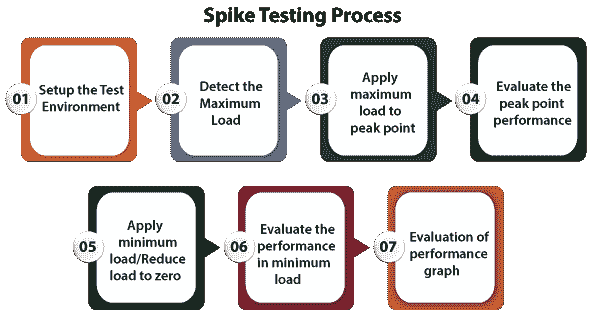

# 尖峰测试

> 原文：<https://www.javatpoint.com/spike-testing>

在本节中，我们将了解**尖峰测试**，这是**软件测试**的重要组成部分。

我们还了解了**的需求、尖峰测试的目的、为什么需要进行尖峰测试、尖峰测试的流程、尖峰测试工具、**以及**的优缺点。**

## 尖峰测试简介

正如我们之前了解到的，测试过程是 [SDLC](https://www.javatpoint.com/software-development-life-cycle) 的重要部分，它评估多个软件组件，如**速度、可扩展性和可靠性。**

它是[压力测试](https://www.javatpoint.com/stress-testing)的一个子类，保证开发的应用程序在由 n 个数字产生的增强和降低的负载下工作。并检测系统的性能。

它保证了产品交付后**软件的速度、恒定性和可扩展性不会出现问题。**

换句话说，我们可以说尖峰测试的执行是为了检查系统如何应对用户的意外增加和失败。

## 尖峰测试的目的

**尖峰测试的重要目标如下:**

*   执行尖峰测试的主要目的是控制系统在负载发生重大变化时是崩溃还是保持不变。
*   注意应用程序在突然改变的负载下的性能或行为。
*   分析影响性能的两点或峰值之间的恢复时间。
*   尖峰测试用于分析应用程序的弱点。

## 尖峰测试过程

尖峰测试是至关重要的，它主要是为了测试当用户负载发生不可预测的变化时，系统如何反应。

尖峰测试程序包括持续监控。它会评估应用程序的漏洞，并在快速增强和降低负载时检查其受影响的性能。

在整个软件开发过程中，尖峰测试是在一个精确的环境中实现的。因此，尖峰测试过程旨在扩展应用程序的最大容量，以确保理想的用户参与。

尖峰测试过程通过以下步骤完成，如下所示:

*   设置测试环境
*   检测最大负载
*   将最大负载施加到峰值点
*   评估峰值点性能
*   施加最小负载/将负载降至零
*   评估最小负载下的性能
*   性能图的评估

### 步骤 1:设置测试环境

尖峰测试流程的第一步是**设置测试环境，**，这取决于业务需求中的各种参数。

测试环境设置对于成功执行测试和恢复公平的质量测试过程是必要的。我们还确保没有人在应用程序中使用实时环境执行**尖峰测试**。

### 步骤 2:检测最大负载

完成环境设置后，启动最大负载；系统可以防止和检测已经开发的应用程序或软件产品的满负荷大小。

这里，最大负载是同时使用系统或应用程序的用户数量过多。

### 第三步:在最高点施加最大负荷

在下一步中，我们将在特定时间突然增强负载，之后，我们将尝试借助任何[性能工具](https://www.javatpoint.com/performance-testing-tools)将最大预期负载应用到峰值点。

### 步骤 4:评估峰值点性能

一旦最大负载施加到峰值点，我们将评估在峰值点负载下检测到的性能。它用于检查系统在这种意外增长下是失败还是幸存。

### 步骤 5:施加最小负载/将负载降至零

之后，我们将把负载慢慢降低到最低(从零到最小负载)。该过程也快速执行，这意味着负载从最高值降低到最低可能值。

### 步骤 6:评估最小负载下的性能

在这一步中，我们将评估最小负载下的性能，以查看系统在这种意外降低的负载下是幸存还是失败。

### 步骤 7:评估绩效图表

最后一步，通过查看**虚拟用户、故障、耗时**等指标来分析性能图。

性能图的评估对于测试工程师检测应用程序何时崩溃是必不可少的，并且向开发人员报告以解决问题取决于此。

## 尖峰测试工具

我们在市场上有多种 spike 工具，其中一些是开源的，一些是授权工具。每个工具都有它的功能和方法。

一些最常用的长钉工具如下:

*   **Apache JMeter**
*   **装载机**

### Apache JMeter

Apache JMeter 是自动化测试中最著名的开源工具。它主要用于测试静态和动态资源以及动态 web 应用程序的性能。

它可以重现对象、服务器和网络上的大量负载，以发现多种负载类型下的完整性能。它帮助开发人员或用户使用源代码开发其他应用程序。

**JMeter 的特性**

**JMeter** 工具的一些重要特性如下:

*   它完全是在 [JAVA 编程语言](https://www.javatpoint.com/java-tutorial)上设计的，与平台无关，用于加载功能测试行为并测量其性能。
*   它保留了各种测试方法，如可用的、分布式的和负载测试。
*   它提供了一个用户友好的图形用户界面，这是交互式的和直接的。
*   在多种类型的服务器中加载性能测试是不可思议的可扩展。

有关 JMeter 的更多信息，请参考以下链接:[https://www.javatpoint.com/jmeter-tutorial](https://www.javatpoint.com/jmeter-tutorial)。

### 工具

另一个尖峰测试工具是 **LoadRunner，**，它支持针对大量协议、大量技术和应用环境的尖峰测试。

它可以快速识别性能问题的最常见原因。并精确预测应用程序的可扩展性和容量。

**负载转轮的特性**

以下是 LoadRunner 工具的功能:

*   我们可以在执行 LoadRunner 工具时获得详细的性能测试报告。
*   如果我们执行 LoadRunner 工具，它会降低分布式负载测试的成本。
*   LoadRunner 工具支持 XML 语言；这就是为什么我们可以轻松地在测试脚本中查看和处理 XML 数据。
*   它为部署跟踪提供了操作工具。

## 尖峰测试的优点和缺点

以下是尖峰测试的优点和缺点:

### 尖峰测试的优势

尖峰测试的一些显著优势如下:

*   在执行尖峰测试时，我们可以轻松地防止系统在负载尖峰下崩溃。
*   尖峰测试将为测试工程师提供在极高和极低用户负载下测试系统的能力。
*   这是一个有益的测试过程，因为它将软件应用程序从失败或崩溃中拯救出来。
*   在尖峰测试中，开发人员可以避免应用程序失败，因为问题被检测到了。
*   尖峰测试最重要的优点是它降低了系统或软件应用程序失败的可能性。
*   尖峰测试是最适合评估软件性能的测试，即使在如此紧张的环境下。
*   它规范了软件的性能，也保证了产品的质量。
*   当我们检索极端案例场景时，这是有益的。

### 尖峰测试的缺点

以下是不在被测系统上执行稳定性测试的**缺点**:

*   尖峰测试需要一个独立的测试环境。
*   为了执行尖峰测试，我们需要设置特殊的测试条件，这使得这个过程有点昂贵。
*   执行尖峰测试时，应用程序的性能可能会恶化、变慢或完全停止。
*   与其他测试方法相比，这是一个耗时的过程。
*   只有专家才能实施尖峰测试。

## 概观

在本教程中，我们理解了软件开发生命周期中尖峰测试的重要性。我们还讨论了尖峰测试过程、优点、缺点和标准缺陷等。

我们可以说，尖峰测试帮助我们找到极端负载和标准问题，一旦负载增强被应用，这些问题就会发生。

此外，尖峰测试有助于确认软件系统在当前有效环境中的现有边界。

执行峰值测试的正确方法是突然增加用户数量，然后立即减少负载。

尖峰测试的主要重点是检测意外负载，并准备应用程序在这种情况下工作。尖峰测试主要用于维护应用程序或软件产品的质量和性能。

因此，如果我们在软件测试过程的初始阶段实现尖峰测试，我们可以验证它的行为和能力。

**JMeter 和 LoadRunner** 是尖峰测试最常用的工具。

* * *