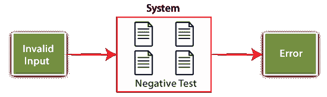
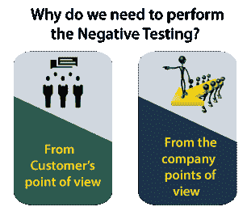
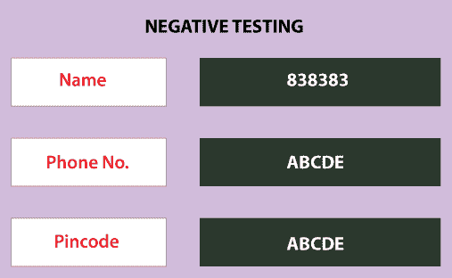
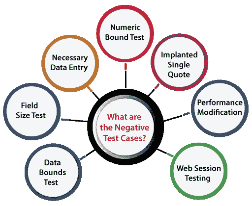

# 阴性测试

> 原文：<https://www.javatpoint.com/negative-testing>

**软件测试**就是检查应用程序是否按照给定的要求工作。我们可能需要使用各种软件测试类型，如**功能测试、[单元测试](https://www.javatpoint.com/unit-testing)、集成系统、[系统测试](https://www.javatpoint.com/system-testing)、[冒烟测试](https://www.javatpoint.com/smoke-testing)、[回归测试](https://www.javatpoint.com/regression-testing)、[健全性测试](https://www.javatpoint.com/sanity-testing)** 来完成这个过程。

软件开发不是一件容易完成的事情，因为它需要编写大量复杂的代码，然后测试这些复合代码，以保证无故障和稳定的性能。正如我们所知，[软件测试](https://www.javatpoint.com/software-testing-tutorial)是编写成功代码的一个重要方面。

然而，所有这些都属于以下两类，例如:

*   **阳性检测**
*   **阴性检测**

在本节中，我们将涵盖以下与被称为阴性测试的特定测试技术**相关的主题:**

*   **阴性检测介绍及其目的。**
*   **阴性检测的属性。**
*   **为什么我们需要进行阴性检测？**
*   **阴性检测的例子。**
*   **阴性检测的优缺点。**

## 什么是阴性测试？

这是一种独特的软件测试技术，用于评估系统是否存在不可预测的情况。它在高性能软件开发中起着非常重要的作用。

在这个测试中，系统通过给出无效数据作为输入而被授权。如果应用程序在其负输入下的表现是可预测的，则分析负测试。

负测试主要用于检查这种不可预测的情况是否会影响软件的性能。

换句话说，我们可以说，实现负测试是为了保证当给定不可预测的输入时，被测试的软件产品不会失败。**也称为故障测试**或**错误路径测试。**

## 阴性检验的目的

*   执行否定测试的主要目的是中断系统，并在整个意外输入期间验证应用程序响应。
*   负测试的执行确保了合适和理想的软件性能，即使当用户通过插入无效和错误的数据执行不一致时。
*   为了确保应用程序不受不适当的验证数据集的不同变化的影响，我们将实施阴性测试。
*   它帮助我们识别 n 个错误，并提高被测软件应用程序的质量。然而，阴性测试是在阳性测试实施之后进行的。

## 阴性检验的属性

在这里，我们讨论阴性测试的一些基本特征，如下所示:

*   我们可以使用阴性测试来评估潜在的安全漏洞和特殊处理程序。
*   阴性测试用于对照失败条件分析应用程序。
*   它的执行是为了破坏系统，并通过提供有害数据来实现软件产品功能的失败。
*   它的执行是为了识别可能导致本质故障的缺陷。
*   执行阴性测试以显示数据损坏或安全违规。
*   通常，实现阴性测试的目的是由测试工程师执行的。
*   为了发现软件漏洞和潜在的漏洞，我们将执行阴性测试。
*   实现负测试是为了保证应用程序或软件产品在遇到输入值、超出范围或限制或无效输入数据后的稳定性。
*   它的实现是为了发现导致其失败的关键漏洞或 bug 和薄弱区域。

## 为什么我们需要进行阴性测试？

随后，执行任何类型的测试活动都是一个耗费成本和时间的过程。因此，我们必须明智地选择是否需要在我们的系统中实施阴性检测。

在这里，我们讨论了为什么我们需要在特定应用中通过考虑以下客户、组织的防腐剂来执行阴性测试:

### 从客户的角度来看

*   否定测试的实施确保交付一个无缺陷和零漏洞的产品，以满足客户的期望。
*   当应用程序至关重要时，如电子商务、在线股票等，需要进行阴性测试。
*   在进行阴性测试时，成本是客户唯一关心的问题。但是在评估效果的时候，要由客户来选择是否进行阴性检测。

### 从公司的角度来看

*   向客户交付高质量的产品是组织的责任。要做到这一点，必须进行阴性测试。
*   从公司的角度来看，需要进行阴性测试是因为针对失败进行了验证。
*   我们应该执行阴性测试，因为有时，我们不能保证开发一个 100%无 bug 的系统，但是我们必须确保尽一切努力避免失败。
*   通过执行阴性测试，我们还可以涵盖重要的黑客案件，因为有很多黑客在那里寻找机会破坏系统。

## 阴性测试示例

在阴性测试中，软件产品的实现是在无效数据输入的帮助下进行评估的。当输入意外参数时，测试软件的响应。

在这种情况下，应用程序应该显示以下错误消息:

**无效数据输入。**

**例如:**假设我们有一个示例表单来输入姓名、电话号码和密码字段的值。在这种情况下，负输入可能如下:

**名称:838383**

(因为名称字段只接受字母字符值)

**电话号码:ABCDE**

(因为电话号码字段只接受号码的值)

**pin 码:ABCD**

(因为密码字段只接受数字的值)

## 如何进行阴性测试

为了实现阴性测试，测试工程师需要注意所有可能的场景。具体来说，如果它是可以实现的，我们就必须在测试用例中考虑它，不管它是否是正确的使用方法。

**例如 1:**

假设我们看到一个图像上传选项，所以我们已经考虑了所有可能的输入，我们可以把它放在那里，用所有可能的文件进行测试。

**例如 2:**

同样，我们有一个电子邮件字段，我们必须考虑所有可能的输入，我们可以将它们放在那里，而不是正确的电子邮件格式。

#### 注意:在阴性测试中，我们必须在实施之前选择案例，以节省时间和测试成本。

## 什么是阴性测试用例？

阴性测试的另一个重要组成部分是**阴性测试案例**。团队创建这些负测试用例，以一种不应该使用的方式测试应用程序。

据我们所知，进行阴性测试是为了确保应用的稳定性和可靠性。这些应该由团队在以下测试工作中进行衡量:

*   **数据界限测试**
*   **现场尺寸测试**
*   **必要的数据输入**
*   **数值界限测试**
*   **植入单引号**
*   **性能修改**
*   **网络会话测试**

*   **数据界限测试**

测试团队必须测试数据字段的所有下限和上限。

*   **现场尺寸测试**

功能规范应该指定一个字段可以输入的字符数。为了确保不超过这个限制，我们可以编写一个测试用例。

它有助于防止用户在超过限制后收到错误消息之前输入更多字符。

*   **必要的数据输入**

软件中涉及屏幕数据输入的每个字段都应在关键数据输入特定字段之前进行验证。

*   **数值界限测试**

为了确保阴性测试用例是准确的，测试团队需要分析下限和上限。

*   **植入单引号**

当最终用户试图存储包含单个报价的信息时，一些软件系统会遇到一个问题。

因此，对于接收字母数字数据输入的所有屏幕，特定团队应该提供包含一个或多个单引号的文本。

*   **性能修改**

测试套件应该包含比较以前和当前版本性能静态的测试用例，这有助于对潜在的性能问题进行分类。

*   **网络会话测试**

正如我们所知，各种网络应用程序在浏览器会话中显示不同的用户信息。

测试团队准备**测试用例**发布应用内不涉及用户登录的网页。

## 阴性测试场景

负测试的使用增强了软件产品或应用程序的测试覆盖率，并在不同的条件下发现可能的应用程序故障。

以下是一些负面案例和测试场景:

*   网络会话测试
*   居住在强制领域
*   允许的特殊字符数
*   数据字段类型之间的一致性
*   足够的数据

## 阴性测试的优势

阴性测试的一些显著优势如下所述:

*   上线前会给客户更多的信心。
*   它提高了覆盖所有基础和每种类型错误的可能性，这种错误可能是由于不一致的人类行为引起的。
*   众所周知，负测试的实施对于保证产品的质量非常重要，因为一个高质量的产品或应用程序被认为是零漏洞产品。
*   它还确保在执行阴性测试期间覆盖所有可能的情况，因为有意或无意地，有一点点阴性测试情况的可能性。因此，为了确保覆盖所有的测试用例，我们必须执行一轮阴性测试和阳性测试。

## 阴性测试的缺点

然而，负测试的实现有助于增强应用程序，但是负测试仍然有一些缺点，下面将讨论这些缺点:

*   阴性测试的执行需要不必要的时间、金钱和努力。
*   对于客户来说，它会导致软件产品或应用程序发布的极端延迟。
*   阴性测试的实施需要一个训练有素、经验丰富的测试工程师来开发阴性测试用例。
*   在软件测试中，负测试在某些情况下会成为一个耗时的过程。并且在各种情况下，没有必要执行过度的阴性检测。
*   假设，如果软件只为单人使用而开发，那么我们不必考虑 50-100 个最终用户同时使用应用程序的情况。因此，在关键案例中，阴性测试案例非常重要。有时我们不必对特定的软件产品进行负面测试。

## 概观

在本教程中，我们已经理解了阴性测试的概念。在看到**阴性测试**的所有相关话题后，我们可以得出结论，阴性测试确保交付的软件没有错误，并且可以被客户限制使用。

要设计详细而强大的阴性测试场景，需要一个有创造力、有技能、有远见和聪明的测试工程师。

正如我们所知，每个软件开发公司都希望拥有强大的软件，需要进行严格的负面测试。

人们经常生活在错觉中，认为**阴性检测**是增加支出的又一种方式，没有任何可能的好处。这个想法很重要，因为它可能会损害最终软件产品的优秀性。

最后，我们可以说，通过实施阴性测试，我们可以提高软件的质量，使其更加强大。

* * *