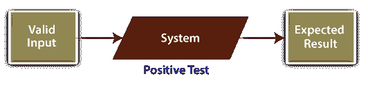
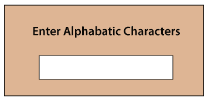
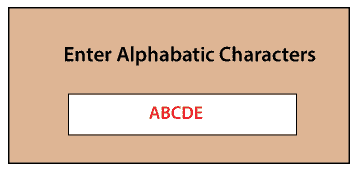
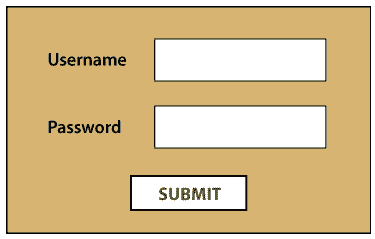
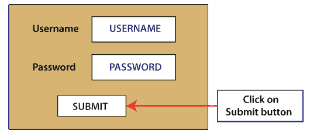
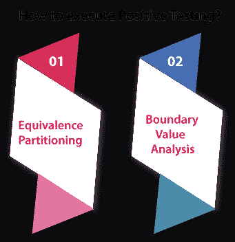
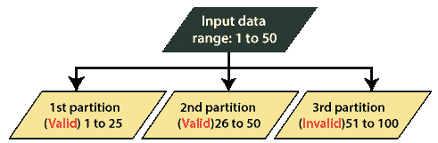
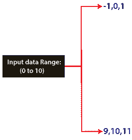

# 阳性检测

> 原文：<https://www.javatpoint.com/positive-testing>

**软件测试**是对软件应用程序进行验证和确认的过程，以测试应用程序是否按照给定的要求工作。

执行任何 [**类型的软件测试**](https://www.javatpoint.com/types-of-software-testing) 的主要目的是通过插入不正确的数据、处理它们以进行分类和纠正来识别错误或帮助最终用户纠正他/她的错误。

[软件测试](https://www.javatpoint.com/software-testing-tutorial)流程有助于我们提高产品质量、健壮性，并交付更加用户友好的应用程序。

为了实现以上所有方面，我们将使用不同的测试类型和测试技术。在这里，我们讨论其中的一个，即**阳性检测。**

在本文中，我们将讨论以下与阳性检测相关的主题:

*   **什么是阳性检测及其目的**
*   **为什么我们需要进行阳性检测？**
*   **如何进行阳性检测**
*   **阳性检测示例**
*   **阳性检测的益处**

## 什么是阳性检测？

这是另一种重要的测试技术，用于展示测试中的软件产品或应用程序。

它验证应用程序如何为正数据集执行。在这种测试中，我们将输入有效的数据集作为输入值。

我们将实施积极的测试，以验证不同软件模块的准确工作，并根据有效的数据输入进行性能评估。

**例如**，假设我们有像网站和移动应用这样的软件应用，需要像**文本框和文本表单**这样的对象。因此，在这种情况下，积极测试用于测试这些对象的特定功能。

通常，积极的测试是为了确保特定的应用程序或软件产品符合客户的规格和前景。

换句话说，我们可以说，正向测试主要是通过使用正向输入来帮助测试工程师检查软件是否按预期工作。

简而言之，积极测试用于准确测试软件或应用程序的预期性能。

#### 注意:积极测试用有效数据评估积极场景，如快乐路径。

## 为什么我们需要进行阳性检测？

如果我们可能面临以下情况，则需要进行阳性检测:

*   只要应用程序为测试过程做好了准备，测试工程师就可以实现为该功能设计的所有其他场景，如数据库测试、否定测试等，只有在肯定测试被批准之后。
*   每次构建准备就绪时都需要执行阳性测试，也称为冒烟测试/ **构建验证测试**/健全性测试，因为这是测试执行过程的第一步。

## 阳性检测的例子

为了更好地理解阳性检测，我们将看到以下示例:

**示例 1:**

在这个例子中，假设我们有一个**文本框**，它只能接受**字母字符值。**

**因此，在这种情况下，阳性检测场景如下:**

**阳性检测场景:**

*   输入**字母字符值**，并验证应用程序是否接收到被测输入值。

让我们再看一个阳性检测的例子:

**示例 2**

在这个例子中，假设我们有一个需要填写登录表单的 web 应用程序。并且，在具体的登录页面中，需要考虑以下条件:

*   用户应输入**用户名、密码**，点击**提交按钮**。
*   在插入确切的用户名和密码并点击提交按钮后，用户应该被导航到下一页。

因此，在上述情况下，正面测试场景如下所述:

**阳性检测场景:**

*   插入正确的**用户名和密码(如用户名和密码)**。
*   然后点击**提交按钮**，检查用户是否按照预期导航到下一页。

## 如何执行阳性检测？

为了执行阳性测试，我们有以下两种测试方法，这两种方法是强烈推荐的，也是阳性测试执行期间最常用的方法。

*   **等价划分**
*   **边界值分析**

这两种测试技术主要用于设计测试用例。每当测试工程师需要测试数字字段时，这些方法都是相关的。

测试工程师应该在执行阳性测试时检查输入数据、测试活动和输出。因为测试工程师一直需要分析测试输入是否在给定测试数据的范围内。

让我们逐一看看**等价划分**和**边界值分析**测试技术的工作细节。

### 等价划分

它是软件测试中最常用的测试用例设计技术之一。在等价划分中，输入数据被划分为**有效**和**无效**值的划分。它源自软件产品的需求和规范。

换句话说，我们可以说测试工程师可以将测试输入划分成相等的分区，并将每个分区的值用作等价分区方法中的测试数据。测试工程师还需要确保测试数据包括来自所有分区的值。

让我们看一个例子**例子**以便我们更好的理解。

**例如**，假设我们有一个字段或系统和输入值(1-50)，这被认为是一个值的范围。

在等价分区测试技术中，输入数据被分成两个或两个以上的分区，如下所示:

**第一分区(有效):1-25**

**第二分区(有效):26-50**

**第三分区(无效):51-100**

### 边界值分析

另一个最常用的测试用例设计技术是**边界值分析**。这种技术用于测试作为输入值的边界值，因为在边界附近有更大的出错机会。主要用于测试数值字段。

测试工程师需要在边界值分析技术的边界或数据范围内开发测试数据。因为输入数据是在边界值限制之外选择的。

在执行阳性测试时，如果输入是 A 到 B 之间的**值范围**，那么我们必须为这样的输入值设计测试:

*   **A，A+1，A-1**
*   **B，B+1，B - 1。**

让我们举个例子来更好地说明:

**例如**，假设我们有一个系统可以接受从 **0 到 10** 数值的数字。其他所有数字都是无效值。

在边界值分析技术下，边界值将在以下范围内测试: **-1，0，1 和 9，10，11**

## 阳性检测的优势

阳性检测的一些显著优势如下所述:

*   它用于通过在初始阶段发现错误的构建来节省测试工程师的努力。
*   为了测试应用程序的正向路径，我们可以执行正向测试。
*   积极测试不能保证应用程序的质量，因为测试工程师不能在不可预测的条件下测试应用程序的性能，例如当用户输入不正确的数据时。

## 概观

在本文中，我们看到了关于阳性检测的详细信息，如阳性检测的需求、阳性检测的执行过程、实例以及阳性检测的好处。

看完以上所有心理问题，我们可以得出结论，阳性检测是必要的。阳性测试在验证大多数网站中识别的基本对象的常规性能方面发挥着重要作用。

为了获得有效的测试结果，我们需要执行**阳性和阴性**测试，这为软件质量提供了足够的确定性。

实现所有类型的软件测试背后的主要目标是确保软件产品在软件启动之前没有错误，并帮助交付高质量的软件产品。

* * *