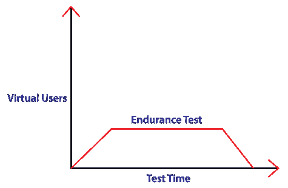
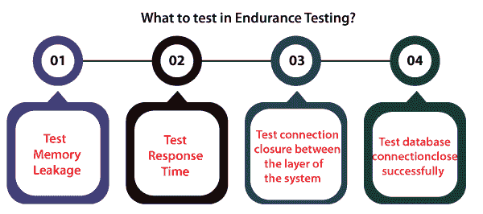
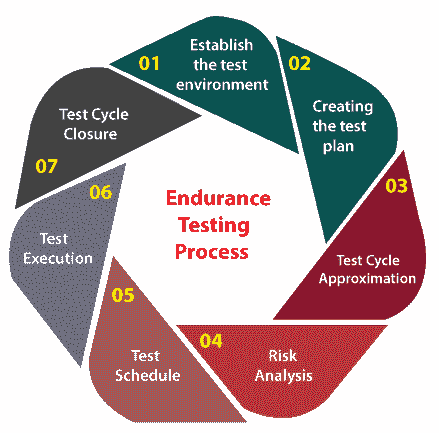

# 耐久性测试

> 原文：<https://www.javatpoint.com/endurance-testing>

在本节中，我们将详细探讨以下与称为**耐力测试**的特定测试技术相关的主题。

*   **什么是耐力测试？**
*   **耐力测试的目的**
*   **耐力测试属性**
*   **耐久试验过程**
*   **耐久测试示例**
*   **耐久试验的优缺点。**

## 什么是耐力测试？

在软件测试中，我们有几种不同类型的测试，在分析任何软件或应用程序时都非常有效。

在这里，我们讨论另一种类型的软件测试，称为**耐久性测试**。

**耐久性测试**是指我们在一定负载条件下长时间测试系统性能的测试。

耐久性测试是非功能测试的重要组成部分之一。

一般又称****长寿检测*** 。耐久性测试在性能运行周期的最后阶段进行。*

 *#### 注意:浸泡测试用于测试环境中应用程序的行为，这在很长一段时间内是不被支持的。通常，浸泡测试是一种破坏性测试；随后，我们已经知道服务器或域不支持。

为了评估测试组件在特定负载和时间的可能复制情况下的响应，我们使用了耐久性测试。

简单来说，我们可以说 ***【耐力】*** 这个术语是用来定义**某事物持续的能力，**又进一步称之为**耐力，能力**，或者**耐力**。

测量内存消耗以修复潜在故障，并确定整个耐久性测试的性能质量。

为了增强软件应用程序的一致性参数，我们可以在耐久性测试中记录性能。

为了找出系统中的任何内存泄漏，耐久性测试是有益的，它还帮助我们在更长的时间内测试系统的响应时间。

在耐久性测试期间，与其他类型的测试如**载荷或应力**测试相比，测试根据给定的测试要求进行更长的时间，如 15 小时、90 小时。

这使得耐力测试不同于**负荷测试**，负荷测试通常在几个小时后结束。

## 耐力测试的目的

*   执行耐久性测试的主要目的是确认应用程序足够高效，能够处理增加的负载而不会出现响应时间故障。
*   执行耐久性测试的目的是测试内存泄漏。
*   这通常是通过使系统过载或减少特定的系统资源并评估结果来实现的。
*   耐久性测试的实施确保了系统响应时间将在一段延长的时间后保持不变或得到增强。
*   识别系统在持续使用下的表现。
*   为了完成未来的负载，我们需要了解有多少额外的资源，如磁盘容量、处理器容量、内存使用或网络带宽是必不可少的。
*   它控制软件产品在最长时间内的健壮性和稳定性。
*   它关注内存的消耗。
*   在市场上发布任何产品之前，我们必须确保它将有助于增强对软件或系统稳定性的信心。

## 耐力测试要测试什么？

在执行耐久性测试期间，我们将测试以下方面:

*   **测试内存泄漏**
*   **测试响应时间**
*   **测试系统各层之间的连接闭合**
*   **测试数据库连接关闭成功**

### 测试内存泄漏

在耐久性测试的实现中，进行检查以验证特定软件或应用程序中的任何内存泄漏，这可能导致系统或操作系统的故障。

### 测试响应时间

我们还可以检查测试响应时间。并且应用程序或系统被测试系统的响应时间，因为应用程序作为系统无休止使用的输出变得不太可操作。

### 测试系统各层之间的连接闭合情况

在耐久性测试实施过程中，如果系统各层之间的连接没有有效地关闭，它可能会使系统的某些或每个模块停滞不前。

### 测试数据库连接成功关闭

如果在执行耐久性测试期间数据库连接没有成功关闭，我们可能会以系统崩溃的方式获得输出。

## 耐久性测试示例

让我们看一个耐力测试的例子，以便更好地理解特定的主题。

在这里，我们将看到内存泄漏概念的例子，但我们将首先了解什么是内存泄漏？

**内存泄漏:**这是计算机科学中最常面临的问题。由于开发人员编写的易受攻击的编程代码，释放不再使用的对象是一种失败。

在耐久性测试中，测试工程师将通过提供特定数量的负载来测试任何内存泄漏，从而在固定的时间内执行系统。

在编程语言的使用中，处理内存泄漏问题是完全不同的。

因此，我们将看到任何银行的一个真实例子。

**示例:**

*   假设封锁已经发生，银行将连续 7-8 天不营业。
*   在整个封锁期内，与其他标准工作日相比，网上银行活动将激增。
*   如果用户数量和操作数量激增，系统需要准备好处理这样的负载。

## 耐久性测试过程

耐久性测试过程分为以下步骤:

*   **建立测试环境**
*   **创建测试计划**
*   **测试周期近似值**
*   **风险分析**
*   **测试时间表**
*   **测试执行**
*   **测试循环结束**

让我们一个接一个地讨论它们，以便更好地理解:

### 第一步:建立测试环境

耐力测试过程的第一步是**创建或建立测试环境**。这一步将发现软件、硬件、操作系统和数据库执行耐久性测试的必要性。

测试环境应该在测试执行之前准备好，并且应该与实际的实时系统适当分离。

团队的创建包括执行耐力测试和在集团内移交角色和职责。

### 步骤 2:创建测试计划和测试场景

完成耐力测试流程的第一步后，我们将进入下一步，创建测试计划和测试场景。

在这种情况下，应该根据手动和自动化测试的必要性或两者的结合来设计、审查和准备测试用例。

应该确定应用程序的断点，并且应该确认在整个耐久性测试中应用程序将承受多少负载。

### 步骤 3:测试周期近似

完成第 1 步和第 2 步后，我们将进入下一步耐久性测试，**测试周期近似值。**

在测试周期近似步骤中评估每个测试阶段的时间和需要多少个测试周期。

它提供了完成测试阶段所需时间的近似值。应根据测试工程师的数量和测试周期数的必要性对其进行评估。

### 第四步:风险分析

风险分析是耐久性测试过程中最关键的一步。在这里，我们将根据风险因素对测试用例进行优先排序。

下面是测试工程师在耐久性测试中最常面临的一些问题和风险。

*   是否有尚未传递的外部干扰？
*   还有其他尚未确定的小问题吗？
*   性能测试是否会随着时间的推移而持续可靠？

### 步骤 5:测试时间表

在耐力过程的下一步，我们将总结进一步过程的预算、交付成果和时间框架。

### 步骤 6:测试执行

一旦测试日程已经设定，我们将进入下一步，即**测试执行**。在这种情况下，一旦环境准备好了，测试用例就会被实现，如果在这个阶段发现了任何问题，它们也会被记录下来。

开发人员将解决这些问题，并在修复后重新测试。

### 步骤 7:测试周期结束

耐久测试的最后一步是**测试循环结束**。一旦测试周期符合测试流程的退出标准，它将被视为已结束，并且将安排已识别问题及其最终状态的报告。

## 耐久性测试的优势

耐久性测试的一些显著优势如下所述:

*   它有助于识别与内存泄漏相关的错误。
*   一旦执行时间延长，系统可能会面临与性能相关的问题。
*   耐久性测试还有助于我们发现这些问题并检查软件的健壮性。
*   在耐久性测试期间，可以很容易地识别缺陷和故障，这允许开发团队和客户端增强基础设施。
*   耐久性测试向开发团队和客户保证，系统将在更长的时间内有效实施，而无需任何维护，特别是在长周末。
*   执行耐久性测试的主要好处是降低维护成本，如果在整个测试周期中没有发现特定的性能相关问题，维护成本可能会更高。
*   像另一种非功能性测试类型，如性能测试一样，耐久性测试也会产生客户满意度。

## 耐久性测试的缺点

尽管耐久性测试的执行有助于增强应用程序，但耐久性测试仍有一些缺点，下面将对此进行讨论:

*   这有点昂贵，因为它需要系统在测试执行期间无休止地运行，我们还需要合适的基础设施。
*   耐力测试是一个耗时的过程。
*   为了执行耐久性测试，需要适当的计划，尤其是在确定测试运行需要完成的小时数时。
*   保持耐久性测试环境不同于其他测试环境非常重要，因为它可能会导致应用程序失败或数据丢失。
*   不可能执行手动耐久性测试；因此，我们将使用自动化工具来运行测试。
*   为了使用各种自动化工具，测试团队应该是专家。

## 概观

在上面关于耐久性测试的文章中，我们讨论了耐久性测试的详细过程、耐久性测试的一个例子、进行耐久性测试的一些基本好处和缺点。

最后，我们可以说 ***耐久测试*** 是非功能测试，是**使用性能测试的负载测试**的一个子类。

进行耐久性测试是为了检查系统在持续使用下的性能。就检测内存泄漏等问题而言，耐久性测试的执行是必不可少的。这些问题可能是系统故障的原因，导致关键数据的丢失。

耐久性测试使应用程序更加健壮，并使其能够承受持续的重负载。我们应该防止手动执行耐久性测试，因为这是一个非常耗时的过程。这就是为什么它主要是自动化的。

耐力测试最常用的工具有 **Apache JMeter、LoadUI、LoadRunner、WebLoad** 、**IBM Rational Performance Tester**等。

耐力测试的时间取决于业务、项目和客户要求。它可能持续 10-15 个小时或几天或一个月，有时甚至一年。

耐久性测试过程从建立隔离的测试环境、创建测试计划、估计测试周期持续时间、分析风险、准备测试时间表、执行耐久性测试以及最终结束测试周期开始。

* * **